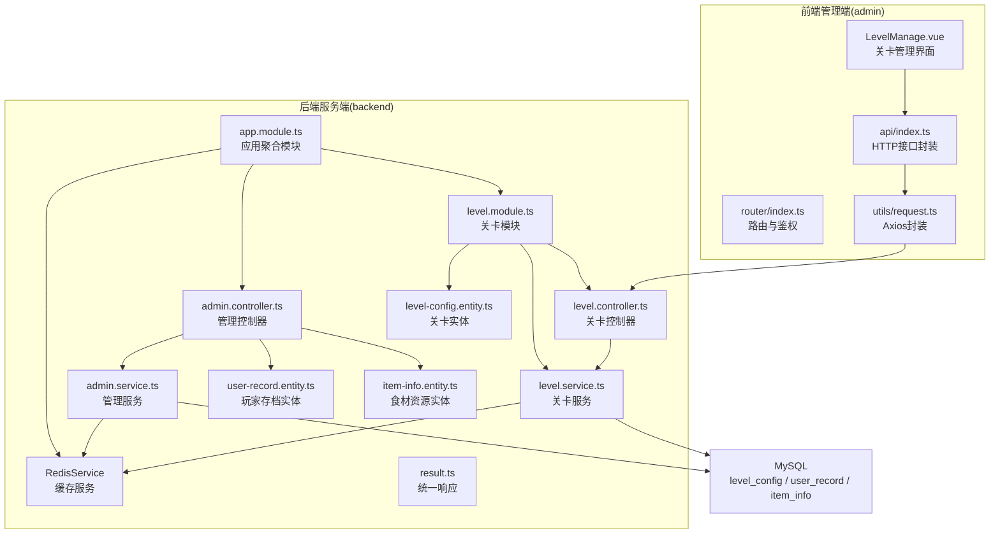
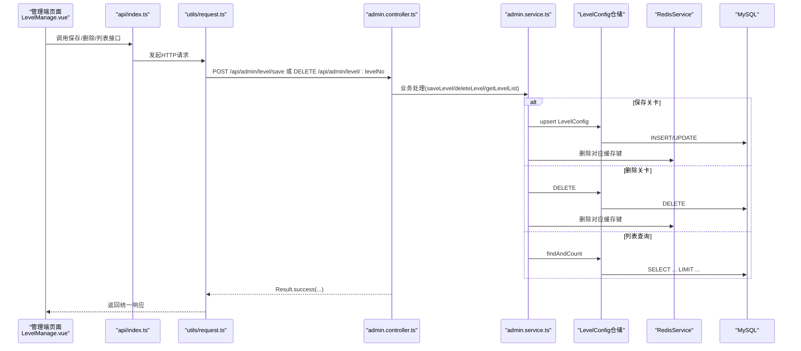
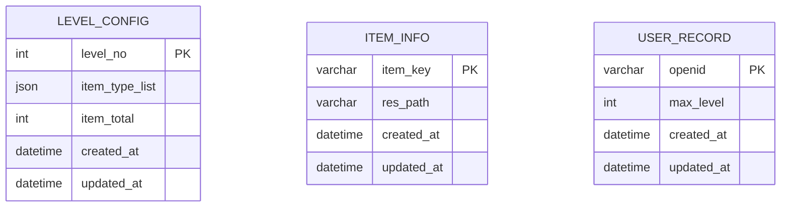
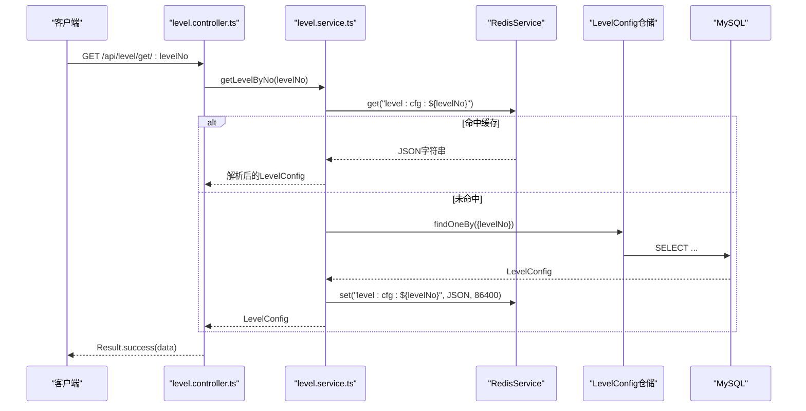
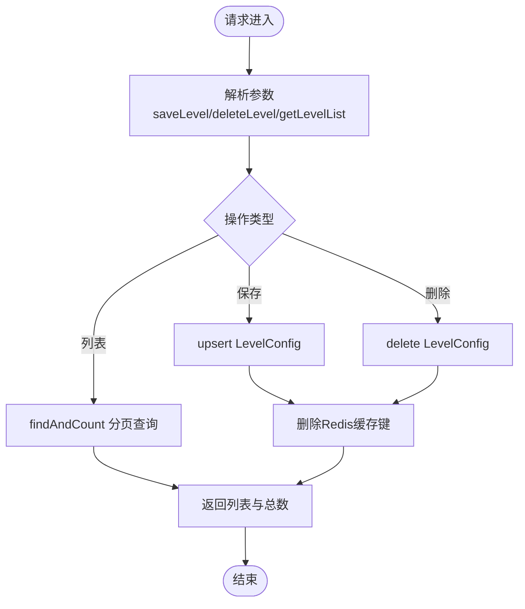
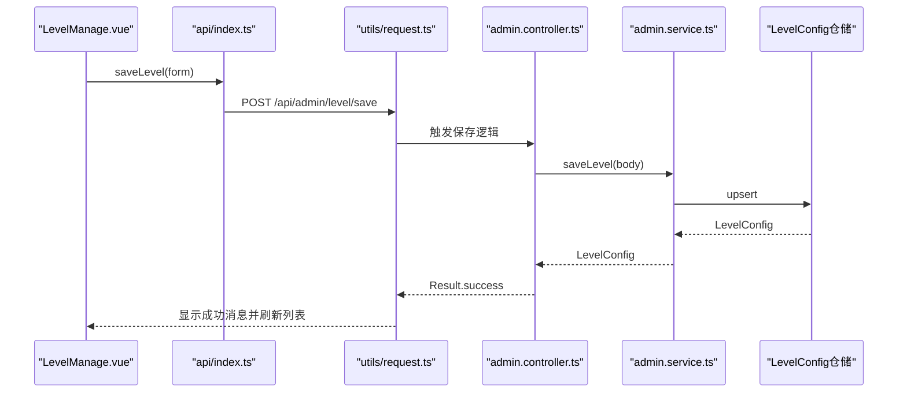
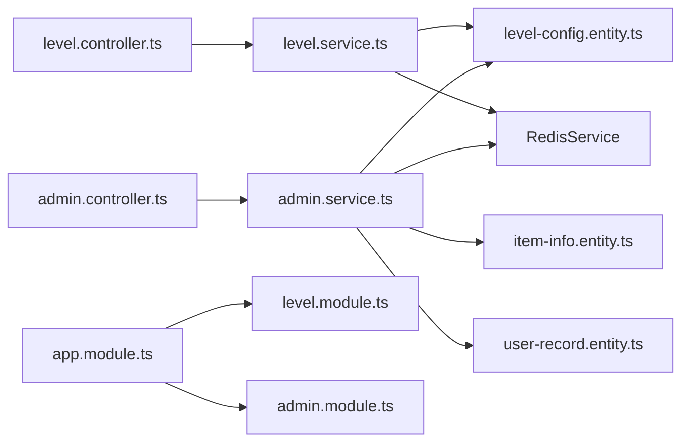

# 关卡配置API

<cite>
**本文引用的文件**
- [level-config.entity.ts](file://backend/src/entities/level-config.entity.ts)
- [item-info.entity.ts](file://backend/src/entities/item-info.entity.ts)
- [user-record.entity.ts](file://backend/src/entities/user-record.entity.ts)
- [level.controller.ts](file://backend/src/modules/level/level.controller.ts)
- [level.service.ts](file://backend/src/modules/level/level.service.ts)
- [level.module.ts](file://backend/src/modules/level/level.module.ts)
- [admin.controller.ts](file://backend/src/modules/admin/admin.controller.ts)
- [admin.service.ts](file://backend/src/modules/admin/admin.service.ts)
- [result.ts](file://backend/src/common/result.ts)
- [app.module.ts](file://backend/src/app.module.ts)
- [index.ts](file://admin/src/api/index.ts)
- [LevelManage.vue](file://admin/src/views/LevelManage.vue)
- [request.ts](file://admin/src/utils/request.ts)
- [index.ts](file://admin/src/router/index.ts)
- [init.sql](file://sql/init.sql)
</cite>

## 目录
1. [简介](#简介)
2. [项目结构](#项目结构)
3. [核心组件](#核心组件)
4. [架构总览](#架构总览)
5. [详细组件分析](#详细组件分析)
6. [依赖分析](#依赖分析)
7. [性能考虑](#性能考虑)
8. [故障排查指南](#故障排查指南)
9. [结论](#结论)
10. [附录](#附录)

## 简介
本文件面向“关卡配置管理API”的使用与维护，覆盖关卡的创建、编辑、删除、查询等接口；解释关卡数据模型、配置参数与业务规则；说明关卡模板管理、关卡进度跟踪与玩家完成状态查询；文档化关卡间依赖关系、解锁逻辑与动态配置更新；并提供关卡测试接口、预览功能与配置验证建议，以及关卡数据导入导出与批量操作支持思路。

## 项目结构
后端采用 NestJS + TypeORM + Redis 的分层架构，前端采用 Vue3 + Element Plus 的管理后台。数据库初始化脚本包含关卡配置、玩家存档与食材资源三张表。

图表来源
- [app.module.ts:10-21](file://backend/src/app.module.ts#L10-L21)
- [level.module.ts:7-12](file://backend/src/modules/level/level.module.ts#L7-L12)
- [level.controller.ts:6-8](file://backend/src/modules/level/level.controller.ts#L6-L8)
- [level.service.ts:9-14](file://backend/src/modules/level/level.service.ts#L9-L14)
- [admin.controller.ts:6-8](file://backend/src/modules/admin/admin.controller.ts#L6-L8)
- [admin.service.ts:11-20](file://backend/src/modules/admin/admin.service.ts#L11-L20)
- [level-config.entity.ts:4-19](file://backend/src/entities/level-config.entity.ts#L4-L19)
- [user-record.entity.ts:4-16](file://backend/src/entities/user-record.entity.ts#L4-L16)
- [item-info.entity.ts:4-16](file://backend/src/entities/item-info.entity.ts#L4-L16)

章节来源
- [app.module.ts:10-21](file://backend/src/app.module.ts#L10-L21)
- [level.module.ts:7-12](file://backend/src/modules/level/level.module.ts#L7-L12)
- [init.sql:7-15](file://sql/init.sql#L7-L15)

## 核心组件
- 关卡实体：定义关卡编号、食材类型数组、食材总数及时间戳字段。
- 管理控制器：提供关卡的新增/修改、删除、列表查询与管理员登录接口。
- 关卡服务：实现关卡配置的缓存读写与数据库交互。
- 统一响应：封装统一的返回格式，便于前后端约定。
- 前端管理端：提供关卡管理界面、分页列表、新增/编辑/删除操作与鉴权路由。

章节来源
- [level-config.entity.ts:4-19](file://backend/src/entities/level-config.entity.ts#L4-L19)
- [admin.controller.ts:10-31](file://backend/src/modules/admin/admin.controller.ts#L10-L31)
- [level.service.ts:16-32](file://backend/src/modules/level/level.service.ts#L16-L32)
- [result.ts:13-21](file://backend/src/common/result.ts#L13-L21)
- [LevelManage.vue:90-132](file://admin/src/views/LevelManage.vue#L90-L132)

## 架构总览
后端通过模块化组织业务，控制器负责路由与参数解析，服务层负责数据持久化与缓存策略，实体映射数据库表结构。前端通过 Axios 封装调用后端接口，管理端页面负责数据展示与用户交互。

图表来源
- [LevelManage.vue:115-126](file://admin/src/views/LevelManage.vue#L115-L126)
- [index.ts:11-17](file://admin/src/api/index.ts#L11-L17)
- [request.ts:5-8](file://admin/src/utils/request.ts#L5-L8)
- [admin.controller.ts:10-31](file://backend/src/modules/admin/admin.controller.ts#L10-L31)
- [admin.service.ts:22-51](file://backend/src/modules/admin/admin.service.ts#L22-L51)

## 详细组件分析

### 关卡数据模型
- 关卡编号：整型主键，唯一标识每关。
- 食材类型数组：JSON数组，存储本关可用的食材类型键值。
- 食材总数：整型，表示本关需要收集的食材总量。
- 时间戳：创建与更新时间，用于审计与排序。

图表来源
- [level-config.entity.ts:6-19](file://backend/src/entities/level-config.entity.ts#L6-L19)
- [item-info.entity.ts:6-16](file://backend/src/entities/item-info.entity.ts#L6-L16)
- [user-record.entity.ts:6-16](file://backend/src/entities/user-record.entity.ts#L6-L16)
- [init.sql:8-24](file://sql/init.sql#L8-L24)

章节来源
- [level-config.entity.ts:4-19](file://backend/src/entities/level-config.entity.ts#L4-L19)
- [init.sql:35-47](file://sql/init.sql#L35-L47)

### 关卡查询接口
- 接口路径：GET /api/level/get/:levelNo
- 功能：按关卡编号查询关卡配置
- 缓存策略：优先从 Redis 读取，未命中则查询数据库并写入缓存，有效期 24 小时
- 返回：统一响应对象，data 字段为关卡配置对象

图表来源
- [level.controller.ts:10-15](file://backend/src/modules/level/level.controller.ts#L10-L15)
- [level.service.ts:16-32](file://backend/src/modules/level/level.service.ts#L16-L32)

章节来源
- [level.controller.ts:10-15](file://backend/src/modules/level/level.controller.ts#L10-L15)
- [level.service.ts:16-32](file://backend/src/modules/level/level.service.ts#L16-L32)

### 关卡管理接口（后台）
- 新增/修改关卡：POST /api/admin/level/save
  - 参数：levelNo、itemTypeList、itemTotal
  - 行为：若存在则更新，否则插入；随后删除对应 Redis 缓存键
- 删除关卡：DELETE /api/admin/level/:levelNo
  - 行为：删除指定关卡并清理缓存
- 关卡列表（分页）：GET /api/admin/level/list?page&pageSize
  - 行为：按 levelNo 升序分页返回关卡列表与总数
- 管理员登录：POST /api/admin/login
  - 行为：硬编码校验用户名/密码，成功返回 token

图表来源
- [admin.controller.ts:10-31](file://backend/src/modules/admin/admin.controller.ts#L10-L31)
- [admin.service.ts:22-51](file://backend/src/modules/admin/admin.service.ts#L22-L51)

章节来源
- [admin.controller.ts:10-31](file://backend/src/modules/admin/admin.controller.ts#L10-L31)
- [admin.service.ts:22-51](file://backend/src/modules/admin/admin.service.ts#L22-L51)

### 前端管理端（关卡管理）
- 页面组件：LevelManage.vue
  - 展示关卡列表、分页、标签显示食材类型
  - 提供新增/编辑弹窗，输入关卡编号、食材类型多选、食材总数
  - 调用 api/index.ts 中的 getLevelList、saveLevel、deleteLevel、getItemList
- 请求封装：utils/request.ts
  - baseURL=/api，自动附加本地存储中的 admin_token
  - 统一错误提示与 401 重定向
- 路由与鉴权：router/index.ts
  - 未登录禁止访问子页面，自动跳转到登录页

图表来源
- [LevelManage.vue:115-126](file://admin/src/views/LevelManage.vue#L115-L126)
- [index.ts:11-13](file://admin/src/api/index.ts#L11-L13)
- [request.ts:5-8](file://admin/src/utils/request.ts#L5-L8)
- [admin.controller.ts:10-17](file://backend/src/modules/admin/admin.controller.ts#L10-L17)
- [admin.service.ts:22-35](file://backend/src/modules/admin/admin.service.ts#L22-L35)

章节来源
- [LevelManage.vue:90-132](file://admin/src/views/LevelManage.vue#L90-L132)
- [index.ts:7-17](file://admin/src/api/index.ts#L7-L17)
- [request.ts:10-20](file://admin/src/utils/request.ts#L10-L20)
- [index.ts:42-50](file://admin/src/router/index.ts#L42-L50)

### 关卡模板管理
- 模板概念：以关卡编号作为模板标识，通过 itemTypeList 与 itemTotal 定义关卡模板内容。
- 模板复用：可基于现有关卡编号复制生成新模板，仅调整食材类型与数量。
- 建议：在管理端增加“复制模板”按钮，调用保存接口并清空缓存。

章节来源
- [admin.controller.ts:10-17](file://backend/src/modules/admin/admin.controller.ts#L10-L17)
- [admin.service.ts:22-35](file://backend/src/modules/admin/admin.service.ts#L22-L35)

### 关卡进度跟踪与玩家完成状态
- 玩家最高通关记录：user_record.maxLevel 记录已通关最高关卡。
- 解锁逻辑：当前可玩关卡通常为 maxLevel + 1；若需更复杂依赖（如前置关卡完成度），可在服务层扩展。
- 进度查询：可通过玩家 openid 查询其最高关卡，结合关卡查询接口获取详情。

章节来源
- [user-record.entity.ts:9-10](file://backend/src/entities/user-record.entity.ts#L9-L10)
- [init.sql:18-24](file://sql/init.sql#L18-L24)

### 关卡间依赖关系与动态配置更新
- 依赖关系：当前设计未体现关卡间直接依赖；可通过在关卡实体中增加“前置关卡”字段扩展。
- 动态配置：关卡配置变更后，管理端保存会删除对应 Redis 缓存键，确保下次查询读取最新数据。
- 建议：在关卡实体中增加“前置关卡”与“难度系数”字段，配合服务层校验与解锁逻辑。

章节来源
- [level.service.ts:16-32](file://backend/src/modules/level/level.service.ts#L16-L32)
- [admin.service.ts:32-34](file://backend/src/modules/admin/admin.service.ts#L32-L34)

### 配置验证与测试接口
- 前端校验：LevelManage.vue 使用 Element Plus 表单规则进行必填校验。
- 后端校验：可扩展 admin.service.ts 中的 saveLevel 对食材类型与数量进行范围与存在性校验。
- 测试接口：建议在开发环境提供关卡配置预览接口，返回渲染所需完整信息（含资源路径）。

章节来源
- [LevelManage.vue:84-88](file://admin/src/views/LevelManage.vue#L84-L88)
- [admin.service.ts:22-35](file://backend/src/modules/admin/admin.service.ts#L22-L35)

### 导入导出与批量操作
- 导入：提供批量导入接口，接收 JSON 数组，逐条调用保存接口并清理缓存。
- 导出：提供导出接口，返回 level_config 全量数据，支持 Excel/CSV 格式转换。
- 批量删除：提供按编号集合的批量删除接口，逐条删除并清理缓存。

章节来源
- [admin.controller.ts:10-31](file://backend/src/modules/admin/admin.controller.ts#L10-L31)
- [admin.service.ts:22-51](file://backend/src/modules/admin/admin.service.ts#L22-L51)

## 依赖分析
- 模块耦合
  - LevelModule 仅依赖 LevelConfig 实体与 RedisService，职责清晰
  - AdminModule 聚合 LevelConfig、ItemInfo、UserRecord 三类实体，承担管理端所有 CRUD
- 外部依赖
  - TypeORM：数据库 ORM 映射
  - Redis：缓存层，提升查询性能
  - Axios：前端 HTTP 请求封装
- 可能的循环依赖
  - 当前模块无循环导入，结构合理

图表来源
- [level.controller.ts:6-8](file://backend/src/modules/level/level.controller.ts#L6-L8)
- [level.service.ts:9-14](file://backend/src/modules/level/level.service.ts#L9-L14)
- [admin.controller.ts:6-8](file://backend/src/modules/admin/admin.controller.ts#L6-L8)
- [admin.service.ts:11-20](file://backend/src/modules/admin/admin.service.ts#L11-L20)
- [app.module.ts:10-21](file://backend/src/app.module.ts#L10-L21)

章节来源
- [app.module.ts:10-21](file://backend/src/app.module.ts#L10-L21)
- [level.module.ts:7-12](file://backend/src/modules/level/level.module.ts#L7-L12)

## 性能考虑
- 缓存命中率：关卡查询默认走 Redis，未命中再查数据库，建议在高并发场景下监控缓存命中率与过期策略
- 分页查询：列表接口使用分页，避免一次性加载过多数据
- 批量操作：导入/导出建议异步执行并提供进度反馈
- 数据库索引：建议为 level_no 建立索引，提升查询效率

## 故障排查指南
- 登录失败：检查管理员登录接口的硬编码用户名/密码是否正确
- 401 未授权：确认前端请求头是否携带 admin_token，或是否被后端拦截器重定向到登录页
- 关卡未更新：保存后需清理对应 Redis 缓存键，确认缓存是否被删除
- 数据不一致：检查数据库事务与 Redis 删除顺序，确保一致性

章节来源
- [admin.controller.ts:54-61](file://backend/src/modules/admin/admin.controller.ts#L54-L61)
- [request.ts:22-41](file://admin/src/utils/request.ts#L22-L41)
- [admin.service.ts:32-34](file://backend/src/modules/admin/admin.service.ts#L32-L34)

## 结论
本系统提供了完整的关卡配置管理能力：基础的增删改查、缓存优化、统一响应与前端管理界面。后续可扩展关卡间依赖、难度与奖励配置、解锁逻辑与动态更新机制，并完善导入导出与批量操作能力，以满足更复杂的运营需求。

## 附录
- 初始化 SQL 包含关卡配置、玩家存档与食材资源三张表，初始插入了示例数据，便于快速验证
- 建议在生产环境启用 HTTPS、参数校验与权限控制，确保数据安全

章节来源
- [init.sql:7-47](file://sql/init.sql#L7-L47)