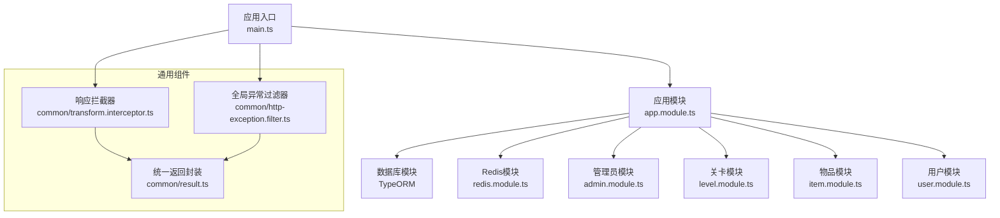
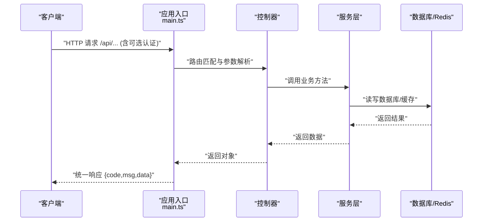
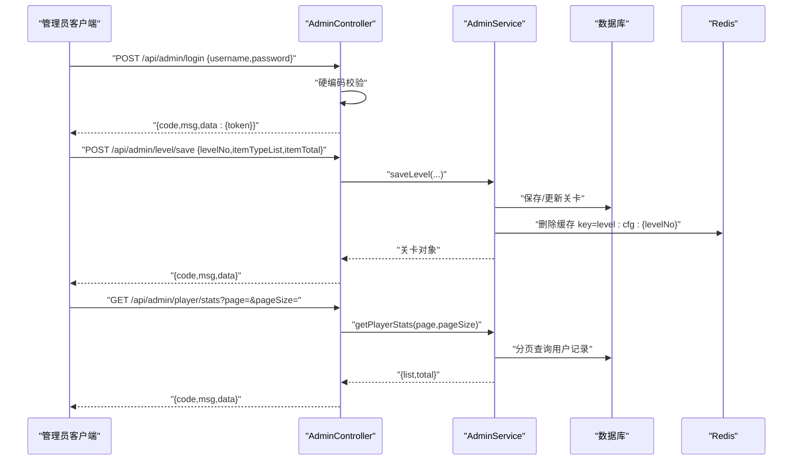
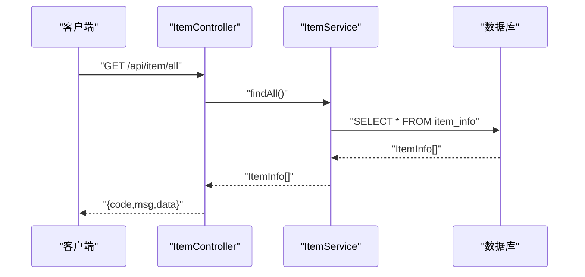
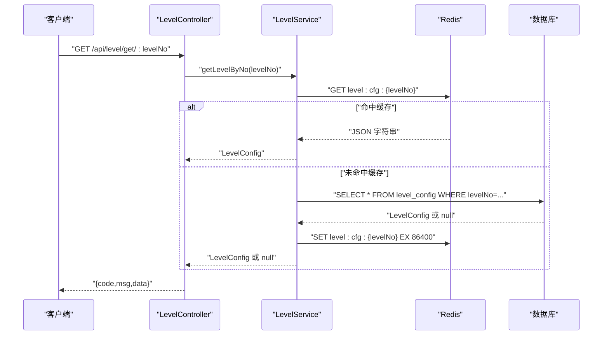
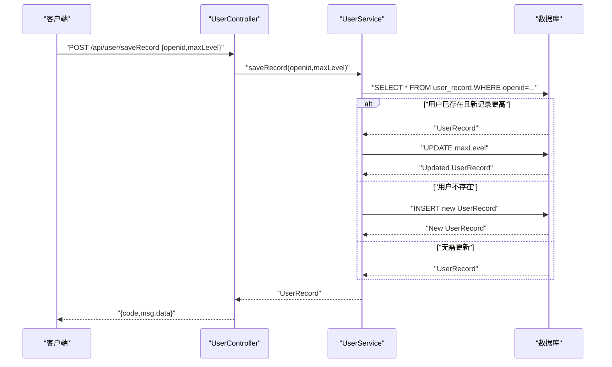
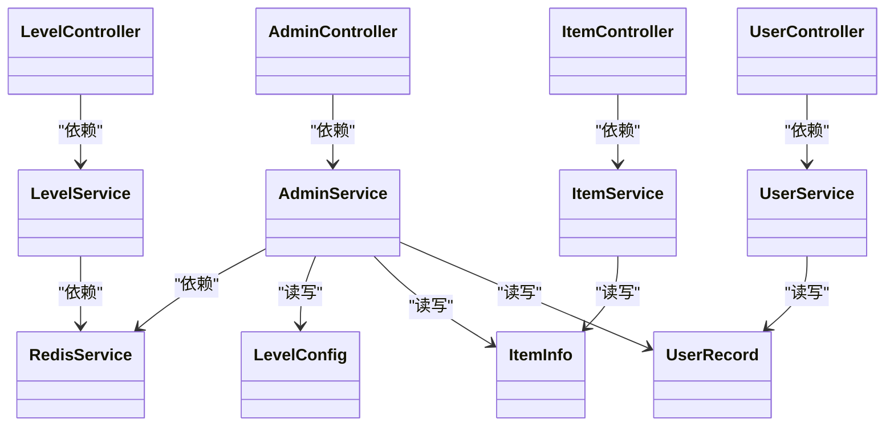

# 后端API文档

<cite>
**本文引用的文件**
- [backend/src/main.ts](file://backend/src/main.ts)
- [backend/src/app.module.ts](file://backend/src/app.module.ts)
- [backend/src/common/result.ts](file://backend/src/common/result.ts)
- [backend/src/common/http-exception.filter.ts](file://backend/src/common/http-exception.filter.ts)
- [backend/src/common/transform.interceptor.ts](file://backend/src/common/transform.interceptor.ts)
- [backend/src/modules/admin/admin.controller.ts](file://backend/src/modules/admin/admin.controller.ts)
- [backend/src/modules/admin/admin.service.ts](file://backend/src/modules/admin/admin.service.ts)
- [backend/src/modules/item/item.controller.ts](file://backend/src/modules/item/item.controller.ts)
- [backend/src/modules/item/item.service.ts](file://backend/src/modules/item/item.service.ts)
- [backend/src/modules/level/level.controller.ts](file://backend/src/modules/level/level.controller.ts)
- [backend/src/modules/level/level.service.ts](file://backend/src/modules/level/level.service.ts)
- [backend/src/modules/user/user.controller.ts](file://backend/src/modules/user/user.controller.ts)
- [backend/src/modules/user/user.service.ts](file://backend/src/modules/user/user.service.ts)
- [backend/src/entities/level-config.entity.ts](file://backend/src/entities/level-config.entity.ts)
- [backend/src/entities/item-info.entity.ts](file://backend/src/entities/item-info.entity.ts)
- [backend/src/entities/user-record.entity.ts](file://backend/src/entities/user-record.entity.ts)
- [backend/src/modules/redis/redis.service.ts](file://backend/src/modules/redis/redis.service.ts)
</cite>

## 目录
1. [简介](#简介)
2. [项目结构](#项目结构)
3. [核心组件](#核心组件)
4. [架构总览](#架构总览)
5. [详细组件分析](#详细组件分析)
6. [依赖关系分析](#依赖关系分析)
7. [性能与缓存策略](#性能与缓存策略)
8. [故障排查指南](#故障排查指南)
9. [结论](#结论)
10. [附录：接口清单与示例](#附录接口清单与示例)

## 简介
本项目为一个基于 NestJS 的后端服务，提供管理员后台、关卡配置、物品管理和用户通关记录等能力。系统通过统一的响应包装、全局异常过滤与拦截器，确保接口返回格式一致；通过 Redis 缓存提升关卡配置读取性能；通过 TypeORM 访问 MySQL 数据库。

## 项目结构
后端采用模块化设计，按功能划分为 admin、level、item、user 四个业务模块，并引入 Redis 缓存模块与数据库模块。应用入口设置全局 CORS、路由前缀、验证管道、异常过滤器与响应拦截器。

图表来源
- [backend/src/main.ts:1-35](file://backend/src/main.ts#L1-L35)
- [backend/src/app.module.ts:1-24](file://backend/src/app.module.ts#L1-L24)

章节来源
- [backend/src/main.ts:1-35](file://backend/src/main.ts#L1-L35)
- [backend/src/app.module.ts:1-24](file://backend/src/app.module.ts#L1-L24)

## 核心组件
- 统一返回格式：所有接口返回统一结构 { code, msg, data }，便于前端统一处理。
- 全局异常过滤器：将异常转换为标准响应，保证 HTTP 状态码与业务 code 的一致性。
- 响应拦截器：自动将控制器返回值包装为统一格式，除非显式返回 Result 实例。
- 路由前缀：所有接口以 /api 开头，便于前后端分离部署与代理转发。
- 验证管道：开启白名单与自动转换，减少脏数据进入业务层。

章节来源
- [backend/src/common/result.ts:1-23](file://backend/src/common/result.ts#L1-L23)
- [backend/src/common/http-exception.filter.ts:1-26](file://backend/src/common/http-exception.filter.ts#L1-L26)
- [backend/src/common/transform.interceptor.ts:1-20](file://backend/src/common/transform.interceptor.ts#L1-L20)
- [backend/src/main.ts:18-28](file://backend/src/main.ts#L18-L28)

## 架构总览
下图展示请求在系统中的流转过程：客户端 → 应用入口 → 全局中间件 → 控制器 → 服务层 → 数据库/缓存 → 统一响应。

图表来源
- [backend/src/main.ts:18-28](file://backend/src/main.ts#L18-L28)
- [backend/src/common/transform.interceptor.ts:7-18](file://backend/src/common/transform.interceptor.ts#L7-L18)
- [backend/src/common/http-exception.filter.ts:8-24](file://backend/src/common/http-exception.filter.ts#L8-L24)

## 详细组件分析

### 管理员认证与后台管理接口
- 接口前缀：/api/admin
- 登录接口：用于管理员登录，返回 token；当前为硬编码校验。
- 关卡管理：支持新增/修改、分页查询、删除关卡。
- 食材管理：支持新增/修改、删除食材。
- 玩家统计：支持分页查询玩家通关记录。

图表来源
- [backend/src/modules/admin/admin.controller.ts:54-61](file://backend/src/modules/admin/admin.controller.ts#L54-L61)
- [backend/src/modules/admin/admin.controller.ts:10-31](file://backend/src/modules/admin/admin.controller.ts#L10-L31)
- [backend/src/modules/admin/admin.controller.ts:47-52](file://backend/src/modules/admin/admin.controller.ts#L47-L52)
- [backend/src/modules/admin/admin.service.ts:22-35](file://backend/src/modules/admin/admin.service.ts#L22-L35)
- [backend/src/modules/admin/admin.service.ts:69-77](file://backend/src/modules/admin/admin.service.ts#L69-L77)
- [backend/src/modules/redis/redis.service.ts:35-38](file://backend/src/modules/redis/redis.service.ts#L35-L38)

章节来源
- [backend/src/modules/admin/admin.controller.ts:1-63](file://backend/src/modules/admin/admin.controller.ts#L1-L63)
- [backend/src/modules/admin/admin.service.ts:1-79](file://backend/src/modules/admin/admin.service.ts#L1-L79)

### 物品管理接口
- 接口前缀：/api/item
- 获取全量食材配置：返回所有物品定义。

图表来源
- [backend/src/modules/item/item.controller.ts:10-15](file://backend/src/modules/item/item.controller.ts#L10-L15)
- [backend/src/modules/item/item.service.ts:14-17](file://backend/src/modules/item/item.service.ts#L14-L17)

章节来源
- [backend/src/modules/item/item.controller.ts:1-17](file://backend/src/modules/item/item.controller.ts#L1-L17)
- [backend/src/modules/item/item.service.ts:1-35](file://backend/src/modules/item/item.service.ts#L1-L35)

### 关卡配置接口
- 接口前缀：/api/level
- 获取单关卡配置：优先从 Redis 缓存读取，未命中则查询数据库并写入缓存。

图表来源
- [backend/src/modules/level/level.controller.ts:10-15](file://backend/src/modules/level/level.controller.ts#L10-L15)
- [backend/src/modules/level/level.service.ts:16-32](file://backend/src/modules/level/level.service.ts#L16-L32)
- [backend/src/modules/redis/redis.service.ts:21-33](file://backend/src/modules/redis/redis.service.ts#L21-L33)

章节来源
- [backend/src/modules/level/level.controller.ts:1-17](file://backend/src/modules/level/level.controller.ts#L1-L17)
- [backend/src/modules/level/level.service.ts:1-34](file://backend/src/modules/level/level.service.ts#L1-L34)

### 用户数据接口
- 接口前缀：/api/user
- 提交玩家通关存档：若新记录更高则更新，否则不变更。

图表来源
- [backend/src/modules/user/user.controller.ts:10-15](file://backend/src/modules/user/user.controller.ts#L10-L15)
- [backend/src/modules/user/user.service.ts:14-29](file://backend/src/modules/user/user.service.ts#L14-L29)

章节来源
- [backend/src/modules/user/user.controller.ts:1-17](file://backend/src/modules/user/user.controller.ts#L1-L17)
- [backend/src/modules/user/user.service.ts:1-41](file://backend/src/modules/user/user.service.ts#L1-L41)

## 依赖关系分析
- 控制器仅依赖服务层，服务层依赖仓储与 Redis 服务，实现关注点分离。
- Redis 服务封装 ioredis 客户端，提供 get/set/del 等基础能力。
- 实体定义清晰映射到数据库表结构，便于维护与扩展。

图表来源
- [backend/src/modules/admin/admin.controller.ts:1-63](file://backend/src/modules/admin/admin.controller.ts#L1-L63)
- [backend/src/modules/admin/admin.service.ts:1-79](file://backend/src/modules/admin/admin.service.ts#L1-L79)
- [backend/src/modules/item/item.controller.ts:1-17](file://backend/src/modules/item/item.controller.ts#L1-L17)
- [backend/src/modules/item/item.service.ts:1-35](file://backend/src/modules/item/item.service.ts#L1-L35)
- [backend/src/modules/level/level.controller.ts:1-17](file://backend/src/modules/level/level.controller.ts#L1-L17)
- [backend/src/modules/level/level.service.ts:1-34](file://backend/src/modules/level/level.service.ts#L1-L34)
- [backend/src/modules/user/user.controller.ts:1-17](file://backend/src/modules/user/user.controller.ts#L1-L17)
- [backend/src/modules/user/user.service.ts:1-41](file://backend/src/modules/user/user.service.ts#L1-L41)
- [backend/src/modules/redis/redis.service.ts:1-45](file://backend/src/modules/redis/redis.service.ts#L1-L45)
- [backend/src/entities/level-config.entity.ts:1-21](file://backend/src/entities/level-config.entity.ts#L1-L21)
- [backend/src/entities/item-info.entity.ts:1-18](file://backend/src/entities/item-info.entity.ts#L1-L18)
- [backend/src/entities/user-record.entity.ts:1-18](file://backend/src/entities/user-record.entity.ts#L1-L18)

## 性能与缓存策略
- Redis 缓存：关卡配置读取优先走缓存，未命中再查数据库，并设置 24 小时过期时间，显著降低数据库压力。
- 分页查询：管理端与用户端均采用分页查询，避免一次性返回大量数据。
- 统一响应与异常处理：减少前端分支判断，提高整体稳定性。

章节来源
- [backend/src/modules/level/level.service.ts:16-32](file://backend/src/modules/level/level.service.ts#L16-L32)
- [backend/src/modules/admin/admin.service.ts:37-45](file://backend/src/modules/admin/admin.service.ts#L37-L45)
- [backend/src/modules/user/user.service.ts:31-39](file://backend/src/modules/user/user.service.ts#L31-L39)

## 故障排查指南
- 统一异常处理：全局异常过滤器会将未知异常转换为标准响应，HTTP 状态码固定为 200，业务 code 默认 500，msg 为错误信息字符串。
- 参数校验：启用 ValidationPipe，非法字段会被拒绝，建议检查请求体是否符合控制器声明的类型。
- Redis 连接：RedisService 在构造时建立连接并在模块销毁时断开，如出现连接错误请检查配置项与网络连通性。
- 数据库访问：确认数据库连接配置正确，实体与表结构一致。

章节来源
- [backend/src/common/http-exception.filter.ts:8-24](file://backend/src/common/http-exception.filter.ts#L8-L24)
- [backend/src/common/transform.interceptor.ts:7-18](file://backend/src/common/transform.interceptor.ts#L7-L18)
- [backend/src/main.ts:22-28](file://backend/src/main.ts#L22-L28)
- [backend/src/modules/redis/redis.service.ts:10-19](file://backend/src/modules/redis/redis.service.ts#L10-L19)

## 结论
本后端 API 通过模块化设计与统一的响应/异常处理机制，提供了稳定、易维护的 RESTful 接口。结合 Redis 缓存与分页查询，满足了管理后台与游戏运行时的性能需求。建议后续增强鉴权体系与参数校验规则，进一步提升安全性与健壮性。

## 附录：接口清单与示例

### 通用约定
- 路由前缀：/api
- 统一响应格式：{ code, msg, data }
- 成功 code：200
- 失败 code：500 或业务特定 code（如登录失败 401）
- Content-Type：application/json

### 管理员后台接口
- 登录
  - 方法：POST
  - 路径：/api/admin/login
  - 请求体：{ username, password }
  - 成功响应：{ code: 200, msg, data: { token } }
  - 失败响应：{ code: 401, msg, data: null }
  - 示例请求：POST /api/admin/login { "username": "admin", "password": "admin123" }
  - 示例响应：{ "code": 200, "msg": "登录成功", "data": { "token": "goose-admin-token-..." } }

- 新增/修改关卡
  - 方法：POST
  - 路径：/api/admin/level/save
  - 请求体：{ levelNo, itemTypeList, itemTotal }
  - 成功响应：{ code: 200, msg, data: LevelConfig }

- 查询关卡列表（分页）
  - 方法：GET
  - 路径：/api/admin/level/list?page=&pageSize=
  - 查询参数：page, pageSize
  - 成功响应：{ code: 200, msg, data: { list, total } }

- 删除关卡
  - 方法：DELETE
  - 路径：/api/admin/level/:levelNo
  - 路径参数：levelNo
  - 成功响应：{ code: 200, msg: "删除成功", data: null }

- 新增/修改食材
  - 方法：POST
  - 路径：/api/admin/item/save
  - 请求体：{ itemKey, resPath }
  - 成功响应：{ code: 200, msg, data: ItemInfo }

- 删除食材
  - 方法：DELETE
  - 路径：/api/admin/item/:itemKey
  - 路径参数：itemKey
  - 成功响应：{ code: 200, msg: "删除成功", data: null }

- 玩家数据统计（分页）
  - 方法：GET
  - 路径：/api/admin/player/stats?page=&pageSize=
  - 查询参数：page, pageSize
  - 成功响应：{ code: 200, msg, data: { list, total } }

章节来源
- [backend/src/modules/admin/admin.controller.ts:10-61](file://backend/src/modules/admin/admin.controller.ts#L10-L61)

### 物品管理接口
- 获取全量食材配置
  - 方法：GET
  - 路径：/api/item/all
  - 成功响应：{ code: 200, msg, data: ItemInfo[] }

章节来源
- [backend/src/modules/item/item.controller.ts:10-15](file://backend/src/modules/item/item.controller.ts#L10-L15)

### 关卡配置接口
- 获取单关卡配置
  - 方法：GET
  - 路径：/api/level/get/:levelNo
  - 路径参数：levelNo
  - 成功响应：{ code: 200, msg, data: LevelConfig 或 null }

章节来源
- [backend/src/modules/level/level.controller.ts:10-15](file://backend/src/modules/level/level.controller.ts#L10-L15)

### 用户数据接口
- 提交玩家通关存档
  - 方法：POST
  - 路径：/api/user/saveRecord
  - 请求体：{ openid, maxLevel }
  - 成功响应：{ code: 200, msg, data: UserRecord }

章节来源
- [backend/src/modules/user/user.controller.ts:10-15](file://backend/src/modules/user/user.controller.ts#L10-L15)

### 数据模型
- 关卡配置 LevelConfig
  - 字段：levelNo(int), itemTypeList(json数组), itemTotal(int), createdAt, updatedAt

- 食材 ItemInfo
  - 字段：itemKey(varchar), resPath(varchar), createdAt, updatedAt

- 用户记录 UserRecord
  - 字段：openid(varchar), maxLevel(int), createdAt, updatedAt

章节来源
- [backend/src/entities/level-config.entity.ts:1-21](file://backend/src/entities/level-config.entity.ts#L1-L21)
- [backend/src/entities/item-info.entity.ts:1-18](file://backend/src/entities/item-info.entity.ts#L1-L18)
- [backend/src/entities/user-record.entity.ts:1-18](file://backend/src/entities/user-record.entity.ts#L1-L18)