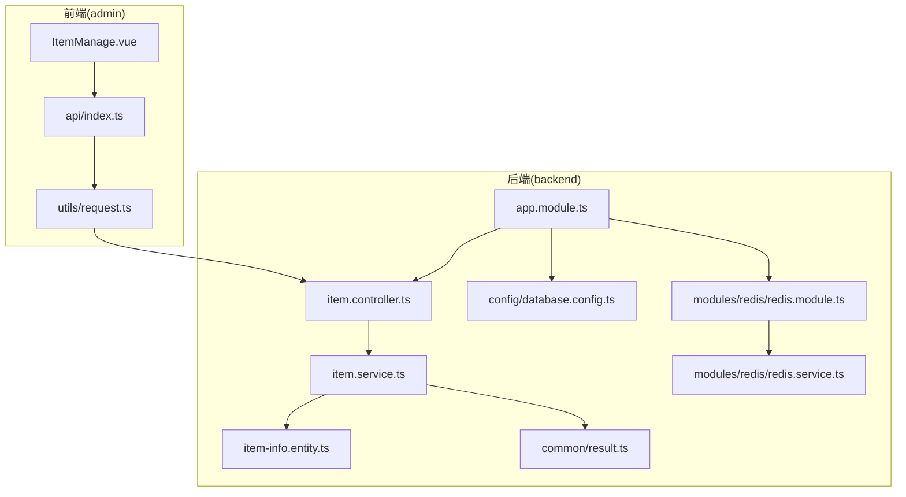
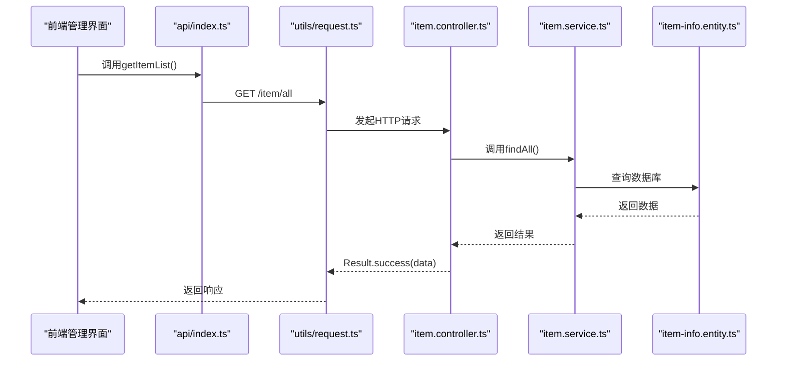
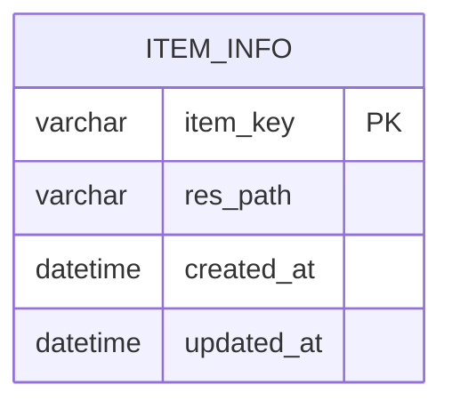
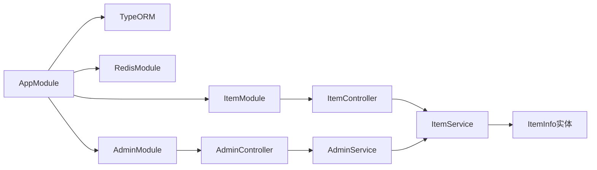

# 物品管理API

<cite>
**本文引用的文件**
- [backend/src/entities/item-info.entity.ts](file://backend/src/entities/item-info.entity.ts)
- [backend/src/modules/item/item.controller.ts](file://backend/src/modules/item/item.controller.ts)
- [backend/src/modules/item/item.service.ts](file://backend/src/modules/item/item.service.ts)
- [backend/src/common/result.ts](file://backend/src/common/result.ts)
- [backend/src/app.module.ts](file://backend/src/app.module.ts)
- [backend/src/config/database.config.ts](file://backend/src/config/database.config.ts)
- [backend/src/modules/redis/redis.module.ts](file://backend/src/modules/redis/redis.module.ts)
- [backend/src/modules/redis/redis.service.ts](file://backend/src/modules/redis/redis.service.ts)
- [backend/src/modules/level/level.controller.ts](file://backend/src/modules/level/level.controller.ts)
- [backend/src/modules/level/level.service.ts](file://backend/src/modules/level/level.service.ts)
- [backend/src/modules/user/user.controller.ts](file://backend/src/modules/user/user.controller.ts)
- [backend/src/modules/user/user.service.ts](file://backend/src/modules/user/user.service.ts)
- [backend/src/modules/admin/admin.controller.ts](file://backend/src/modules/admin/admin.controller.ts)
- [backend/src/modules/admin/admin.service.ts](file://backend/src/modules/admin/admin.service.ts)
- [admin/src/views/ItemManage.vue](file://admin/src/views/ItemManage.vue)
- [admin/src/api/index.ts](file://admin/src/api/index.ts)
- [admin/src/utils/request.ts](file://admin/src/utils/request.ts)
- [sql/init.sql](file://sql/init.sql)
</cite>

## 目录
1. [简介](#简介)
2. [项目结构](#项目结构)
3. [核心组件](#核心组件)
4. [架构总览](#架构总览)
5. [详细组件分析](#详细组件分析)
6. [依赖关系分析](#依赖关系分析)
7. [性能考虑](#性能考虑)
8. [故障排查指南](#故障排查指南)
9. [结论](#结论)
10. [附录](#附录)

## 简介
本文件为“物品管理系统”的API文档，聚焦于物品（食材）的增删改查、属性管理、库存控制与分类相关能力。当前后端实现提供了基础的物品配置读取与管理接口，前端提供了可视化管理界面。本文将基于现有代码梳理数据模型、接口规范、错误处理与性能优化建议，并给出可扩展到库存与分类的实践方向。

## 项目结构
系统采用前后端分离架构：
- 后端：NestJS + TypeORM + MySQL，模块化组织业务域（物品、关卡、用户、管理员等）
- 前端：Vue3 + Element Plus，通过统一请求封装调用后端接口
- 数据层：MySQL初始化脚本包含物品配置表与关卡配置表

**图表来源**
- [backend/src/app.module.ts:1-24](file://backend/src/app.module.ts#L1-L24)
- [backend/src/modules/item/item.controller.ts:1-17](file://backend/src/modules/item/item.controller.ts#L1-L17)
- [backend/src/modules/item/item.service.ts:1-35](file://backend/src/modules/item/item.service.ts#L1-L35)
- [backend/src/entities/item-info.entity.ts:1-18](file://backend/src/entities/item-info.entity.ts#L1-L18)
- [backend/src/common/result.ts:1-23](file://backend/src/common/result.ts#L1-L23)
- [admin/src/views/ItemManage.vue:1-96](file://admin/src/views/ItemManage.vue#L1-L96)
- [admin/src/api/index.ts:1-34](file://admin/src/api/index.ts#L1-L34)
- [admin/src/utils/request.ts:1-44](file://admin/src/utils/request.ts#L1-L44)

**章节来源**
- [backend/src/app.module.ts:1-24](file://backend/src/app.module.ts#L1-L24)
- [sql/init.sql:26-33](file://sql/init.sql#L26-L33)

## 核心组件
- 物品实体：定义物品的唯一键与资源路径，并包含创建/更新时间戳
- 物品控制器：提供获取全量物品配置的只读接口
- 物品服务：封装数据访问逻辑，支持新增/修改与删除
- 统一返回包装：约定响应结构code/msg/data
- 前端管理界面：提供物品列表展示、新增/编辑弹窗、删除确认与数据加载

**章节来源**
- [backend/src/entities/item-info.entity.ts:1-18](file://backend/src/entities/item-info.entity.ts#L1-L18)
- [backend/src/modules/item/item.controller.ts:1-17](file://backend/src/modules/item/item.controller.ts#L1-L17)
- [backend/src/modules/item/item.service.ts:1-35](file://backend/src/modules/item/item.service.ts#L1-L35)
- [backend/src/common/result.ts:1-23](file://backend/src/common/result.ts#L1-L23)
- [admin/src/views/ItemManage.vue:1-96](file://admin/src/views/ItemManage.vue#L1-L96)

## 架构总览
后端通过TypeORM连接MySQL，使用模块化方式组织业务；前端通过Axios封装统一请求，自动注入鉴权头并集中处理错误码。

**图表来源**
- [admin/src/views/ItemManage.vue:58-61](file://admin/src/views/ItemManage.vue#L58-L61)
- [admin/src/api/index.ts:19-21](file://admin/src/api/index.ts#L19-L21)
- [admin/src/utils/request.ts:1-44](file://admin/src/utils/request.ts#L1-L44)
- [backend/src/modules/item/item.controller.ts:10-15](file://backend/src/modules/item/item.controller.ts#L10-L15)
- [backend/src/modules/item/item.service.ts:14-17](file://backend/src/modules/item/item.service.ts#L14-L17)
- [backend/src/entities/item-info.entity.ts:1-18](file://backend/src/entities/item-info.entity.ts#L1-L18)

## 详细组件分析

### 数据模型与字段定义
- 表名：item_info
- 字段说明
  - item_key：字符串，长度限制，主键，唯一标识
  - res_path：字符串，长度限制，模型资源地址
  - created_at：时间戳，自动记录创建时间
  - updated_at：时间戳，自动记录更新时间

**图表来源**
- [sql/init.sql:26-33](file://sql/init.sql#L26-L33)
- [backend/src/entities/item-info.entity.ts:6-16](file://backend/src/entities/item-info.entity.ts#L6-L16)

**章节来源**
- [sql/init.sql:26-33](file://sql/init.sql#L26-L33)
- [backend/src/entities/item-info.entity.ts:1-18](file://backend/src/entities/item-info.entity.ts#L1-L18)

### 接口定义与行为
- 获取全量物品配置
  - 方法：GET
  - 路径：/item/all
  - 控制器：ItemController.getAllItems
  - 服务：ItemService.findAll
  - 响应：Result.success(data)
- 新增/修改物品
  - 方法：POST
  - 路径：/admin/item/save
  - 控制器：AdminController.saveItem
  - 服务：AdminService.saveItem
  - 参数：itemKey, resPath
  - 响应：Result.success(data)
- 删除物品
  - 方法：DELETE
  - 路径：/admin/item/:itemKey
  - 控制器：AdminController.removeItem
  - 服务：AdminService.removeItem
  - 响应：Result.success()

注意：当前仓库中未发现“/admin/item/save”和“/admin/item/:itemKey”的具体实现文件，但前端已调用对应API。建议在后续版本中补充Admin模块的控制器与服务实现以匹配前端调用。

**章节来源**
- [backend/src/modules/item/item.controller.ts:10-15](file://backend/src/modules/item/item.controller.ts#L10-L15)
- [backend/src/modules/item/item.service.ts:19-28](file://backend/src/modules/item/item.service.ts#L19-L28)
- [admin/src/api/index.ts:23-29](file://admin/src/api/index.ts#L23-L29)
- [admin/src/views/ItemManage.vue:75-86](file://admin/src/views/ItemManage.vue#L75-L86)

### 请求示例（基于现有实现）
- 获取全量物品
  - 方法：GET
  - 路径：/item/all
  - 响应：Result.success(data)
  - 参考路径：[admin/src/api/index.ts:19-21](file://admin/src/api/index.ts#L19-L21)，[admin/src/views/ItemManage.vue:58-61](file://admin/src/views/ItemManage.vue#L58-L61)
- 新增/修改物品
  - 方法：POST
  - 路径：/admin/item/save
  - 请求体：{ itemKey, resPath }
  - 参考路径：[admin/src/api/index.ts:23-25](file://admin/src/api/index.ts#L23-L25)，[admin/src/views/ItemManage.vue:75-86](file://admin/src/views/ItemManage.vue#L75-L86)
- 删除物品
  - 方法：DELETE
  - 路径：/admin/item/:itemKey
  - 路径参数：itemKey
  - 参考路径：[admin/src/api/index.ts:27-29](file://admin/src/api/index.ts#L27-L29)，[admin/src/views/ItemManage.vue:88-92](file://admin/src/views/ItemManage.vue#L88-L92)

**章节来源**
- [admin/src/api/index.ts:19-29](file://admin/src/api/index.ts#L19-L29)
- [admin/src/views/ItemManage.vue:58-92](file://admin/src/views/ItemManage.vue#L58-L92)

### 数据验证与错误处理
- 前端校验
  - 表单规则：itemKey与resPath必填
  - 参考路径：[admin/src/views/ItemManage.vue:52-56](file://admin/src/views/ItemManage.vue#L52-L56)
- 统一响应包装
  - 成功：code=200，msg为操作成功提示，data为返回数据
  - 失败：默认code=500，msg为操作失败提示
  - 参考路径：[backend/src/common/result.ts:13-21](file://backend/src/common/result.ts#L13-L21)
- 前端统一请求封装
  - 自动附加Authorization头（localStorage中的admin_token）
  - 对非200状态进行统一错误提示与401跳转登录
  - 参考路径：[admin/src/utils/request.ts:10-41](file://admin/src/utils/request.ts#L10-L41)

**章节来源**
- [admin/src/views/ItemManage.vue:52-56](file://admin/src/views/ItemManage.vue#L52-L56)
- [backend/src/common/result.ts:13-21](file://backend/src/common/result.ts#L13-L21)
- [admin/src/utils/request.ts:10-41](file://admin/src/utils/request.ts#L10-L41)

### 库存控制与物品分类（扩展建议）
当前仓库未提供库存与分类的实体与接口。建议按以下思路扩展：
- 新增库存表：包含itemKey、数量、阈值、仓库位置等字段
- 新增分类表：包含分类ID、名称、父级分类、排序等字段
- 在物品服务中增加库存变更与分类关联逻辑
- 在控制器中提供库存查询、补货、出库等接口

该部分为概念性扩展，不对应具体源码文件。

### 图片上传、存储管理与访问控制（扩展建议）
- 文件上传：建议使用通用文件上传中间件或云存储SDK
- 存储策略：区分开发/测试/生产环境的存储路径或对象存储桶
- 访问控制：结合鉴权中间件与权限位，限制敏感资源访问
- 缓存：对常用资源路径做Redis缓存，降低数据库压力
该部分为概念性扩展，不对应具体源码文件。

### 搜索过滤、分页查询与排序（当前实现与建议）
- 当前实现
  - GET /item/all：返回全量物品，无分页与排序
  - 参考路径：[backend/src/modules/item/item.controller.ts:10-15](file://backend/src/modules/item/item.controller.ts#L10-L15)，[backend/src/modules/item/item.service.ts:14-17](file://backend/src/modules/item/item.service.ts#L14-L17)
- 建议
  - 分页：在服务层增加分页参数与总数统计
  - 过滤：按itemKey或resPath模糊/精确过滤
  - 排序：按created_at或updated_at倒序
该部分为概念性扩展，不对应具体源码文件。

## 依赖关系分析
- 模块耦合
  - AppModule集中导入数据库、Redis与各业务模块
  - ItemModule提供物品读取能力，AdminModule承载新增/删除等管理接口
- 外部依赖
  - TypeORM负责数据库映射与查询
  - Axios负责HTTP请求封装与拦截器
  - Element Plus负责前端UI与表单校验

**图表来源**
- [backend/src/app.module.ts:10-21](file://backend/src/app.module.ts#L10-L21)
- [backend/src/modules/item/item.controller.ts:1-17](file://backend/src/modules/item/item.controller.ts#L1-L17)
- [backend/src/modules/item/item.service.ts:1-35](file://backend/src/modules/item/item.service.ts#L1-L35)
- [backend/src/entities/item-info.entity.ts:1-18](file://backend/src/entities/item-info.entity.ts#L1-L18)

**章节来源**
- [backend/src/app.module.ts:10-21](file://backend/src/app.module.ts#L10-L21)

## 性能考虑
- 数据库层面
  - 为item_key建立索引（主键已具备）
  - 对高频查询字段考虑复合索引
- 缓存层面
  - 使用Redis缓存常用物品配置，减少数据库压力
  - 参考路径：[backend/src/modules/redis/redis.module.ts](file://backend/src/modules/redis/redis.module.ts)，[backend/src/modules/redis/redis.service.ts](file://backend/src/modules/redis/redis.service.ts)
- 接口层面
  - 对全量查询增加分页与过滤参数
  - 对写操作使用批量提交与事务控制
- 前端层面
  - 对重复请求进行去重与节流
  - 对大列表使用虚拟滚动优化渲染

[本节为通用性能建议，不直接分析具体文件]

## 故障排查指南
- 常见问题
  - 401未授权：检查localStorage中的admin_token是否有效
  - 请求失败：查看响应msg与后端日志
  - 数据异常：核对数据库表结构与实体映射
- 定位方法
  - 前端：统一响应拦截器会提示错误并处理401跳转
  - 后端：Result统一返回结构便于定位
- 参考路径
  - [admin/src/utils/request.ts:22-41](file://admin/src/utils/request.ts#L22-L41)
  - [backend/src/common/result.ts:13-21](file://backend/src/common/result.ts#L13-L21)

**章节来源**
- [admin/src/utils/request.ts:22-41](file://admin/src/utils/request.ts#L22-L41)
- [backend/src/common/result.ts:13-21](file://backend/src/common/result.ts#L13-L21)

## 结论
当前系统提供了物品配置的基础读取能力与前端管理界面，后续可在Admin模块补齐新增/删除接口、引入库存与分类、完善搜索/分页/排序与缓存策略，以满足更复杂的业务需求。本文档为这些扩展提供了清晰的参考路径与最佳实践建议。

## 附录
- 初始化SQL包含物品配置表与示例数据，可用于快速验证
  - 参考路径：[sql/init.sql:26-47](file://sql/init.sql#L26-L47)

**章节来源**
- [sql/init.sql:26-47](file://sql/init.sql#L26-L47)