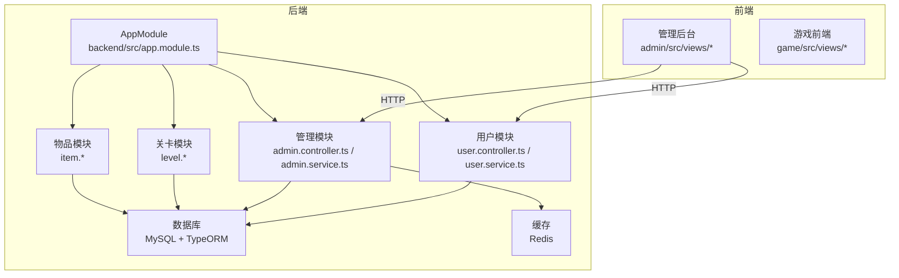
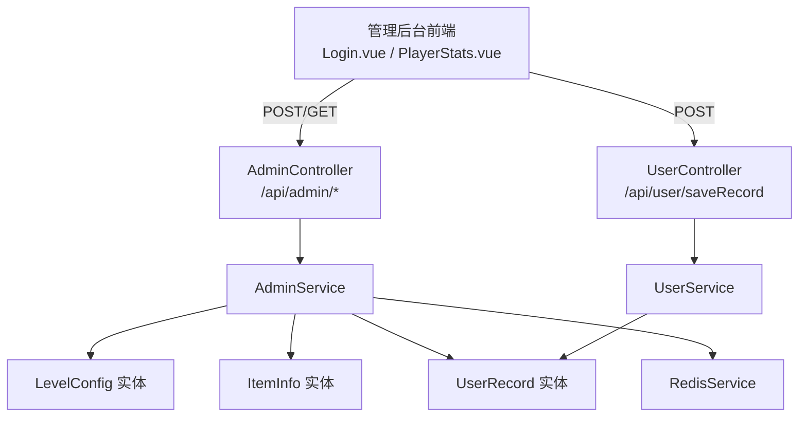
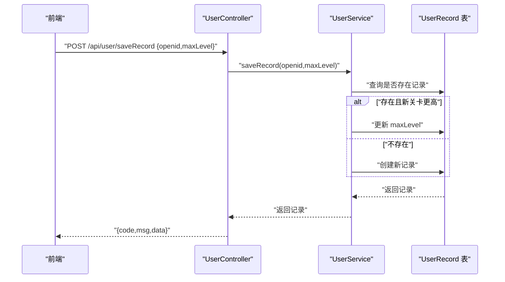
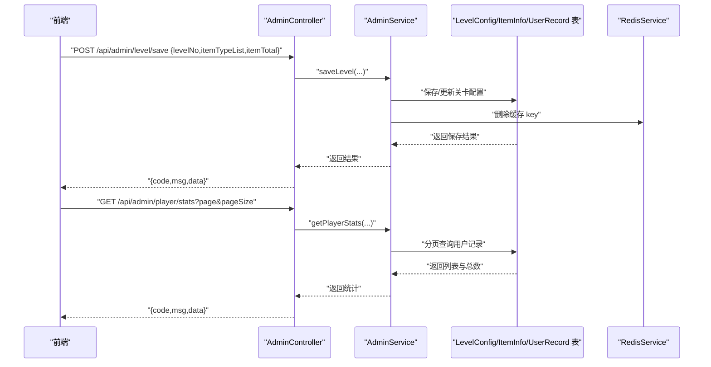
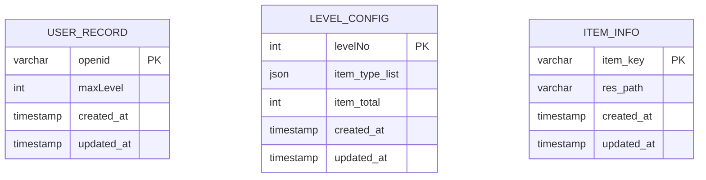
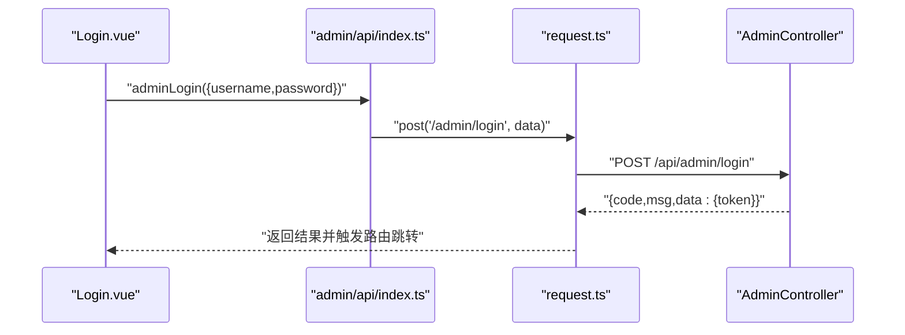
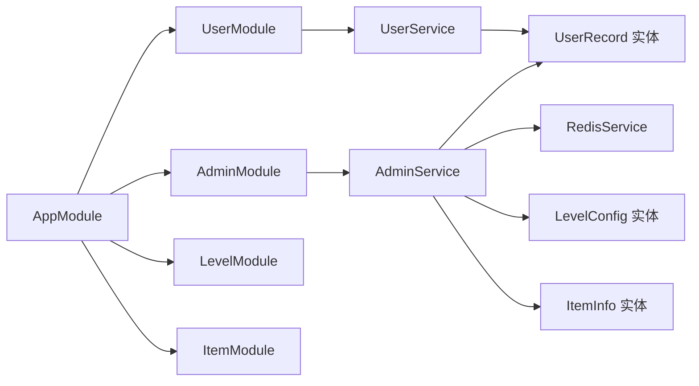

# 用户数据API

<cite>
**本文引用的文件**
- [backend/src/entities/user-record.entity.ts](file://backend/src/entities/user-record.entity.ts)
- [backend/src/modules/user/user.controller.ts](file://backend/src/modules/user/user.controller.ts)
- [backend/src/modules/user/user.service.ts](file://backend/src/modules/user/user.service.ts)
- [backend/src/entities/level-config.entity.ts](file://backend/src/entities/level-config.entity.ts)
- [backend/src/entities/item-info.entity.ts](file://backend/src/entities/item-info.entity.ts)
- [backend/src/modules/admin/admin.controller.ts](file://backend/src/modules/admin/admin.controller.ts)
- [backend/src/modules/admin/admin.service.ts](file://backend/src/modules/admin/admin.service.ts)
- [backend/src/common/transform.interceptor.ts](file://backend/src/common/transform.interceptor.ts)
- [backend/src/common/http-exception.filter.ts](file://backend/src/common/http-exception.filter.ts)
- [backend/src/app.module.ts](file://backend/src/app.module.ts)
- [admin/src/views/Login.vue](file://admin/src/views/Login.vue)
- [admin/src/stores/user.ts](file://admin/src/stores/user.ts)
- [admin/src/utils/request.ts](file://admin/src/utils/request.ts)
- [admin/src/api/index.ts](file://admin/src/api/index.ts)
- [admin/src/views/PlayerStats.vue](file://admin/src/views/PlayerStats.vue)
</cite>

## 目录
1. [简介](#简介)
2. [项目结构](#项目结构)
3. [核心组件](#核心组件)
4. [架构总览](#架构总览)
5. [详细组件分析](#详细组件分析)
6. [依赖关系分析](#依赖关系分析)
7. [性能考虑](#性能考虑)
8. [故障排查指南](#故障排查指南)
9. [结论](#结论)
10. [附录](#附录)

## 简介
本文件面向“用户数据管理API”的使用与维护，覆盖以下主题：
- 用户注册、登录、个人信息管理与游戏进度查询接口
- 用户数据模型、隐私保护与数据安全措施
- 用户等级系统、积分计算与成就记录能力说明
- 用户行为追踪、统计数据收集与分析接口
- 用户反馈、客服支持与账户安全管理
- 用户数据备份、恢复、迁移与清理功能
- API限流、防刷机制与异常监控

当前仓库后端实现聚焦于“用户通关记录”与“管理后台”，提供基础的用户进度存档与统计能力；其余高级功能（如用户注册/登录、等级/积分/成就、行为追踪、客服等）在本仓库中尚未实现，将在“附录”中给出可扩展建议。

## 项目结构
整体采用前后端分离架构：前端包含管理后台（Vue + Element Plus）、游戏前端（Vue + 小程序环境）、后端（NestJS + TypeORM + MySQL + Redis）。后端通过模块化组织业务域，包括用户、关卡、物品与管理模块。

图表来源
- [backend/src/app.module.ts:10-23](file://backend/src/app.module.ts#L10-L23)
- [backend/src/modules/user/user.controller.ts:5-16](file://backend/src/modules/user/user.controller.ts#L5-L16)
- [backend/src/modules/admin/admin.controller.ts:5-62](file://backend/src/modules/admin/admin.controller.ts#L5-L62)

章节来源
- [backend/src/app.module.ts:10-23](file://backend/src/app.module.ts#L10-L23)

## 核心组件
- 用户模块：提供“提交通关记录”接口，按 openid 存储最高通关关卡，若新记录更高则更新。
- 管理模块：提供关卡配置、食材配置的增删改查与分页列表，以及玩家统计数据查询。
- 数据模型：用户通关记录、关卡配置、食材信息三类实体。
- 统一响应与异常：全局响应拦截器统一返回 {code,msg,data} 结构；全局异常过滤器统一处理错误。
- 前端管理后台：登录、玩家统计展示、与后端API交互。

章节来源
- [backend/src/modules/user/user.controller.ts:10-15](file://backend/src/modules/user/user.controller.ts#L10-L15)
- [backend/src/modules/user/user.service.ts:14-29](file://backend/src/modules/user/user.service.ts#L14-L29)
- [backend/src/modules/admin/admin.controller.ts:47-52](file://backend/src/modules/admin/admin.controller.ts#L47-L52)
- [backend/src/common/transform.interceptor.ts:5-19](file://backend/src/common/transform.interceptor.ts#L5-L19)
- [backend/src/common/http-exception.filter.ts:5-25](file://backend/src/common/http-exception.filter.ts#L5-L25)

## 架构总览
后端以模块为中心，通过 TypeORM 连接 MySQL，部分管理操作配合 Redis 缓存。前端管理后台通过 Axios 发起请求，自动注入 Token 并统一对错误进行处理。

图表来源
- [backend/src/modules/admin/admin.controller.ts:10-61](file://backend/src/modules/admin/admin.controller.ts#L10-L61)
- [backend/src/modules/admin/admin.service.ts:22-77](file://backend/src/modules/admin/admin.service.ts#L22-L77)
- [backend/src/modules/user/user.controller.ts:11-15](file://backend/src/modules/user/user.controller.ts#L11-L15)
- [backend/src/modules/user/user.service.ts:14-29](file://backend/src/modules/user/user.service.ts#L14-L29)

## 详细组件分析

### 用户模块：通关记录提交
- 接口：POST /api/user/saveRecord
- 功能：根据 openid 保存或更新最高通关关卡；仅当新关卡更高时更新。
- 返回：统一响应结构，包含最新记录。

图表来源
- [backend/src/modules/user/user.controller.ts:11-15](file://backend/src/modules/user/user.controller.ts#L11-L15)
- [backend/src/modules/user/user.service.ts:14-29](file://backend/src/modules/user/user.service.ts#L14-L29)

章节来源
- [backend/src/modules/user/user.controller.ts:10-15](file://backend/src/modules/user/user.controller.ts#L10-L15)
- [backend/src/modules/user/user.service.ts:14-29](file://backend/src/modules/user/user.service.ts#L14-L29)

### 管理模块：关卡与食材管理、玩家统计
- 关卡管理
  - 新增/修改：POST /api/admin/level/save
  - 列表分页：GET /api/admin/level/list?page=&pageSize=
  - 删除：DELETE /api/admin/level/:levelNo
- 食材管理
  - 新增/修改：POST /api/admin/item/save
  - 删除：DELETE /api/admin/item/:itemKey
- 玩家统计
  - 分页查询：GET /api/admin/player/stats?page=&pageSize=
- 管理员登录
  - 登录：POST /api/admin/login（示例凭据：admin/admin123）

图表来源
- [backend/src/modules/admin/admin.controller.ts:10-52](file://backend/src/modules/admin/admin.controller.ts#L10-L52)
- [backend/src/modules/admin/admin.service.ts:22-77](file://backend/src/modules/admin/admin.service.ts#L22-L77)

章节来源
- [backend/src/modules/admin/admin.controller.ts:10-61](file://backend/src/modules/admin/admin.controller.ts#L10-L61)
- [backend/src/modules/admin/admin.service.ts:22-77](file://backend/src/modules/admin/admin.service.ts#L22-L77)

### 数据模型
- 用户通关记录（UserRecord）
  - 主键：openid（字符串，长度64）
  - 字段：maxLevel（整型，默认0），createdAt/updatedAt（时间戳）
- 关卡配置（LevelConfig）
  - 主键：levelNo（整型）
  - 字段：itemTypeList（JSON数组）、itemTotal（整型），createdAt/updatedAt
- 食材信息（ItemInfo）
  - 主键：itemKey（字符串，长度64）
  - 字段：resPath（字符串，长度255），createdAt/updatedAt

图表来源
- [backend/src/entities/user-record.entity.ts:4-17](file://backend/src/entities/user-record.entity.ts#L4-L17)
- [backend/src/entities/level-config.entity.ts:4-20](file://backend/src/entities/level-config.entity.ts#L4-L20)
- [backend/src/entities/item-info.entity.ts:4-17](file://backend/src/entities/item-info.entity.ts#L4-L17)

章节来源
- [backend/src/entities/user-record.entity.ts:4-17](file://backend/src/entities/user-record.entity.ts#L4-L17)
- [backend/src/entities/level-config.entity.ts:4-20](file://backend/src/entities/level-config.entity.ts#L4-L20)
- [backend/src/entities/item-info.entity.ts:4-17](file://backend/src/entities/item-info.entity.ts#L4-L17)

### 前端管理后台
- 登录页面：输入账号/密码，调用 /api/admin/login，成功后本地持久化 token 并跳转首页。
- 玩家统计：分页加载 /api/admin/player/stats，展示 openid、最高关卡、更新时间。
- 请求封装：统一设置 baseURL=/api，自动附加 Authorization 头，统一对 401 与业务错误进行处理。

图表来源
- [admin/src/views/Login.vue:40-53](file://admin/src/views/Login.vue#L40-L53)
- [admin/src/api/index.ts:4](file://admin/src/api/index.ts#L4)
- [admin/src/utils/request.ts:10-20](file://admin/src/utils/request.ts#L10-L20)
- [backend/src/modules/admin/admin.controller.ts:54-61](file://backend/src/modules/admin/admin.controller.ts#L54-L61)

章节来源
- [admin/src/views/Login.vue:40-53](file://admin/src/views/Login.vue#L40-L53)
- [admin/src/stores/user.ts:12-25](file://admin/src/stores/user.ts#L12-L25)
- [admin/src/utils/request.ts:10-41](file://admin/src/utils/request.ts#L10-L41)
- [admin/src/api/index.ts:4](file://admin/src/api/index.ts#L4)
- [admin/src/views/PlayerStats.vue:31-35](file://admin/src/views/PlayerStats.vue#L31-L35)

## 依赖关系分析
- 模块依赖：AppModule 导入数据库、Redis、用户、关卡、物品、管理模块。
- 控制器依赖：AdminController 与 UserController 分别依赖各自 Service；AdminService 依赖多个实体与 RedisService。
- 统一响应：TransformInterceptor 将所有返回包裹为统一结构；GlobalExceptionFilter 统一异常处理。

图表来源
- [backend/src/app.module.ts:10-23](file://backend/src/app.module.ts#L10-L23)
- [backend/src/modules/admin/admin.service.ts:12-20](file://backend/src/modules/admin/admin.service.ts#L12-L20)
- [backend/src/modules/user/user.service.ts:9-12](file://backend/src/modules/user/user.service.ts#L9-L12)

章节来源
- [backend/src/app.module.ts:10-23](file://backend/src/app.module.ts#L10-L23)
- [backend/src/common/transform.interceptor.ts:7-18](file://backend/src/common/transform.interceptor.ts#L7-L18)
- [backend/src/common/http-exception.filter.ts:7-24](file://backend/src/common/http-exception.filter.ts#L7-L24)

## 性能考虑
- 数据访问层
  - 使用分页查询（skip/take）避免一次性拉取大量数据，降低内存与带宽压力。
  - 对高频读取的关卡配置可结合 Redis 缓存，写入时主动失效对应缓存键，保证一致性。
- 接口设计
  - 统一响应与异常处理减少前端分支判断，提升稳定性。
  - 控制器仅做参数校验与转发，业务逻辑集中在 Service，便于单元测试与优化。
- 前端交互
  - 管理后台分页加载玩家统计，避免首屏压力过大。

章节来源
- [backend/src/modules/admin/admin.service.ts:32-34](file://backend/src/modules/admin/admin.service.ts#L32-L34)
- [backend/src/common/transform.interceptor.ts:7-18](file://backend/src/common/transform.interceptor.ts#L7-L18)
- [admin/src/views/PlayerStats.vue:11-18](file://admin/src/views/PlayerStats.vue#L11-L18)

## 故障排查指南
- 统一错误处理
  - 响应拦截器：当 code 不为 200 时弹窗提示；当 code=401 时清除本地 token 并跳转登录页。
  - 异常过滤器：捕获所有异常并返回标准结构，避免泄露内部细节。
- 常见问题定位
  - 登录失败：检查 /api/admin/login 的账号密码是否正确；确认前端是否正确设置 Authorization 头。
  - 数据查询为空：确认分页参数 page/pageSize 是否合理；检查数据库中是否存在对应记录。
  - 写入不生效：确认 Redis 缓存是否被正确清理；检查实体字段类型与默认值。

章节来源
- [admin/src/utils/request.ts:22-41](file://admin/src/utils/request.ts#L22-L41)
- [backend/src/common/http-exception.filter.ts:7-24](file://backend/src/common/http-exception.filter.ts#L7-L24)

## 结论
本仓库提供了用户通关记录的最小可用能力与管理后台的基础功能。后续可在现有基础上扩展：
- 用户注册/登录：引入鉴权中间件、Token 签发与刷新、密码加密与盐值
- 等级/积分/成就：新增等级规则引擎、积分流水表、成就模板与达成记录
- 行为追踪与分析：埋点采集、离线日志、聚合统计与可视化看板
- 客服与反馈：工单系统、消息推送、敏感词过滤
- 数据安全：字段脱敏、传输加密、访问审计、合规导出与删除
- 数据治理：备份策略、增量迁移、冷热数据分层、归档清理

## 附录

### 用户数据模型与隐私保护
- 当前模型
  - 用户：openid（主键）、maxLevel、createdAt/updatedAt
  - 关卡：levelNo（主键）、itemTypeList、itemTotal、createdAt/updatedAt
  - 物品：itemKey（主键）、resPath、createdAt/updatedAt
- 隐私建议
  - 仅保留必要标识（如 openid），避免存储真实姓名、手机号等敏感信息
  - 对外展示与导出时进行脱敏处理
  - 明确数据留存期限与删除流程

章节来源
- [backend/src/entities/user-record.entity.ts:4-17](file://backend/src/entities/user-record.entity.ts#L4-L17)
- [backend/src/entities/level-config.entity.ts:4-20](file://backend/src/entities/level-config.entity.ts#L4-L20)
- [backend/src/entities/item-info.entity.ts:4-17](file://backend/src/entities/item-info.entity.ts#L4-L17)

### 用户等级系统、积分计算与成就记录（扩展建议）
- 等级系统
  - 基于累计通关关卡数或总时长设定等级阈值
  - 等级变更事件用于解锁特权或外观
- 积分计算
  - 单关得分=基础分×难度系数×时间奖励
  - 连击、无伤、速通等额外加成
- 成就记录
  - 成就模板与达成条件
  - 达成时间与奖励发放
- 实施要点
  - 新增等级配置表与积分流水表
  - 事件驱动式计算，避免重复计分
  - 成就状态持久化与跨会话同步

### 用户行为追踪、统计数据与分析（扩展建议）
- 行为追踪
  - 前端埋点：进入关卡、开始/结束挑战、购买道具、分享等
  - 后端日志：请求链路、耗时、异常
- 统计指标
  - 活跃用户、通关率、平均时长、留存曲线
  - 关卡热度、物品使用率、付费转化
- 分析接口
  - 时间范围筛选、维度下钻、TopN 排名
  - 导出报表与可视化看板

### 用户反馈、客服支持与账户安全（扩展建议）
- 反馈与客服
  - 工单系统：分类、优先级、处理人、状态流转
  - 消息推送：通知、公告、活动提醒
- 账户安全
  - 登录风控：设备指纹、地理位置、频率限制
  - 异常登录告警与二次验证
  - 密码策略与定期轮换

### 用户数据备份、恢复、迁移与清理（扩展建议）
- 备份策略
  - 全量+增量备份，周期性校验与异地容灾
- 恢复流程
  - 快速回滚到最近一次健康状态
- 迁移方案
  - 结构变更与数据映射脚本，灰度切换
- 清理规范
  - 超期匿名化或删除，满足合规要求

### API限流、防刷与异常监控（扩展建议）
- 限流与防刷
  - 基于 IP/用户/接口维度的速率限制
  - 滑动窗口或令牌桶算法
  - 人机验证与验证码
- 异常监控
  - 日志分级、错误率与 P95/P99 延迟监控
  - 自动告警与根因分析
  - APM 工具集成（如链路追踪）