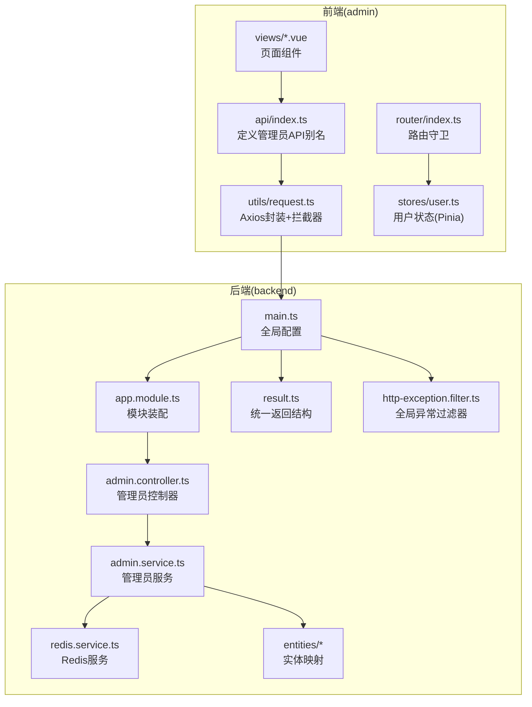
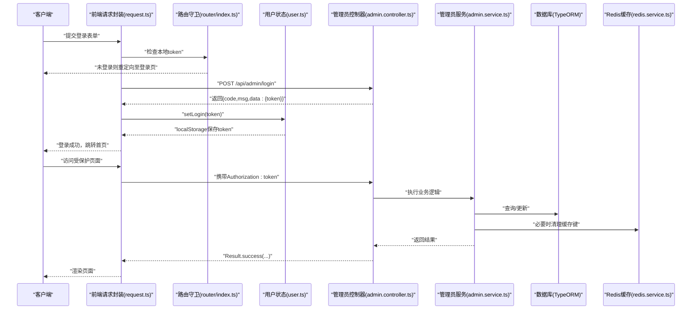
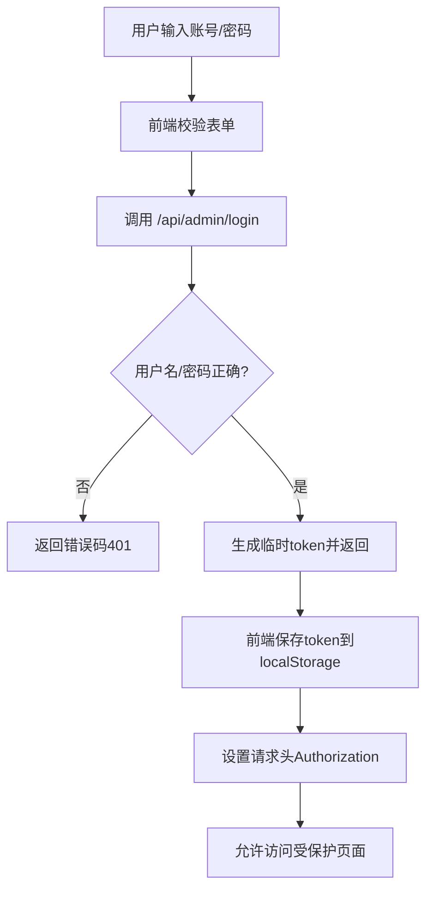
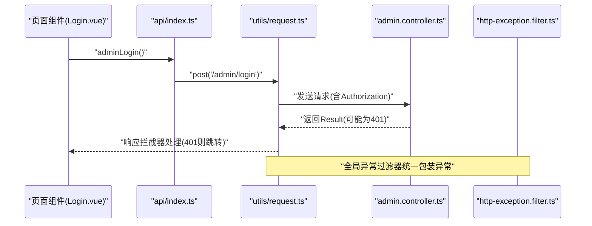
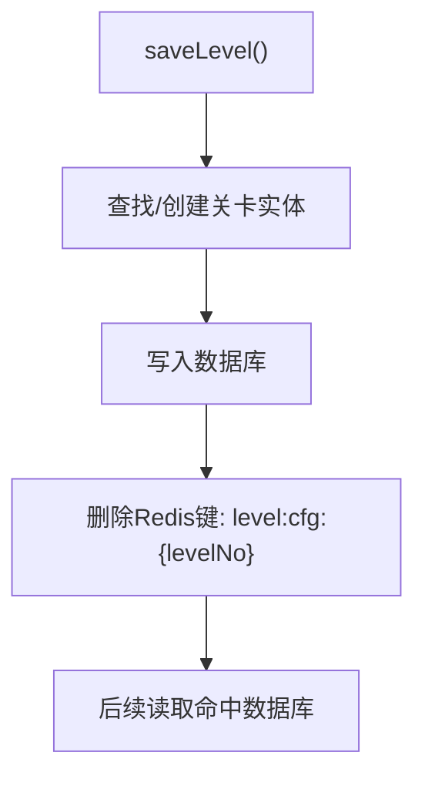
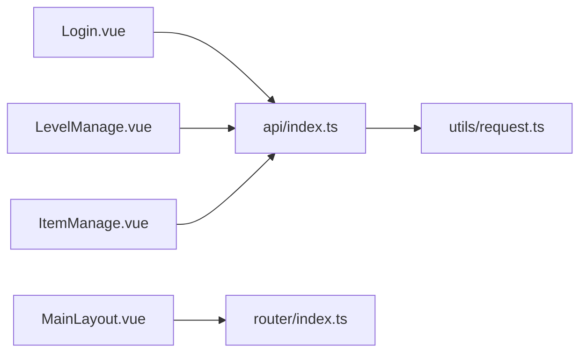
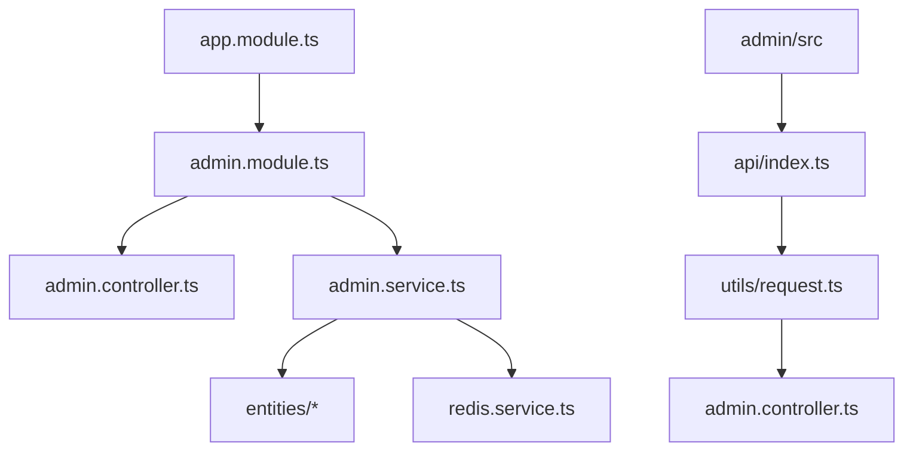

# 管理员API

<cite>
**本文引用的文件**
- [admin.controller.ts](file://backend/src/modules/admin/admin.controller.ts)
- [admin.service.ts](file://backend/src/modules/admin/admin.service.ts)
- [admin.module.ts](file://backend/src/modules/admin/admin.module.ts)
- [result.ts](file://backend/src/common/result.ts)
- [http-exception.filter.ts](file://backend/src/common/http-exception.filter.ts)
- [main.ts](file://backend/src/main.ts)
- [app.module.ts](file://backend/src/app.module.ts)
- [redis.service.ts](file://backend/src/modules/redis/redis.service.ts)
- [level-config.entity.ts](file://backend/src/entities/level-config.entity.ts)
- [index.ts](file://admin/src/api/index.ts)
- [request.ts](file://admin/src/utils/request.ts)
- [user.ts](file://admin/src/stores/user.ts)
- [Login.vue](file://admin/src/views/Login.vue)
- [LevelManage.vue](file://admin/src/views/LevelManage.vue)
- [ItemManage.vue](file://admin/src/views/ItemManage.vue)
- [MainLayout.vue](file://admin/src/layout/MainLayout.vue)
- [index.ts](file://admin/src/router/index.ts)
</cite>

## 目录
1. [简介](#简介)
2. [项目结构](#项目结构)
3. [核心组件](#核心组件)
4. [架构总览](#架构总览)
5. [详细组件分析](#详细组件分析)
6. [依赖关系分析](#依赖关系分析)
7. [性能与可扩展性](#性能与可扩展性)
8. [故障排查指南](#故障排查指南)
9. [结论](#结论)
10. [附录：API定义与调用示例](#附录api定义与调用示例)

## 简介
本文件面向管理员相关API的使用与维护，覆盖管理员登录认证、权限验证机制、管理操作接口、JWT令牌处理、会话管理、日志与安全审计建议以及常见问题解决方案。文档基于仓库中的实际实现进行梳理，并提供可视化流程图帮助理解。

## 项目结构
后端采用NestJS框架，管理员模块位于 backend/src/modules/admin；前端管理后台位于 admin/src，通过统一请求封装与全局拦截器实现认证与错误处理；数据库ORM使用TypeORM，Redis用于缓存与清理。

**图表来源**
- [main.ts:1-35](file://backend/src/main.ts#L1-L35)
- [app.module.ts:1-24](file://backend/src/app.module.ts#L1-L24)
- [admin.controller.ts:1-63](file://backend/src/modules/admin/admin.controller.ts#L1-L63)
- [admin.service.ts:1-79](file://backend/src/modules/admin/admin.service.ts#L1-L79)
- [result.ts:1-23](file://backend/src/common/result.ts#L1-L23)
- [http-exception.filter.ts:1-26](file://backend/src/common/http-exception.filter.ts#L1-L26)
- [redis.service.ts:1-45](file://backend/src/modules/redis/redis.service.ts#L1-L45)
- [index.ts:1-34](file://admin/src/api/index.ts#L1-L34)
- [request.ts:1-44](file://admin/src/utils/request.ts#L1-L44)
- [user.ts:1-27](file://admin/src/stores/user.ts#L1-L27)
- [index.ts:1-53](file://admin/src/router/index.ts#L1-L53)

**章节来源**
- [main.ts:1-35](file://backend/src/main.ts#L1-L35)
- [app.module.ts:1-24](file://backend/src/app.module.ts#L1-L24)
- [admin.controller.ts:1-63](file://backend/src/modules/admin/admin.controller.ts#L1-L63)
- [admin.service.ts:1-79](file://backend/src/modules/admin/admin.service.ts#L1-L79)
- [index.ts:1-34](file://admin/src/api/index.ts#L1-L34)
- [request.ts:1-44](file://admin/src/utils/request.ts#L1-L44)
- [user.ts:1-27](file://admin/src/stores/user.ts#L1-L27)
- [index.ts:1-53](file://admin/src/router/index.ts#L1-L53)

## 核心组件
- 管理员控制器：提供登录、关卡管理、食材管理、玩家统计等接口。
- 管理员服务：封装数据访问与缓存清理逻辑。
- 统一返回结构：Result类规范前后端交互格式。
- 全局异常过滤器：统一捕获异常并返回标准格式。
- 前端请求封装：Axios实例、请求/响应拦截器、路由守卫与用户状态管理。
- Redis服务：提供缓存读写与键空间清理能力。

**章节来源**
- [admin.controller.ts:1-63](file://backend/src/modules/admin/admin.controller.ts#L1-L63)
- [admin.service.ts:1-79](file://backend/src/modules/admin/admin.service.ts#L1-L79)
- [result.ts:1-23](file://backend/src/common/result.ts#L1-L23)
- [http-exception.filter.ts:1-26](file://backend/src/common/http-exception.filter.ts#L1-L26)
- [request.ts:1-44](file://admin/src/utils/request.ts#L1-L44)
- [user.ts:1-27](file://admin/src/stores/user.ts#L1-L27)
- [redis.service.ts:1-45](file://backend/src/modules/redis/redis.service.ts#L1-L45)

## 架构总览
管理员相关API遵循“前端请求 -> 后端控制器 -> 服务层 -> 数据库/缓存”的标准调用链路。登录成功后，前端将令牌持久化到本地存储并在后续请求头中携带；后端通过全局拦截器与路由守卫实现会话与权限控制。

**图表来源**
- [request.ts:1-44](file://admin/src/utils/request.ts#L1-L44)
- [index.ts:42-50](file://admin/src/router/index.ts#L42-L50)
- [user.ts:12-25](file://admin/src/stores/user.ts#L12-L25)
- [admin.controller.ts:54-61](file://backend/src/modules/admin/admin.controller.ts#L54-L61)
- [admin.service.ts:22-35](file://backend/src/modules/admin/admin.service.ts#L22-L35)
- [redis.service.ts:35-38](file://backend/src/modules/redis/redis.service.ts#L35-L38)

## 详细组件分析

### 管理员登录认证流程
- 登录接口：POST /api/admin/login
- 参数：用户名、密码
- 返回：统一结构，成功时包含临时token
- 前端：登录成功后将token写入localStorage，并在后续请求头中携带Authorization
- 路由守卫：未登录访问受保护路由将被重定向至登录页

**图表来源**
- [admin.controller.ts:54-61](file://backend/src/modules/admin/admin.controller.ts#L54-L61)
- [request.ts:10-20](file://admin/src/utils/request.ts#L10-L20)
- [index.ts:42-50](file://admin/src/router/index.ts#L42-L50)
- [user.ts:12-18](file://admin/src/stores/user.ts#L12-L18)

**章节来源**
- [admin.controller.ts:54-61](file://backend/src/modules/admin/admin.controller.ts#L54-L61)
- [request.ts:10-20](file://admin/src/utils/request.ts#L10-L20)
- [index.ts:42-50](file://admin/src/router/index.ts#L42-L50)
- [user.ts:12-18](file://admin/src/stores/user.ts#L12-L18)

### 权限验证与会话管理
- 会话：前端使用localStorage保存token，刷新后仍可维持登录态
- 认证：请求拦截器自动附加Authorization头
- 授权：后端未实现鉴权中间件，当前仅通过前端路由守卫与请求拦截器进行简单防护
- 401处理：响应拦截器检测到401时清空token并跳转登录页

**图表来源**
- [Login.vue:40-53](file://admin/src/views/Login.vue#L40-L53)
- [index.ts:3-5](file://admin/src/api/index.ts#L3-L5)
- [request.ts:22-41](file://admin/src/utils/request.ts#L22-L41)
- [admin.controller.ts:54-61](file://backend/src/modules/admin/admin.controller.ts#L54-L61)
- [http-exception.filter.ts:1-26](file://backend/src/common/http-exception.filter.ts#L1-L26)

**章节来源**
- [Login.vue:40-53](file://admin/src/views/Login.vue#L40-L53)
- [index.ts:3-5](file://admin/src/api/index.ts#L3-L5)
- [request.ts:22-41](file://admin/src/utils/request.ts#L22-L41)
- [http-exception.filter.ts:1-26](file://backend/src/common/http-exception.filter.ts#L1-L26)

### 管理操作接口
- 关卡管理
  - 新增/修改：POST /api/admin/level/save
  - 列表分页：GET /api/admin/level/list?page=&pageSize=
  - 删除：DELETE /api/admin/level/:levelNo
- 食材管理
  - 新增/修改：POST /api/admin/item/save
  - 删除：DELETE /api/admin/item/:itemKey
- 玩家统计
  - 列表分页：GET /api/admin/player/stats?page=&pageSize=

以上接口均通过统一Result结构返回，前端通过Axios拦截器统一处理错误与401跳转。

**章节来源**
- [admin.controller.ts:10-52](file://backend/src/modules/admin/admin.controller.ts#L10-L52)
- [index.ts:7-33](file://admin/src/api/index.ts#L7-L33)
- [result.ts:13-21](file://backend/src/common/result.ts#L13-L21)

### 缓存与数据一致性
- 写操作（新增/修改关卡）会清理对应Redis键，确保下次读取从数据库加载最新数据
- Redis服务提供通用的get/set/del能力，便于扩展其他缓存场景

**图表来源**
- [admin.service.ts:22-35](file://backend/src/modules/admin/admin.service.ts#L22-L35)
- [redis.service.ts:35-38](file://backend/src/modules/redis/redis.service.ts#L35-L38)

**章节来源**
- [admin.service.ts:22-35](file://backend/src/modules/admin/admin.service.ts#L22-L35)
- [redis.service.ts:21-38](file://backend/src/modules/redis/redis.service.ts#L21-L38)

### 前端页面与交互
- 登录页：表单校验、调用登录API、保存token并跳转
- 关卡管理页：分页加载、新增/编辑弹窗、删除确认、调用关卡API
- 食材配置页：列表展示、新增/编辑弹窗、删除确认、调用食材API
- 主布局：左侧菜单、顶部退出登录按钮、路由导航

**图表来源**
- [Login.vue:40-53](file://admin/src/views/Login.vue#L40-L53)
- [LevelManage.vue:90-132](file://admin/src/views/LevelManage.vue#L90-L132)
- [ItemManage.vue:58-92](file://admin/src/views/ItemManage.vue#L58-L92)
- [MainLayout.vue:48-51](file://admin/src/layout/MainLayout.vue#L48-L51)
- [index.ts:1-34](file://admin/src/api/index.ts#L1-L34)
- [request.ts:1-44](file://admin/src/utils/request.ts#L1-L44)
- [index.ts:1-53](file://admin/src/router/index.ts#L1-L53)

**章节来源**
- [Login.vue:40-53](file://admin/src/views/Login.vue#L40-L53)
- [LevelManage.vue:90-132](file://admin/src/views/LevelManage.vue#L90-L132)
- [ItemManage.vue:58-92](file://admin/src/views/ItemManage.vue#L58-L92)
- [MainLayout.vue:48-51](file://admin/src/layout/MainLayout.vue#L48-L51)
- [index.ts:1-34](file://admin/src/api/index.ts#L1-L34)
- [request.ts:1-44](file://admin/src/utils/request.ts#L1-L44)
- [index.ts:1-53](file://admin/src/router/index.ts#L1-L53)

## 依赖关系分析
- 后端模块装配：AppModule导入TypeORM、RedisModule与各业务模块，AdminModule注册控制器与服务
- 控制器依赖服务：AdminModule中注入AdminService，AdminService注入三个实体仓库与RedisService
- 前端模块装配：api封装统一调用，request.ts集中处理认证与错误，router/index.ts提供路由守卫

**图表来源**
- [app.module.ts:10-21](file://backend/src/app.module.ts#L10-L21)
- [admin.module.ts:9-14](file://backend/src/modules/admin/admin.module.ts#L9-L14)
- [admin.controller.ts:1-8](file://backend/src/modules/admin/admin.controller.ts#L1-L8)
- [admin.service.ts:12-20](file://backend/src/modules/admin/admin.service.ts#L12-L20)
- [redis.service.ts:1-45](file://backend/src/modules/redis/redis.service.ts#L1-L45)
- [index.ts:1-34](file://admin/src/api/index.ts#L1-L34)
- [request.ts:1-44](file://admin/src/utils/request.ts#L1-L44)

**章节来源**
- [app.module.ts:10-21](file://backend/src/app.module.ts#L10-L21)
- [admin.module.ts:9-14](file://backend/src/modules/admin/admin.module.ts#L9-L14)
- [admin.controller.ts:1-8](file://backend/src/modules/admin/admin.controller.ts#L1-L8)
- [admin.service.ts:12-20](file://backend/src/modules/admin/admin.service.ts#L12-L20)
- [index.ts:1-34](file://admin/src/api/index.ts#L1-L34)
- [request.ts:1-44](file://admin/src/utils/request.ts#L1-L44)

## 性能与可扩展性
- 缓存策略：写操作后清理对应键，避免脏读；可按需引入TTL与批量清理策略
- 分页查询：服务层使用skip/take实现分页，建议结合索引优化与count缓存
- 异常处理：全局异常过滤器统一包装，减少重复逻辑
- 扩展建议：
  - 引入JWT签名与过期时间，替换当前临时token方案
  - 在控制器层增加鉴权装饰器与权限校验
  - 对高频读取的关卡配置引入Redis缓存与预热
  - 增加操作日志与审计字段，便于追踪

[本节为通用建议，不直接分析具体文件]

## 故障排查指南
- 登录失败
  - 确认用户名/密码是否符合后端硬编码规则
  - 检查前端是否正确保存token并附加到请求头
- 401未授权
  - 响应拦截器会自动清空token并跳转登录页
  - 检查Authorization头是否正确传递
- 接口报错
  - 全局异常过滤器会将异常统一包装为Result格式
  - 查看返回的code/msg定位问题
- 页面无法访问
  - 路由守卫会在无token时重定向至登录页
  - 检查localStorage中是否存在admin_token

**章节来源**
- [admin.controller.ts:54-61](file://backend/src/modules/admin/admin.controller.ts#L54-L61)
- [request.ts:22-41](file://admin/src/utils/request.ts#L22-L41)
- [index.ts:42-50](file://admin/src/router/index.ts#L42-L50)
- [http-exception.filter.ts:1-26](file://backend/src/common/http-exception.filter.ts#L1-L26)

## 结论
本项目实现了管理员登录认证与基础管理操作接口，前端通过Axios拦截器与路由守卫完成会话与权限控制。当前认证机制较为简化，建议后续引入JWT与鉴权中间件以提升安全性与可维护性；同时完善日志与审计能力，增强运维可观测性。

[本节为总结性内容，不直接分析具体文件]

## 附录：API定义与调用示例

### 登录接口
- 方法与路径：POST /api/admin/login
- 请求体参数
  - username: string
  - password: string
- 成功响应
  - code: 200
  - msg: "登录成功"
  - data: { token: string }
- 失败响应
  - code: 401
  - msg: "账号或密码错误"
  - data: null

调用示例（前端）
- 使用 api/adminLogin({...}) 发起登录
- 登录成功后，前端将token写入localStorage并设置Authorization头

**章节来源**
- [admin.controller.ts:54-61](file://backend/src/modules/admin/admin.controller.ts#L54-L61)
- [index.ts:3-5](file://admin/src/api/index.ts#L3-L5)
- [request.ts:10-20](file://admin/src/utils/request.ts#L10-L20)
- [user.ts:12-18](file://admin/src/stores/user.ts#L12-L18)

### 关卡管理接口
- 新增/修改关卡
  - 方法与路径：POST /api/admin/level/save
  - 请求体参数：levelNo, itemTypeList, itemTotal
  - 成功响应：Result.success(data)
- 获取关卡列表（分页）
  - 方法与路径：GET /api/admin/level/list?page=&pageSize=
  - 查询参数：page, pageSize
  - 成功响应：Result.success({ list, total })
- 删除关卡
  - 方法与路径：DELETE /api/admin/level/:levelNo
  - 成功响应：Result.success(null, "删除成功")

调用示例（前端）
- 使用 api/saveLevel(...)、api/getLevelList(...)、api/deleteLevel(...) 调用
- 关卡列表页通过分页参数动态加载

**章节来源**
- [admin.controller.ts:10-31](file://backend/src/modules/admin/admin.controller.ts#L10-L31)
- [admin.service.ts:22-51](file://backend/src/modules/admin/admin.service.ts#L22-L51)
- [index.ts:7-17](file://admin/src/api/index.ts#L7-L17)
- [LevelManage.vue:90-132](file://admin/src/views/LevelManage.vue#L90-L132)

### 食材管理接口
- 新增/修改食材
  - 方法与路径：POST /api/admin/item/save
  - 请求体参数：itemKey, resPath
  - 成功响应：Result.success(data)
- 获取食材列表
  - 方法与路径：GET /api/item/all
  - 成功响应：Result.success(list)
- 删除食材
  - 方法与路径：DELETE /api/admin/item/:itemKey
  - 成功响应：Result.success(null, "删除成功")

调用示例（前端）
- 使用 api/saveItem(...)、api/getItemList()、api/deleteItem(...) 调用
- 食材配置页通过下拉选项与表单编辑

**章节来源**
- [admin.controller.ts:33-45](file://backend/src/modules/admin/admin.controller.ts#L33-L45)
- [admin.service.ts:53-67](file://backend/src/modules/admin/admin.service.ts#L53-L67)
- [index.ts:19-29](file://admin/src/api/index.ts#L19-L29)
- [ItemManage.vue:58-92](file://admin/src/views/ItemManage.vue#L58-L92)

### 玩家统计接口
- 获取玩家统计数据（分页）
  - 方法与路径：GET /api/admin/player/stats?page=&pageSize=
  - 查询参数：page, pageSize
  - 成功响应：Result.success({ list, total })

调用示例（前端）
- 使用 api/getPlayerStats(...) 调用
- 页面组件负责渲染与分页

**章节来源**
- [admin.controller.ts:47-52](file://backend/src/modules/admin/admin.controller.ts#L47-L52)
- [admin.service.ts:69-77](file://backend/src/modules/admin/admin.service.ts#L69-L77)
- [index.ts:31-33](file://admin/src/api/index.ts#L31-L33)

### 统一返回结构
- 成功：Result.success(data, msg)
- 失败：Result.fail(msg, code)

**章节来源**
- [result.ts:13-21](file://backend/src/common/result.ts#L13-L21)

### 全局异常过滤器
- 捕获所有异常并统一返回Result格式
- 401未授权时返回标准结构，前端拦截器据此跳转登录页

**章节来源**
- [http-exception.filter.ts:1-26](file://backend/src/common/http-exception.filter.ts#L1-L26)
- [request.ts:22-41](file://admin/src/utils/request.ts#L22-L41)