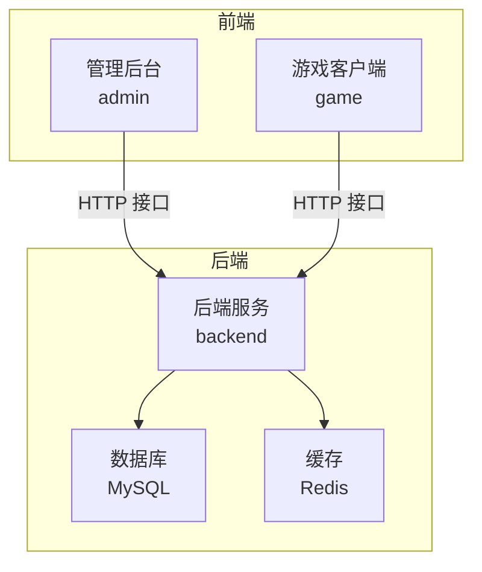
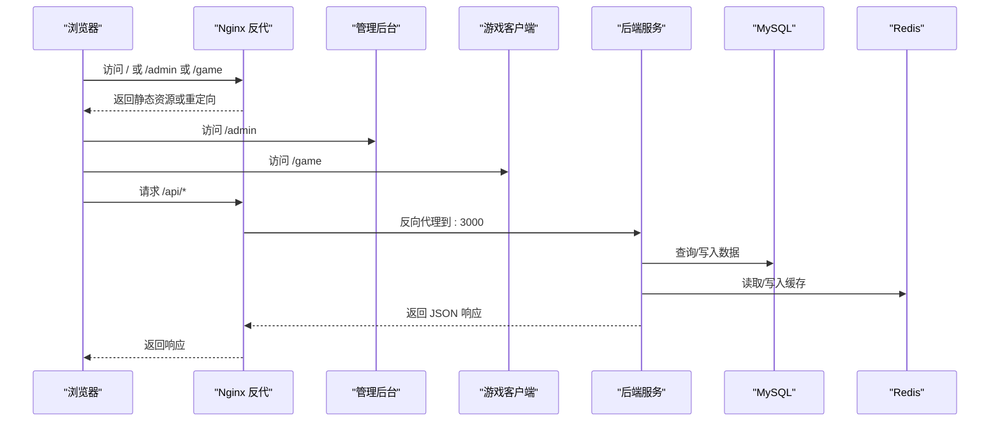
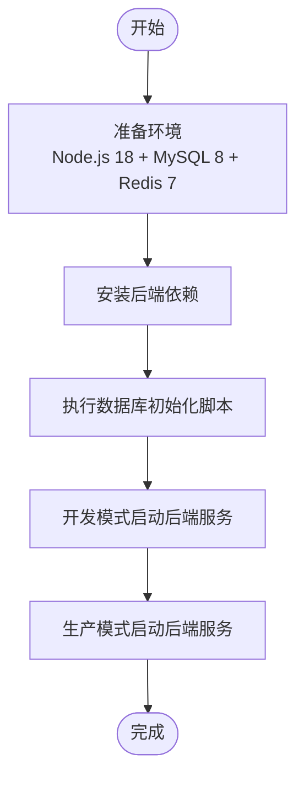
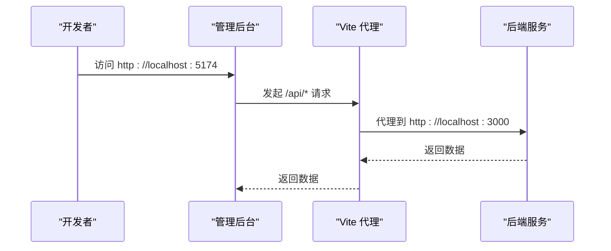
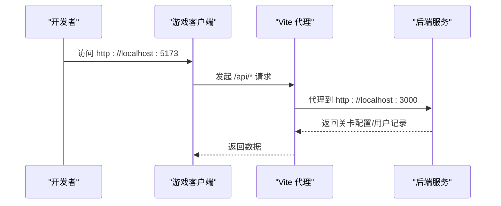
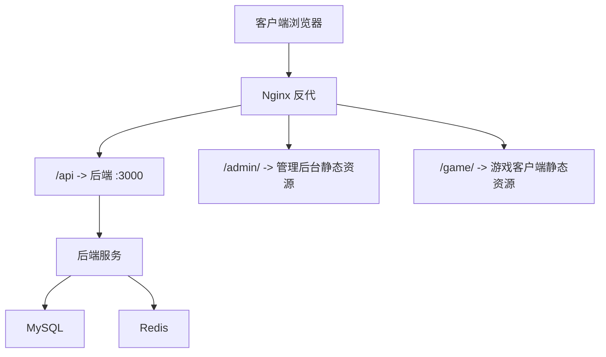
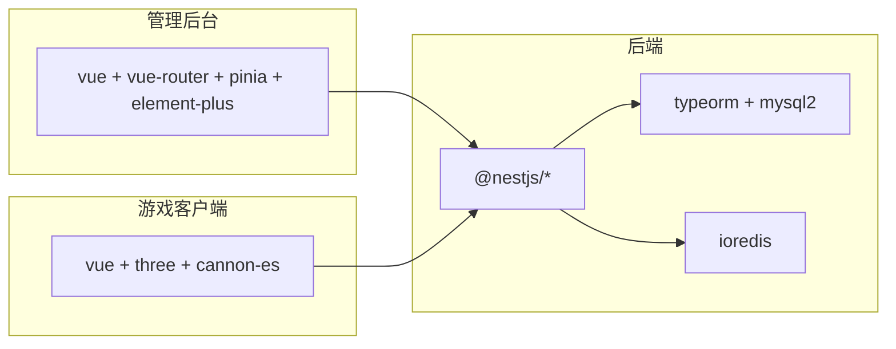

# 快速开始

<cite>
**本文引用的文件**
- [backend/package.json](file://backend/package.json)
- [backend/src/config/database.config.ts](file://backend/src/config/database.config.ts)
- [backend/src/main.ts](file://backend/src/main.ts)
- [backend/src/app.module.ts](file://backend/src/app.module.ts)
- [admin/package.json](file://admin/package.json)
- [admin/vite.config.ts](file://admin/vite.config.ts)
- [admin/src/router/index.ts](file://admin/src/router/index.ts)
- [game/package.json](file://game/package.json)
- [game/vite.config.ts](file://game/vite.config.ts)
- [game/src/views/Game.vue](file://game/src/views/Game.vue)
- [sql/init.sql](file://sql/init.sql)
- [deploy/docker-compose.yml](file://deploy/docker-compose.yml)
- [deploy/Dockerfile](file://deploy/Dockerfile)
- [deploy/nginx/default.conf](file://deploy/nginx/default.conf)
</cite>

## 目录
1. [简介](#简介)
2. [项目结构](#项目结构)
3. [核心组件](#核心组件)
4. [架构总览](#架构总览)
5. [详细组件分析](#详细组件分析)
6. [依赖关系分析](#依赖关系分析)
7. [性能注意事项](#性能注意事项)
8. [故障排除指南](#故障排除指南)
9. [结论](#结论)
10. [附录](#附录)

## 简介
本指南面向首次接触“摇一摇抓大鹅”项目的开发者，帮助你在约 30 分钟内完成从环境准备、依赖安装、数据库初始化到前后端与游戏模块启动的全流程。你将了解各模块的职责、启动顺序、访问方式以及常见问题的排查方法。

## 项目结构
该项目采用多模块分层设计：
- 后端（NestJS + TypeORM + MySQL + Redis）
- 管理后台（Vue 3 + Vite）
- 游戏客户端（Vue 3 + Vite + Three.js/Cannon-es）
- 部署（Docker 编排 + Nginx 反代）

图表来源
- [backend/src/app.module.ts:1-24](file://backend/src/app.module.ts#L1-L24)
- [backend/src/config/database.config.ts:1-26](file://backend/src/config/database.config.ts#L1-L26)
- [admin/vite.config.ts:1-16](file://admin/vite.config.ts#L1-L16)
- [game/vite.config.ts:1-22](file://game/vite.config.ts#L1-L22)

章节来源
- [backend/src/app.module.ts:1-24](file://backend/src/app.module.ts#L1-L24)
- [backend/src/config/database.config.ts:1-26](file://backend/src/config/database.config.ts#L1-L26)
- [admin/vite.config.ts:1-16](file://admin/vite.config.ts#L1-L16)
- [game/vite.config.ts:1-22](file://game/vite.config.ts#L1-L22)

## 核心组件
- 后端服务
  - 使用 NestJS 提供 REST API，统一前缀为 /api，启用跨域与全局校验、异常与响应拦截器。
  - 数据库连接通过 TypeORM 配置，支持环境变量注入；生产环境禁止自动同步，需使用 SQL 初始化。
  - Redis 连接参数同样来自环境变量。
- 管理后台
  - 基于 Vue 3 + Vue Router + Pinia + Element Plus。
  - 开发服务器端口 5174，默认代理 /api 到后端本地 3000 端口。
  - 登录态通过 localStorage 的 admin_token 控制路由守卫。
- 游戏客户端
  - 基于 Vue 3 + Vite + Three.js + Cannon-es，提供 3D 物理消除玩法。
  - 开发服务器端口 5173，代理 /api 到后端本地 3000 端口。
  - 支持微信小游戏模式构建（输出到 mini-game 目录）。
- 部署
  - Docker Compose 同时启动 MySQL、Redis、后端服务。
  - Nginx 反向代理后端 API，并托管管理后台与游戏客户端静态资源。

章节来源
- [backend/src/main.ts:1-35](file://backend/src/main.ts#L1-L35)
- [backend/src/config/database.config.ts:1-26](file://backend/src/config/database.config.ts#L1-L26)
- [admin/src/router/index.ts:1-53](file://admin/src/router/index.ts#L1-L53)
- [game/src/views/Game.vue:1-357](file://game/src/views/Game.vue#L1-L357)
- [deploy/docker-compose.yml:1-68](file://deploy/docker-compose.yml#L1-L68)
- [deploy/nginx/default.conf:1-54](file://deploy/nginx/default.conf#L1-L54)

## 架构总览
下图展示从浏览器到后端服务的数据流与模块交互：

图表来源
- [deploy/nginx/default.conf:1-54](file://deploy/nginx/default.conf#L1-L54)
- [admin/vite.config.ts:1-16](file://admin/vite.config.ts#L1-L16)
- [game/vite.config.ts:1-22](file://game/vite.config.ts#L1-L22)
- [backend/src/main.ts:1-35](file://backend/src/main.ts#L1-L35)

## 详细组件分析

### 后端服务启动流程
- 环境准备
  - Node.js 版本：建议使用 Node.js 18（Dockerfile 使用 node:18-alpine）。
  - 数据库：MySQL 8，字符集 utf8mb4，Collation utf8mb4_unicode_ci。
  - 缓存：Redis 7。
- 依赖安装
  - 在 backend 目录执行安装命令以生成 node_modules。
- 数据库初始化
  - 使用提供的 SQL 脚本初始化数据库与表结构。
  - 若使用 Docker Compose，容器启动时会自动执行 init.sql。
- 启动服务
  - 开发模式：监听 3000 端口，启用全局前缀 /api、跨域、校验、异常与响应拦截器。
  - 生产模式：Dockerfile 中通过 npm run start:prod 启动。

图表来源
- [deploy/Dockerfile:1-23](file://deploy/Dockerfile#L1-L23)
- [sql/init.sql:1-48](file://sql/init.sql#L1-L48)
- [backend/src/main.ts:1-35](file://backend/src/main.ts#L1-L35)

章节来源
- [backend/package.json:1-34](file://backend/package.json#L1-L34)
- [backend/src/main.ts:1-35](file://backend/src/main.ts#L1-L35)
- [backend/src/config/database.config.ts:1-26](file://backend/src/config/database.config.ts#L1-L26)
- [sql/init.sql:1-48](file://sql/init.sql#L1-L48)
- [deploy/Dockerfile:1-23](file://deploy/Dockerfile#L1-L23)

### 管理后台启动流程
- 环境准备
  - Node.js 版本：与项目一致即可。
- 依赖安装
  - 在 admin 目录执行安装命令以生成 node_modules。
- 启动与代理
  - 开发服务器端口 5174，默认代理 /api 到后端本地 3000 端口。
  - 登录页路径 /login，登录后进入主布局，子路由包括关卡管理、食材配置、玩家统计。
  - 未登录访问受路由守卫拦截，自动跳转至登录页。

图表来源
- [admin/vite.config.ts:1-16](file://admin/vite.config.ts#L1-L16)
- [admin/src/router/index.ts:1-53](file://admin/src/router/index.ts#L1-L53)
- [backend/src/main.ts:1-35](file://backend/src/main.ts#L1-L35)

章节来源
- [admin/package.json:1-25](file://admin/package.json#L1-L25)
- [admin/vite.config.ts:1-16](file://admin/vite.config.ts#L1-L16)
- [admin/src/router/index.ts:1-53](file://admin/src/router/index.ts#L1-L53)

### 游戏客户端启动流程
- 环境准备
  - Node.js 版本：与项目一致即可。
- 依赖安装
  - 在 game 目录执行安装命令以生成 node_modules。
- 启动与代理
  - 开发服务器端口 5173，默认代理 /api 到后端本地 3000 端口。
  - 支持普通网页模式与微信小游戏模式（通过 MODE=wx 输出到 mini-game 目录）。
- 游戏逻辑要点
  - 页面挂载后自动加载第 1 关，失败或通关分别弹窗提示。
  - 提供回锅、洗牌、一键凑三等道具按钮，支持模拟摇晃按钮用于调试。

图表来源
- [game/vite.config.ts:1-22](file://game/vite.config.ts#L1-L22)
- [game/src/views/Game.vue:1-357](file://game/src/views/Game.vue#L1-L357)
- [backend/src/main.ts:1-35](file://backend/src/main.ts#L1-L35)

章节来源
- [game/package.json:1-25](file://game/package.json#L1-L25)
- [game/vite.config.ts:1-22](file://game/vite.config.ts#L1-L22)
- [game/src/views/Game.vue:1-357](file://game/src/views/Game.vue#L1-L357)

### 部署与访问方式
- Docker Compose
  - 启动 MySQL（3306）、Redis（6379）、后端（3000），并挂载 init.sql 自动初始化数据库。
  - 环境变量包含 DB_HOST/PORT/USER/PASS/NAME 与 REDIS_HOST/PORT/DB/NAME。
- Nginx 反向代理
  - 反代 /api/ 到后端服务。
  - 托管管理后台与游戏客户端静态资源，支持默认访问游戏页面。
  - 配置跨域头并处理 OPTIONS 预检请求。

图表来源
- [deploy/docker-compose.yml:1-68](file://deploy/docker-compose.yml#L1-L68)
- [deploy/nginx/default.conf:1-54](file://deploy/nginx/default.conf#L1-L54)

章节来源
- [deploy/docker-compose.yml:1-68](file://deploy/docker-compose.yml#L1-L68)
- [deploy/nginx/default.conf:1-54](file://deploy/nginx/default.conf#L1-L54)

## 依赖关系分析
- 后端依赖
  - @nestjs/*、typeorm、mysql2、ioredis、class-validator、class-transformer 等。
  - 通过 TypeORM 连接 MySQL，通过 RedisModule 使用 Redis。
- 前端依赖
  - admin：vue、vue-router、pinia、element-plus、axios。
  - game：vue、three、cannon-es、axios。
- 构建工具
  - Vite、Vue 3 类型检查、TypeScript。

图表来源
- [backend/package.json:1-34](file://backend/package.json#L1-L34)
- [admin/package.json:1-25](file://admin/package.json#L1-L25)
- [game/package.json:1-25](file://game/package.json#L1-L25)

章节来源
- [backend/package.json:1-34](file://backend/package.json#L1-L34)
- [admin/package.json:1-25](file://admin/package.json#L1-L25)
- [game/package.json:1-25](file://game/package.json#L1-L25)

## 性能注意事项
- 后端
  - 生产环境关闭 synchronize，使用 SQL 脚本初始化，避免频繁自动迁移带来的性能损耗。
  - 合理使用 Redis 缓存热点数据，减少数据库压力。
- 前端
  - 开发阶段使用 Vite 的热更新与按需加载，避免打包体积过大影响首屏。
  - 游戏场景中注意 Three.js 资源加载与物理计算频率，必要时降低帧率或简化模型。
- 部署
  - Docker Compose 中的卷挂载与日志轮转有助于长期运行稳定性。
  - Nginx 反代可结合 gzip/缓存策略优化静态资源传输效率。

## 故障排除指南
- 端口冲突
  - 后端默认 3000，前端管理后台 5174，游戏 5173。若被占用，请在对应配置中修改端口。
- 代理无效
  - 确认 admin 与 game 的 Vite 代理配置指向后端 3000 端口；浏览器控制台查看网络请求是否被代理命中。
- 数据库连接失败
  - 检查 DB_HOST/PORT/USER/PASS/NAME 与数据库连通性；Docker Compose 中确认 init.sql 是否正确挂载。
- Redis 连接失败
  - 检查 REDIS_HOST/PORT/DB 等环境变量；确认 Redis 容器正常运行。
- 跨域问题
  - 后端已启用全局跨域；若使用 Nginx 反代，确认反代配置中的 CORS 头是否生效。
- 无法访问管理后台或游戏页面
  - 确认 Nginx 静态资源路径映射正确；默认访问游戏页面，管理后台通过 /admin 访问。
- 微信小游戏构建
  - 使用 MODE=wx 构建输出到 mini-game 目录；确保微信开发者工具指向该目录。

章节来源
- [admin/vite.config.ts:1-16](file://admin/vite.config.ts#L1-L16)
- [game/vite.config.ts:1-22](file://game/vite.config.ts#L1-L22)
- [backend/src/config/database.config.ts:1-26](file://backend/src/config/database.config.ts#L1-L26)
- [deploy/docker-compose.yml:1-68](file://deploy/docker-compose.yml#L1-L68)
- [deploy/nginx/default.conf:1-54](file://deploy/nginx/default.conf#L1-L54)

## 结论
按照本指南，你可以在 30 分钟内完成环境准备、依赖安装、数据库初始化与各模块启动。建议先以 Docker Compose 快速跑通整体链路，再逐步替换为本地开发模式进行调试。遇到问题优先检查端口、代理、数据库与 Redis 的连通性，以及 Nginx 的静态资源与反代配置。

## 附录

### 快速操作清单
- 环境准备
  - 安装 Node.js 18、Docker、Docker Compose。
- 数据库初始化
  - 执行 SQL 脚本或使用 Docker Compose 自动初始化。
- 后端启动
  - 在 backend 目录安装依赖并启动服务。
- 管理后台启动
  - 在 admin 目录安装依赖并启动，访问 http://localhost:5174。
- 游戏客户端启动
  - 在 game 目录安装依赖并启动，访问 http://localhost:5173。
- 部署上线
  - 使用 Docker Compose 启动 MySQL、Redis、后端；配置 Nginx 反代并托管静态资源。

章节来源
- [sql/init.sql:1-48](file://sql/init.sql#L1-L48)
- [deploy/docker-compose.yml:1-68](file://deploy/docker-compose.yml#L1-L68)
- [deploy/nginx/default.conf:1-54](file://deploy/nginx/default.conf#L1-L54)