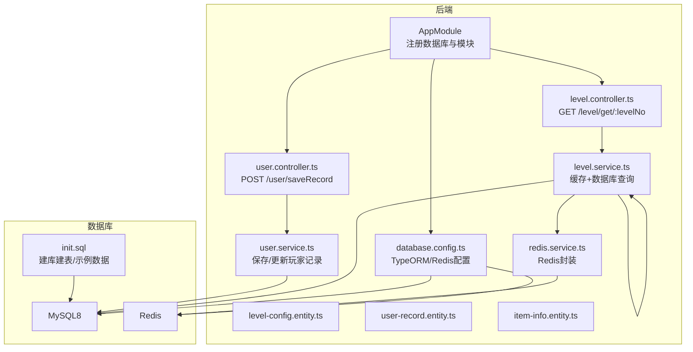
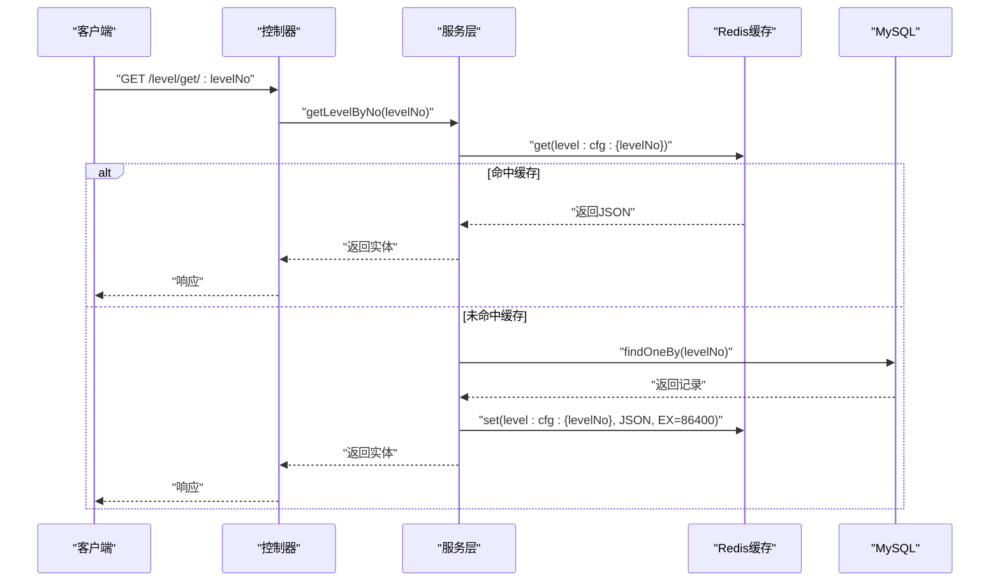
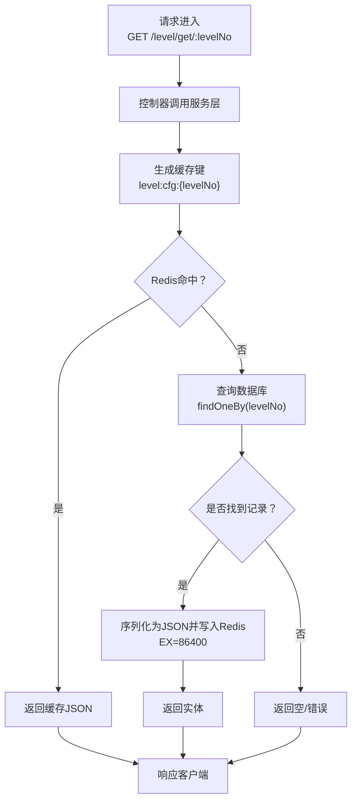
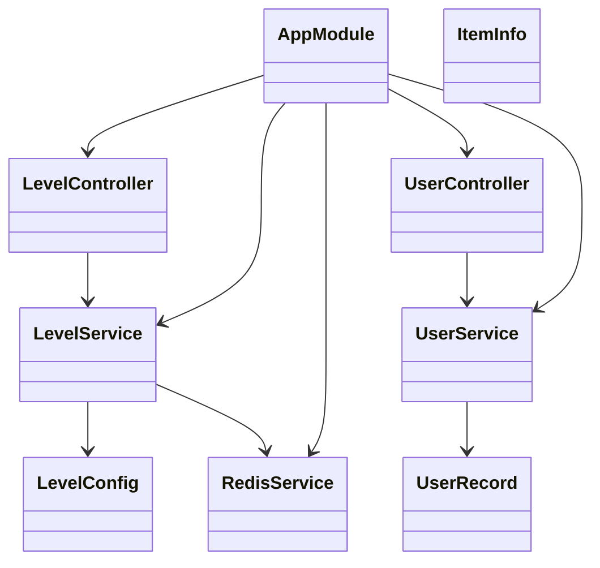
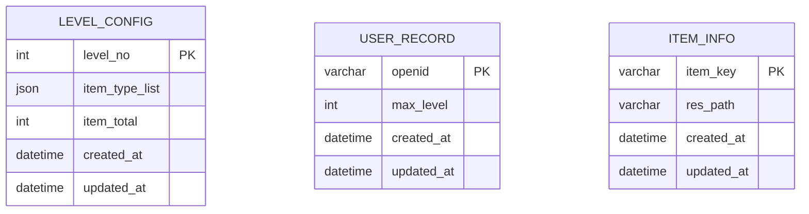
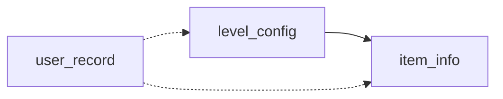

# 数据库设计

<cite>
**本文引用的文件**
- [init.sql](file://sql/init.sql)
- [item-info.entity.ts](file://backend/src/entities/item-info.entity.ts)
- [level-config.entity.ts](file://backend/src/entities/level-config.entity.ts)
- [user-record.entity.ts](file://backend/src/entities/user-record.entity.ts)
- [database.config.ts](file://backend/src/config/database.config.ts)
- [level.service.ts](file://backend/src/modules/level/level.service.ts)
- [user.service.ts](file://backend/src/modules/user/user.service.ts)
- [redis.service.ts](file://backend/src/modules/redis/redis.service.ts)
- [level.controller.ts](file://backend/src/modules/level/level.controller.ts)
- [user.controller.ts](file://backend/src/modules/user/user.controller.ts)
- [app.module.ts](file://backend/src/app.module.ts)
- [docker-compose.yml](file://deploy/docker-compose.yml)
- [deploy.md](file://deploy/deploy.md)
</cite>

## 目录
1. [简介](#简介)
2. [项目结构](#项目结构)
3. [核心组件](#核心组件)
4. [架构总览](#架构总览)
5. [详细组件分析](#详细组件分析)
6. [依赖分析](#依赖分析)
7. [性能考虑](#性能考虑)
8. [故障排查指南](#故障排查指南)
9. [结论](#结论)
10. [附录](#附录)

## 简介
本文件系统性梳理“摇一摇抓大鹅”项目的数据库设计，覆盖表结构、字段定义、主外键关系、索引设计、实体映射、数据类型与约束、缓存与查询优化策略、数据迁移与备份恢复方案以及性能监控指标。文档同时给出ER图、表关系图与数据流图，帮助开发者与运维人员快速理解并维护数据库。

## 项目结构
数据库相关的核心文件分布如下：
- 初始化SQL：用于创建数据库与表、插入示例数据
- 实体定义：TypeORM实体映射数据库表
- 配置：TypeORM与Redis连接配置
- 服务与控制器：封装数据访问与对外接口
- 部署：Docker编排，包含MySQL、Redis与后端服务

图表来源
- [app.module.ts:1-24](file://backend/src/app.module.ts#L1-L24)
- [database.config.ts:1-26](file://backend/src/config/database.config.ts#L1-L26)
- [level.controller.ts:1-17](file://backend/src/modules/level/level.controller.ts#L1-L17)
- [user.controller.ts:1-17](file://backend/src/modules/user/user.controller.ts#L1-L17)
- [level.service.ts:1-34](file://backend/src/modules/level/level.service.ts#L1-L34)
- [user.service.ts:1-41](file://backend/src/modules/user/user.service.ts#L1-L41)
- [redis.service.ts:1-45](file://backend/src/modules/redis/redis.service.ts#L1-L45)
- [init.sql:1-48](file://sql/init.sql#L1-L48)

章节来源
- [app.module.ts:1-24](file://backend/src/app.module.ts#L1-L24)
- [database.config.ts:1-26](file://backend/src/config/database.config.ts#L1-L26)
- [init.sql:1-48](file://sql/init.sql#L1-L48)

## 核心组件
本项目采用TypeORM进行数据库访问，实体与表一一对应，控制器通过服务层访问数据库与缓存。核心组件包括：
- 实体层：LevelConfig、UserRecord、ItemInfo
- 服务层：LevelService（关卡配置缓存）、UserService（玩家记录保存）
- 缓存层：RedisService（基于ioredis）
- 配置层：database.config.ts（TypeORM与Redis配置）

章节来源
- [level-config.entity.ts:1-21](file://backend/src/entities/level-config.entity.ts#L1-L21)
- [user-record.entity.ts:1-18](file://backend/src/entities/user-record.entity.ts#L1-L18)
- [item-info.entity.ts:1-18](file://backend/src/entities/item-info.entity.ts#L1-L18)
- [level.service.ts:1-34](file://backend/src/modules/level/level.service.ts#L1-L34)
- [user.service.ts:1-41](file://backend/src/modules/user/user.service.ts#L1-L41)
- [redis.service.ts:1-45](file://backend/src/modules/redis/redis.service.ts#L1-L45)
- [database.config.ts:1-26](file://backend/src/config/database.config.ts#L1-L26)

## 架构总览
下图展示应用、数据库与缓存的整体交互流程，包括请求入口、服务层处理、缓存命中与回源、数据库写入与更新。

图表来源
- [level.controller.ts:10-15](file://backend/src/modules/level/level.controller.ts#L10-L15)
- [level.service.ts:16-32](file://backend/src/modules/level/level.service.ts#L16-L32)
- [redis.service.ts:21-33](file://backend/src/modules/redis/redis.service.ts#L21-L33)

## 详细组件分析

### 表结构与字段定义
- 关卡配置表 level_config
  - 字段：level_no（主键，整型）、item_type_list（JSON数组，食材类型列表）、item_total（整型，本关食材总数）、created_at、updated_at
  - 约束：主键 level_no；默认字符集 utf8mb4；InnoDB 引擎
  - 示例数据：包含关卡1~3，每关食材类型与总数
- 玩家存档表 user_record
  - 字段：openid（主键，字符串，微信唯一标识）、max_level（整型，默认0，已通关最高关卡）、created_at、updated_at
  - 约束：主键 openid；默认字符集 utf8mb4；InnoDB 引擎
- 食材资源配置表 item_info
  - 字段：item_key（主键，字符串，食材唯一ID）、res_path（字符串，模型资源地址）、created_at、updated_at
  - 约束：主键 item_key；默认字符集 utf8mb4；InnoDB 引擎
  - 示例数据：包含苹果、香蕉、橙子、葡萄、桃子等食材及其资源路径

章节来源
- [init.sql:7-47](file://sql/init.sql#L7-L47)
- [level-config.entity.ts:6-19](file://backend/src/entities/level-config.entity.ts#L6-L19)
- [user-record.entity.ts:6-10](file://backend/src/entities/user-record.entity.ts#L6-L10)
- [item-info.entity.ts:6-10](file://backend/src/entities/item-info.entity.ts#L6-L10)

### 主外键关系与索引设计
- 主键
  - level_config.level_no
  - user_record.openid
  - item_info.item_key
- 外键
  - 当前表之间无显式外键约束，业务上通过 level_no 与 item_key 作为逻辑关联键
- 索引
  - 以上三张表均以主键作为唯一索引
  - 建议在高频查询列上增加索引（例如 user_record.max_level 的排序查询）
- JSON字段
  - item_type_list 为JSON类型，适合存储动态数组，不建议在此字段上建立二级索引

章节来源
- [init.sql:8-33](file://sql/init.sql#L8-L33)
- [level-config.entity.ts:9](file://backend/src/entities/level-config.entity.ts#L9)
- [user.service.ts:32-39](file://backend/src/modules/user/user.service.ts#L32-L39)

### 实体模型映射与数据类型
- LevelConfig
  - levelNo → int（主键）
  - itemTypeList → json（TypeORM映射为字符串数组）
  - itemTotal → int
  - createdAt/updatedAt → Date（TypeORM自动时间戳）
- UserRecord
  - openid → varchar(64)（主键）
  - maxLevel → int（默认0）
  - createdAt/updatedAt → Date
- ItemInfo
  - itemKey → varchar(64)（主键）
  - resPath → varchar(255)
  - createdAt/updatedAt → Date

章节来源
- [level-config.entity.ts:1-21](file://backend/src/entities/level-config.entity.ts#L1-L21)
- [user-record.entity.ts:1-18](file://backend/src/entities/user-record.entity.ts#L1-L18)
- [item-info.entity.ts:1-18](file://backend/src/entities/item-info.entity.ts#L1-L18)

### 数据访问模式与查询优化
- 关卡配置读取
  - 优先从Redis缓存读取，命中则直接返回；未命中则查询数据库，并将结果写入Redis，有效期24小时
  - 适用于高并发读取场景，降低数据库压力
- 玩家记录保存
  - 若记录存在且新关卡更高，则更新；否则创建新记录
  - 支持分页查询与按最高关卡降序排序，便于管理后台展示排行榜
- 查询优化建议
  - 对 user_record.max_level 建立索引以支持排序与范围查询
  - 控制JSON字段的解析频率，避免在热点路径重复解析

章节来源
- [level.service.ts:16-32](file://backend/src/modules/level/level.service.ts#L16-L32)
- [user.service.ts:14-29](file://backend/src/modules/user/user.service.ts#L14-L29)
- [user.service.ts:32-39](file://backend/src/modules/user/user.service.ts#L32-L39)

### 缓存机制
- 缓存键命名：level:cfg:{levelNo}
- 过期策略：24小时（86400秒）
- 访问流程：先查缓存，命中则返回；未命中则查数据库并写入缓存
- 错误处理：Redis连接错误会输出日志，不影响数据库回退

章节来源
- [level.service.ts:18-30](file://backend/src/modules/level/level.service.ts#L18-L30)
- [redis.service.ts:10-19](file://backend/src/modules/redis/redis.service.ts#L10-L19)

### 数据流图
以下流程图展示“获取关卡配置”的完整数据流，包括缓存与数据库交互。

图表来源
- [level.controller.ts:10-15](file://backend/src/modules/level/level.controller.ts#L10-L15)
- [level.service.ts:16-32](file://backend/src/modules/level/level.service.ts#L16-L32)
- [redis.service.ts:21-33](file://backend/src/modules/redis/redis.service.ts#L21-L33)

## 依赖分析
- 应用模块
  - AppModule 注册 TypeORM（连接MySQL）与 Redis 模块，并导入 Level、User、Item、Admin 模块
- 数据库与Redis配置
  - database.config.ts 统一管理数据库与Redis连接参数，生产环境禁止自动同步，使用SQL脚本初始化
- 服务依赖
  - LevelService 依赖 LevelConfig 仓库与 RedisService
  - UserService 依赖 UserRecord 仓库

图表来源
- [app.module.ts:10-21](file://backend/src/app.module.ts#L10-L21)
- [level.controller.ts:7-8](file://backend/src/modules/level/level.controller.ts#L7-L8)
- [user.controller.ts:7-8](file://backend/src/modules/user/user.controller.ts#L7-L8)
- [level.service.ts:10-14](file://backend/src/modules/level/level.service.ts#L10-L14)
- [user.service.ts:9-12](file://backend/src/modules/user/user.service.ts#L9-L12)
- [redis.service.ts:7-19](file://backend/src/modules/redis/redis.service.ts#L7-L19)
- [level-config.entity.ts:4](file://backend/src/entities/level-config.entity.ts#L4)
- [user-record.entity.ts:4](file://backend/src/entities/user-record.entity.ts#L4)
- [item-info.entity.ts:4](file://backend/src/entities/item-info.entity.ts#L4)

章节来源
- [app.module.ts:1-24](file://backend/src/app.module.ts#L1-L24)
- [database.config.ts:7-17](file://backend/src/config/database.config.ts#L7-L17)

## 性能考虑
- 缓存策略
  - 关卡配置缓存24小时，显著降低数据库读压力
  - Redis连接错误不影响业务，具备回退能力
- 查询优化
  - 对高频排序字段（如 user_record.max_level）建立索引
  - 控制JSON字段解析次数，避免在热路径重复解析
- 数据库与缓存一致性
  - 关卡配置变更时，建议清理对应缓存键，确保一致性
- 连接与日志
  - TypeORM logging 设为开启，便于开发阶段定位问题
  - 生产环境建议关闭或调整为较低级别

章节来源
- [level.service.ts:18-30](file://backend/src/modules/level/level.service.ts#L18-L30)
- [redis.service.ts:17-18](file://backend/src/modules/redis/redis.service.ts#L17-L18)
- [database.config.ts:15-16](file://backend/src/config/database.config.ts#L15-L16)

## 故障排查指南
- Redis连接失败
  - 现象：控制台输出连接错误日志
  - 排查：检查 Redis 地址、端口、密码配置；确认容器网络连通
- 关卡配置为空
  - 现象：返回null或空对象
  - 排查：确认 init.sql 已执行；确认 level_no 是否正确；检查Redis缓存是否过期
- 玩家记录未更新
  - 现象：maxLevel未变化
  - 排查：确认传入的 maxLevel 是否大于当前值；检查数据库连接与事务
- 数据库初始化失败
  - 现象：MySQL启动后无表或数据
  - 排查：确认 init.sql 路径与挂载；查看容器日志确认执行完成

章节来源
- [redis.service.ts:17-18](file://backend/src/modules/redis/redis.service.ts#L17-L18)
- [level.service.ts:25-28](file://backend/src/modules/level/level.service.ts#L25-L28)
- [user.service.ts:16-27](file://backend/src/modules/user/user.service.ts#L16-L27)
- [docker-compose.yml:20-21](file://deploy/docker-compose.yml#L20-L21)

## 结论
本数据库设计围绕“高并发读取、低写入成本”的目标展开：通过Redis缓存关卡配置、在实体层严格定义字段与约束、在部署层通过Docker编排统一环境。建议后续在高频查询字段上补充索引，并完善缓存失效策略与监控告警，以进一步提升稳定性与可观测性。

## 附录

### ER图

图表来源
- [init.sql:8-33](file://sql/init.sql#L8-L33)
- [level-config.entity.ts:6-19](file://backend/src/entities/level-config.entity.ts#L6-L19)
- [user-record.entity.ts:6-10](file://backend/src/entities/user-record.entity.ts#L6-L10)
- [item-info.entity.ts:6-10](file://backend/src/entities/item-info.entity.ts#L6-L10)

### 表关系图
- 关系说明
  - level_config 与 item_info 无显式外键，业务上通过 level_no 与 item_key 作为逻辑关联键
  - user_record 与关卡配置无直接外键，但可通过 max_level 字段用于统计与排行

图表来源
- [init.sql:8-33](file://sql/init.sql#L8-L33)
- [level-config.entity.ts:6](file://backend/src/entities/level-config.entity.ts#L6)
- [item-info.entity.ts:6](file://backend/src/entities/item-info.entity.ts#L6)
- [user-record.entity.ts:6](file://backend/src/entities/user-record.entity.ts#L6)

### 数据迁移脚本与备份恢复
- 初始化脚本
  - 使用 init.sql 创建数据库、表与示例数据
- 迁移策略
  - 生产环境禁止自动同步，使用SQL脚本进行结构与数据变更
- 备份与恢复
  - MySQL：使用 mysqldump 备份；恢复时先创建数据库与表，再导入数据
  - Redis：使用 RDB 快照或 AOF 日志进行备份；恢复时重启容器并加载持久化文件
- 部署与验证
  - 通过 docker-compose 启动 MySQL、Redis 与后端服务；执行 curl 验证接口可用性

章节来源
- [init.sql:1-48](file://sql/init.sql#L1-L48)
- [database.config.ts:15](file://backend/src/config/database.config.ts#L15)
- [docker-compose.yml:6-68](file://deploy/docker-compose.yml#L6-L68)
- [deploy.md:113-129](file://deploy/deploy.md#L113-L129)

### 性能监控指标
- 数据库
  - QPS、慢查询、连接数、锁等待、表扫描次数
- 缓存
  - 命中率、过期率、内存使用、连接数
- 应用
  - 请求延迟、错误率、Redis连接错误数、数据库查询耗时

章节来源
- [redis.service.ts:17-18](file://backend/src/modules/redis/redis.service.ts#L17-L18)
- [database.config.ts:16](file://backend/src/config/database.config.ts#L16)