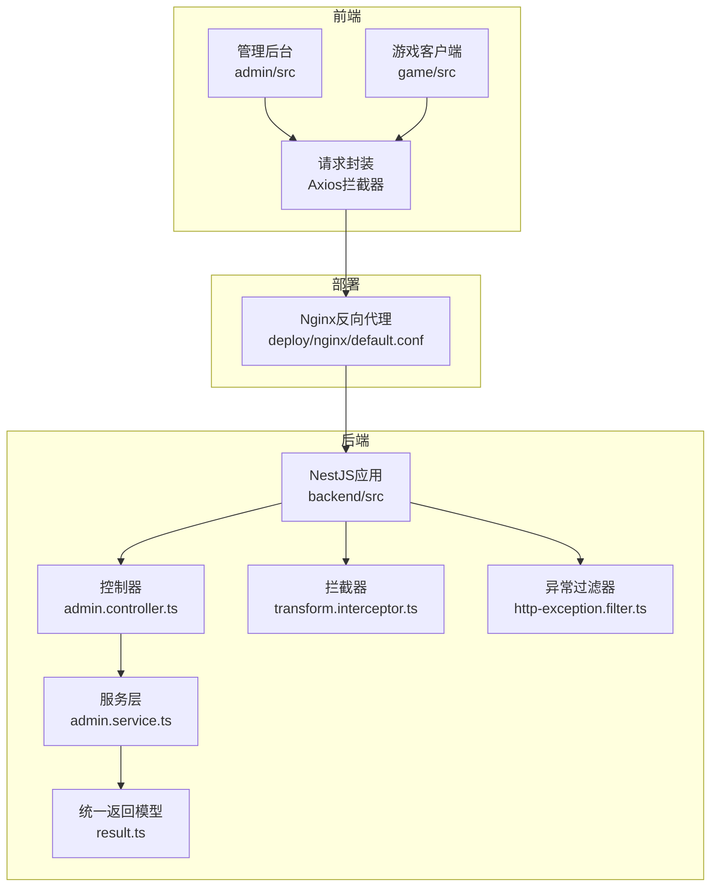
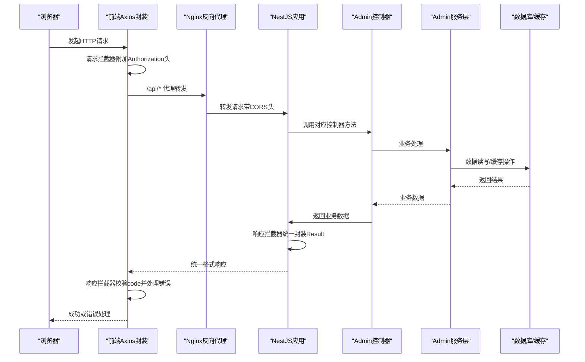
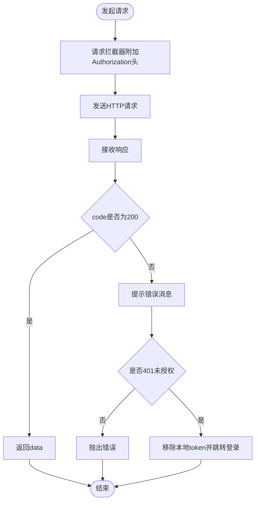
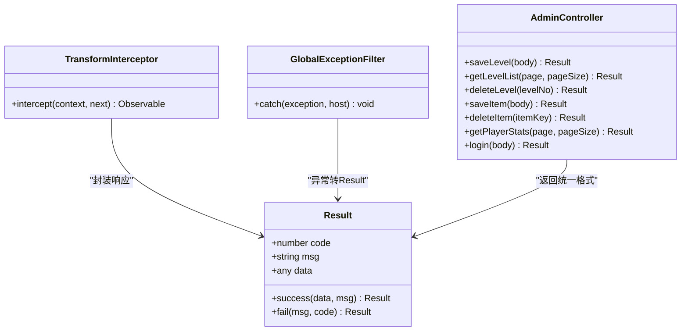
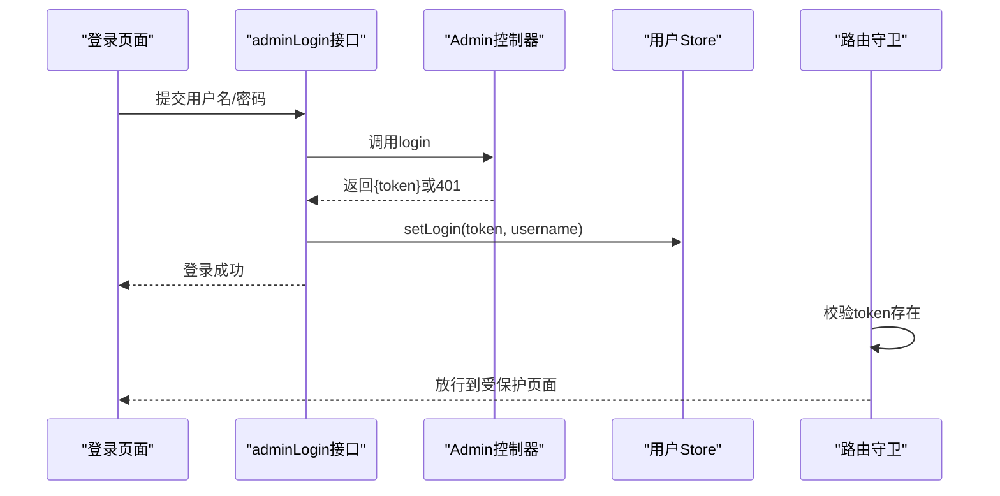
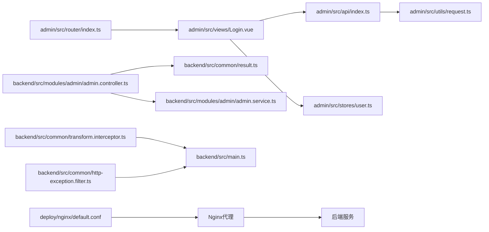

# HTTP API集成

<cite>
**本文引用的文件**
- [admin/src/utils/request.ts](file://admin/src/utils/request.ts)
- [admin/src/api/index.ts](file://admin/src/api/index.ts)
- [admin/src/stores/user.ts](file://admin/src/stores/user.ts)
- [admin/src/views/Login.vue](file://admin/src/views/Login.vue)
- [admin/src/router/index.ts](file://admin/src/router/index.ts)
- [backend/src/common/http-exception.filter.ts](file://backend/src/common/http-exception.filter.ts)
- [backend/src/common/transform.interceptor.ts](file://backend/src/common/transform.interceptor.ts)
- [backend/src/common/result.ts](file://backend/src/common/result.ts)
- [backend/src/modules/admin/admin.controller.ts](file://backend/src/modules/admin/admin.controller.ts)
- [backend/src/modules/admin/admin.service.ts](file://backend/src/modules/admin/admin.service.ts)
- [backend/src/main.ts](file://backend/src/main.ts)
- [deploy/nginx/default.conf](file://deploy/nginx/default.conf)
- [game/src/core/Http.ts](file://game/src/core/Http.ts)
- [game/src/views/Game.vue](file://game/src/views/Game.vue)
</cite>

## 目录
1. [简介](#简介)
2. [项目结构](#项目结构)
3. [核心组件](#核心组件)
4. [架构总览](#架构总览)
5. [详细组件分析](#详细组件分析)
6. [依赖关系分析](#依赖关系分析)
7. [性能考虑](#性能考虑)
8. [故障排查指南](#故障排查指南)
9. [结论](#结论)
10. [附录](#附录)

## 简介
本技术文档围绕HTTP API集成展开，系统性阐述前端与后端之间的网络请求封装、数据传输协议、错误处理机制、认证与会话管理、跨域与代理配置等。文档以实际代码为依据，结合架构图与流程图，帮助开发者快速理解并扩展该系统的API集成能力。

## 项目结构
该项目采用前后端分离架构：
- 前端（管理后台）：基于Vue 3 + Vite + Element Plus，通过Axios进行HTTP请求封装，统一拦截器处理鉴权与错误。
- 后端（NestJS）：统一响应格式、全局异常过滤与拦截器，提供REST接口。
- 部署（Nginx）：反向代理、静态资源托管、CORS跨域配置。

图表来源
- [admin/src/utils/request.ts:1-44](file://admin/src/utils/request.ts#L1-L44)
- [game/src/core/Http.ts:1-36](file://game/src/core/Http.ts#L1-L36)
- [backend/src/common/transform.interceptor.ts:1-20](file://backend/src/common/transform.interceptor.ts#L1-L20)
- [backend/src/common/http-exception.filter.ts:1-26](file://backend/src/common/http-exception.filter.ts#L1-L26)
- [backend/src/common/result.ts:1-23](file://backend/src/common/result.ts#L1-L23)
- [backend/src/modules/admin/admin.controller.ts:1-63](file://backend/src/modules/admin/admin.controller.ts#L1-L63)
- [backend/src/modules/admin/admin.service.ts:1-79](file://backend/src/modules/admin/admin.service.ts#L1-L79)
- [deploy/nginx/default.conf:1-54](file://deploy/nginx/default.conf#L1-L54)

章节来源
- [admin/src/utils/request.ts:1-44](file://admin/src/utils/request.ts#L1-L44)
- [game/src/core/Http.ts:1-36](file://game/src/core/Http.ts#L1-L36)
- [backend/src/common/transform.interceptor.ts:1-20](file://backend/src/common/transform.interceptor.ts#L1-L20)
- [backend/src/common/http-exception.filter.ts:1-26](file://backend/src/common/http-exception.filter.ts#L1-L26)
- [backend/src/common/result.ts:1-23](file://backend/src/common/result.ts#L1-L23)
- [backend/src/modules/admin/admin.controller.ts:1-63](file://backend/src/modules/admin/admin.controller.ts#L1-L63)
- [backend/src/modules/admin/admin.service.ts:1-79](file://backend/src/modules/admin/admin.service.ts#L1-L79)
- [backend/src/main.ts:1-35](file://backend/src/main.ts#L1-L35)
- [deploy/nginx/default.conf:1-54](file://deploy/nginx/default.conf#L1-L54)

## 核心组件
- 前端请求封装（Axios）
  - 基础配置：基础URL、超时时间。
  - 请求拦截器：自动附加Authorization头（localStorage中的token）。
  - 响应拦截器：统一校验code字段；非200时提示错误并处理401跳转登录；网络错误统一提示。
- 后端响应封装
  - 统一返回模型Result，包含code/msg/data。
  - 响应拦截器TransformInterceptor将业务返回统一封装为Result格式。
  - 全局异常过滤器GlobalExceptionFilter捕获异常并返回标准格式。
- 认证与会话
  - 管理后台登录接口返回token，前端存储在localStorage并在后续请求中携带。
  - 路由守卫与Pinia Store共同维护登录态。
  - 后端控制器提供硬编码登录逻辑（演示用途）。
- 跨域与代理
  - 后端启用CORS并设置全局路由前缀。
  - Nginx反向代理/api路径到后端，并配置CORS头与静态资源托管。

章节来源
- [admin/src/utils/request.ts:1-44](file://admin/src/utils/request.ts#L1-L44)
- [admin/src/stores/user.ts:1-27](file://admin/src/stores/user.ts#L1-L27)
- [admin/src/router/index.ts:1-53](file://admin/src/router/index.ts#L1-L53)
- [backend/src/common/transform.interceptor.ts:1-20](file://backend/src/common/transform.interceptor.ts#L1-L20)
- [backend/src/common/http-exception.filter.ts:1-26](file://backend/src/common/http-exception.filter.ts#L1-L26)
- [backend/src/common/result.ts:1-23](file://backend/src/common/result.ts#L1-L23)
- [backend/src/modules/admin/admin.controller.ts:54-61](file://backend/src/modules/admin/admin.controller.ts#L54-L61)
- [deploy/nginx/default.conf:16-32](file://deploy/nginx/default.conf#L16-L32)

## 架构总览
下图展示从浏览器到后端的完整调用链路，包括请求头注入、统一响应格式、错误处理与跨域代理。

图表来源
- [admin/src/utils/request.ts:10-41](file://admin/src/utils/request.ts#L10-L41)
- [backend/src/common/transform.interceptor.ts:7-18](file://backend/src/common/transform.interceptor.ts#L7-L18)
- [backend/src/modules/admin/admin.controller.ts:10-52](file://backend/src/modules/admin/admin.controller.ts#L10-L52)
- [backend/src/modules/admin/admin.service.ts:22-77](file://backend/src/modules/admin/admin.service.ts#L22-L77)
- [deploy/nginx/default.conf:16-32](file://deploy/nginx/default.conf#L16-L32)

## 详细组件分析

### 前端请求封装与API定义
- Axios实例配置
  - 基础URL指向/api，便于与Nginx代理一致。
  - 超时时间10秒，避免长时间阻塞。
- 请求拦截器
  - 从localStorage读取admin_token并附加到Authorization头。
- 响应拦截器
  - 校验后端返回的code字段，非200时统一提示错误消息。
  - 对401错误移除本地token并跳转登录页。
  - 网络错误统一提示“网络错误”。
- API接口定义
  - 管理后台登录、关卡CRUD、食材CRUD、玩家统计等接口均通过封装后的request发起。
- 使用示例
  - 登录页面调用adminLogin接口，成功后通过Pinia Store存储token并跳转首页。

图表来源
- [admin/src/utils/request.ts:10-41](file://admin/src/utils/request.ts#L10-L41)
- [admin/src/api/index.ts:1-34](file://admin/src/api/index.ts#L1-L34)
- [admin/src/views/Login.vue:40-53](file://admin/src/views/Login.vue#L40-L53)

章节来源
- [admin/src/utils/request.ts:1-44](file://admin/src/utils/request.ts#L1-L44)
- [admin/src/api/index.ts:1-34](file://admin/src/api/index.ts#L1-L34)
- [admin/src/views/Login.vue:1-55](file://admin/src/views/Login.vue#L1-L55)

### 后端响应封装与异常处理
- 统一返回模型Result
  - 字段：code、msg、data。
  - 提供success/fail静态方法，简化返回。
- 响应拦截器TransformInterceptor
  - 将业务返回统一封装为Result格式；若已是Result则透传。
- 全局异常过滤器GlobalExceptionFilter
  - 捕获所有异常，提取HTTP状态码与消息，统一返回Result格式。
- 控制器方法
  - Admin控制器提供登录、关卡/食材CRUD、玩家统计等接口，均返回Result.success或Result.fail。

图表来源
- [backend/src/common/result.ts:1-23](file://backend/src/common/result.ts#L1-L23)
- [backend/src/common/transform.interceptor.ts:1-20](file://backend/src/common/transform.interceptor.ts#L1-L20)
- [backend/src/common/http-exception.filter.ts:1-26](file://backend/src/common/http-exception.filter.ts#L1-L26)
- [backend/src/modules/admin/admin.controller.ts:1-63](file://backend/src/modules/admin/admin.controller.ts#L1-L63)

章节来源
- [backend/src/common/result.ts:1-23](file://backend/src/common/result.ts#L1-L23)
- [backend/src/common/transform.interceptor.ts:1-20](file://backend/src/common/transform.interceptor.ts#L1-L20)
- [backend/src/common/http-exception.filter.ts:1-26](file://backend/src/common/http-exception.filter.ts#L1-L26)
- [backend/src/modules/admin/admin.controller.ts:1-63](file://backend/src/modules/admin/admin.controller.ts#L1-L63)

### 认证机制与会话保持
- 登录流程
  - 前端提交用户名/密码至/admin/login。
  - 后端控制器校验（演示使用硬编码），成功返回token，失败返回401。
  - 前端存储token至localStorage，并在后续请求中通过拦截器附加。
- 会话管理
  - Pinia Store维护token与用户名，提供setLogin/logout动作。
  - 路由守卫拦截未登录访问，强制跳转登录页。
- 401处理
  - 前端响应拦截器检测401，清理token并跳转登录页。

图表来源
- [admin/src/views/Login.vue:40-53](file://admin/src/views/Login.vue#L40-L53)
- [admin/src/api/index.ts:4-5](file://admin/src/api/index.ts#L4-L5)
- [backend/src/modules/admin/admin.controller.ts:54-61](file://backend/src/modules/admin/admin.controller.ts#L54-L61)
- [admin/src/stores/user.ts:12-24](file://admin/src/stores/user.ts#L12-L24)
- [admin/src/router/index.ts:42-50](file://admin/src/router/index.ts#L42-L50)

章节来源
- [admin/src/views/Login.vue:1-55](file://admin/src/views/Login.vue#L1-L55)
- [admin/src/api/index.ts:1-34](file://admin/src/api/index.ts#L1-L34)
- [backend/src/modules/admin/admin.controller.ts:54-61](file://backend/src/modules/admin/admin.controller.ts#L54-L61)
- [admin/src/stores/user.ts:1-27](file://admin/src/stores/user.ts#L1-L27)
- [admin/src/router/index.ts:1-53](file://admin/src/router/index.ts#L1-L53)

### 游戏客户端HTTP封装
- 游戏端同样基于Axios封装，基础URL为/api，超时10秒。
- 响应拦截器仅校验后端返回的code字段，200才返回data，否则抛错。
- 提供三个常用接口：获取关卡配置、获取全部食材、保存用户通关记录。
- 游戏页面在加载关卡失败时使用默认配置兜底，提升用户体验。

章节来源
- [game/src/core/Http.ts:1-36](file://game/src/core/Http.ts#L1-L36)
- [game/src/views/Game.vue:84-94](file://game/src/views/Game.vue#L84-L94)

### 跨域、代理与HTTPS配置
- Nginx反向代理
  - /api路径代理至后端服务，设置Host、X-Real-IP、X-Forwarded-For、X-Forwarded-Proto等头部。
  - 配置CORS头：允许任意源、GET/POST/PUT/DELETE/OPTIONS、Content-Type/Authorization/Accept。
  - 对OPTIONS预检请求直接返回204。
  - 托管管理后台与游戏客户端静态资源，支持SPA路由回退。
- 后端CORS与全局前缀
  - Nest应用启用CORS并设置允许的方法与头。
  - 设置全局路由前缀为/api，确保与前端Axios配置一致。

章节来源
- [deploy/nginx/default.conf:1-54](file://deploy/nginx/default.conf#L1-L54)
- [backend/src/main.ts:10-16](file://backend/src/main.ts#L10-L16)
- [backend/src/main.ts:18-19](file://backend/src/main.ts#L18-L19)

## 依赖关系分析
- 前端
  - admin/src/api/index.ts依赖admin/src/utils/request.ts提供的Axios实例。
  - admin/src/views/Login.vue依赖admin/src/api/index.ts与admin/src/stores/user.ts。
  - admin/src/router/index.ts依赖localStorage进行登录态判断。
- 后端
  - backend/src/modules/admin/admin.controller.ts依赖backend/src/common/result.ts与backend/src/modules/admin/admin.service.ts。
  - backend/src/common/transform.interceptor.ts与backend/src/common/http-exception.filter.ts作为全局中间件被backend/src/main.ts注册。
- 部署
  - deploy/nginx/default.conf负责/api代理与CORS配置，与前后端约定一致。

图表来源
- [admin/src/api/index.ts:1-34](file://admin/src/api/index.ts#L1-L34)
- [admin/src/utils/request.ts:1-44](file://admin/src/utils/request.ts#L1-L44)
- [admin/src/views/Login.vue:26-27](file://admin/src/views/Login.vue#L26-L27)
- [admin/src/stores/user.ts:1-27](file://admin/src/stores/user.ts#L1-L27)
- [admin/src/router/index.ts:1-53](file://admin/src/router/index.ts#L1-L53)
- [backend/src/modules/admin/admin.controller.ts:1-63](file://backend/src/modules/admin/admin.controller.ts#L1-L63)
- [backend/src/common/result.ts:1-23](file://backend/src/common/result.ts#L1-L23)
- [backend/src/modules/admin/admin.service.ts:1-79](file://backend/src/modules/admin/admin.service.ts#L1-L79)
- [backend/src/common/transform.interceptor.ts:1-20](file://backend/src/common/transform.interceptor.ts#L1-L20)
- [backend/src/common/http-exception.filter.ts:1-26](file://backend/src/common/http-exception.filter.ts#L1-L26)
- [backend/src/main.ts:1-35](file://backend/src/main.ts#L1-L35)
- [deploy/nginx/default.conf:1-54](file://deploy/nginx/default.conf#L1-L54)

章节来源
- [admin/src/api/index.ts:1-34](file://admin/src/api/index.ts#L1-L34)
- [admin/src/utils/request.ts:1-44](file://admin/src/utils/request.ts#L1-L44)
- [admin/src/views/Login.vue:1-55](file://admin/src/views/Login.vue#L1-L55)
- [admin/src/stores/user.ts:1-27](file://admin/src/stores/user.ts#L1-L27)
- [admin/src/router/index.ts:1-53](file://admin/src/router/index.ts#L1-L53)
- [backend/src/modules/admin/admin.controller.ts:1-63](file://backend/src/modules/admin/admin.controller.ts#L1-L63)
- [backend/src/common/result.ts:1-23](file://backend/src/common/result.ts#L1-L23)
- [backend/src/modules/admin/admin.service.ts:1-79](file://backend/src/modules/admin/admin.service.ts#L1-L79)
- [backend/src/common/transform.interceptor.ts:1-20](file://backend/src/common/transform.interceptor.ts#L1-L20)
- [backend/src/common/http-exception.filter.ts:1-26](file://backend/src/common/http-exception.filter.ts#L1-L26)
- [backend/src/main.ts:1-35](file://backend/src/main.ts#L1-L35)
- [deploy/nginx/default.conf:1-54](file://deploy/nginx/default.conf#L1-L54)

## 性能考虑
- 超时控制：前端与游戏端均设置10秒超时，避免长时间等待。
- 缓存策略：后端服务层在修改关卡配置时主动删除Redis缓存键，保证数据一致性。
- 响应格式：统一Result格式减少前端分支判断，提高解析效率。
- 代理与CORS：Nginx集中处理跨域与静态资源，降低后端压力。

章节来源
- [admin/src/utils/request.ts:5-8](file://admin/src/utils/request.ts#L5-L8)
- [game/src/core/Http.ts:6-9](file://game/src/core/Http.ts#L6-L9)
- [backend/src/modules/admin/admin.service.ts:32-34](file://backend/src/modules/admin/admin.service.ts#L32-L34)

## 故障排查指南
- 登录失败或401
  - 检查后端/admin/login是否返回正确token。
  - 确认前端请求拦截器是否附加Authorization头。
  - 若出现401，确认前端响应拦截器是否移除token并跳转登录。
- 接口报错
  - 查看后端异常过滤器是否将异常转换为标准Result格式。
  - 确认前端响应拦截器是否正确解析code并提示错误。
- 跨域问题
  - 检查Nginx CORS头配置与后端enableCors设置是否一致。
  - 确保前端基础URL与代理路径/api一致。
- 静态资源404
  - 检查Nginx静态资源映射与try_files配置。
- 日志与监控
  - 后端启动日志输出监听地址。
  - 前端可利用浏览器开发者工具Network面板查看请求与响应。
  - 建议在生产环境增加统一日志采集与错误上报。

章节来源
- [admin/src/utils/request.ts:22-41](file://admin/src/utils/request.ts#L22-L41)
- [backend/src/common/http-exception.filter.ts:8-24](file://backend/src/common/http-exception.filter.ts#L8-L24)
- [backend/src/main.ts:30-32](file://backend/src/main.ts#L30-L32)
- [deploy/nginx/default.conf:23-31](file://deploy/nginx/default.conf#L23-L31)

## 结论
本项目通过前后端统一的HTTP请求封装与响应格式，实现了清晰的认证与会话管理、完善的错误处理与跨域配置。前端Axios拦截器与后端拦截器/过滤器协同工作，确保了API交互的一致性与可靠性。建议在生产环境中进一步完善HTTPS、代理与跨域策略，并引入更细粒度的日志与监控体系。

## 附录
- API接口清单（基于前端封装）
  - 管理员登录：POST /admin/login
  - 关卡列表：GET /admin/level/list?page&pageSize
  - 保存关卡：POST /admin/level/save
  - 删除关卡：DELETE /admin/level/:levelNo
  - 食材列表：GET /item/all
  - 保存食材：POST /admin/item/save
  - 删除食材：DELETE /admin/item/:itemKey
  - 玩家统计：GET /admin/player/stats?page&pageSize
- 游戏端接口
  - 获取关卡配置：GET /level/get/:levelNo
  - 获取全部食材：GET /item/all
  - 保存用户通关记录：POST /user/saveRecord

章节来源
- [admin/src/api/index.ts:1-34](file://admin/src/api/index.ts#L1-L34)
- [game/src/core/Http.ts:23-33](file://game/src/core/Http.ts#L23-L33)