# 游戏客户端

<cite>
**本文引用的文件**
- [main.ts](file://game/src/main.ts)
- [App.vue](file://game/src/App.vue)
- [Game.vue](file://game/src/views/Game.vue)
- [GameContainer.vue](file://game/src/components/GameContainer.vue)
- [ThreeEnv.ts](file://game/src/core/ThreeEnv.ts)
- [PhysicWorld.ts](file://game/src/core/PhysicWorld.ts)
- [ShakeSensor.ts](file://game/src/core/ShakeSensor.ts)
- [ItemPool.ts](file://game/src/pool/ItemPool.ts)
- [GameLogic.ts](file://game/src/utils/GameLogic.ts)
- [Http.ts](file://game/src/core/Http.ts)
- [vite.config.ts](file://game/vite.config.ts)
- [package.json](file://game/package.json)
- [wx.d.ts](file://game/src/wx.d.ts)
- [admin main.ts](file://admin/src/main.ts)
</cite>

## 目录
1. [简介](#简介)
2. [项目结构](#项目结构)
3. [核心组件](#核心组件)
4. [架构总览](#架构总览)
5. [详细组件分析](#详细组件分析)
6. [依赖关系分析](#依赖关系分析)
7. [性能考虑](#性能考虑)
8. [故障排查指南](#故障排查指南)
9. [结论](#结论)
10. [附录](#附录)

## 简介
本项目是一个基于 Vue 3 + TypeScript 的 3D 三消类游戏客户端，采用 Three.js 进行 3D 渲染、Cannon-es 实现物理模拟、对象池优化渲染与内存、Vite 构建与代理。游戏支持点击拾取、三消判定、道具系统（回锅、洗牌、一键凑三）、摇一摇颠锅、关卡配置加载与通关记录保存，并提供微信小游戏与网页双端运行能力。

## 项目结构
- 游戏客户端位于 game/ 目录，包含入口、视图层、核心模块、工具与资源。
- 管理后台位于 admin/，使用 Vue 3 + Pinia + Element Plus。
- 后端位于 backend/，提供关卡、道具、用户记录等 API。
- 部署脚本位于 deploy/，包含 Nginx 配置与 Docker 编排。

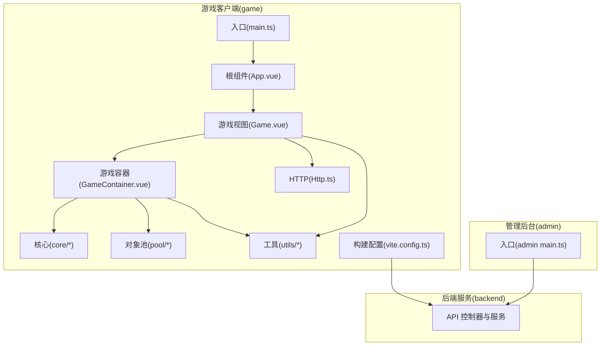

图表来源
- [main.ts:1-4](file://game/src/main.ts#L1-L4)
- [App.vue:1-7](file://game/src/App.vue#L1-L7)
- [Game.vue:1-357](file://game/src/views/Game.vue#L1-L357)
- [GameContainer.vue:1-270](file://game/src/components/GameContainer.vue#L1-L270)
- [Http.ts:1-36](file://game/src/core/Http.ts#L1-L36)
- [vite.config.ts:1-22](file://game/vite.config.ts#L1-L22)
- [admin main.ts:1-20](file://admin/src/main.ts#L1-L20)

章节来源
- [main.ts:1-4](file://game/src/main.ts#L1-L4)
- [App.vue:1-7](file://game/src/App.vue#L1-L7)
- [vite.config.ts:1-22](file://game/vite.config.ts#L1-L22)

## 核心组件
- 游戏视图层：负责 UI、事件绑定、道具交互、弹窗与状态展示。
- 游戏容器层：承载 Three.js 场景、物理世界、输入与摇晃传感器，协调渲染与物理步进。
- 核心模块：ThreeEnv（场景与渲染）、PhysicWorld（物理世界与碰撞）、ShakeSensor（摇一摇）。
- 对象池：ItemPool（复用球体 Mesh，降低 GC 压力）。
- 工具模块：GameLogic（三消算法、道具辅助逻辑）。
- HTTP：Axios 封装，对接后端 API。
- 构建配置：Vite，支持本地代理与微信小游戏构建输出。

章节来源
- [Game.vue:68-168](file://game/src/views/Game.vue#L68-L168)
- [GameContainer.vue:5-70](file://game/src/components/GameContainer.vue#L5-L70)
- [ThreeEnv.ts:7-48](file://game/src/core/ThreeEnv.ts#L7-L48)
- [PhysicWorld.ts:7-26](file://game/src/core/PhysicWorld.ts#L7-L26)
- [ShakeSensor.ts:5-38](file://game/src/core/ShakeSensor.ts#L5-L38)
- [ItemPool.ts:17-32](file://game/src/pool/ItemPool.ts#L17-L32)
- [GameLogic.ts:8-15](file://game/src/utils/GameLogic.ts#L8-L15)
- [Http.ts:6-35](file://game/src/core/Http.ts#L6-L35)
- [vite.config.ts:4-21](file://game/vite.config.ts#L4-L21)

## 架构总览
整体采用“视图层-容器层-核心模块-工具-网络”的分层设计。容器层作为协调者，将 Three.js 渲染与 Cannon-es 物理进行帧级同步；视图层通过事件驱动容器层执行游戏逻辑与道具操作；工具模块提供三消与位置重排等纯逻辑；HTTP 模块统一封装后端交互。

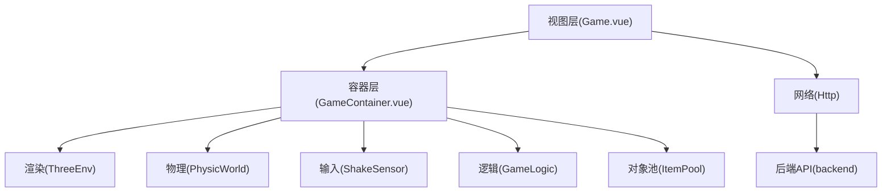

图表来源
- [Game.vue:68-168](file://game/src/views/Game.vue#L68-L168)
- [GameContainer.vue:38-70](file://game/src/components/GameContainer.vue#L38-L70)
- [ThreeEnv.ts:7-48](file://game/src/core/ThreeEnv.ts#L7-L48)
- [PhysicWorld.ts:7-26](file://game/src/core/PhysicWorld.ts#L7-L26)
- [ShakeSensor.ts:5-38](file://game/src/core/ShakeSensor.ts#L5-L38)
- [GameLogic.ts:21-63](file://game/src/utils/GameLogic.ts#L21-L63)
- [ItemPool.ts:17-32](file://game/src/pool/ItemPool.ts#L17-L32)
- [Http.ts:6-35](file://game/src/core/Http.ts#L6-L35)

## 详细组件分析

### 游戏视图层（Game.vue）
- 负责渲染游戏区域、顶部关卡与锅内计数、底部卡槽 UI、道具按钮与弹窗。
- 通过事件与容器通信：槽位更新、游戏结束、通关、锅内数量变化。
- 提供道具使用入口：回锅、洗牌、一键凑三；提供摇晃模拟按钮。
- 生命周期中加载首关配置；失败/通关弹窗控制与记录保存。

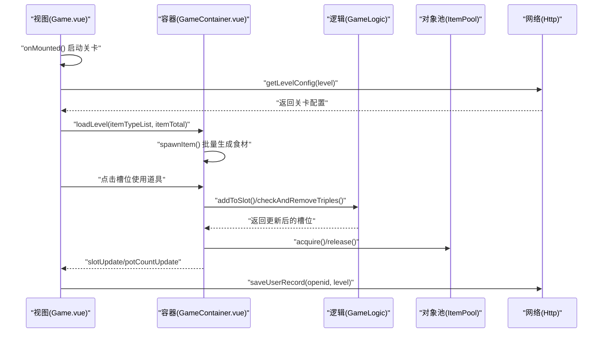

图表来源
- [Game.vue:83-120](file://game/src/views/Game.vue#L83-L120)
- [GameContainer.vue:72-103](file://game/src/components/GameContainer.vue#L72-L103)
- [GameLogic.ts:21-63](file://game/src/utils/GameLogic.ts#L21-L63)
- [ItemPool.ts:43-66](file://game/src/pool/ItemPool.ts#L43-L66)
- [Http.ts:23-33](file://game/src/core/Http.ts#L23-L33)

章节来源
- [Game.vue:68-168](file://game/src/views/Game.vue#L68-L168)

### 游戏容器层（GameContainer.vue）
- 初始化 ThreeEnv、PhysicWorld、ShakeSensor、ItemPool。
- 注册每帧物理步进与坐标同步，保证渲染与物理一致。
- 处理鼠标点击拾取、三消判定、道具使用（回锅、洗牌、一键凑三）。
- 提供暴露方法给父组件调用，便于调试与外部控制。

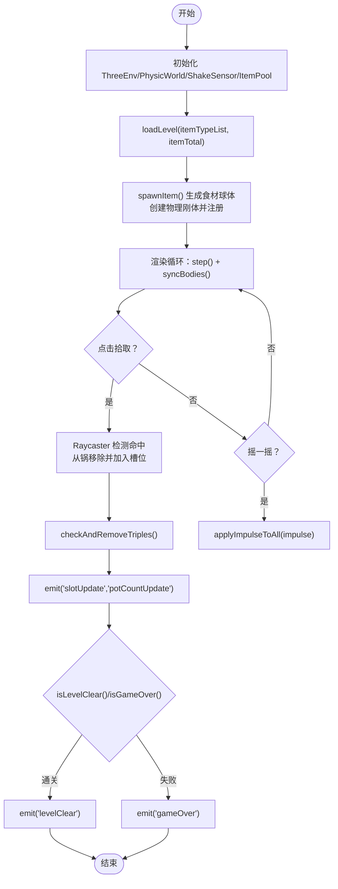

图表来源
- [GameContainer.vue:38-70](file://game/src/components/GameContainer.vue#L38-L70)
- [GameContainer.vue:72-103](file://game/src/components/GameContainer.vue#L72-L103)
- [GameContainer.vue:105-166](file://game/src/components/GameContainer.vue#L105-L166)
- [PhysicWorld.ts:85-96](file://game/src/core/PhysicWorld.ts#L85-L96)
- [GameLogic.ts:42-63](file://game/src/utils/GameLogic.ts#L42-L63)

章节来源
- [GameContainer.vue:5-70](file://game/src/components/GameContainer.vue#L5-L70)
- [GameContainer.vue:72-248](file://game/src/components/GameContainer.vue#L72-L248)

### Three.js 渲染环境（ThreeEnv.ts）
- 创建场景、透视相机、光源与渲染器，支持窗口自适应。
- 提供 addAnimFn 注册每帧回调，animate 中统一调度。
- 提供 createPot 创建漏斗锅体几何与材质。
- 提供 dispose 释放资源，避免内存泄漏。

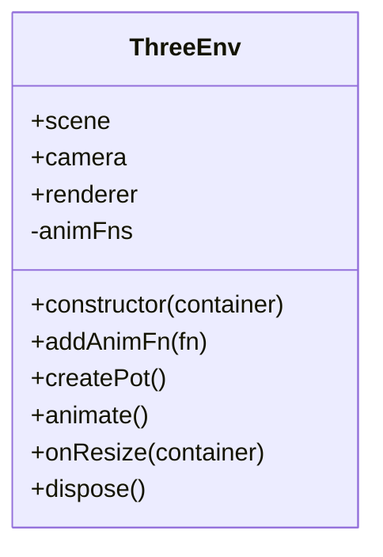

图表来源
- [ThreeEnv.ts:7-122](file://game/src/core/ThreeEnv.ts#L7-L122)

章节来源
- [ThreeEnv.ts:7-122](file://game/src/core/ThreeEnv.ts#L7-L122)

### 物理世界（PhysicWorld.ts）
- 创建 Cannon-es 物理世界，设置重力、阻尼与接触材料。
- 创建锅体碰撞体（底部+四壁），使用静态刚体。
- 提供球体刚体创建、注册/注销、每帧步进与坐标同步。
- 提供 applyImpulseToAll 实现颠锅效果。

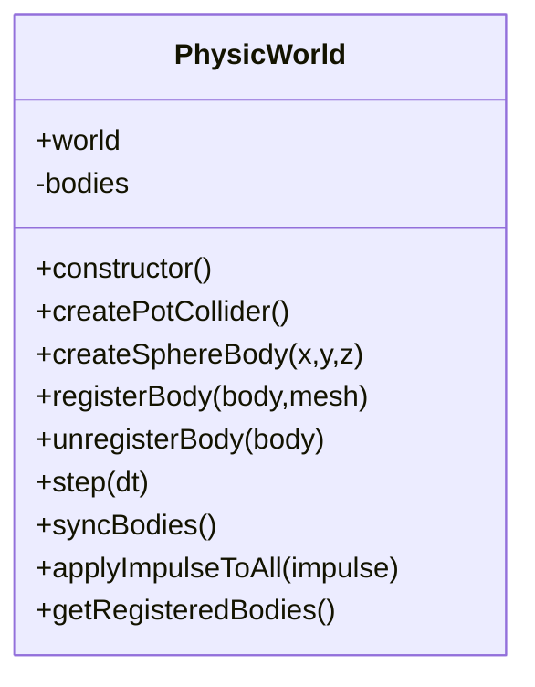

图表来源
- [PhysicWorld.ts:7-109](file://game/src/core/PhysicWorld.ts#L7-L109)

章节来源
- [PhysicWorld.ts:7-109](file://game/src/core/PhysicWorld.ts#L7-L109)

### 摇一摇传感器（ShakeSensor.ts）
- 自动检测微信小游戏环境，使用 wx.startAccelerometer 监听加速度。
- 通过三轴差值累加与阈值判断触发摇晃事件，带防抖。
- 提供 simulateShake 用于网页调试。

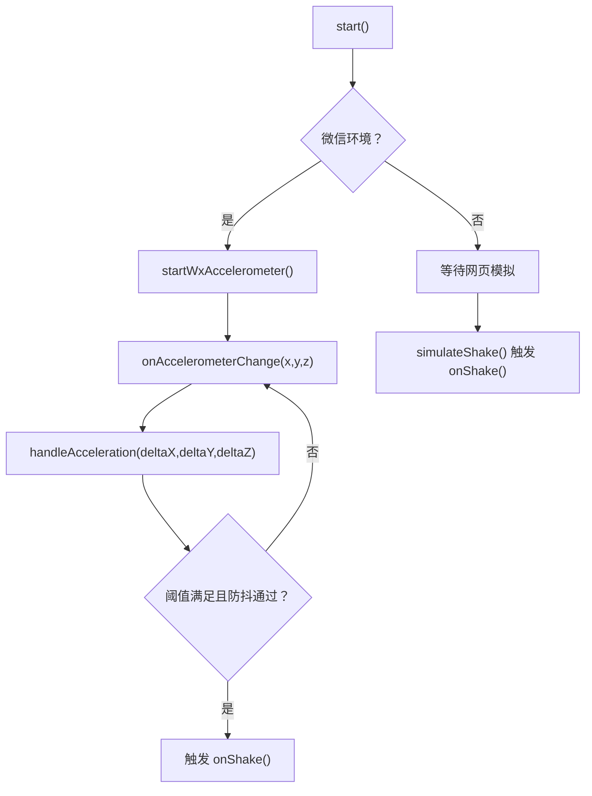

图表来源
- [ShakeSensor.ts:25-87](file://game/src/core/ShakeSensor.ts#L25-L87)

章节来源
- [ShakeSensor.ts:5-88](file://game/src/core/ShakeSensor.ts#L5-L88)
- [wx.d.ts:1-7](file://game/src/wx.d.ts#L1-L7)

### 对象池（ItemPool.ts）
- 共享几何体 SphereGeometry，按需创建材质与 Mesh。
- acquire/release 复用 Mesh，降低频繁创建销毁带来的 GC 压力。
- 维护活跃集合与空闲池，支持动态扩容与资源释放。

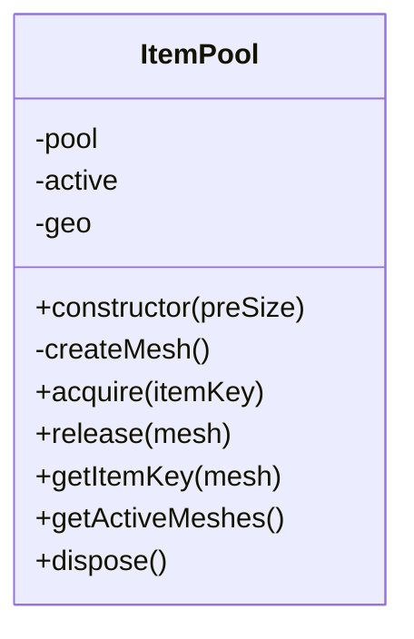

图表来源
- [ItemPool.ts:17-91](file://game/src/pool/ItemPool.ts#L17-L91)

章节来源
- [ItemPool.ts:17-91](file://game/src/pool/ItemPool.ts#L17-L91)

### 游戏逻辑（GameLogic.ts）
- addToSlot：向卡槽添加元素并检测三消。
- checkAndRemoveTriples：从左至右扫描并递归消除，直至无新增三消。
- isGameOver/isLevelClear：失败条件（槽满且不可消除）、通关条件（锅内清空）。
- generateTripleItems：一键凑三道具辅助逻辑。
- shufflePositions：洗牌时生成随机坐标。

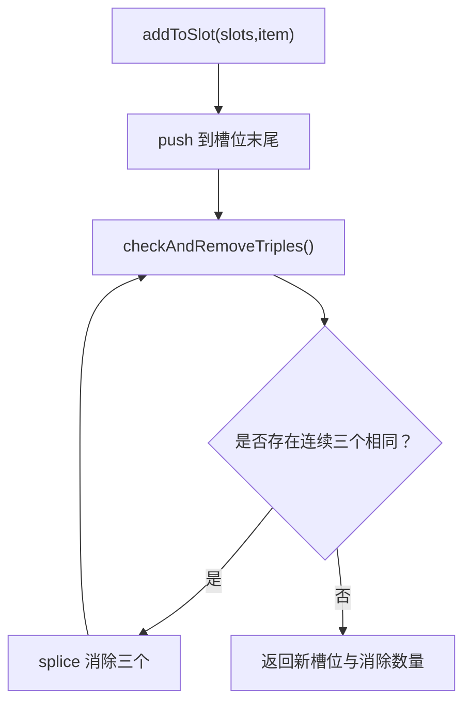

图表来源
- [GameLogic.ts:21-63](file://game/src/utils/GameLogic.ts#L21-L63)

章节来源
- [GameLogic.ts:8-133](file://game/src/utils/GameLogic.ts#L8-L133)

### 网络层（Http.ts）
- Axios 实例化，设置 baseURL 与超时。
- 响应拦截器统一解包与错误处理。
- 提供 getLevelConfig、getAllItems、saveUserRecord 接口。

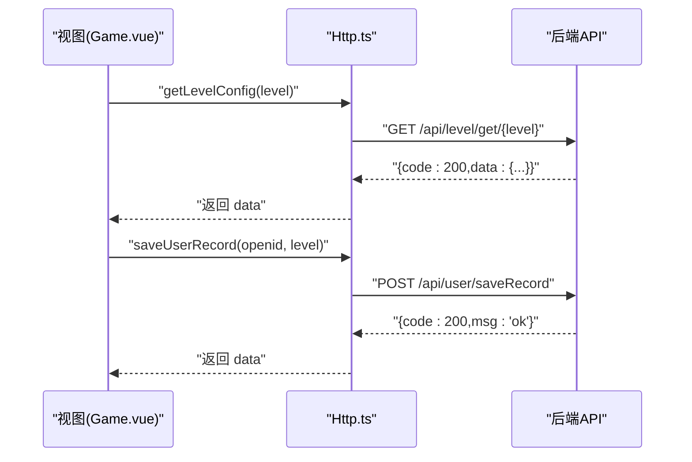

图表来源
- [Http.ts:23-33](file://game/src/core/Http.ts#L23-L33)
- [vite.config.ts:8-13](file://game/vite.config.ts#L8-L13)

章节来源
- [Http.ts:6-35](file://game/src/core/Http.ts#L6-L35)
- [vite.config.ts:6-14](file://game/vite.config.ts#L6-L14)

## 依赖关系分析
- 运行时依赖：vue、three、cannon-es、axios。
- 开发依赖：@vitejs/plugin-vue、typescript、vite、vue-tsc。
- 构建模式：普通 Web 与微信小游戏两种输出目录与命名策略。
- 代理配置：前端开发时将 /api 代理到后端服务端口。

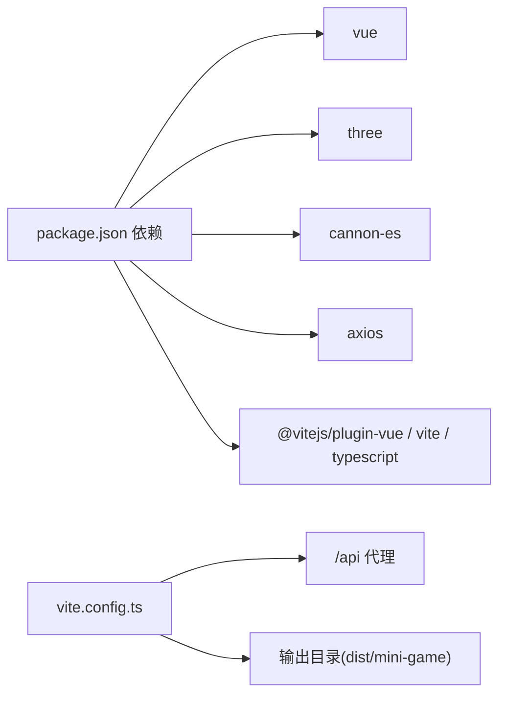

图表来源
- [package.json:11-23](file://game/package.json#L11-L23)
- [vite.config.ts:4-21](file://game/vite.config.ts#L4-L21)

章节来源
- [package.json:1-25](file://game/package.json#L1-L25)
- [vite.config.ts:4-21](file://game/vite.config.ts#L4-L21)

## 性能考虑
- 对象池：共享几何体与材质，减少 GC 抖动，提升大量 Mesh 动态创建/回收场景下的稳定性。
- 帧步进与同步：在容器层统一注册每帧物理步进与坐标同步，避免重复遍历与不一致。
- 渲染优化：ThreeEnv 使用阴影与抗锯齿，像素比限制在合理范围，窗口自适应避免额外重绘。
- 物理参数：适当阻尼与弹性参数平衡真实感与稳定性，减少长链堆叠抖动。
- 网络：统一拦截器解包与错误提示，避免重复请求与异常传播。

## 故障排查指南
- 无法加载关卡配置
  - 检查 /api 代理是否生效，确认后端服务已启动。
  - 若接口失败，视图层会降级使用默认配置，确认代理与跨域设置。
- 点击无效或拾取不到
  - 确认 Raycaster 参数与相机状态，检查容器尺寸与事件坐标换算。
  - 确认对象池 acquire/released 流程，确保 Mesh 可见与活跃。
- 摇一摇无效
  - 在网页端使用“模拟摇晃”按钮触发；在微信小游戏需真机测试。
  - 检查 wx 环境检测与加速度监听是否成功。
- 三消不触发或误判
  - 检查 addToSlot 与 checkAndRemoveTriples 的调用顺序与返回值。
  - 确认卡槽长度与可用匹配逻辑。
- 性能问题
  - 检查对象池容量与扩容频率；减少不必要的几何体与材质创建。
  - 降低阴影与高分辨率像素比；合并渲染批次。

章节来源
- [Http.ts:12-21](file://game/src/core/Http.ts#L12-L21)
- [Game.vue:87-93](file://game/src/views/Game.vue#L87-L93)
- [GameContainer.vue:105-166](file://game/src/components/GameContainer.vue#L105-L166)
- [ShakeSensor.ts:25-87](file://game/src/core/ShakeSensor.ts#L25-L87)
- [GameLogic.ts:21-63](file://game/src/utils/GameLogic.ts#L21-L63)
- [ThreeEnv.ts:37-41](file://game/src/core/ThreeEnv.ts#L37-L41)

## 结论
该客户端以清晰的分层架构实现了 3D 三消游戏的核心流程：从关卡配置加载、点击拾取、三消判定、道具使用到摇一摇颠锅与通关/失败判定。Three.js 与 Cannon-es 的结合提供了稳定流畅的视觉与物理体验，对象池与统一帧循环进一步提升了性能与可维护性。配合 Vite 的代理与多模式构建，既满足网页端开发调试，也支持微信小游戏部署。

## 附录
- 构建命令
  - 开发：npm run dev
  - 构建：npm run build
  - 微信小游戏构建：npm run build:wx
- 代理与端口
  - 前端开发服务器端口：5173
  - /api 代理至后端：http://localhost:3000
- 类型声明
  - 微信小游戏加速度 API 类型声明：wx.d.ts

章节来源
- [vite.config.ts:6-21](file://game/vite.config.ts#L6-L21)
- [package.json:5-10](file://game/package.json#L5-L10)
- [wx.d.ts:1-7](file://game/src/wx.d.ts#L1-L7)