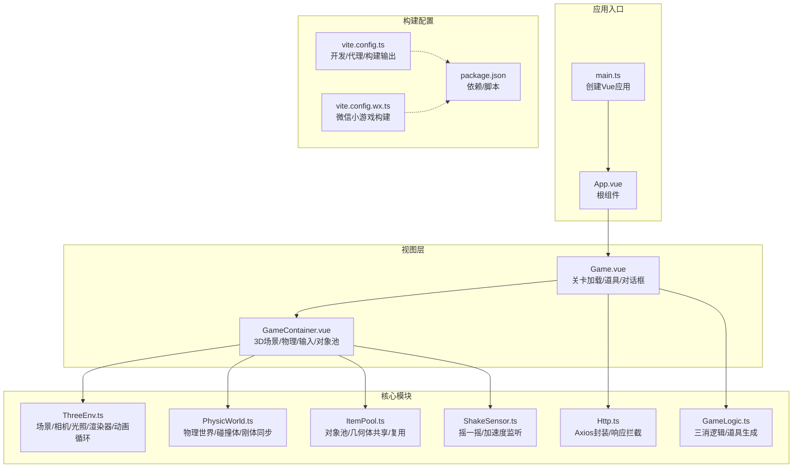
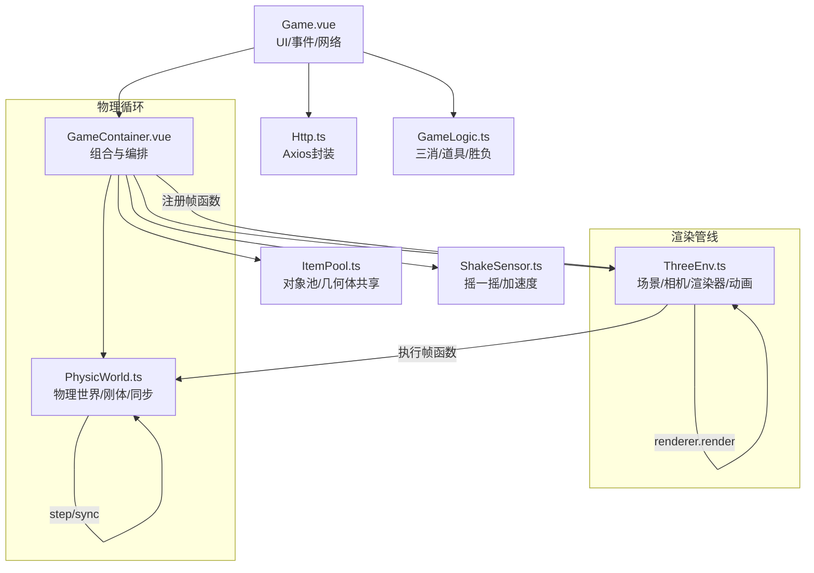
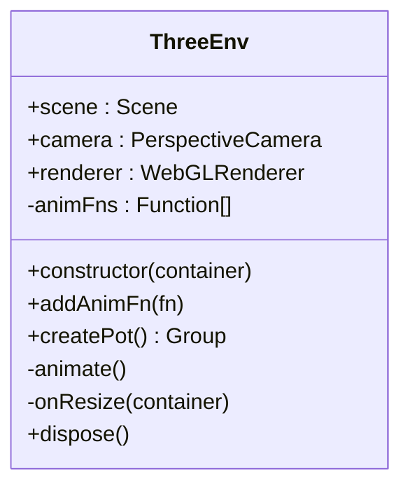
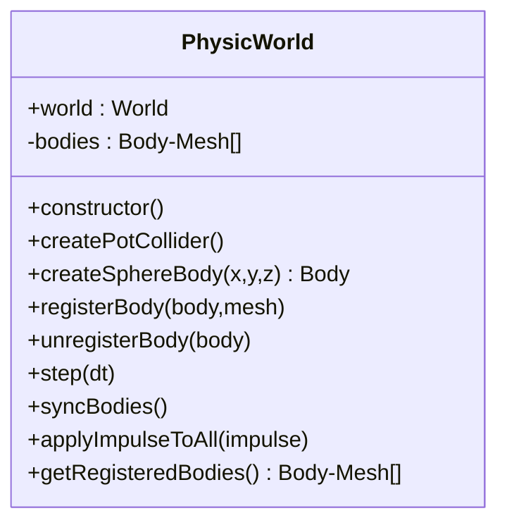
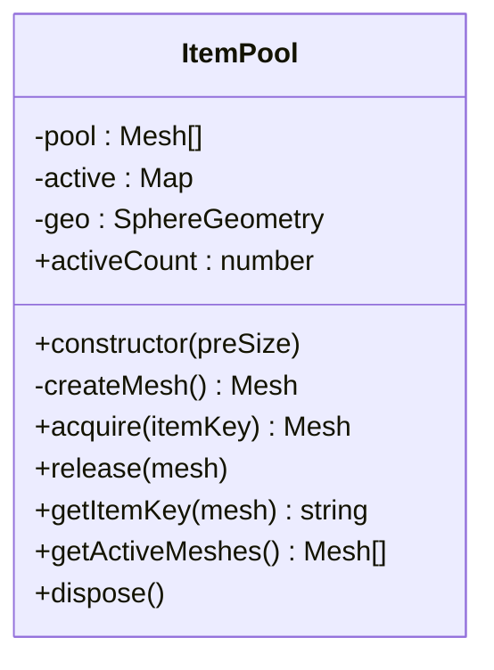
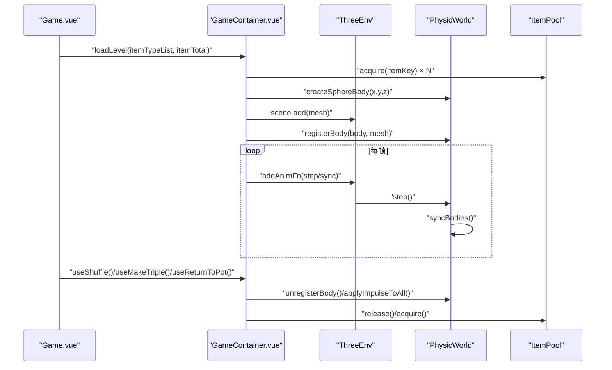
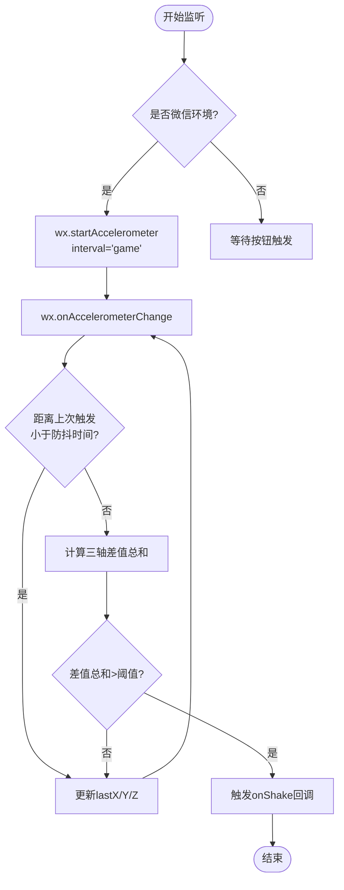
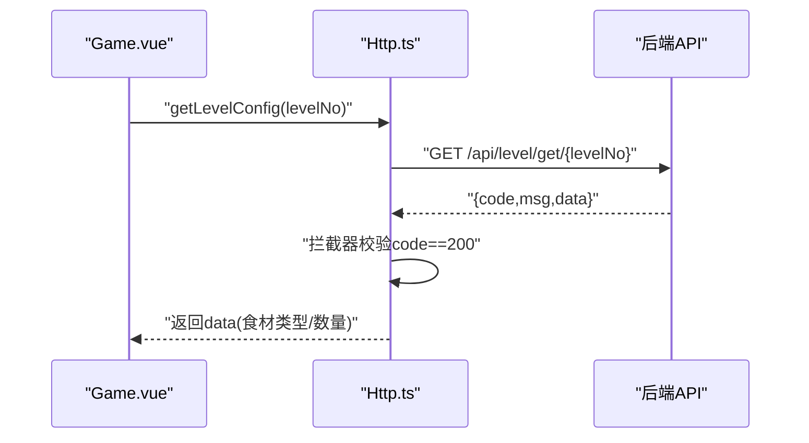
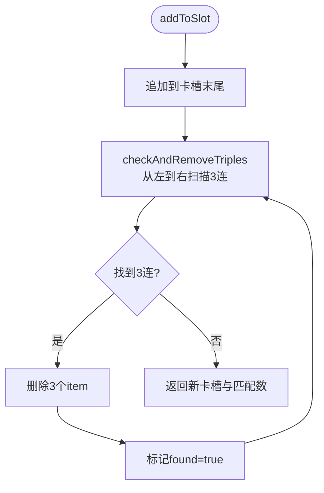
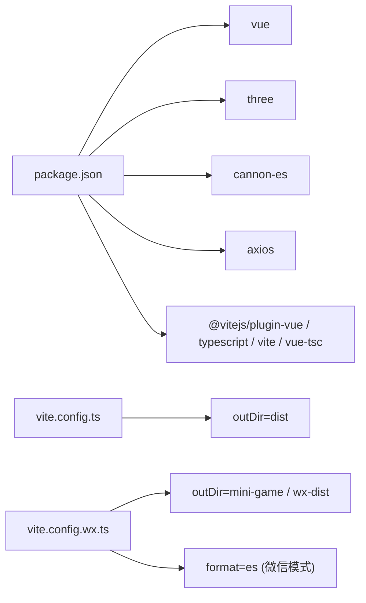

# 游戏引擎架构

<cite>
**本文引用的文件**
- [ThreeEnv.ts](file://game/src/core/ThreeEnv.ts)
- [PhysicWorld.ts](file://game/src/core/PhysicWorld.ts)
- [ItemPool.ts](file://game/src/pool/ItemPool.ts)
- [GameContainer.vue](file://game/src/components/GameContainer.vue)
- [Game.vue](file://game/src/views/Game.vue)
- [ShakeSensor.ts](file://game/src/core/ShakeSensor.ts)
- [Http.ts](file://game/src/core/Http.ts)
- [GameLogic.ts](file://game/src/utils/GameLogic.ts)
- [main.ts](file://game/src/main.ts)
- [App.vue](file://game/src/App.vue)
- [vite.config.ts](file://game/vite.config.ts)
- [vite.config.wx.ts](file://game/vite.config.wx.ts)
- [package.json](file://game/package.json)
</cite>

## 目录
1. [简介](#简介)
2. [项目结构](#项目结构)
3. [核心组件](#核心组件)
4. [架构总览](#架构总览)
5. [详细组件分析](#详细组件分析)
6. [依赖关系分析](#依赖关系分析)
7. [性能考量](#性能考量)
8. [故障排查指南](#故障排查指南)
9. [结论](#结论)
10. [附录](#附录)

## 简介
本技术文档面向Three.js游戏引擎的架构设计与实现，围绕Three.js环境配置、渲染管线、场景管理、物理仿真、对象池与资源管理、渲染循环与帧率控制、性能监控、扩展点与插件系统、自定义渲染器集成、引擎配置选项、调试工具与移动端适配策略进行系统化梳理。文档以代码级分析为基础，辅以可视化图示，帮助开发者快速理解并扩展该引擎。

## 项目结构
游戏前端位于 game 目录，采用 Vue 3 + TypeScript + Vite 构建，Three.js 负责3D渲染，cannon-es 提供物理仿真，Axios 封装HTTP请求，微信小游戏模式通过独立Vite配置支持。

**图表来源**
- [main.ts:1-4](file://game/src/main.ts#L1-L4)
- [App.vue:1-7](file://game/src/App.vue#L1-L7)
- [Game.vue:1-357](file://game/src/views/Game.vue#L1-L357)
- [GameContainer.vue:1-270](file://game/src/components/GameContainer.vue#L1-L270)
- [ThreeEnv.ts:1-123](file://game/src/core/ThreeEnv.ts#L1-L123)
- [PhysicWorld.ts:1-110](file://game/src/core/PhysicWorld.ts#L1-L110)
- [ItemPool.ts:1-92](file://game/src/pool/ItemPool.ts#L1-L92)
- [ShakeSensor.ts:1-89](file://game/src/core/ShakeSensor.ts#L1-L89)
- [Http.ts:1-36](file://game/src/core/Http.ts#L1-L36)
- [GameLogic.ts:1-133](file://game/src/utils/GameLogic.ts#L1-L133)
- [vite.config.ts:1-22](file://game/vite.config.ts#L1-L22)
- [vite.config.wx.ts:1-37](file://game/vite.config.wx.ts#L1-L37)
- [package.json:1-25](file://game/package.json#L1-L25)

**章节来源**
- [main.ts:1-4](file://game/src/main.ts#L1-L4)
- [App.vue:1-7](file://game/src/App.vue#L1-L7)
- [vite.config.ts:1-22](file://game/vite.config.ts#L1-L22)
- [vite.config.wx.ts:1-37](file://game/vite.config.wx.ts#L1-L37)
- [package.json:1-25](file://game/package.json#L1-L25)

## 核心组件
- ThreeEnv：封装场景、相机、光源、渲染器与渲染循环；提供创建锅体、窗口自适应、资源销毁等能力。
- PhysicWorld：封装cannon-es物理世界，创建锅体碰撞体、球形食材刚体，维护刚体-网格同步与全局冲量施加。
- ItemPool：对象池与几何体共享，降低GC压力，提升运行时性能。
- GameContainer：组合ThreeEnv、PhysicWorld、ShakeSensor、ItemPool，处理点击拾取、三消逻辑、道具使用、摇晃颠锅等业务。
- Game：负责关卡加载、UI交互、对话框、用户记录提交。
- ShakeSensor：微信加速度监听与网页模拟摇晃。
- Http：Axios封装，统一响应拦截与错误处理。
- GameLogic：三消算法、道具生成、胜负判断。
- 构建配置：vite.config.ts 与 vite.config.wx.ts 分别支持Web与微信小游戏构建。

**章节来源**
- [ThreeEnv.ts:1-123](file://game/src/core/ThreeEnv.ts#L1-L123)
- [PhysicWorld.ts:1-110](file://game/src/core/PhysicWorld.ts#L1-L110)
- [ItemPool.ts:1-92](file://game/src/pool/ItemPool.ts#L1-L92)
- [GameContainer.vue:1-270](file://game/src/components/GameContainer.vue#L1-L270)
- [Game.vue:1-357](file://game/src/views/Game.vue#L1-L357)
- [ShakeSensor.ts:1-89](file://game/src/core/ShakeSensor.ts#L1-L89)
- [Http.ts:1-36](file://game/src/core/Http.ts#L1-L36)
- [GameLogic.ts:1-133](file://game/src/utils/GameLogic.ts#L1-L133)
- [vite.config.ts:1-22](file://game/vite.config.ts#L1-L22)
- [vite.config.wx.ts:1-37](file://game/vite.config.wx.ts#L1-L37)

## 架构总览
引擎采用“视图层-容器层-核心模块”的分层设计。视图层负责UI与业务交互，容器层承载3D场景、物理与输入，核心模块提供渲染、物理、对象池、传感器与网络等基础能力。渲染循环由ThreeEnv统一调度，物理步进与坐标同步在容器层注册的帧函数中执行。

**图表来源**
- [Game.vue:1-357](file://game/src/views/Game.vue#L1-L357)
- [GameContainer.vue:1-270](file://game/src/components/GameContainer.vue#L1-L270)
- [ThreeEnv.ts:1-123](file://game/src/core/ThreeEnv.ts#L1-L123)
- [PhysicWorld.ts:1-110](file://game/src/core/PhysicWorld.ts#L1-L110)
- [ItemPool.ts:1-92](file://game/src/pool/ItemPool.ts#L1-L92)
- [ShakeSensor.ts:1-89](file://game/src/core/ShakeSensor.ts#L1-L89)
- [Http.ts:1-36](file://game/src/core/Http.ts#L1-L36)
- [GameLogic.ts:1-133](file://game/src/utils/GameLogic.ts#L1-L133)

## 详细组件分析

### ThreeEnv：Three.js环境与渲染循环
- 场景与相机：创建Scene、PerspectiveCamera，设置背景色与初始姿态。
- 光照：DirectionalLight（投射阴影）+ AmbientLight（补光），满足主视角俯视场景。
- 渲染器：WebGLRenderer，启用抗锯齿、像素比限制（设备像素比上限2）、阴影贴图。
- 动画循环：基于requestAnimationFrame，按帧执行注册的函数列表后再渲染。
- 场景管理：提供创建锅体Group、窗口自适应、销毁释放资源（几何体与材质）。
- 扩展点：addAnimFn允许注入自定义帧函数，便于接入物理步进、传感器回调等。

**图表来源**
- [ThreeEnv.ts:1-123](file://game/src/core/ThreeEnv.ts#L1-L123)

**章节来源**
- [ThreeEnv.ts:1-123](file://game/src/core/ThreeEnv.ts#L1-L123)

### PhysicWorld：物理世界与刚体同步
- 物理世界：重力、Broadphase、Solver迭代次数、接触材料参数。
- 锅体碰撞体：底部平面+四面侧壁（静态刚体）拼接，形成漏斗状容器。
- 食材刚体：球形刚体，设置阻尼、线性/角阻尼，提升堆叠稳定性。
- 同步机制：维护body-mesh映射，每帧复制位置与四元数到Three.js网格。
- 冲量施加：对所有刚体施加瞬时冲量，实现颠锅效果。
- 资源管理：注册/注销刚体，移除世界中的刚体，避免泄漏。

**图表来源**
- [PhysicWorld.ts:1-110](file://game/src/core/PhysicWorld.ts#L1-L110)

**章节来源**
- [PhysicWorld.ts:1-110](file://game/src/core/PhysicWorld.ts#L1-L110)

### ItemPool：对象池与几何体共享
- 共享几何体：所有球体复用同一SphereGeometry，降低内存占用与GC压力。
- 颜色映射：根据itemKey设置材质颜色，支持多种食材类型。
- 复用策略：acquire/release缓存复用，池空时动态扩容。
- 可见性管理：回收时隐藏并移出视野，避免视觉残留。
- 资源释放：dispose统一释放几何体与材质，防止内存泄漏。

**图表来源**
- [ItemPool.ts:1-92](file://game/src/pool/ItemPool.ts#L1-L92)

**章节来源**
- [ItemPool.ts:1-92](file://game/src/pool/ItemPool.ts#L1-L92)

### GameContainer：场景编排与交互
- 组合核心模块：ThreeEnv、PhysicWorld、ShakeSensor、ItemPool。
- 关卡加载：根据关卡配置批量生成食材球体，加入场景与物理世界。
- 输入与拾取：Raycaster射线检测，命中食材后从锅内移除并进入卡槽。
- 三消逻辑：addToSlot与checkAndRemoveTriples，支持递归消除。
- 道具系统：回锅、洗牌、一键凑三，配合对象池与物理世界协同。
- 摇晃颠锅：ShakeSensor触发applyImpulseToAll，施加随机冲量。
- 生命周期：onMounted创建，onUnmounted释放资源。

**图表来源**
- [Game.vue:1-357](file://game/src/views/Game.vue#L1-L357)
- [GameContainer.vue:1-270](file://game/src/components/GameContainer.vue#L1-L270)
- [ThreeEnv.ts:1-123](file://game/src/core/ThreeEnv.ts#L1-L123)
- [PhysicWorld.ts:1-110](file://game/src/core/PhysicWorld.ts#L1-L110)
- [ItemPool.ts:1-92](file://game/src/pool/ItemPool.ts#L1-L92)

**章节来源**
- [GameContainer.vue:1-270](file://game/src/components/GameContainer.vue#L1-L270)
- [GameLogic.ts:1-133](file://game/src/utils/GameLogic.ts#L1-L133)

### ShakeSensor：摇一摇与加速度监听
- 环境检测：通过wx对象判断微信小游戏环境。
- 数据采集：微信端使用wx.startAccelerometer(interval='game')，网页端通过按钮模拟。
- 阈值与防抖：三轴差值之和超过阈值且防抖时间到才触发回调。
- 生命周期：start/stop分别开启与停止监听。

**图表来源**
- [ShakeSensor.ts:1-89](file://game/src/core/ShakeSensor.ts#L1-L89)

**章节来源**
- [ShakeSensor.ts:1-89](file://game/src/core/ShakeSensor.ts#L1-L89)

### Http：Axios封装与统一拦截
- 基础配置：baseURL指向本地代理，超时10秒。
- 响应拦截：解包统一返回格式，code为200时透传data，否则reject。
- 接口：关卡配置、全量食材、用户记录保存。

**图表来源**
- [Http.ts:1-36](file://game/src/core/Http.ts#L1-L36)
- [Game.vue:1-357](file://game/src/views/Game.vue#L1-L357)

**章节来源**
- [Http.ts:1-36](file://game/src/core/Http.ts#L1-L36)

### GameLogic：三消算法与道具生成
- 卡槽容量：7格，相同itemKey连续3个消除。
- 递归消除：消除后可能产生新组合，持续扫描直至无新增。
- 胜负判断：卡槽满且无可消除为失败；锅内食材清空为通关。
- 道具：一键凑三优先补齐已有2个的itemKey，否则随机生成3个相同。

**图表来源**
- [GameLogic.ts:1-133](file://game/src/utils/GameLogic.ts#L1-L133)

**章节来源**
- [GameLogic.ts:1-133](file://game/src/utils/GameLogic.ts#L1-L133)

## 依赖关系分析
- 运行时依赖：vue、three、cannon-es、axios。
- 开发依赖：@vitejs/plugin-vue、typescript、vite、vue-tsc。
- 构建产物：Web默认输出dist，微信小游戏模式输出到mini-game或wx-dist，关闭文件名hash，微信模式使用ES模块输出。

**图表来源**
- [package.json:1-25](file://game/package.json#L1-L25)
- [vite.config.ts:1-22](file://game/vite.config.ts#L1-L22)
- [vite.config.wx.ts:1-37](file://game/vite.config.wx.ts#L1-L37)

**章节来源**
- [package.json:1-25](file://game/package.json#L1-L25)
- [vite.config.ts:1-22](file://game/vite.config.ts#L1-L22)
- [vite.config.wx.ts:1-37](file://game/vite.config.wx.ts#L1-L37)

## 性能考量
- 渲染性能
  - 抗锯齿与阴影：开启抗锯齿与阴影贴图会增加GPU负担，建议在低端设备适当关闭或降低分辨率。
  - 像素比限制：限制devicePixelRatio上限，平衡清晰度与性能。
  - 几何体共享：ItemPool复用SphereGeometry，显著降低GC频率。
- 物理性能
  - Solver迭代次数与阻尼：适度提高迭代次数可改善稳定性，但会增加CPU开销；阻尼有助于减少滑动与旋转，提升观感。
  - 静态碰撞体：锅体使用质量为0的静态刚体，避免不必要的动力学计算。
- 对象池与内存
  - 对象池预创建与动态扩容：减少频繁new Mesh/Geometry/Material带来的GC峰值。
  - dispose释放：ThreeEnv与ItemPool均提供完整释放流程，避免内存泄漏。
- 渲染循环与帧率
  - requestAnimationFrame：统一在animate中调度，确保与显示器刷新节拍一致。
  - 帧函数粒度：将物理步进与坐标同步放在帧函数中，避免耦合。
- 构建优化
  - Web模式：开启压缩与Tree-shaking（Vite默认）。
  - 微信小游戏：关闭hash与ES模块输出，减小包体与加载时间。

[本节为通用性能指导，不直接分析具体文件，故无“章节来源”]

## 故障排查指南
- 渲染异常
  - 现象：黑屏或画面不显示。
  - 排查：确认ThreeEnv构造时容器尺寸有效、相机投影矩阵更新、渲染器domElement已挂载。
  - 参考：[ThreeEnv.ts:13-48](file://game/src/core/ThreeEnv.ts#L13-L48)
- 物理世界无响应
  - 现象：食材不落地或不动。
  - 排查：检查PhysicWorld.step调用频率、重力方向与数值、阻尼设置；确认registerBody与syncBodies正确执行。
  - 参考：[PhysicWorld.ts:86-96](file://game/src/core/PhysicWorld.ts#L86-L96)
- 食材拾取无效
  - 现象：点击无反应或误判。
  - 排查：确认Raycaster参数与相机一致、仅检测活跃mesh、命中后及时从场景与物理世界移除。
  - 参考：[GameContainer.vue:105-166](file://game/src/components/GameContainer.vue#L105-L166)
- 内存泄漏
  - 现象：长时间运行后内存持续增长。
  - 排查：确保ThreeEnv.dispose与ItemPool.dispose被调用；检查未释放的几何体与材质。
  - 参考：[ThreeEnv.ts:108-121](file://game/src/core/ThreeEnv.ts#L108-L121)，[ItemPool.ts:83-90](file://game/src/pool/ItemPool.ts#L83-L90)
- 微信摇一摇无效
  - 现象：页面无响应或报错。
  - 排查：确认微信环境检测、加速度监听是否成功开启、防抖与阈值设置合理。
  - 参考：[ShakeSensor.ts:26-81](file://game/src/core/ShakeSensor.ts#L26-L81)
- 关卡加载失败
  - 现象：接口报错或默认配置未生效。
  - 排查：检查代理配置与后端连通性、响应拦截器是否正确解包。
  - 参考：[vite.config.ts:6-14](file://game/vite.config.ts#L6-L14)，[Http.ts:11-21](file://game/src/core/Http.ts#L11-L21)

**章节来源**
- [ThreeEnv.ts:108-121](file://game/src/core/ThreeEnv.ts#L108-L121)
- [PhysicWorld.ts:86-96](file://game/src/core/PhysicWorld.ts#L86-L96)
- [GameContainer.vue:105-166](file://game/src/components/GameContainer.vue#L105-L166)
- [ItemPool.ts:83-90](file://game/src/pool/ItemPool.ts#L83-L90)
- [ShakeSensor.ts:26-81](file://game/src/core/ShakeSensor.ts#L26-L81)
- [vite.config.ts:6-14](file://game/vite.config.ts#L6-L14)
- [Http.ts:11-21](file://game/src/core/Http.ts#L11-L21)

## 结论
该引擎以Three.js为核心，结合cannon-es物理系统与对象池，实现了稳定的3D场景、真实的物理交互与高效的资源管理。通过统一的渲染循环与帧函数编排，引擎具备良好的扩展性与可维护性。针对Web与微信小游戏的不同需求，提供了差异化的构建配置与运行时适配。后续可在渲染器扩展、插件化管线、性能监控与调试工具方面进一步增强。

[本节为总结性内容，不直接分析具体文件，故无“章节来源”]

## 附录

### 引擎扩展点与插件系统
- 自定义帧函数：通过ThreeEnv.addAnimFn注入任意逻辑（如AI、动画、传感器回调）。
- 渲染器扩展：ThreeEnv内部封装WebGLRenderer，若需自定义渲染器，可在构造阶段替换或包装。
- 插件化管线：GameContainer作为编排中心，可抽象出“插件接口”，按需注册与卸载功能模块（如音效、粒子、后处理）。

[本节为概念性说明，不直接分析具体文件，故无“章节来源”]

### 自定义渲染器集成
- 在ThreeEnv中替换或包装renderer，以接入自定义渲染器（如多通道渲染、SSR/SSAO等）。
- 注意保持与Scene/Camera/ShadowMap等现有配置的一致性。

[本节为概念性说明，不直接分析具体文件，故无“章节来源”]

### 引擎配置选项
- 构建配置
  - Web模式：默认输出dist，开启代理与热更新。
  - 微信小游戏：输出到mini-game或wx-dist，关闭hash，ES模块输出。
- 渲染器参数
  - 抗锯齿：开启以提升边缘质量。
  - 阴影贴图：按需开启，考虑性能影响。
  - 像素比上限：限制devicePixelRatio，平衡清晰度与性能。
- 物理参数
  - 重力：根据场景调整重力强度与方向。
  - Solver迭代：在稳定性和性能间权衡。
  - 阻尼：线性/角阻尼影响堆叠与滚动行为。

**章节来源**
- [vite.config.ts:15-21](file://game/vite.config.ts#L15-L21)
- [vite.config.wx.ts:22-36](file://game/vite.config.wx.ts#L22-L36)
- [ThreeEnv.ts:37-41](file://game/src/core/ThreeEnv.ts#L37-L41)
- [PhysicWorld.ts:13-26](file://game/src/core/PhysicWorld.ts#L13-L26)

### 调试工具使用
- 控制台日志：ShakeSensor在检测到摇晃时打印差值，便于调试阈值与防抖。
- 代理与网络：vite.config.ts配置本地代理，便于联调后端。
- 资源释放：在组件卸载时调用ThreeEnv与ItemPool的dispose，避免内存泄漏。

**章节来源**
- [ShakeSensor.ts:74-81](file://game/src/core/ShakeSensor.ts#L74-L81)
- [vite.config.ts:6-14](file://game/vite.config.ts#L6-L14)
- [ThreeEnv.ts:108-121](file://game/src/core/ThreeEnv.ts#L108-L121)
- [ItemPool.ts:83-90](file://game/src/pool/ItemPool.ts#L83-L90)

### 多平台兼容性与移动端适配
- 浏览器支持：Three.js与cannon-es在主流桌面浏览器表现稳定。
- 移动端适配：限制像素比上限、减少阴影与抗锯齿强度、使用对象池降低GC；触摸事件与点击事件统一处理。
- 微信小游戏：通过vite.config.wx.ts定制构建，关闭hash与ES模块输出，保证加载效率与兼容性。

**章节来源**
- [vite.config.wx.ts:22-36](file://game/vite.config.wx.ts#L22-L36)
- [ThreeEnv.ts:37-41](file://game/src/core/ThreeEnv.ts#L37-L41)
- [GameContainer.vue:1-270](file://game/src/components/GameContainer.vue#L1-L270)