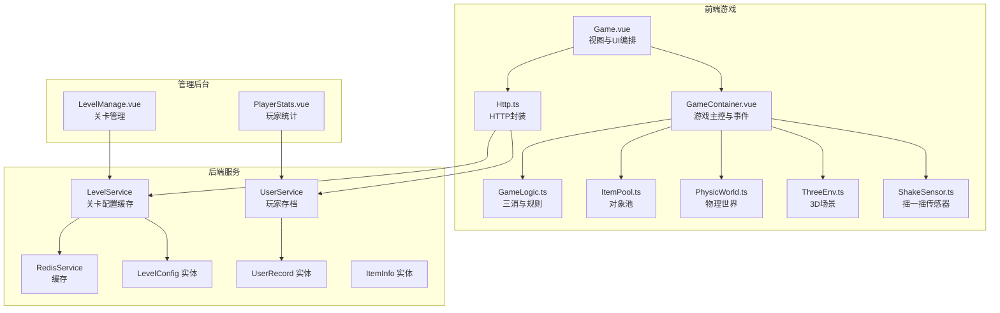
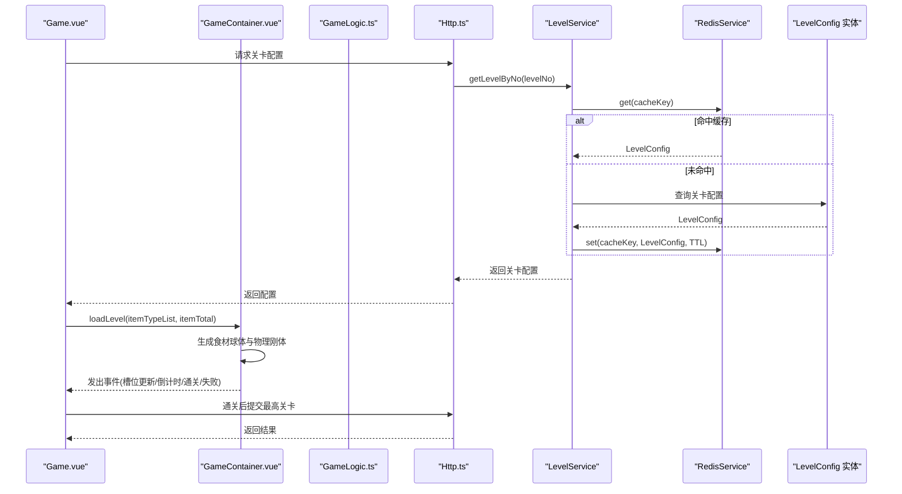
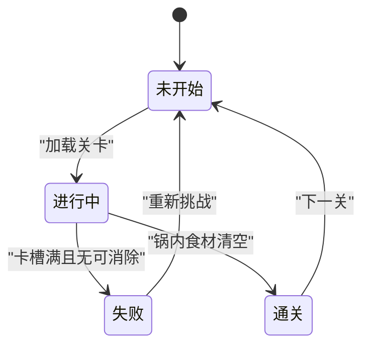
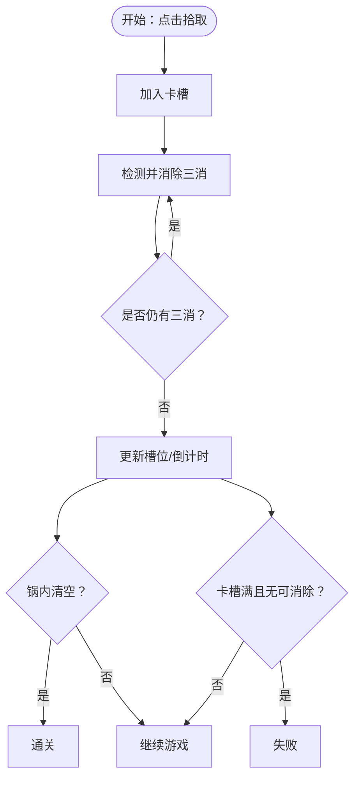
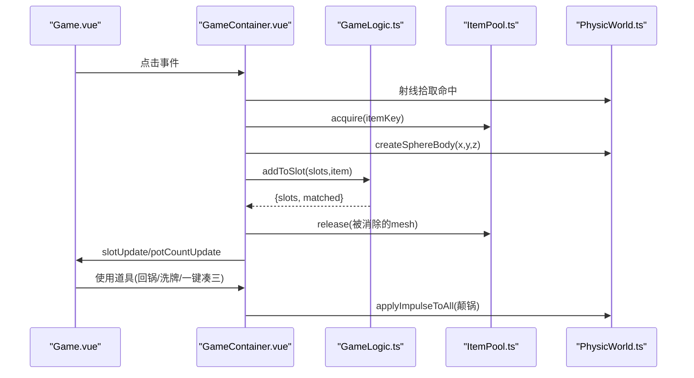
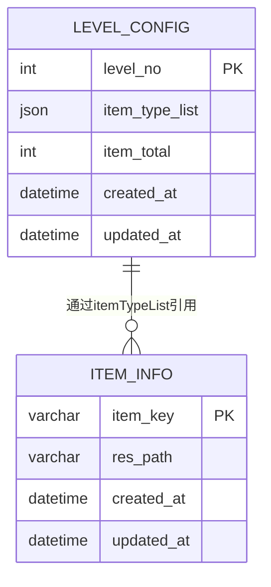
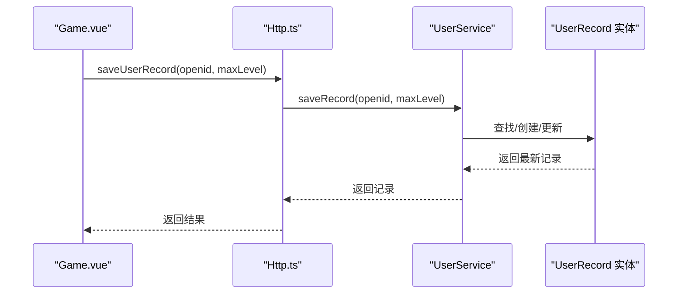
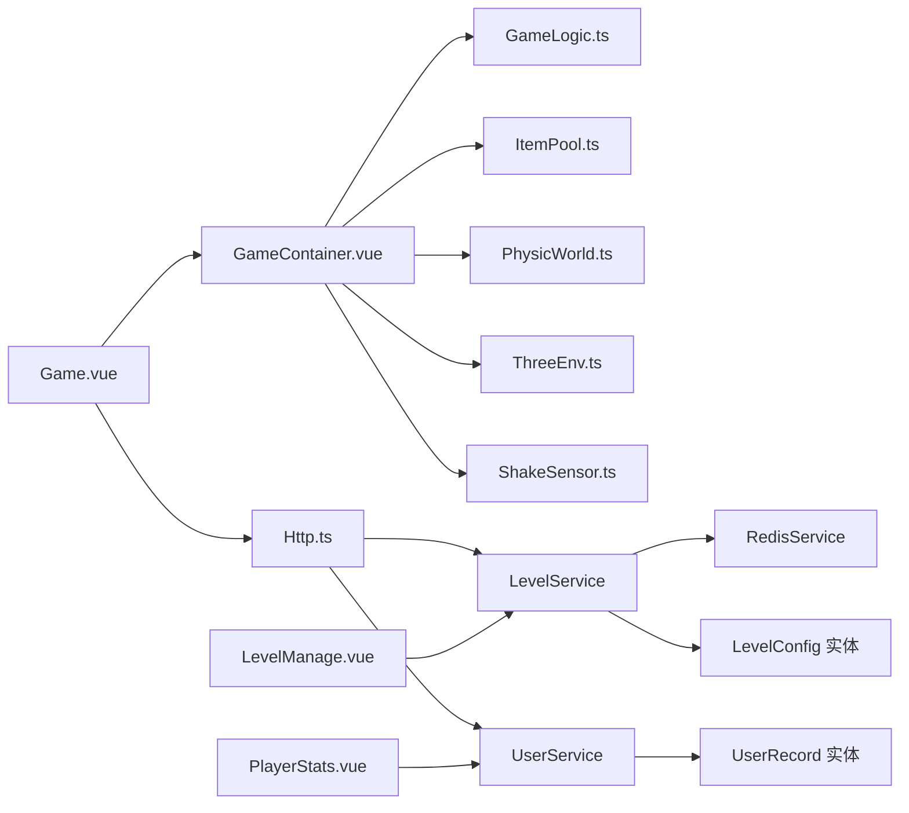

# 游戏核心逻辑

<cite>
**本文引用的文件**
- [Game.vue](file://game/src/views/Game.vue)
- [GameContainer.vue](file://game/src/components/GameContainer.vue)
- [GameLogic.ts](file://game/src/utils/GameLogic.ts)
- [ItemPool.ts](file://game/src/pool/ItemPool.ts)
- [PhysicWorld.ts](file://game/src/core/PhysicWorld.ts)
- [ThreeEnv.ts](file://game/src/core/ThreeEnv.ts)
- [ShakeSensor.ts](file://game/src/core/ShakeSensor.ts)
- [Http.ts](file://game/src/core/Http.ts)
- [level.service.ts](file://backend/src/modules/level/level.service.ts)
- [user.service.ts](file://backend/src/modules/user/user.service.ts)
- [redis.service.ts](file://backend/src/modules/redis/redis.service.ts)
- [level-config.entity.ts](file://backend/src/entities/level-config.entity.ts)
- [user-record.entity.ts](file://backend/src/entities/user-record.entity.ts)
- [item-info.entity.ts](file://backend/src/entities/item-info.entity.ts)
- [LevelManage.vue](file://admin/src/views/LevelManage.vue)
- [PlayerStats.vue](file://admin/src/views/PlayerStats.vue)
- [init.sql](file://sql/init.sql)
</cite>

## 目录
1. [简介](#简介)
2. [项目结构](#项目结构)
3. [核心组件](#核心组件)
4. [架构总览](#架构总览)
5. [详细组件分析](#详细组件分析)
6. [依赖关系分析](#依赖关系分析)
7. [性能考量](#性能考量)
8. [故障排查指南](#故障排查指南)
9. [结论](#结论)
10. [附录](#附录)

## 简介
本文件面向游戏“摇一摇抓大鹅”的核心逻辑，系统化梳理游戏状态机设计、关卡管理、玩家行为控制、三消规则与道具系统、AI/敌人生成（本项目以物理交互为主）、事件触发与分支逻辑、平衡性与难度曲线设计建议、以及数据持久化与多设备同步方案。文档同时提供可视化图示，帮助非技术读者快速理解整体流程。

## 项目结构
该仓库采用前后端分离架构，前端游戏通过HTTP接口对接后端；后端基于NestJS，使用TypeORM进行数据库访问，并集成Redis作为缓存层；管理后台提供关卡与玩家数据的可视化维护能力。

图表来源
- [Game.vue:1-357](file://game/src/views/Game.vue#L1-L357)
- [GameContainer.vue:1-270](file://game/src/components/GameContainer.vue#L1-L270)
- [GameLogic.ts:1-133](file://game/src/utils/GameLogic.ts#L1-L133)
- [ItemPool.ts:1-92](file://game/src/pool/ItemPool.ts#L1-L92)
- [PhysicWorld.ts:1-110](file://game/src/core/PhysicWorld.ts#L1-L110)
- [ThreeEnv.ts:1-123](file://game/src/core/ThreeEnv.ts#L1-L123)
- [ShakeSensor.ts:1-89](file://game/src/core/ShakeSensor.ts#L1-L89)
- [Http.ts:1-36](file://game/src/core/Http.ts#L1-L36)
- [level.service.ts:1-34](file://backend/src/modules/level/level.service.ts#L1-L34)
- [user.service.ts:1-41](file://backend/src/modules/user/user.service.ts#L1-L41)
- [redis.service.ts:1-45](file://backend/src/modules/redis/redis.service.ts#L1-L45)
- [level-config.entity.ts:1-21](file://backend/src/entities/level-config.entity.ts#L1-L21)
- [user-record.entity.ts:1-18](file://backend/src/entities/user-record.entity.ts#L1-L18)
- [item-info.entity.ts:1-18](file://backend/src/entities/item-info.entity.ts#L1-L18)
- [LevelManage.vue:1-139](file://admin/src/views/LevelManage.vue#L1-L139)
- [PlayerStats.vue:1-39](file://admin/src/views/PlayerStats.vue#L1-L39)

章节来源
- [Game.vue:1-357](file://game/src/views/Game.vue#L1-L357)
- [GameContainer.vue:1-270](file://game/src/components/GameContainer.vue#L1-L270)
- [Http.ts:1-36](file://game/src/core/Http.ts#L1-L36)

## 核心组件
- 游戏状态机与事件流：由Game.vue驱动，负责关卡切换、对话框展示、道具使用与存档提交；GameContainer.vue承载核心交互，包括点击拾取、三消判定、道具使用、物理步进与坐标同步。
- 三消与规则引擎：GameLogic.ts提供卡槽三消、失败/通关判定、一键凑三与洗牌等规则函数。
- 对象池与渲染：ItemPool.ts复用Three.js球体Mesh，降低GC压力；ThreeEnv.ts构建场景、光照与渲染循环。
- 物理系统：PhysicWorld.ts封装CANNON物理世界，创建锅体碰撞体、食材刚体，提供每帧同步与颠锅冲量。
- 输入与交互：ShakeSensor.ts在微信小游戏环境监听摇一摇，网页调试提供模拟按钮；GameContainer.vue通过射线拾取实现点击交互。
- 关卡与存档：Http.ts封装API；LevelService结合Redis缓存关卡配置；UserService持久化玩家最高通关关卡；管理后台提供关卡与玩家数据维护。

章节来源
- [Game.vue:68-167](file://game/src/views/Game.vue#L68-L167)
- [GameContainer.vue:38-260](file://game/src/components/GameContainer.vue#L38-L260)
- [GameLogic.ts:8-133](file://game/src/utils/GameLogic.ts#L8-L133)
- [ItemPool.ts:17-92](file://game/src/pool/ItemPool.ts#L17-L92)
- [PhysicWorld.ts:7-110](file://game/src/core/PhysicWorld.ts#L7-L110)
- [ThreeEnv.ts:7-123](file://game/src/core/ThreeEnv.ts#L7-L123)
- [ShakeSensor.ts:5-89](file://game/src/core/ShakeSensor.ts#L5-L89)
- [Http.ts:23-35](file://game/src/core/Http.ts#L23-L35)
- [level.service.ts:9-34](file://backend/src/modules/level/level.service.ts#L9-L34)
- [user.service.ts:8-41](file://backend/src/modules/user/user.service.ts#L8-L41)

## 架构总览
游戏运行时序从加载关卡开始，前端请求关卡配置，后端优先从Redis缓存读取，未命中则查询数据库并写入缓存；随后前端创建3D场景与物理世界，生成食材球体并进入交互循环。玩家通过点击拾取、摇一摇颠锅、使用道具推进游戏；通关后提交最高关卡存档。

图表来源
- [Game.vue:84-94](file://game/src/views/Game.vue#L84-L94)
- [Http.ts:23-35](file://game/src/core/Http.ts#L23-L35)
- [level.service.ts:16-32](file://backend/src/modules/level/level.service.ts#L16-L32)
- [redis.service.ts:21-33](file://backend/src/modules/redis/redis.service.ts#L21-L33)
- [level-config.entity.ts:4-20](file://backend/src/entities/level-config.entity.ts#L4-L20)

## 详细组件分析

### 游戏状态机与事件流
- 状态节点：未开始、进行中、失败、通关。
- 转换条件：点击拾取触发三消判定；卡槽满且无可消除则失败；锅内食材清空则通关；摇一摇触发颠锅。
- 事件发射：槽位更新、倒计时、通关、失败；UI根据事件显示对话框与下一步动作。

图表来源
- [GameContainer.vue:157-165](file://game/src/components/GameContainer.vue#L157-L165)
- [Game.vue:107-120](file://game/src/views/Game.vue#L107-L120)

章节来源
- [Game.vue:68-167](file://game/src/views/Game.vue#L68-L167)
- [GameContainer.vue:38-166](file://game/src/components/GameContainer.vue#L38-L166)

### 三消算法与规则实现
- 卡槽容量：默认7格；超过容量且无可消除则失败。
- 三消检测：从左至右扫描，连续三个相同itemKey即消除，消除后可能产生新的三消，循环检测直至稳定。
- 一键凑三：优先寻找已有2个的itemKey补1个；否则随机生成3个相同itemKey。
- 洗牌：随机重置锅内食材位置，保持物理刚体与Mesh的绑定。

图表来源
- [GameLogic.ts:21-89](file://game/src/utils/GameLogic.ts#L21-L89)
- [GameContainer.vue:134-165](file://game/src/components/GameContainer.vue#L134-L165)

章节来源
- [GameLogic.ts:8-133](file://game/src/utils/GameLogic.ts#L8-L133)
- [GameContainer.vue:105-166](file://game/src/components/GameContainer.vue#L105-L166)

### 玩家行为控制与交互
- 射线拾取：点击屏幕触发Raycaster，命中活跃食材后从锅内移除并加入卡槽，触发三消检测与对象池回收。
- 道具系统：
  - 回锅：选中卡槽物品，丢回锅内并重建物理刚体。
  - 全局洗牌：移除旧物理体，随机重置位置并重建刚体。
  - 一键凑三：按策略生成一组可三消食材，直接丢入锅内。
- 摇一摇：颠锅效果对所有食材施加瞬时冲量，改变堆叠状态。

图表来源
- [GameContainer.vue:105-232](file://game/src/components/GameContainer.vue#L105-L232)
- [GameLogic.ts:21-116](file://game/src/utils/GameLogic.ts#L21-L116)
- [ItemPool.ts:42-76](file://game/src/pool/ItemPool.ts#L42-L76)
- [PhysicWorld.ts:98-103](file://game/src/core/PhysicWorld.ts#L98-L103)

章节来源
- [GameContainer.vue:105-232](file://game/src/components/GameContainer.vue#L105-L232)
- [ItemPool.ts:17-92](file://game/src/pool/ItemPool.ts#L17-L92)
- [PhysicWorld.ts:7-110](file://game/src/core/PhysicWorld.ts#L7-L110)

### 关卡管理与配置
- 关卡配置：levelNo、itemTypeList（食材类型数组）、itemTotal（本关总数）。
- 缓存策略：LevelService优先从Redis读取，未命中查询数据库并写入缓存（TTL 24h）。
- 管理后台：LevelManage.vue支持新增/编辑/删除关卡，选择食材类型并分页查看。

图表来源
- [level-config.entity.ts:4-20](file://backend/src/entities/level-config.entity.ts#L4-L20)
- [item-info.entity.ts:3-17](file://backend/src/entities/item-info.entity.ts#L3-L17)
- [init.sql:7-33](file://sql/init.sql#L7-L33)

章节来源
- [level.service.ts:9-34](file://backend/src/modules/level/level.service.ts#L9-L34)
- [LevelManage.vue:62-139](file://admin/src/views/LevelManage.vue#L62-L139)
- [init.sql:35-47](file://sql/init.sql#L35-L47)

### 玩家存档与进度保存
- 存档字段：openid（微信唯一标识）、maxLevel（最高通关关卡）。
- 更新策略：若新关卡更高则更新；不存在则新建记录。
- 前端提交：Game.vue在通关后调用saveUserRecord提交最高关卡。

图表来源
- [Game.vue:112-120](file://game/src/views/Game.vue#L112-L120)
- [Http.ts:31-33](file://game/src/core/Http.ts#L31-L33)
- [user.service.ts:14-29](file://backend/src/modules/user/user.service.ts#L14-L29)
- [user-record.entity.ts:4-17](file://backend/src/entities/user-record.entity.ts#L4-L17)

章节来源
- [Game.vue:112-120](file://game/src/views/Game.vue#L112-L120)
- [user.service.ts:8-41](file://backend/src/modules/user/user.service.ts#L8-L41)

### AI/敌人生成与物理交互
- 敌人/障碍物：本项目未实现传统AI对手或敌人生成；玩法以物理交互为主，通过颠锅、洗牌等机制改变食材堆叠状态，间接影响可消除组合。
- 物理世界：创建漏斗型锅体碰撞体（底部+四壁），食材为可堆叠球体刚体，重力与阻尼参数保证稳定堆叠与自然落体。

章节来源
- [PhysicWorld.ts:28-55](file://game/src/core/PhysicWorld.ts#L28-L55)
- [ThreeEnv.ts:55-89](file://game/src/core/ThreeEnv.ts#L55-L89)

### 道具系统设计
- 回锅：将卡槽物品丢回锅内，重建物理刚体并恢复Mesh可见状态。
- 全局洗牌：移除旧刚体，随机重置位置并重建刚体。
- 一键凑三：优先补足已有2个的itemKey，否则随机生成3个相同itemKey。

章节来源
- [GameContainer.vue:179-232](file://game/src/components/GameContainer.vue#L179-L232)
- [GameLogic.ts:96-116](file://game/src/utils/GameLogic.ts#L96-L116)

### 数据持久化与多设备同步
- 关卡配置：Redis缓存24h，降低数据库压力，提升响应速度。
- 玩家存档：按openid区分记录，仅在新高时更新，避免频繁写入。
- 多设备同步：当前未实现跨设备账号登录与存档合并；建议引入统一登录体系与云端存档服务。

章节来源
- [level.service.ts:16-32](file://backend/src/modules/level/level.service.ts#L16-L32)
- [user.service.ts:14-29](file://backend/src/modules/user/user.service.ts#L14-L29)
- [redis.service.ts:21-33](file://backend/src/modules/redis/redis.service.ts#L21-L33)

## 依赖关系分析
- 前端耦合：Game.vue依赖GameContainer.vue与Http.ts；GameContainer.vue依赖GameLogic.ts、ItemPool.ts、PhysicWorld.ts、ThreeEnv.ts、ShakeSensor.ts。
- 后端耦合：LevelService依赖LevelConfig实体与RedisService；UserService依赖UserRecord实体；管理后台依赖LevelService与UserService。
- 外部依赖：Three.js/CANNON/WebGL、Axios、Element Plus、ioredis。

图表来源
- [Game.vue:68-167](file://game/src/views/Game.vue#L68-L167)
- [GameContainer.vue:1-270](file://game/src/components/GameContainer.vue#L1-L270)
- [Http.ts:1-36](file://game/src/core/Http.ts#L1-L36)
- [level.service.ts:1-34](file://backend/src/modules/level/level.service.ts#L1-L34)
- [user.service.ts:1-41](file://backend/src/modules/user/user.service.ts#L1-L41)
- [redis.service.ts:1-45](file://backend/src/modules/redis/redis.service.ts#L1-L45)
- [level-config.entity.ts:1-21](file://backend/src/entities/level-config.entity.ts#L1-L21)
- [user-record.entity.ts:1-18](file://backend/src/entities/user-record.entity.ts#L1-L18)
- [LevelManage.vue:1-139](file://admin/src/views/LevelManage.vue#L1-L139)
- [PlayerStats.vue:1-39](file://admin/src/views/PlayerStats.vue#L1-L39)

章节来源
- [Game.vue:68-167](file://game/src/views/Game.vue#L68-L167)
- [GameContainer.vue:1-270](file://game/src/components/GameContainer.vue#L1-L270)
- [Http.ts:1-36](file://game/src/core/Http.ts#L1-L36)

## 性能考量
- 对象池：ItemPool.ts复用几何体与材质，显著降低GC频率与内存占用。
- 物理步进：每帧固定步长，同步物理坐标到渲染模型，避免视觉滞后。
- 缓存策略：LevelService对关卡配置做24h缓存，减少数据库查询。
- 渲染优化：ThreeEnv.ts限制像素比上限，窗口自适应，合理光源配置。
- 建议：进一步优化射线拾取命中集、减少不必要的物理体重建；在道具使用后批量更新而非逐个applyImpulse。

## 故障排查指南
- 关卡加载失败：检查Http.ts的getLevelConfig调用与后端路由；确认LevelService缓存键与LevelConfig实体字段一致。
- 三消异常：核对GameLogic.ts的checkAndRemoveTriples扫描逻辑与匹配条件。
- 道具无效：确认GameContainer.vue中useReturnToPot/useShuffle/useMakeTriple的调用链与参数传递。
- 摇一摇无响应：检查ShakeSensor.ts在微信环境下的加速度监听与防抖阈值；网页调试使用simulateShake验证回调链路。
- 存档未更新：确认Game.vue在通关后调用saveUserRecord，后端UserService仅在maxLevel更高时更新。

章节来源
- [Http.ts:23-35](file://game/src/core/Http.ts#L23-L35)
- [level.service.ts:16-32](file://backend/src/modules/level/level.service.ts#L16-L32)
- [GameLogic.ts:42-82](file://game/src/utils/GameLogic.ts#L42-L82)
- [GameContainer.vue:179-232](file://game/src/components/GameContainer.vue#L179-L232)
- [ShakeSensor.ts:25-81](file://game/src/core/ShakeSensor.ts#L25-L81)
- [user.service.ts:14-29](file://backend/src/modules/user/user.service.ts#L14-L29)

## 结论
本项目以三消为核心玩法，结合物理交互与道具系统，形成清晰的状态机与事件流。前端通过对象池与物理系统保证流畅体验，后端以Redis缓存与简洁的存档策略支撑运营与扩展。后续可在AI/敌人生成、难度曲线、多设备同步与用户画像方面持续优化，以提升长期留存与可玩性。

## 附录
- 数据库初始化脚本包含关卡配置、玩家存档与食材资源表结构与示例数据。
- 管理后台提供关卡配置与玩家统计数据的可视化维护入口。

章节来源
- [init.sql:1-48](file://sql/init.sql#L1-L48)
- [LevelManage.vue:1-139](file://admin/src/views/LevelManage.vue#L1-L139)
- [PlayerStats.vue:1-39](file://admin/src/views/PlayerStats.vue#L1-L39)