# 物品池系统

<cite>
**本文档引用的文件**
- [ItemPool.ts](file://game/src/pool/ItemPool.ts)
- [GameContainer.vue](file://game/src/components/GameContainer.vue)
- [GameLogic.ts](file://game/src/utils/GameLogic.ts)
- [ThreeEnv.ts](file://game/src/core/ThreeEnv.ts)
- [PhysicWorld.ts](file://game/src/core/PhysicWorld.ts)
- [ItemManage.vue](file://admin/src/views/ItemManage.vue)
- [item.service.ts](file://backend/src/modules/item/item.service.ts)
- [item-info.entity.ts](file://backend/src/entities/item-info.entity.ts)
- [index.ts](file://admin/src/api/index.ts)
</cite>

## 目录
1. [简介](#简介)
2. [项目结构](#项目结构)
3. [核心组件](#核心组件)
4. [架构概览](#架构概览)
5. [详细组件分析](#详细组件分析)
6. [依赖关系分析](#依赖关系分析)
7. [性能考虑](#性能考虑)
8. [故障排除指南](#故障排除指南)
9. [结论](#结论)
10. [附录](#附录)

## 简介

物品池系统是本项目中的核心性能优化组件，采用经典的对象池设计模式来管理游戏中的食材对象。该系统通过内存复用策略显著减少了JavaScript垃圾回收的压力，实现了流畅的游戏体验。

系统主要包含以下特性：
- **对象池设计模式**：通过预分配和复用对象来避免频繁的内存分配
- **内存复用策略**：共享几何体和材质，最大化内存使用效率
- **垃圾回收优化**：减少GC触发频率，提升运行时性能
- **动态扩容机制**：根据需求动态创建新对象
- **生命周期管理**：完整的对象激活/释放状态跟踪
- **多线程安全**：在WebGL渲染管线中确保线程安全

## 项目结构

项目采用前后端分离架构，物品池系统位于前端游戏模块中：

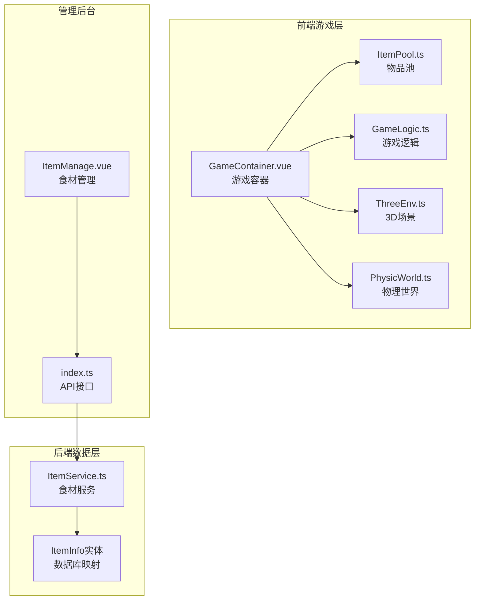

**图表来源**
- [GameContainer.vue:1-270](file://game/src/components/GameContainer.vue#L1-L270)
- [ItemPool.ts:1-92](file://game/src/pool/ItemPool.ts#L1-L92)
- [ItemManage.vue:1-96](file://admin/src/views/ItemManage.vue#L1-L96)

**章节来源**
- [GameContainer.vue:1-270](file://game/src/components/GameContainer.vue#L1-L270)
- [ItemPool.ts:1-92](file://game/src/pool/ItemPool.ts#L1-L92)

## 核心组件

### 物品池类 (ItemPool)

物品池是整个系统的核心组件，负责管理食材对象的生命周期：

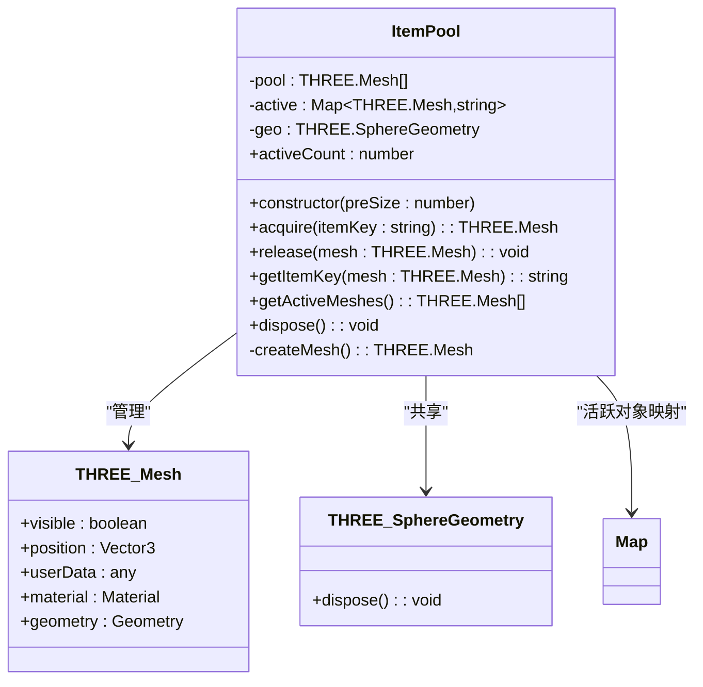

**图表来源**
- [ItemPool.ts:17-92](file://game/src/pool/ItemPool.ts#L17-L92)

### 游戏容器组件 (GameContainer)

游戏容器负责协调各个子系统的工作：

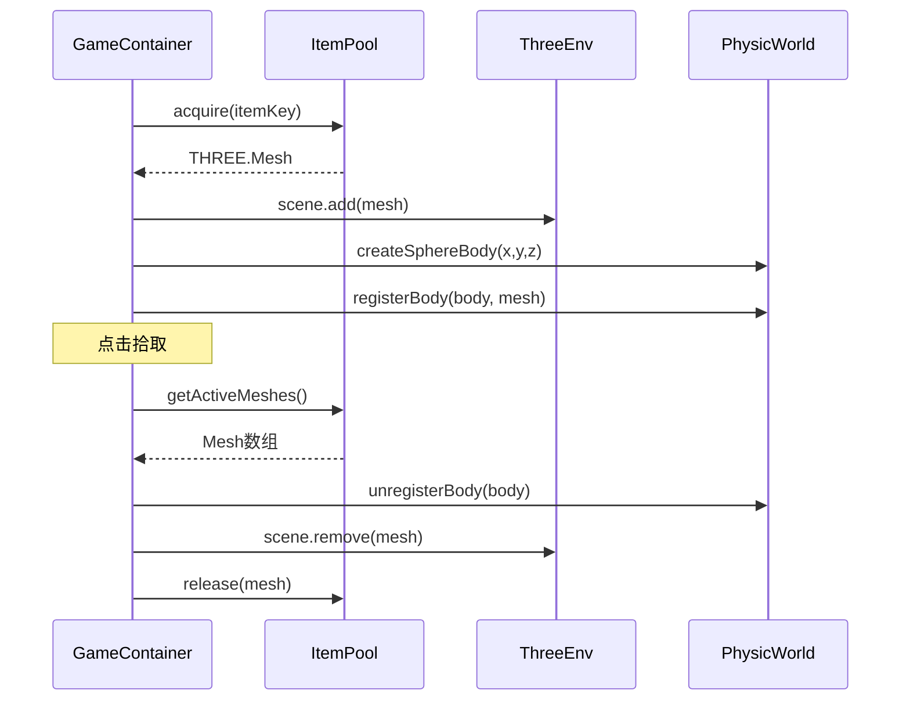

**图表来源**
- [GameContainer.vue:88-166](file://game/src/components/GameContainer.vue#L88-L166)
- [ItemPool.ts:42-66](file://game/src/pool/ItemPool.ts#L42-L66)

**章节来源**
- [ItemPool.ts:17-92](file://game/src/pool/ItemPool.ts#L17-L92)
- [GameContainer.vue:1-270](file://game/src/components/GameContainer.vue#L1-L270)

## 架构概览

物品池系统在整个游戏架构中扮演着关键角色，连接了渲染层、物理层和业务逻辑层：

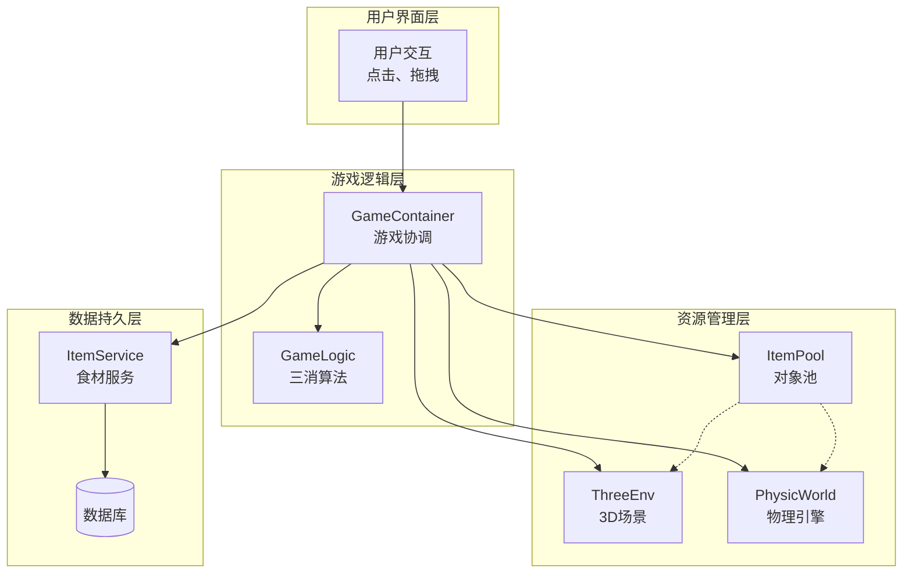

**图表来源**
- [GameContainer.vue:1-270](file://game/src/components/GameContainer.vue#L1-L270)
- [GameLogic.ts:1-133](file://game/src/utils/GameLogic.ts#L1-L133)
- [item.service.ts:1-35](file://backend/src/modules/item/item.service.ts#L1-L35)

## 详细组件分析

### 物品池实现详解

#### 预分配机制

物品池在构造函数中执行预分配策略：

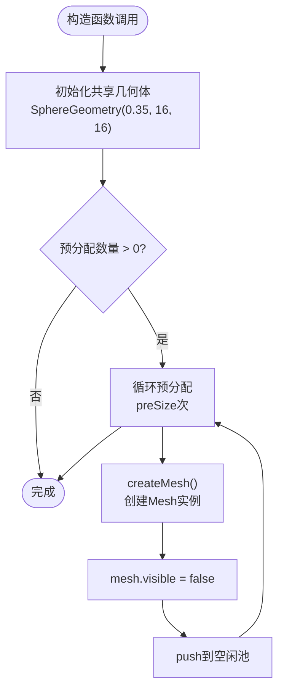

**图表来源**
- [ItemPool.ts:22-32](file://game/src/pool/ItemPool.ts#L22-L32)

#### 动态扩容策略

当空闲池耗尽时，系统会动态创建新对象：

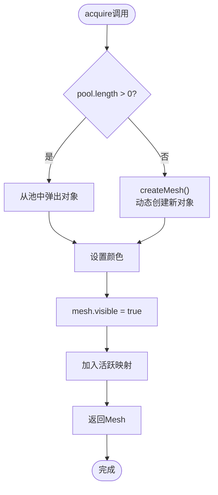

**图表来源**
- [ItemPool.ts:42-58](file://game/src/pool/ItemPool.ts#L42-L58)

#### 生命周期管理

物品池维护完整的生命周期状态：

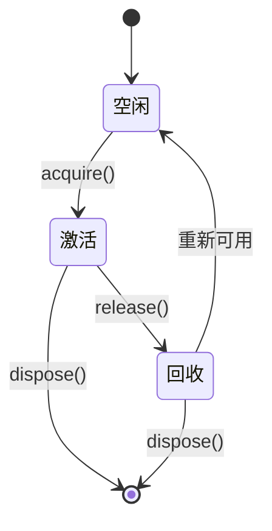

**图表来源**
- [ItemPool.ts:42-90](file://game/src/pool/ItemPool.ts#L42-L90)

### 内存复用策略

#### 几何体共享

系统采用共享几何体策略来减少内存占用：

| 组件 | 类型 | 共享方式 | 内存优势 |
|------|------|----------|----------|
| SphereGeometry | 几何体 | 单例共享 | 每个对象节省几何体内存 |
| MeshStandardMaterial | 材质 | 每个对象独立 | 颜色可变，材质属性独立 |
| 颜色映射表 | 对象 | 预分配 | 快速颜色查找 |

#### 材质管理

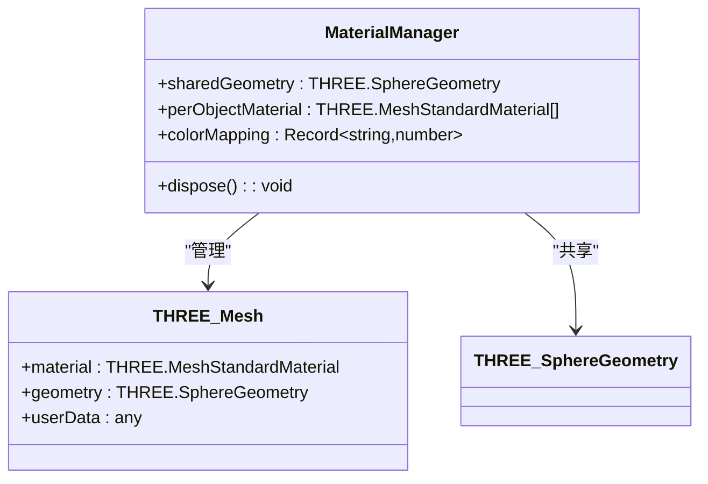

**图表来源**
- [ItemPool.ts:3-10](file://game/src/pool/ItemPool.ts#L3-L10)
- [ItemPool.ts:20](file://game/src/pool/ItemPool.ts#L20)

**章节来源**
- [ItemPool.ts:1-92](file://game/src/pool/ItemPool.ts#L1-L92)

### 游戏集成分析

#### 三消算法集成

物品池与三消算法的协作流程：

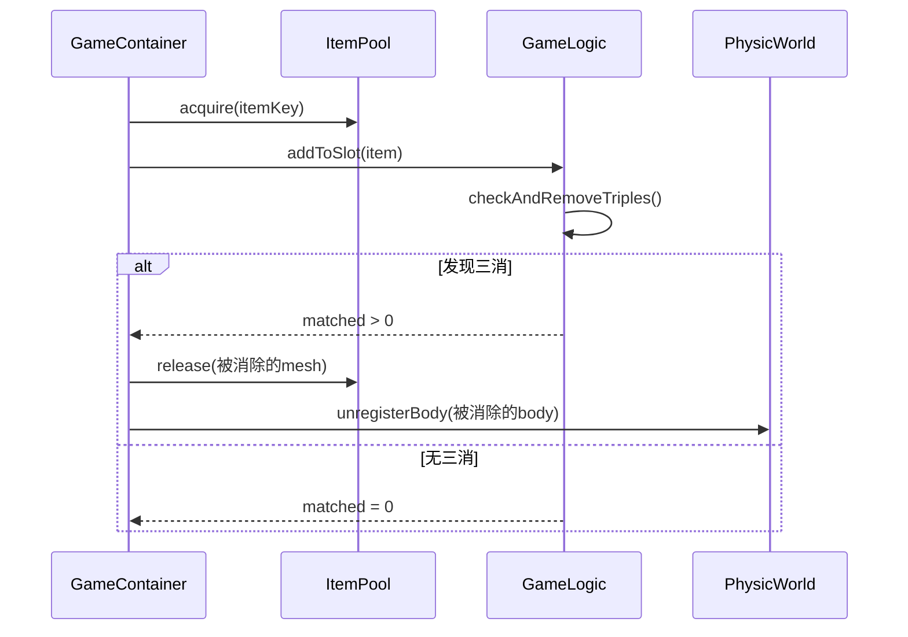

**图表来源**
- [GameContainer.vue:142-151](file://game/src/components/GameContainer.vue#L142-L151)
- [GameLogic.ts:21-35](file://game/src/utils/GameLogic.ts#L21-L35)

#### 物理系统集成

物品池与物理系统的协同工作：

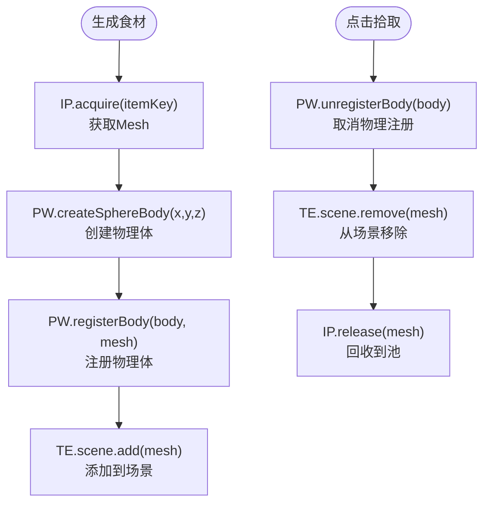

**图表来源**
- [GameContainer.vue:88-103](file://game/src/components/GameContainer.vue#L88-L103)
- [GameContainer.vue:130-133](file://game/src/components/GameContainer.vue#L130-L133)

**章节来源**
- [GameContainer.vue:1-270](file://game/src/components/GameContainer.vue#L1-L270)
- [GameLogic.ts:1-133](file://game/src/utils/GameLogic.ts#L1-L133)

## 依赖关系分析

### 外部依赖

物品池系统依赖于多个第三方库：

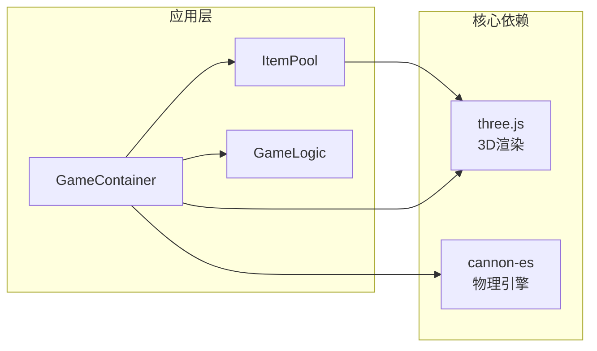

**图表来源**
- [ItemPool.ts:1](file://game/src/pool/ItemPool.ts#L1)
- [GameContainer.vue:7-13](file://game/src/components/GameContainer.vue#L7-L13)

### 内部依赖关系

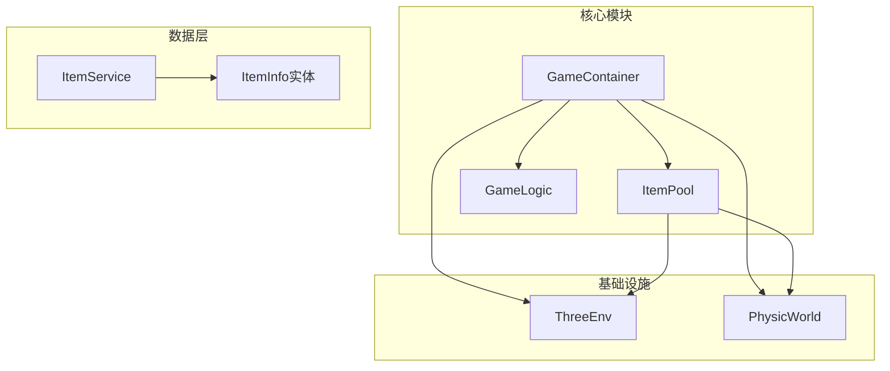

**图表来源**
- [GameContainer.vue:1-270](file://game/src/components/GameContainer.vue#L1-L270)
- [item.service.ts:1-35](file://backend/src/modules/item/item.service.ts#L1-L35)

**章节来源**
- [ItemPool.ts:1-92](file://game/src/pool/ItemPool.ts#L1-L92)
- [GameContainer.vue:1-270](file://game/src/components/GameContainer.vue#L1-L270)

## 性能考虑

### 内存使用统计

物品池系统提供了多种性能监控指标：

| 指标名称 | 计算方式 | 用途 |
|----------|----------|------|
| 活跃对象数 | activeCount | 监控当前使用中的对象数量 |
| 池容量 | pool.length | 监控空闲池大小 |
| 几何体共享率 | sharedGeometry/total | 评估内存复用效果 |
| 材质复用率 | sharedMaterials/total | 评估材质内存优化 |

### 垃圾回收优化

系统通过以下策略减少GC压力：

1. **预分配策略**：在游戏开始时创建固定数量的对象
2. **动态扩容限制**：避免频繁的动态创建
3. **对象复用**：重用现有对象而非创建新对象
4. **手动内存管理**：提供显式的dispose方法

### 性能监控建议

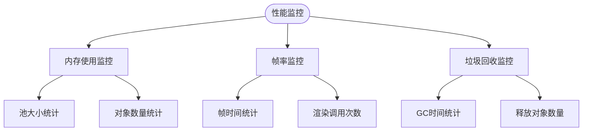

## 故障排除指南

### 常见问题及解决方案

#### 对象泄漏问题

**症状**：内存持续增长，对象池无法正常回收

**诊断步骤**：
1. 检查active映射中是否有未清理的对象
2. 验证release方法是否被正确调用
3. 确认dispose方法是否在组件卸载时调用

**解决方案**：
```typescript
// 确保在组件卸载时调用dispose
onUnmounted(() => {
  itemPool?.dispose();
});
```

#### 颜色显示异常

**症状**：食材颜色不正确或闪烁

**诊断步骤**：
1. 检查ITEM_COLORS映射表是否包含正确的颜色值
2. 验证材质颜色设置逻辑
3. 确认颜色缓存机制

**解决方案**：
```typescript
// 使用安全的颜色获取方式
const color = ITEM_COLORS[itemKey] || 0xaaaaaa;
(mesh.material as THREE.MeshStandardMaterial).color.setHex(color);
```

#### 性能问题

**症状**：游戏运行缓慢，帧率下降

**诊断步骤**：
1. 监控活跃对象数量是否过高
2. 检查池扩容频率
3. 分析渲染调用次数

**优化建议**：
1. 调整预分配数量
2. 实施池大小上限
3. 优化对象回收时机

**章节来源**
- [ItemPool.ts:83-90](file://game/src/pool/ItemPool.ts#L83-L90)
- [GameContainer.vue:66-70](file://game/src/components/GameContainer.vue#L66-L70)

## 结论

物品池系统通过精心设计的对象池模式和内存复用策略，成功解决了游戏中的性能瓶颈问题。系统的主要优势包括：

1. **高效的内存管理**：通过几何体共享和材质复用，显著减少了内存占用
2. **稳定的性能表现**：预分配和动态扩容机制确保了运行时的稳定性
3. **清晰的生命周期管理**：完整的激活/释放状态跟踪便于维护
4. **良好的扩展性**：支持自定义物品类型和配置参数

该系统为类似的游戏开发项目提供了优秀的参考模板，展示了如何在Web环境中实现高性能的对象管理。

## 附录

### 配置参数说明

| 参数名 | 类型 | 默认值 | 描述 |
|--------|------|--------|------|
| preSize | number | 20 | 预分配对象数量 |
| geometryRadius | number | 0.35 | 球体几何半径 |
| geometryWidthSegments | number | 16 | 几何体宽度分段数 |
| geometryHeightSegments | number | 16 | 几何体高度分段数 |
| roughness | number | 0.4 | 材质粗糙度 |
| metalness | number | 0.1 | 材质金属度 |

### 扩展接口

系统支持以下扩展点：

1. **自定义几何体**：可以替换为其他类型的几何体
2. **材质定制**：支持不同的材质类型和属性
3. **颜色映射扩展**：可以添加新的颜色映射规则
4. **池大小管理**：支持动态调整池大小和扩容策略

### 自定义物品类型支持

要添加新的物品类型，需要：

1. 在ITEM_COLORS映射表中添加颜色定义
2. 在游戏逻辑中处理新的物品类型
3. 确保相应的资源文件可用
4. 测试物品的物理属性和视觉效果