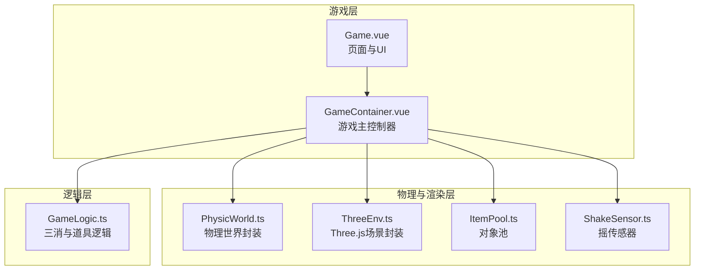
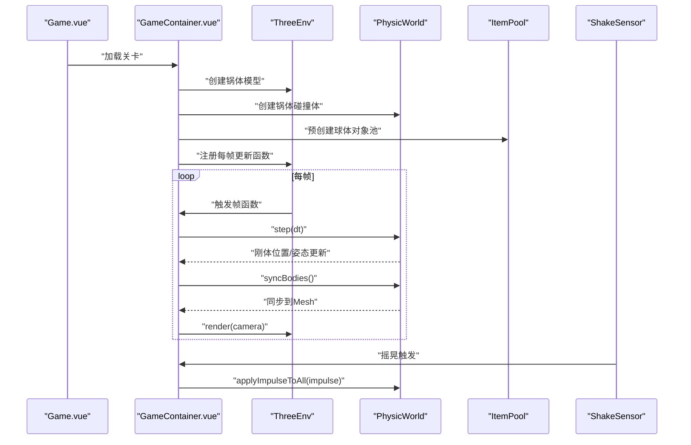
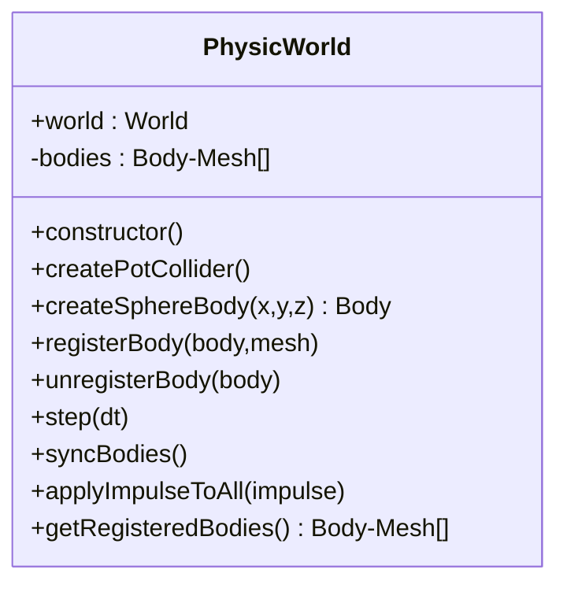
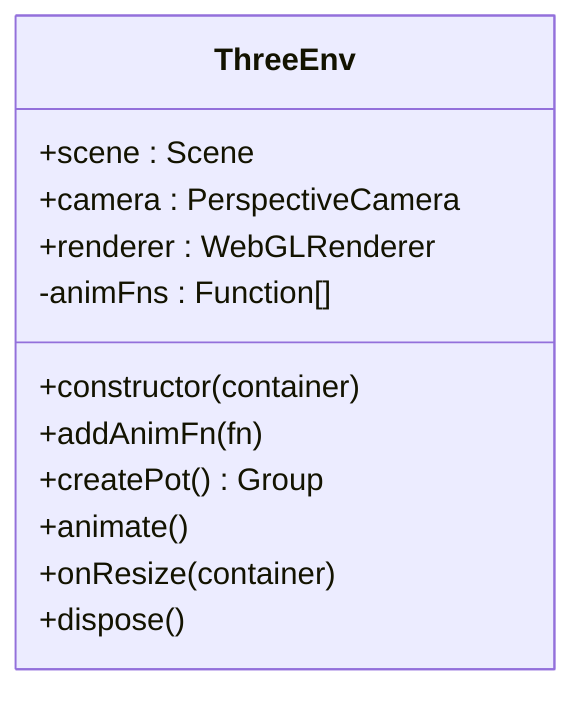
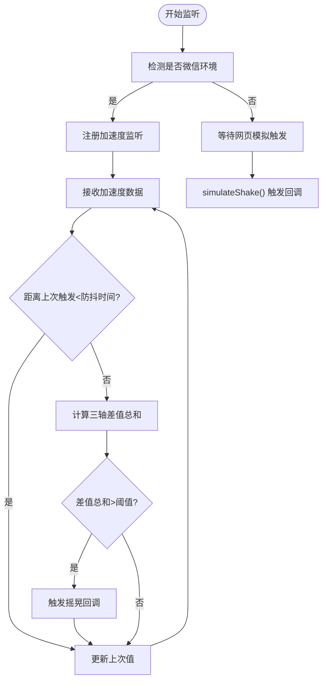
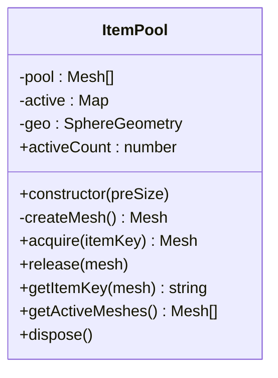
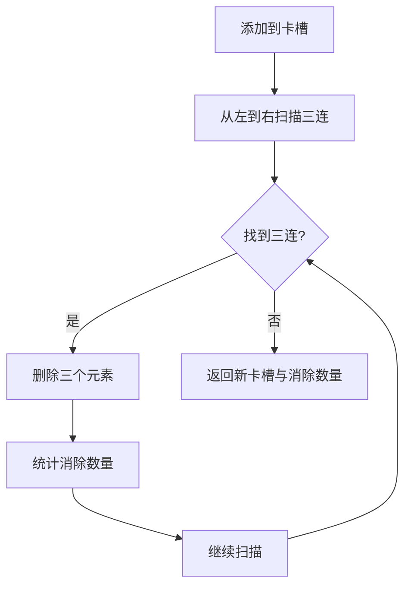
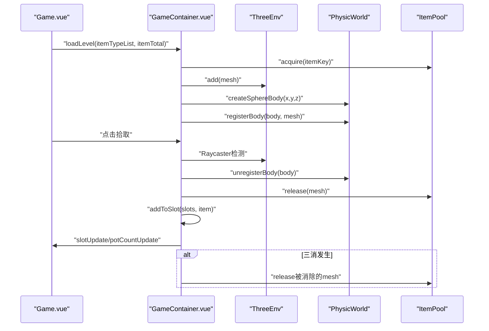
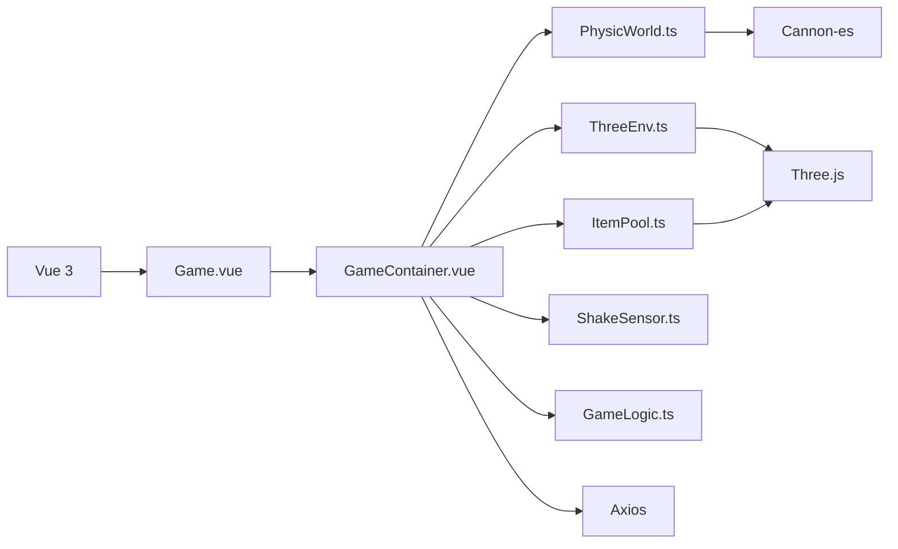

# 物理模拟系统

<cite>
**本文引用的文件**
- [PhysicWorld.ts](file://game/src/core/PhysicWorld.ts)
- [GameContainer.vue](file://game/src/components/GameContainer.vue)
- [ThreeEnv.ts](file://game/src/core/ThreeEnv.ts)
- [ShakeSensor.ts](file://game/src/core/ShakeSensor.ts)
- [ItemPool.ts](file://game/src/pool/ItemPool.ts)
- [GameLogic.ts](file://game/src/utils/GameLogic.ts)
- [Game.vue](file://game/src/views/Game.vue)
- [package.json](file://game/package.json)
- [vite.config.ts](file://game/vite.config.ts)
</cite>

## 目录
1. [简介](#简介)
2. [项目结构](#项目结构)
3. [核心组件](#核心组件)
4. [架构总览](#架构总览)
5. [详细组件分析](#详细组件分析)
6. [依赖关系分析](#依赖关系分析)
7. [性能考虑](#性能考虑)
8. [故障排查指南](#故障排查指南)
9. [结论](#结论)
10. [附录](#附录)

## 简介
本项目是一个基于 Vue 3 + Three.js + Cannon-es 的物理三消类小游戏。系统通过 Cannon-es 提供的刚体动力学与碰撞检测，结合 Three.js 的 3D 渲染，实现食材在漏斗锅内的物理交互、三消判定、道具系统以及移动端摇一摇颠锅效果。本文档围绕物理世界的构建、碰撞检测算法、刚体动力学计算、物理参数配置、重力与摩擦设置、碰撞形状定义、边界约束、物理材质属性、物理事件处理、冲量计算与能量守恒验证、物理调试与可视化、性能优化策略以及移动端与跨平台一致性进行系统化技术说明。

## 项目结构
游戏前端位于 game 目录，采用模块化组织：
- core：物理世界封装、3D场景封装、摇传感器封装
- pool：对象池，复用球体几何与网格，降低 GC 压力
- utils：游戏逻辑算法（三消判定、道具生成等）
- views：页面视图与路由入口
- 组件：GameContainer 负责游戏主流程与事件调度

图表来源
- [Game.vue:1-357](file://game/src/views/Game.vue#L1-L357)
- [GameContainer.vue:1-270](file://game/src/components/GameContainer.vue#L1-L270)
- [PhysicWorld.ts:1-110](file://game/src/core/PhysicWorld.ts#L1-L110)
- [ThreeEnv.ts:1-123](file://game/src/core/ThreeEnv.ts#L1-L123)
- [ItemPool.ts:1-92](file://game/src/pool/ItemPool.ts#L1-L92)
- [ShakeSensor.ts:1-89](file://game/src/core/ShakeSensor.ts#L1-L89)
- [GameLogic.ts:1-133](file://game/src/utils/GameLogic.ts#L1-L133)

章节来源
- [Game.vue:1-357](file://game/src/views/Game.vue#L1-L357)
- [GameContainer.vue:1-270](file://game/src/components/GameContainer.vue#L1-L270)
- [package.json:1-25](file://game/package.json#L1-L25)

## 核心组件
- 物理世界封装（PhysicWorld）：负责创建 Cannon-es 物理世界、设置重力、创建漏斗锅体碰撞体、创建球形食材刚体、注册/注销刚体与 Three.js Mesh 的同步、每帧物理步进与坐标同步、全局冲量应用。
- Three.js 场景封装（ThreeEnv）：负责场景、相机、光照、渲染器初始化，创建漏斗锅体模型，窗口自适应与渲染循环。
- 摇传感器（ShakeSensor）：在微信小游戏环境监听加速度，在网页调试模式提供模拟摇晃。
- 对象池（ItemPool）：复用球体几何与网格，降低频繁创建销毁带来的 GC 压力。
- 游戏逻辑（GameLogic）：三消算法、失败条件判断、道具生成与洗牌逻辑。
- 游戏容器（GameContainer）：协调物理、渲染、输入、道具与事件，驱动每帧更新与状态管理。

章节来源
- [PhysicWorld.ts:1-110](file://game/src/core/PhysicWorld.ts#L1-L110)
- [ThreeEnv.ts:1-123](file://game/src/core/ThreeEnv.ts#L1-L123)
- [ShakeSensor.ts:1-89](file://game/src/core/ShakeSensor.ts#L1-L89)
- [ItemPool.ts:1-92](file://game/src/pool/ItemPool.ts#L1-L92)
- [GameLogic.ts:1-133](file://game/src/utils/GameLogic.ts#L1-L133)
- [GameContainer.vue:1-270](file://game/src/components/GameContainer.vue#L1-L270)

## 架构总览
系统采用“渲染循环 + 物理步进”的双线程模式：Three.js 的渲染循环负责画面更新；GameContainer 注册的动画函数在每帧调用 PhysicWorld.step 与同步坐标，确保物理与渲染一致。

图表来源
- [GameContainer.vue:38-64](file://game/src/components/GameContainer.vue#L38-L64)
- [GameContainer.vue:51-57](file://game/src/components/GameContainer.vue#L51-L57)
- [PhysicWorld.ts:85-96](file://game/src/core/PhysicWorld.ts#L85-L96)
- [ThreeEnv.ts:91-97](file://game/src/core/ThreeEnv.ts#L91-L97)
- [ShakeSensor.ts:25-31](file://game/src/core/ShakeSensor.ts#L25-L31)

## 详细组件分析

### 物理世界封装（PhysicWorld）
- 物理世界创建与参数
  - 重力设置：垂直向下的重力，略大于真实值以增强食材堆叠的自然感。
  - 碰撞求解器：使用 GSSolver，默认迭代次数可调，影响碰撞稳定度与性能。
  - 接触材料：默认材料与接触材料，包含摩擦与弹性系数，统一设置于世界。
- 碰撞体定义
  - 锅体：底部平面 + 四面倾斜侧壁，均使用静态刚体（质量为 0），组合形成漏斗型边界。
  - 食材：球形刚体，半径固定，质量为 1，具备线性/角阻尼，减少滑动与旋转惯性。
- 刚体管理
  - 注册/注销：将 Cannon Body 与 Three Mesh 关联，便于每帧同步位置与朝向。
  - 同步：遍历已注册对，复制位置与四元数到 Three Mesh。
- 冲量与事件
  - 全局冲量：对所有注册刚体施加瞬时冲量，实现颠锅效果。
  - 步进：固定时间步长推进物理世界。

图表来源
- [PhysicWorld.ts:7-109](file://game/src/core/PhysicWorld.ts#L7-L109)

章节来源
- [PhysicWorld.ts:11-26](file://game/src/core/PhysicWorld.ts#L11-L26)
- [PhysicWorld.ts:28-55](file://game/src/core/PhysicWorld.ts#L28-L55)
- [PhysicWorld.ts:57-69](file://game/src/core/PhysicWorld.ts#L57-L69)
- [PhysicWorld.ts:71-83](file://game/src/core/PhysicWorld.ts#L71-L83)
- [PhysicWorld.ts:85-96](file://game/src/core/PhysicWorld.ts#L85-L96)
- [PhysicWorld.ts:98-103](file://game/src/core/PhysicWorld.ts#L98-L103)

### Three.js 场景封装（ThreeEnv）
- 场景与相机：场景背景色、透视相机从上方俯视场景。
- 光照：方向光与环境光，开启阴影提升视觉真实感。
- 渲染器：抗锯齿、像素比限制、阴影贴图。
- 锅体模型：圆柱外壁、圆形底面与装饰环组成漏斗型锅体。
- 动画循环：注册帧函数列表，逐帧执行并渲染。

图表来源
- [ThreeEnv.ts:7-122](file://game/src/core/ThreeEnv.ts#L7-L122)

章节来源
- [ThreeEnv.ts:13-48](file://game/src/core/ThreeEnv.ts#L13-L48)
- [ThreeEnv.ts:55-89](file://game/src/core/ThreeEnv.ts#L55-L89)
- [ThreeEnv.ts:91-106](file://game/src/core/ThreeEnv.ts#L91-L106)
- [ThreeEnv.ts:108-122](file://game/src/core/ThreeEnv.ts#L108-L122)

### 摇传感器（ShakeSensor）
- 环境检测：识别微信小游戏环境，使用原生加速度接口。
- 数据处理：三轴差值累加，超过阈值触发回调，并加入防抖。
- 网页调试：提供模拟摇晃接口，便于在浏览器端测试颠锅效果。

图表来源
- [ShakeSensor.ts:15-87](file://game/src/core/ShakeSensor.ts#L15-L87)

章节来源
- [ShakeSensor.ts:15-38](file://game/src/core/ShakeSensor.ts#L15-L38)
- [ShakeSensor.ts:40-81](file://game/src/core/ShakeSensor.ts#L40-L81)
- [ShakeSensor.ts:83-87](file://game/src/core/ShakeSensor.ts#L83-L87)

### 对象池（ItemPool）
- 共享几何体：所有球体共享 SphereGeometry，降低内存占用。
- 预创建与扩容：构造时预创建一定数量，池空时动态创建。
- 复用策略：visible 控制可见性，userData 标记类型，active Map 记录 itemKey，回收时仅隐藏与复位位置。
- 资源释放：统一释放几何体与材质，避免内存泄漏。

图表来源
- [ItemPool.ts:17-91](file://game/src/pool/ItemPool.ts#L17-L91)

章节来源
- [ItemPool.ts:22-32](file://game/src/pool/ItemPool.ts#L22-L32)
- [ItemPool.ts:42-58](file://game/src/pool/ItemPool.ts#L42-L58)
- [ItemPool.ts:60-66](file://game/src/pool/ItemPool.ts#L60-L66)
- [ItemPool.ts:78-90](file://game/src/pool/ItemPool.ts#L78-L90)

### 游戏逻辑（GameLogic）
- 三消算法：从左到右扫描，连续三个相同 itemKey 即消除，消除后可能产生新的三消，循环检测直至无新增。
- 失败条件：卡槽满且无可消除组合。
- 通关条件：锅内食材清空。
- 道具：
  - 一键凑三：优先选择已有两个的 itemKey 补齐，否则随机生成三连。
  - 洗牌：随机重置锅内食材位置。
  - 回锅：将卡槽中选中的食材丢回锅内。

图表来源
- [GameLogic.ts:21-63](file://game/src/utils/GameLogic.ts#L21-L63)

章节来源
- [GameLogic.ts:21-35](file://game/src/utils/GameLogic.ts#L21-L35)
- [GameLogic.ts:42-63](file://game/src/utils/GameLogic.ts#L42-L63)
- [GameLogic.ts:68-82](file://game/src/utils/GameLogic.ts#L68-L82)
- [GameLogic.ts:87-89](file://game/src/utils/GameLogic.ts#L87-L89)
- [GameLogic.ts:96-116](file://game/src/utils/GameLogic.ts#L96-L116)
- [GameLogic.ts:122-132](file://game/src/utils/GameLogic.ts#L122-L132)

### 游戏容器（GameContainer）
- 生命周期：初始化 ThreeEnv、PhysicWorld、ShakeSensor、ItemPool；创建锅体模型与碰撞体；注册每帧物理步进与同步。
- 输入与交互：鼠标点击拾取食材，Raycaster 仅检测活跃 Mesh；拾取后从锅内移除并加入卡槽，触发三消判定与状态更新。
- 道具系统：回锅、洗牌、一键凑三；颠锅通过摇传感器触发全局冲量。
- 状态管理：游戏失败与通关事件，向父组件 Game.vue 发出通知。

图表来源
- [GameContainer.vue:72-85](file://game/src/components/GameContainer.vue#L72-L85)
- [GameContainer.vue:87-103](file://game/src/components/GameContainer.vue#L87-L103)
- [GameContainer.vue:105-166](file://game/src/components/GameContainer.vue#L105-L166)
- [GameContainer.vue:179-202](file://game/src/components/GameContainer.vue#L179-L202)
- [GameContainer.vue:204-224](file://game/src/components/GameContainer.vue#L204-L224)
- [GameContainer.vue:226-232](file://game/src/components/GameContainer.vue#L226-L232)

章节来源
- [GameContainer.vue:38-64](file://game/src/components/GameContainer.vue#L38-L64)
- [GameContainer.vue:72-85](file://game/src/components/GameContainer.vue#L72-L85)
- [GameContainer.vue:105-166](file://game/src/components/GameContainer.vue#L105-L166)
- [GameContainer.vue:168-177](file://game/src/components/GameContainer.vue#L168-L177)
- [GameContainer.vue:179-202](file://game/src/components/GameContainer.vue#L179-L202)
- [GameContainer.vue:204-232](file://game/src/components/GameContainer.vue#L204-L232)

## 依赖关系分析
- 运行时依赖：Vue 3、Three.js、Cannon-es、Axios。
- 构建配置：Vite，开发服务器代理 /api 到后端服务，微信小游戏模式输出到 mini-game 目录。
- 模块耦合：
  - GameContainer 依赖 PhysicWorld、ThreeEnv、ItemPool、ShakeSensor、GameLogic。
  - PhysicWorld 依赖 Cannon-es；ThreeEnv 依赖 Three.js；ItemPool 依赖 Three.js；ShakeSensor 依赖微信环境 API 或模拟接口。
  - Game.vue 作为页面入口，协调 GameContainer 与后端接口。

图表来源
- [package.json:11-15](file://game/package.json#L11-L15)
- [vite.config.ts:4-21](file://game/vite.config.ts#L4-L21)

章节来源
- [package.json:11-23](file://game/package.json#L11-L23)
- [vite.config.ts:4-21](file://game/vite.config.ts#L4-L21)

## 性能考虑
- 对象池与几何体共享
  - 使用共享 SphereGeometry，避免重复创建几何体，降低内存与 GC 压力。
  - 对象池按需扩容，活跃对象通过 Map 记录 itemKey，回收时仅隐藏与复位，不销毁。
- 渲染与物理分离
  - 渲染循环独立于物理步进，通过注册帧函数在合适时机调用 step 与同步，避免耦合。
- 像素比与阴影
  - 渲染器像素比限制在较低值，兼顾性能与画质；开启阴影贴图提升真实感但会增加开销。
- 物理求解器迭代
  - 默认迭代次数可调，迭代越多越稳定但更耗时；根据场景复杂度权衡。
- 阻尼与稳定性
  - 线性/角阻尼有助于减少抖动与穿透，提高视觉稳定性。
- 移动端优化建议
  - 降低求解器迭代次数、减少活跃刚体数量、关闭不必要的阴影、降低渲染分辨率或使用更低的阴影质量。
  - 在微信小游戏环境下，利用原生加速度接口，避免高频事件导致主线程压力。
- 跨平台一致性
  - 通过 Vite 模式区分构建输出，确保微信小游戏与 Web 端行为一致；在网页端提供模拟摇晃按钮，保证功能可用性。

章节来源
- [ItemPool.ts:22-32](file://game/src/pool/ItemPool.ts#L22-L32)
- [ItemPool.ts:42-58](file://game/src/pool/ItemPool.ts#L42-L58)
- [ThreeEnv.ts:37-41](file://game/src/core/ThreeEnv.ts#L37-L41)
- [PhysicWorld.ts:16](file://game/src/core/PhysicWorld.ts#L16)
- [PhysicWorld.ts:64-66](file://game/src/core/PhysicWorld.ts#L64-L66)
- [vite.config.ts:16-20](file://game/vite.config.ts#L16-L20)

## 故障排查指南
- 物理世界未更新
  - 确认 ThreeEnv 中已注册帧函数并在每帧调用 PhysicWorld.step 与 syncBodies。
  - 检查 isPlaying 标志位，确保在游戏进行期间才执行物理步进。
- 食材无法拾取
  - 确认 Raycaster 仅检测活跃 Mesh，且拾取后正确从 PhysicWorld 注销刚体并回收到对象池。
  - 检查 Mesh userData 标记与拾取逻辑。
- 颠锅无效
  - 确认 ShakeSensor 已启动并触发回调；检查 applyImpulseToAll 是否被调用。
  - 网页端使用 simulateShake() 触发模拟摇晃。
- 三消不生效
  - 检查 addToSlot 与 checkAndRemoveTriples 的调用顺序与返回值；确认消除后对被移除的 Mesh 进行回收。
- 资源泄漏
  - 确保在组件卸载时调用 ThreeEnv.dispose 与 ItemPool.dispose，释放几何体与材质。
- 微信环境问题
  - 确认微信加速度接口已成功注册；失败时检查权限与回调。

章节来源
- [GameContainer.vue:51-57](file://game/src/components/GameContainer.vue#L51-L57)
- [GameContainer.vue:105-166](file://game/src/components/GameContainer.vue#L105-L166)
- [GameContainer.vue:168-177](file://game/src/components/GameContainer.vue#L168-L177)
- [PhysicWorld.ts:85-96](file://game/src/core/PhysicWorld.ts#L85-L96)
- [ItemPool.ts:60-66](file://game/src/pool/ItemPool.ts#L60-L66)
- [ThreeEnv.ts:108-122](file://game/src/core/ThreeEnv.ts#L108-L122)
- [ShakeSensor.ts:25-38](file://game/src/core/ShakeSensor.ts#L25-L38)

## 结论
该物理模拟系统通过 Cannon-es 与 Three.js 的有机结合，实现了稳定的刚体动力学与碰撞检测，配合对象池与帧函数机制，有效平衡了性能与体验。系统支持移动端摇一摇颠锅、三消判定、道具系统与通关/失败状态管理，具备良好的扩展性与跨平台兼容性。后续可在物理参数微调、碰撞形状优化与移动端专项优化方面进一步完善。

## 附录
- 物理参数配置要点
  - 重力：根据视觉自然感调整垂直分量，避免过强导致穿透。
  - 摩擦与弹性：通过接触材料统一设置，影响食材滚动与反弹。
  - 阻尼：线性/角阻尼用于抑制高频振动，提升稳定性。
- 碰撞形状与边界
  - 锅体由平面底面与倾斜侧壁组合，形成漏斗边界；食材使用球形刚体，半径与质量固定。
- 冲量与能量守恒
  - 颠锅施加的冲量为瞬时量，不改变系统总能量；可通过观察食材运动衰减趋势验证阻尼与摩擦设置是否合理。
- 调试与可视化
  - 在网页端使用模拟摇晃按钮快速验证颠锅效果；通过日志输出与断点观察物理步进与同步过程。
- 跨平台一致性
  - 通过 Vite 模式区分构建输出，确保微信小游戏与 Web 端行为一致；在微信端使用原生加速度接口，在网页端提供替代方案。