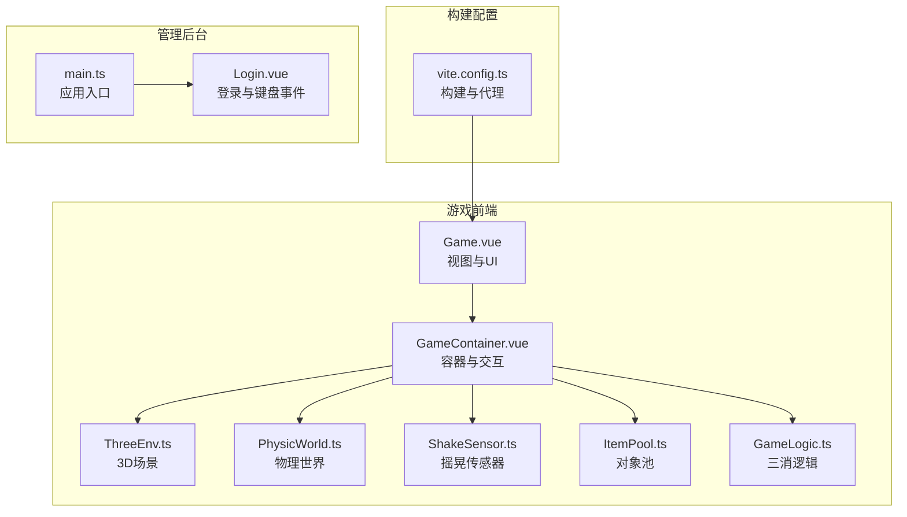
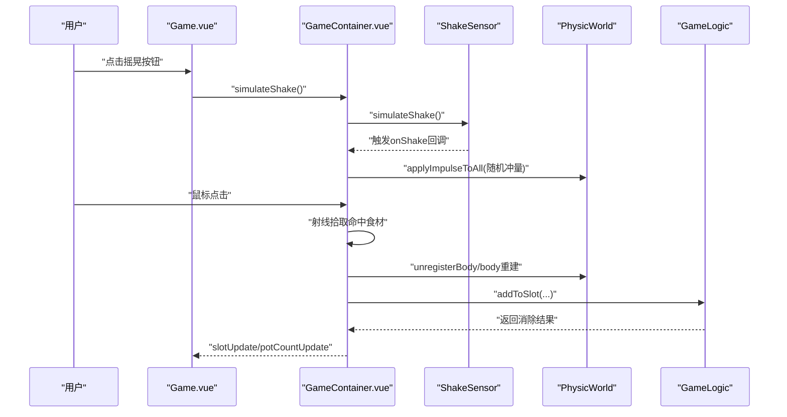
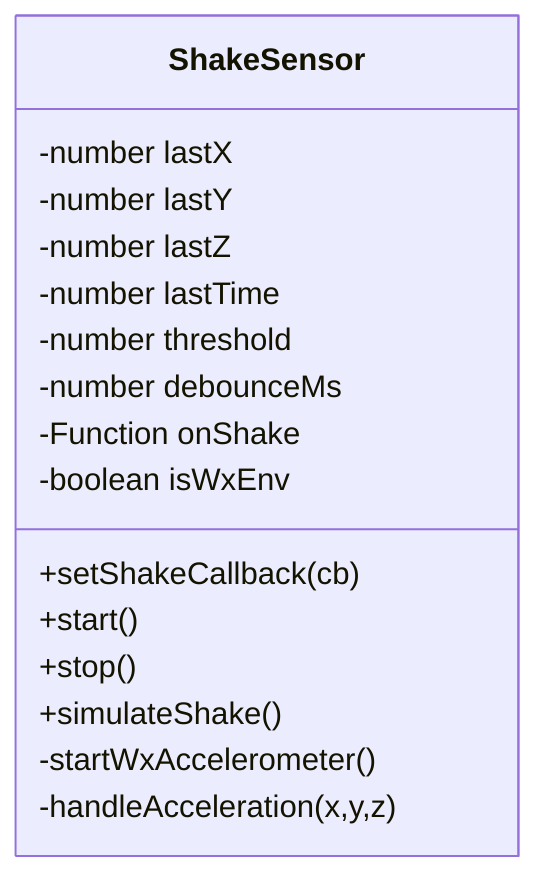
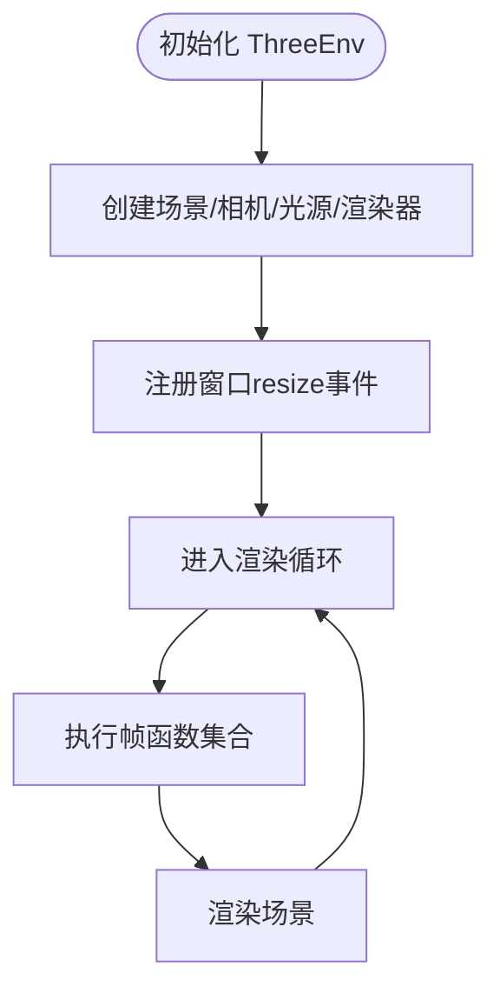
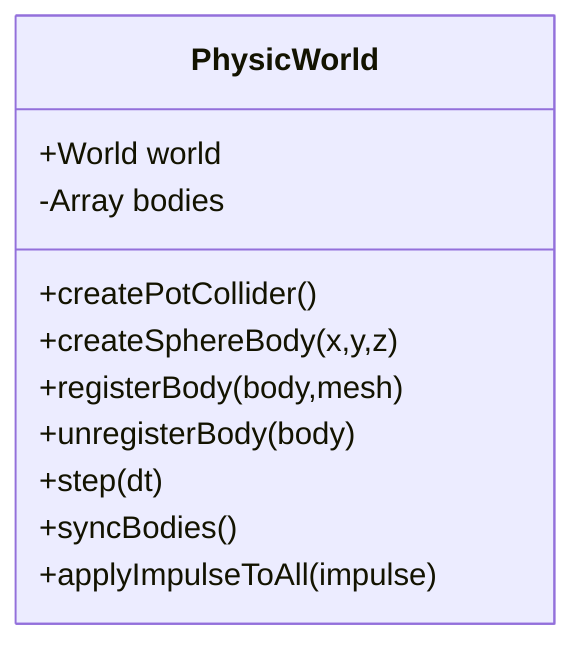
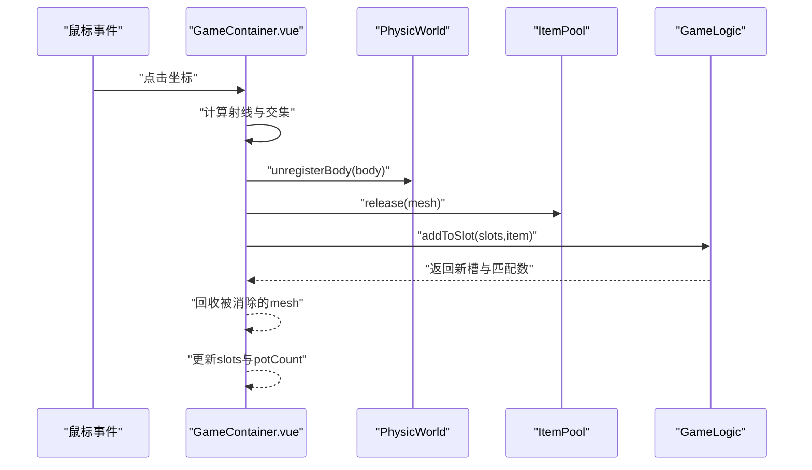
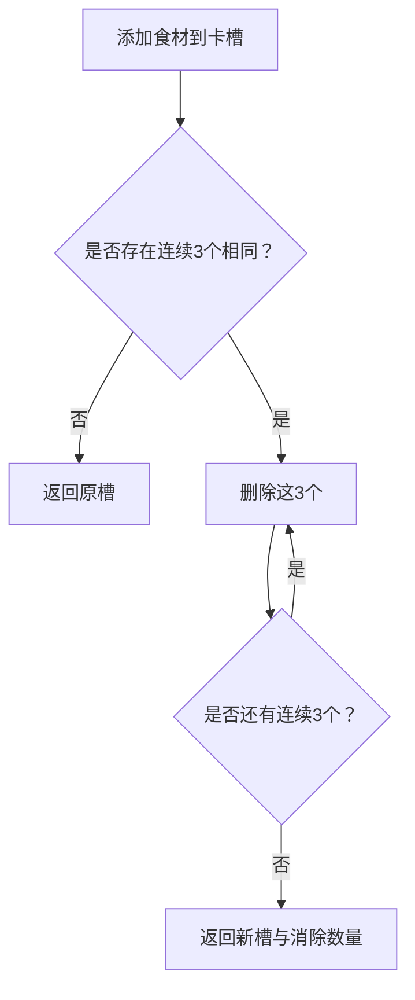
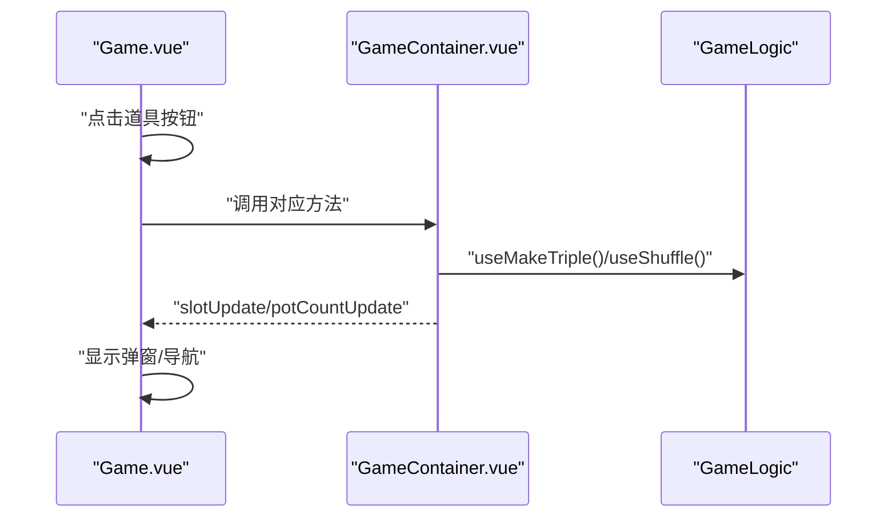
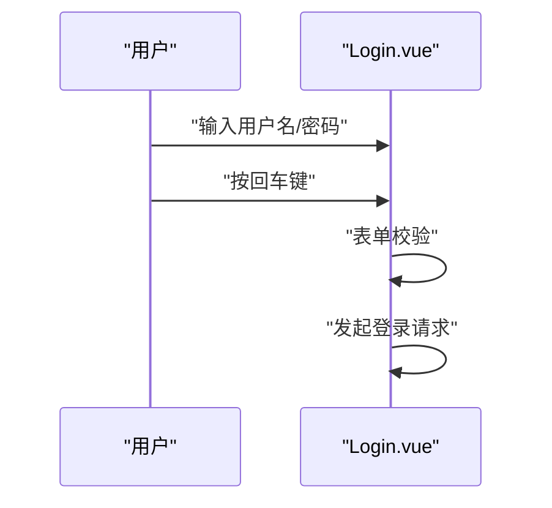
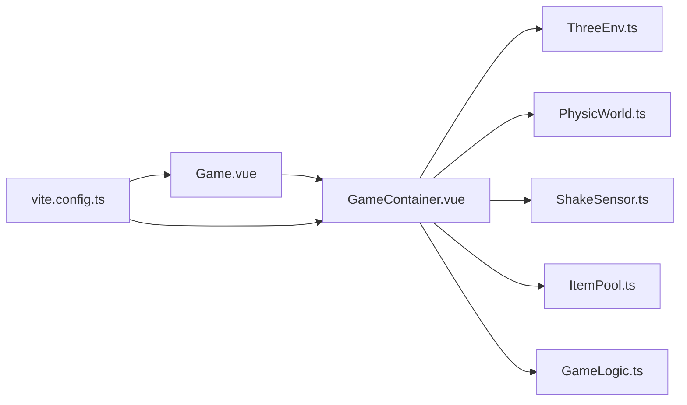

# 输入与交互

<cite>
**本文引用的文件**
- [ShakeSensor.ts](file://game/src/core/ShakeSensor.ts)
- [Game.vue](file://game/src/views/Game.vue)
- [GameContainer.vue](file://game/src/components/GameContainer.vue)
- [GameLogic.ts](file://game/src/utils/GameLogic.ts)
- [ThreeEnv.ts](file://game/src/core/ThreeEnv.ts)
- [PhysicWorld.ts](file://game/src/core/PhysicWorld.ts)
- [ItemPool.ts](file://game/src/pool/ItemPool.ts)
- [vite.config.ts](file://game/vite.config.ts)
- [Login.vue](file://admin/src/views/Login.vue)
- [main.ts](file://game/src/main.ts)
- [main.ts](file://admin/src/main.ts)
</cite>

## 目录
1. [简介](#简介)
2. [项目结构](#项目结构)
3. [核心组件](#核心组件)
4. [架构总览](#架构总览)
5. [详细组件分析](#详细组件分析)
6. [依赖分析](#依赖分析)
7. [性能考虑](#性能考虑)
8. [故障排查指南](#故障排查指南)
9. [结论](#结论)
10. [附录](#附录)

## 简介
本技术文档聚焦于输入与交互系统，覆盖以下能力与特性：
- 触摸手势识别与鼠标点击拾取：基于射线拾取的点击交互，支持点击拾取与卡槽三消逻辑联动。
- 摇晃传感器：微信小游戏加速度监听与网页调试模拟，实现颠锅物理冲量效果。
- 键盘事件处理：登录界面支持回车键触发登录。
- 用户输入映射与响应延迟优化：通过帧驱动的物理步进与坐标同步，降低输入到反馈的延迟。
- 多点触控支持：当前以单指点击为主，未实现多点触控识别；如需扩展可引入 Pointer Events 或 Touch Events。
- 虚拟摇杆与按钮绑定：当前未实现虚拟摇杆；可通过按钮绑定与手势组合扩展。
- 移动端适配与横竖屏：Three.js 渲染器自适应窗口尺寸；未实现横竖屏切换逻辑。
- 设备兼容性：微信小游戏环境与网页环境双适配，通过运行时检测选择加速度监听或模拟触发。
- 输入调试工具与可视化反馈：摇晃按钮、失败/通关弹窗、卡槽高亮与选中态。
- 无障碍访问与特殊输入设备：当前未见无障碍与蓝牙手柄等特殊设备集成。

## 项目结构
游戏前端位于 game 子目录，采用 Vue 3 + TypeScript + Vite 构建；管理后台位于 admin 子目录，采用 Element Plus + Vue Router + Pinia。输入与交互主要集中在游戏视图与容器组件中，核心输入路径包括：
- 视图层：Game.vue（UI 与道具按钮、摇晃按钮）
- 容器层：GameContainer.vue（3D 场景、物理世界、摇晃传感器、射线拾取）
- 核心模块：ShakeSensor.ts（摇晃传感器）、PhysicWorld.ts（物理世界）、ThreeEnv.ts（3D 环境）、ItemPool.ts（对象池）
- 逻辑工具：GameLogic.ts（三消算法）

**图表来源**
- [Game.vue:1-357](file://game/src/views/Game.vue#L1-L357)
- [GameContainer.vue:1-270](file://game/src/components/GameContainer.vue#L1-L270)
- [ThreeEnv.ts:1-123](file://game/src/core/ThreeEnv.ts#L1-L123)
- [PhysicWorld.ts:1-110](file://game/src/core/PhysicWorld.ts#L1-L110)
- [ShakeSensor.ts:1-89](file://game/src/core/ShakeSensor.ts#L1-L89)
- [ItemPool.ts:1-92](file://game/src/pool/ItemPool.ts#L1-L92)
- [GameLogic.ts:1-133](file://game/src/utils/GameLogic.ts#L1-L133)
- [vite.config.ts:1-22](file://game/vite.config.ts#L1-L22)
- [Login.vue:1-55](file://admin/src/views/Login.vue#L1-L55)
- [main.ts:1-20](file://admin/src/main.ts#L1-L20)

**章节来源**
- [Game.vue:1-357](file://game/src/views/Game.vue#L1-L357)
- [GameContainer.vue:1-270](file://game/src/components/GameContainer.vue#L1-L270)
- [vite.config.ts:1-22](file://game/vite.config.ts#L1-L22)

## 核心组件
- 摇晃传感器（ShakeSensor）
  - 功能：微信小游戏加速度监听与网页调试模拟；内置阈值与防抖，触发回调。
  - 关键点：运行时检测微信环境；使用微信 API 订阅加速度变化；提供模拟摇晃接口。
- 3D 场景（ThreeEnv）
  - 功能：场景、相机、光照、渲染器初始化；窗口自适应；渲染循环。
- 物理世界（PhysicWorld）
  - 功能：物理世界创建、重力设置、刚体管理、坐标同步、全局冲量施加。
- 对象池（ItemPool）
  - 功能：复用球体几何与材质，减少 GC；活跃/空闲对象管理。
- 三消逻辑（GameLogic）
  - 功能：向卡槽添加食材、检测并消除三消、判断失败与通关条件、一键凑三与洗牌辅助。
- 视图与交互（GameContainer）
  - 功能：射线拾取点击、卡槽更新、道具使用、摇晃回调、帧驱动物理步进。
- 登录与键盘事件（Login）
  - 功能：账号密码输入、回车键触发登录。

**章节来源**
- [ShakeSensor.ts:1-89](file://game/src/core/ShakeSensor.ts#L1-L89)
- [ThreeEnv.ts:1-123](file://game/src/core/ThreeEnv.ts#L1-L123)
- [PhysicWorld.ts:1-110](file://game/src/core/PhysicWorld.ts#L1-L110)
- [ItemPool.ts:1-92](file://game/src/pool/ItemPool.ts#L1-L92)
- [GameLogic.ts:1-133](file://game/src/utils/GameLogic.ts#L1-L133)
- [GameContainer.vue:1-270](file://game/src/components/GameContainer.vue#L1-L270)
- [Login.vue:1-55](file://admin/src/views/Login.vue#L1-L55)

## 架构总览
输入与交互的总体流程如下：
- 用户输入（鼠标点击、摇晃按钮、键盘回车）触发相应事件。
- GameContainer.vue 中进行射线拾取与物理交互；ShakeSensor 提供摇晃回调；Game.vue 提供摇晃按钮与道具按钮。
- GameLogic 负责三消判定与状态更新；ThreeEnv/PhysicWorld 负责渲染与物理仿真。
- vite.config.ts 提供开发服务器与代理，支持跨域 API 调用。

**图表来源**
- [Game.vue:148-151](file://game/src/views/Game.vue#L148-L151)
- [GameContainer.vue:105-166](file://game/src/components/GameContainer.vue#L105-L166)
- [ShakeSensor.ts:83-87](file://game/src/core/ShakeSensor.ts#L83-L87)
- [PhysicWorld.ts:98-103](file://game/src/core/PhysicWorld.ts#L98-L103)
- [GameLogic.ts:21-35](file://game/src/utils/GameLogic.ts#L21-L35)

## 详细组件分析

### 摇晃传感器（ShakeSensor）
- 运行时环境检测：通过检测微信运行时 API 判断是否为小游戏环境。
- 加速度监听：在小游戏环境启用加速度监听，并订阅变化事件；在网页环境提供模拟触发。
- 阈值与防抖：计算三轴差值之和，超过阈值并满足防抖间隔后触发回调。
- 回调绑定：外部通过 setShakeCallback 注入回调；GameContainer 在 onMounted 中注册。

**图表来源**
- [ShakeSensor.ts:1-89](file://game/src/core/ShakeSensor.ts#L1-L89)

**章节来源**
- [ShakeSensor.ts:1-89](file://game/src/core/ShakeSensor.ts#L1-L89)
- [GameContainer.vue:59-63](file://game/src/components/GameContainer.vue#L59-L63)

### 3D 场景与渲染（ThreeEnv）
- 场景初始化：创建场景、相机、光源与渲染器。
- 自适应窗口：监听 resize 事件，更新相机宽高比与渲染器尺寸。
- 渲染循环：requestAnimationFrame 驱动，逐帧执行注册的动画函数。

**图表来源**
- [ThreeEnv.ts:13-48](file://game/src/core/ThreeEnv.ts#L13-L48)
- [ThreeEnv.ts:91-97](file://game/src/core/ThreeEnv.ts#L91-L97)
- [ThreeEnv.ts:99-106](file://game/src/core/ThreeEnv.ts#L99-L106)

**章节来源**
- [ThreeEnv.ts:1-123](file://game/src/core/ThreeEnv.ts#L1-L123)

### 物理世界与坐标同步（PhysicWorld）
- 物理世界：设置重力、接触材料、求解迭代次数。
- 锅体碰撞体：底部平面与四面侧壁组合，形成漏斗状容器。
- 刚体管理：注册/注销刚体与 Three.js Mesh 的映射，逐帧同步位置与旋转。
- 冲量施加：对所有刚体施加瞬时冲量，实现颠锅效果。

**图表来源**
- [PhysicWorld.ts:1-110](file://game/src/core/PhysicWorld.ts#L1-L110)

**章节来源**
- [PhysicWorld.ts:1-110](file://game/src/core/PhysicWorld.ts#L1-L110)

### 射线拾取与点击交互（GameContainer）
- 射线拾取：根据鼠标坐标计算归一化设备坐标，结合相机矩阵生成射线，检测与活跃食材的交集。
- 拾取流程：命中后从锅内移除物理体并回收至对象池，加入卡槽；若发生三消则回收被消除的 mesh。
- 状态更新：发射 slotUpdate 与 potCountUpdate 事件，驱动 UI 更新与状态判定。

**图表来源**
- [GameContainer.vue:105-166](file://game/src/components/GameContainer.vue#L105-L166)
- [GameLogic.ts:21-35](file://game/src/utils/GameLogic.ts#L21-L35)
- [ItemPool.ts:60-66](file://game/src/pool/ItemPool.ts#L60-L66)

**章节来源**
- [GameContainer.vue:105-166](file://game/src/components/GameContainer.vue#L105-L166)
- [GameLogic.ts:1-133](file://game/src/utils/GameLogic.ts#L1-L133)
- [ItemPool.ts:1-92](file://game/src/pool/ItemPool.ts#L1-L92)

### 三消算法与状态判定（GameLogic）
- 卡槽容量：7 格；相同连续 3 个消除，可能引发连锁消除。
- 失败条件：卡槽已满且无任何可消除组合。
- 通关条件：锅内食材清空。
- 道具辅助：一键凑三与洗牌，提升可玩性。

**图表来源**
- [GameLogic.ts:21-63](file://game/src/utils/GameLogic.ts#L21-L63)

**章节来源**
- [GameLogic.ts:1-133](file://game/src/utils/GameLogic.ts#L1-L133)

### 道具与摇晃交互（Game.vue 与 GameContainer）
- 道具按钮：回锅、全局洗牌、一键凑三；网页调试提供“模拟摇晃”按钮。
- 摇晃效果：GameContainer 接收回调后对所有食材施加随机冲量，实现颠锅物理反馈。
- 状态弹窗：失败弹窗与通关弹窗，支持重新挑战与下一关。

**图表来源**
- [Game.vue:129-146](file://game/src/views/Game.vue#L129-L146)
- [Game.vue:42-44](file://game/src/views/Game.vue#L42-L44)
- [GameContainer.vue:179-232](file://game/src/components/GameContainer.vue#L179-L232)

**章节来源**
- [Game.vue:1-357](file://game/src/views/Game.vue#L1-L357)
- [GameContainer.vue:1-270](file://game/src/components/GameContainer.vue#L1-L270)

### 键盘事件处理（Login.vue）
- 回车键触发：在密码输入框按下回车键时调用登录逻辑。
- 表单校验：Element Plus 表单校验通过后发起登录请求。

**图表来源**
- [Login.vue:10-12](file://admin/src/views/Login.vue#L10-L12)
- [Login.vue:40-53](file://admin/src/views/Login.vue#L40-L53)

**章节来源**
- [Login.vue:1-55](file://admin/src/views/Login.vue#L1-L55)

## 依赖分析
- 组件耦合关系
  - GameContainer 依赖 ThreeEnv、PhysicWorld、ShakeSensor、ItemPool、GameLogic。
  - Game.vue 作为视图层，通过事件与 GameContainer 通信。
  - vite.config.ts 为构建与开发服务器提供配置。
- 外部依赖
  - Three.js、Cannon-es、Element Plus（管理后台）。

**图表来源**
- [Game.vue:1-357](file://game/src/views/Game.vue#L1-L357)
- [GameContainer.vue:1-270](file://game/src/components/GameContainer.vue#L1-L270)
- [ThreeEnv.ts:1-123](file://game/src/core/ThreeEnv.ts#L1-L123)
- [PhysicWorld.ts:1-110](file://game/src/core/PhysicWorld.ts#L1-L110)
- [ShakeSensor.ts:1-89](file://game/src/core/ShakeSensor.ts#L1-L89)
- [ItemPool.ts:1-92](file://game/src/pool/ItemPool.ts#L1-L92)
- [GameLogic.ts:1-133](file://game/src/utils/GameLogic.ts#L1-L133)
- [vite.config.ts:1-22](file://game/vite.config.ts#L1-L22)

**章节来源**
- [GameContainer.vue:1-270](file://game/src/components/GameContainer.vue#L1-L270)
- [vite.config.ts:1-22](file://game/vite.config.ts#L1-L22)

## 性能考虑
- 帧驱动与同步
  - ThreeEnv 的动画函数集合在渲染循环中逐帧执行，确保物理步进与坐标同步的稳定性。
- 对象池优化
  - ItemPool 复用几何体与材质，避免频繁创建销毁 Mesh，降低 GC 压力。
- 物理求解参数
  - 设置求解迭代次数与阻尼参数，平衡性能与稳定性。
- 渲染像素比限制
  - ThreeEnv 使用设备像素比上限，避免在高分屏下过度消耗资源。
- 建议
  - 若未来引入多点触控，建议将射线拾取改为多指事件处理；对高频事件（如触摸移动）增加节流/去抖策略。

[本节为通用性能讨论，不直接分析具体文件]

## 故障排查指南
- 摇晃无效
  - 检查微信环境检测与加速度 API 是否可用；确认回调已正确注册。
  - 网页调试：确认“模拟摇晃”按钮是否触发。
- 点击拾取不生效
  - 检查射线计算与活跃 Mesh 列表；确认命中检测逻辑与事件坐标转换。
- 三消异常
  - 检查 addToSlot 与 checkAndRemoveTriples 的调用顺序；确认卡槽长度与匹配逻辑。
- 渲染或物理卡顿
  - 检查帧函数数量与复杂度；适当降低求解迭代或启用更严格的节流。
- 登录回车无效
  - 检查键盘事件绑定与表单校验流程。

**章节来源**
- [ShakeSensor.ts:15-38](file://game/src/core/ShakeSensor.ts#L15-L38)
- [GameContainer.vue:105-166](file://game/src/components/GameContainer.vue#L105-L166)
- [GameLogic.ts:21-63](file://game/src/utils/GameLogic.ts#L21-L63)
- [Login.vue:10-12](file://admin/src/views/Login.vue#L10-L12)

## 结论
该输入与交互系统以“帧驱动 + 对象池 + 射线拾取 + 物理同步”为核心，实现了稳定的手游式交互体验。摇晃传感器提供沉浸式颠锅反馈，三消逻辑保证了玩法闭环。当前未实现多点触控与虚拟摇杆，也未包含无障碍与特殊输入设备支持，后续可在现有架构基础上扩展。

[本节为总结性内容，不直接分析具体文件]

## 附录
- 构建与代理
  - 开发服务器端口与 API 代理配置，便于前后端联调。
- 应用入口
  - 游戏与管理后台分别在各自 main.ts 中初始化插件与路由。

**章节来源**
- [vite.config.ts:1-22](file://game/vite.config.ts#L1-L22)
- [main.ts:1-4](file://game/src/main.ts#L1-L4)
- [main.ts:1-20](file://admin/src/main.ts#L1-L20)