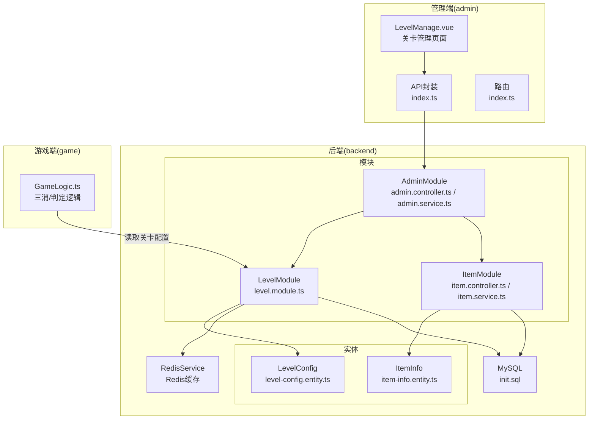
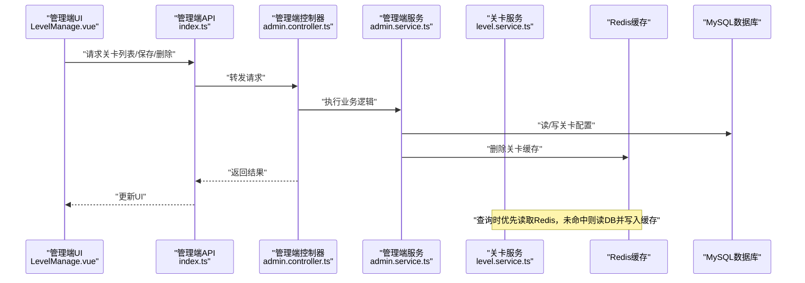
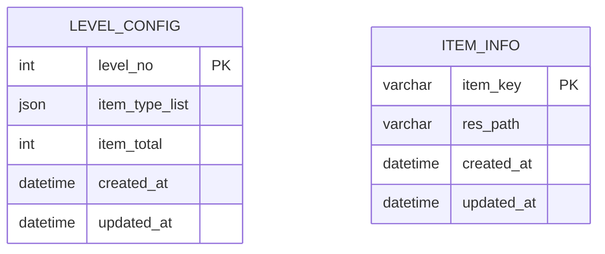
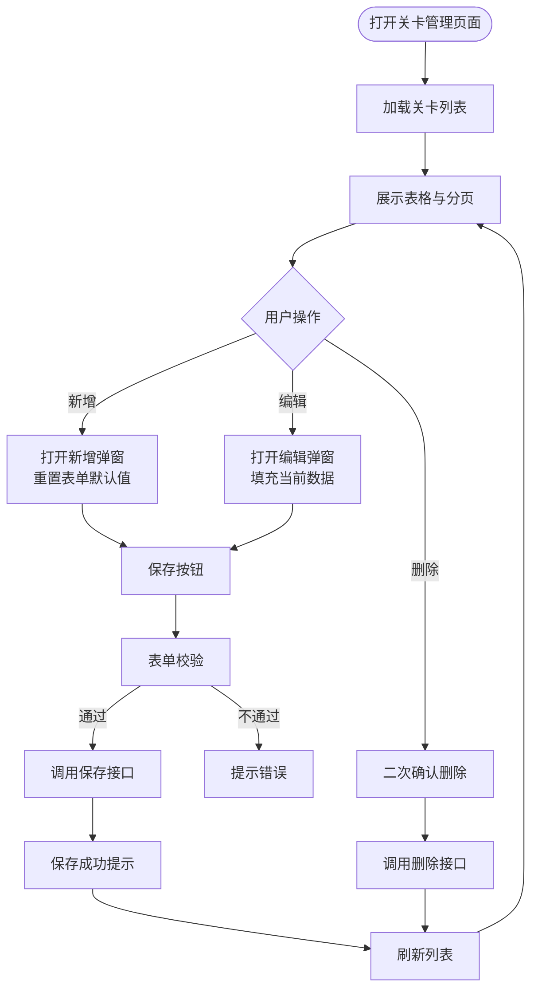
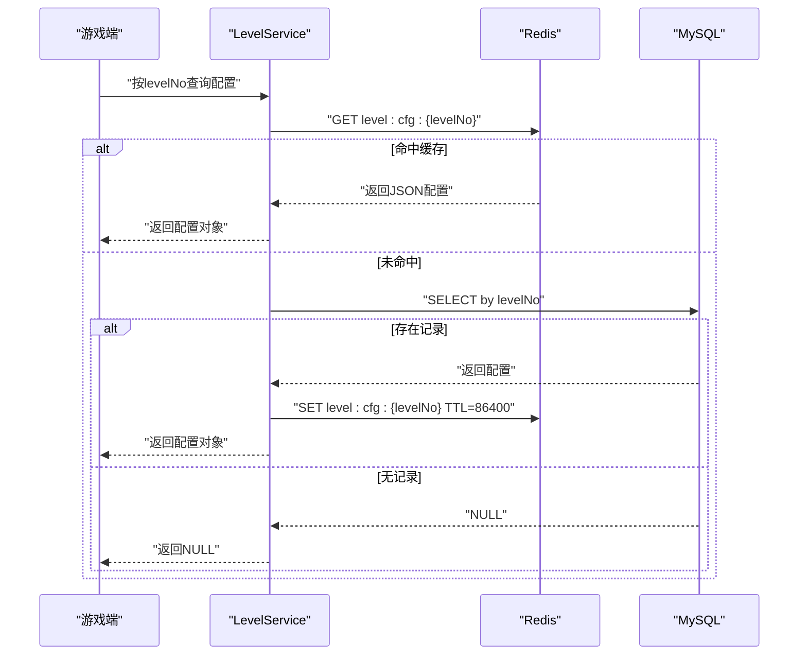
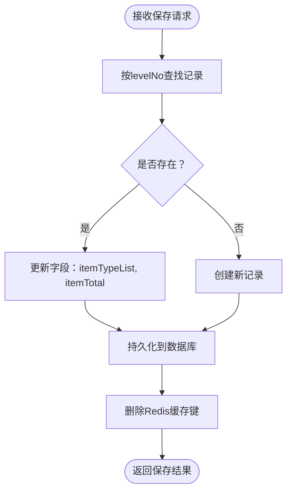
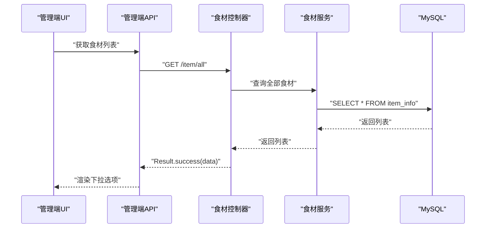
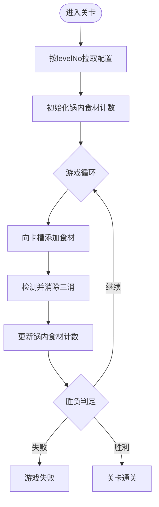
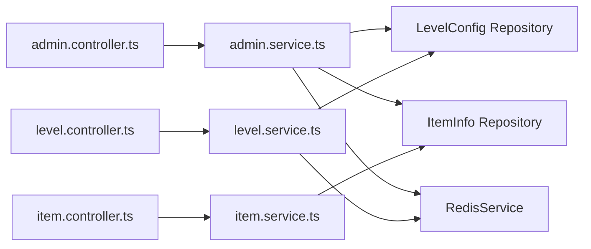

# 关卡管理

<cite>
**本文引用的文件**
- [LevelManage.vue](file://admin/src/views/LevelManage.vue)
- [index.ts（管理员API）](file://admin/src/api/index.ts)
- [index.ts（路由）](file://admin/src/router/index.ts)
- [level.controller.ts](file://backend/src/modules/level/level.controller.ts)
- [level.service.ts](file://backend/src/modules/level/level.service.ts)
- [level.module.ts](file://backend/src/modules/level/level.module.ts)
- [admin.controller.ts](file://backend/src/modules/admin/admin.controller.ts)
- [admin.service.ts](file://backend/src/modules/admin/admin.service.ts)
- [item.controller.ts](file://backend/src/modules/item/item.controller.ts)
- [item.service.ts](file://backend/src/modules/item/item.service.ts)
- [level-config.entity.ts](file://backend/src/entities/level-config.entity.ts)
- [item-info.entity.ts](file://backend/src/entities/item-info.entity.ts)
- [init.sql](file://sql/init.sql)
- [GameLogic.ts](file://game/src/utils/GameLogic.ts)
</cite>

## 目录
1. [简介](#简介)
2. [项目结构](#项目结构)
3. [核心组件](#核心组件)
4. [架构总览](#架构总览)
5. [详细组件分析](#详细组件分析)
6. [依赖分析](#依赖分析)
7. [性能考虑](#性能考虑)
8. [故障排查指南](#故障排查指南)
9. [结论](#结论)
10. [附录](#附录)

## 简介
本文件面向“关卡管理”功能，系统性说明关卡配置的创建、编辑与删除流程；关卡难度与奖励配置的设定方式；关卡地图数据、怪物与道具掉落的管理思路；关卡模板系统、参数调整与预览能力；关卡编辑器使用指南、配置校验与保存流程；以及关卡数据结构、依赖关系与游戏逻辑集成点。文档以仓库现有实现为基础，结合概念性扩展建议，帮助开发者与运营人员高效完成关卡设计与维护。

## 项目结构
本项目采用前后端分离架构：
- 管理端（admin）：基于 Vue3 + Element Plus 的后台界面，提供关卡管理、食材配置与玩家统计等页面。
- 后端（backend）：基于 NestJS + TypeORM + Redis，提供关卡配置、食材配置与玩家记录的数据接口与业务逻辑。
- 游戏端（game）：包含三消算法与物理/渲染环境，负责根据关卡配置驱动玩法。

图表来源
- [LevelManage.vue:1-139](file://admin/src/views/LevelManage.vue#L1-L139)
- [index.ts（管理员API）:1-34](file://admin/src/api/index.ts#L1-L34)
- [index.ts（路由）:1-53](file://admin/src/router/index.ts#L1-L53)
- [level.module.ts:1-13](file://backend/src/modules/level/level.module.ts#L1-L13)
- [admin.controller.ts:1-63](file://backend/src/modules/admin/admin.controller.ts#L1-L63)
- [admin.service.ts:1-79](file://backend/src/modules/admin/admin.service.ts#L1-L79)
- [item.controller.ts:1-17](file://backend/src/modules/item/item.controller.ts#L1-L17)
- [item.service.ts:1-35](file://backend/src/modules/item/item.service.ts#L1-L35)
- [level-config.entity.ts:1-21](file://backend/src/entities/level-config.entity.ts#L1-L21)
- [item-info.entity.ts:1-18](file://backend/src/entities/item-info.entity.ts#L1-L18)
- [init.sql:1-48](file://sql/init.sql#L1-L48)
- [GameLogic.ts:1-133](file://game/src/utils/GameLogic.ts#L1-L133)

章节来源
- [LevelManage.vue:1-139](file://admin/src/views/LevelManage.vue#L1-L139)
- [index.ts（管理员API）:1-34](file://admin/src/api/index.ts#L1-L34)
- [index.ts（路由）:1-53](file://admin/src/router/index.ts#L1-L53)
- [level.module.ts:1-13](file://backend/src/modules/level/level.module.ts#L1-L13)
- [admin.controller.ts:1-63](file://backend/src/modules/admin/admin.controller.ts#L1-L63)
- [admin.service.ts:1-79](file://backend/src/modules/admin/admin.service.ts#L1-L79)
- [item.controller.ts:1-17](file://backend/src/modules/item/item.controller.ts#L1-L17)
- [item.service.ts:1-35](file://backend/src/modules/item/item.service.ts#L1-L35)
- [level-config.entity.ts:1-21](file://backend/src/entities/level-config.entity.ts#L1-L21)
- [item-info.entity.ts:1-18](file://backend/src/entities/item-info.entity.ts#L1-L18)
- [init.sql:1-48](file://sql/init.sql#L1-L48)
- [GameLogic.ts:1-133](file://game/src/utils/GameLogic.ts#L1-L133)

## 核心组件
- 管理端关卡页面：提供关卡列表展示、分页、新增/编辑弹窗、删除确认与保存流程。
- 后端关卡服务：提供按关卡号查询配置，支持 Redis 缓存与数据库双写策略。
- 后端管理服务：提供关卡的新增/修改、删除、列表分页与缓存清理。
- 实体层：定义关卡配置与食材配置的数据结构及字段注释。
- 游戏端逻辑：提供三消判定、通关/失败判断、道具生成与洗牌等算法。

章节来源
- [LevelManage.vue:62-139](file://admin/src/views/LevelManage.vue#L62-L139)
- [level.service.ts:16-32](file://backend/src/modules/level/level.service.ts#L16-L32)
- [admin.service.ts:22-51](file://backend/src/modules/admin/admin.service.ts#L22-L51)
- [level-config.entity.ts:4-20](file://backend/src/entities/level-config.entity.ts#L4-L20)
- [item-info.entity.ts:3-17](file://backend/src/entities/item-info.entity.ts#L3-L17)
- [GameLogic.ts:21-89](file://game/src/utils/GameLogic.ts#L21-L89)

## 架构总览
下图展示了从管理端到后端再到数据库与缓存的整体调用链路，以及游戏端如何消费关卡配置。

图表来源
- [LevelManage.vue:90-132](file://admin/src/views/LevelManage.vue#L90-L132)
- [index.ts（管理员API）:7-17](file://admin/src/api/index.ts#L7-L17)
- [admin.controller.ts:10-31](file://backend/src/modules/admin/admin.controller.ts#L10-L31)
- [admin.service.ts:22-51](file://backend/src/modules/admin/admin.service.ts#L22-L51)
- [level.service.ts:16-32](file://backend/src/modules/level/level.service.ts#L16-L32)

## 详细组件分析

### 关卡配置数据模型
- 关卡配置实体包含关卡编号、食材类型数组与本关食材总数等字段，并带有创建/更新时间戳。
- 食材配置实体包含食材唯一键与资源路径等字段。

图表来源
- [level-config.entity.ts:4-20](file://backend/src/entities/level-config.entity.ts#L4-L20)
- [item-info.entity.ts:3-17](file://backend/src/entities/item-info.entity.ts#L3-L17)

章节来源
- [level-config.entity.ts:4-20](file://backend/src/entities/level-config.entity.ts#L4-L20)
- [item-info.entity.ts:3-17](file://backend/src/entities/item-info.entity.ts#L3-L17)

### 关卡管理页面（管理端）
- 功能要点
  - 展示关卡列表，包含关卡编号、食材类型（标签显示）、食材总数。
  - 支持分页加载与刷新。
  - 新增/编辑弹窗：输入关卡编号（不可重复）、多选食材类型、输入食材总数。
  - 删除关卡前二次确认。
  - 保存时进行表单校验，提交后关闭弹窗并刷新列表。
- 表单规则
  - 关卡编号必填。
  - 食材类型必填（多选）。
  - 食材总数必填。

图表来源
- [LevelManage.vue:90-132](file://admin/src/views/LevelManage.vue#L90-L132)

章节来源
- [LevelManage.vue:84-132](file://admin/src/views/LevelManage.vue#L84-L132)

### 后端关卡查询服务（Redis + DB）
- 查询流程
  - 以“level:cfg:{levelNo}”为键从 Redis 读取缓存。
  - 若未命中，查询数据库中的关卡配置并写入缓存，有效期 24 小时。
  - 若数据库无记录，返回空。
- 适用场景
  - 游戏端按关卡号拉取配置时优先走缓存，降低数据库压力。

图表来源
- [level.service.ts:16-32](file://backend/src/modules/level/level.service.ts#L16-L32)

章节来源
- [level.service.ts:16-32](file://backend/src/modules/level/level.service.ts#L16-L32)

### 后端管理服务（关卡 CRUD 与缓存清理）
- 新增/修改关卡
  - 若存在同编号记录则更新，否则新建。
  - 保存后立即删除对应 Redis 缓存键，确保后续查询读取最新值。
- 删除关卡
  - 删除数据库记录并清理缓存。
- 列表分页
  - 支持按页码与每页条数查询，并按关卡编号升序排序。

图表来源
- [admin.service.ts:22-35](file://backend/src/modules/admin/admin.service.ts#L22-L35)

章节来源
- [admin.controller.ts:10-31](file://backend/src/modules/admin/admin.controller.ts#L10-L31)
- [admin.service.ts:22-51](file://backend/src/modules/admin/admin.service.ts#L22-L51)

### 食材配置与关卡关联
- 食材配置提供资源路径与唯一键，供游戏端加载模型资源。
- 关卡配置中的食材类型数组与食材配置的唯一键一一对应，保证运行期可解析。

图表来源
- [item.controller.ts:10-15](file://backend/src/modules/item/item.controller.ts#L10-L15)
- [item.service.ts:14-28](file://backend/src/modules/item/item.service.ts#L14-L28)
- [index.ts（管理员API）:19-21](file://admin/src/api/index.ts#L19-L21)

章节来源
- [item.controller.ts:10-15](file://backend/src/modules/item/item.controller.ts#L10-L15)
- [item.service.ts:14-28](file://backend/src/modules/item/item.service.ts#L14-L28)
- [index.ts（管理员API）:19-21](file://admin/src/api/index.ts#L19-L21)

### 游戏端逻辑与关卡配置集成
- 三消算法
  - 向卡槽添加食材后检测三消，支持递归消除。
  - 判断失败条件：卡槽已满且无可消除组合。
  - 判断通关条件：锅内食材计数清零。
- 道具系统
  - 一键凑三：优先补齐已有两件的食材类型，否则随机生成三件相同类型。
  - 洗牌：随机打乱锅内食材位置。
- 关卡配置消费
  - 游戏端通过关卡服务按关卡号拉取配置，读取食材类型数组与总数，驱动玩法。

图表来源
- [GameLogic.ts:21-89](file://game/src/utils/GameLogic.ts#L21-L89)
- [level.service.ts:16-32](file://backend/src/modules/level/level.service.ts#L16-L32)

章节来源
- [GameLogic.ts:21-89](file://game/src/utils/GameLogic.ts#L21-L89)
- [level.service.ts:16-32](file://backend/src/modules/level/level.service.ts#L16-L32)

## 依赖分析
- 模块耦合
  - LevelModule 仅依赖 LevelConfig 实体与 RedisService，职责清晰。
  - AdminModule 聚合了关卡与食材的管理接口，负责缓存清理与分页查询。
- 外部依赖
  - Redis 提供高并发下的配置读取能力。
  - MySQL 存储结构化数据，配合初始化脚本完成表结构与示例数据。
- 可能的循环依赖
  - 当前模块间无直接循环导入，保持良好内聚。

图表来源
- [admin.controller.ts:1-63](file://backend/src/modules/admin/admin.controller.ts#L1-L63)
- [admin.service.ts:11-20](file://backend/src/modules/admin/admin.service.ts#L11-L20)
- [level.controller.ts:1-17](file://backend/src/modules/level/level.controller.ts#L1-L17)
- [level.service.ts:9-14](file://backend/src/modules/level/level.service.ts#L9-L14)
- [item.controller.ts:1-17](file://backend/src/modules/item/item.controller.ts#L1-L17)
- [item.service.ts:8-12](file://backend/src/modules/item/item.service.ts#L8-L12)

章节来源
- [admin.controller.ts:1-63](file://backend/src/modules/admin/admin.controller.ts#L1-L63)
- [admin.service.ts:11-20](file://backend/src/modules/admin/admin.service.ts#L11-L20)
- [level.controller.ts:1-17](file://backend/src/modules/level/level.controller.ts#L1-L17)
- [level.service.ts:9-14](file://backend/src/modules/level/level.service.ts#L9-L14)
- [item.controller.ts:1-17](file://backend/src/modules/item/item.controller.ts#L1-L17)
- [item.service.ts:8-12](file://backend/src/modules/item/item.service.ts#L8-L12)

## 性能考虑
- 缓存策略
  - 关卡配置查询优先命中 Redis，未命中再查数据库并写入缓存，24 小时过期，适合频繁读取场景。
- 写入一致性
  - 新增/修改关卡后立即删除对应缓存键，避免脏读。
- 分页查询
  - 后端提供分页接口，前端按需加载，减少一次性传输数据量。
- 数据库索引
  - 建议在 level_no 上建立主键索引（已由主键约束保证），确保查询效率。

## 故障排查指南
- 关卡配置读取为空
  - 检查 Redis 是否正常运行与键是否存在。
  - 检查数据库中是否存在对应 levelNo 的记录。
- 保存后读取仍为旧值
  - 确认保存接口是否触发缓存清理（删除对应键）。
- 食材类型下拉为空
  - 检查食材配置表是否有数据，以及 /item/all 接口是否可用。
- 删除关卡后仍可查询
  - 确认删除接口是否正确调用并清理缓存键。
- 登录拦截问题
  - 管理端路由守卫会检查本地存储中的 token，未登录将跳转登录页。

章节来源
- [level.service.ts:16-32](file://backend/src/modules/level/level.service.ts#L16-L32)
- [admin.service.ts:32-34](file://backend/src/modules/admin/admin.service.ts#L32-L34)
- [index.ts（路由）:42-50](file://admin/src/router/index.ts#L42-L50)

## 结论
本关卡管理方案以简洁的数据模型与清晰的模块边界实现了配置的增删改查与缓存优化。管理端提供直观的编辑体验，后端通过 Redis 与数据库协同保障性能与一致性，游戏端以三消算法为核心集成关卡配置。建议后续扩展包括：关卡模板系统、难度分级与奖励配置字段、怪物与掉落的实体化建模、关卡预览与批量导入导出等，以进一步提升运营效率与玩法丰富度。

## 附录

### 关卡配置字段说明
- 关卡编号：整型，唯一标识。
- 食材类型数组：字符串数组，与食材配置唯一键对应。
- 食材总数：整型，决定本关目标消除数量。

章节来源
- [level-config.entity.ts:6-13](file://backend/src/entities/level-config.entity.ts#L6-L13)

### 初始化脚本要点
- 创建数据库与三张表：关卡配置、玩家存档、食材配置。
- 插入示例关卡与食材数据，便于快速验证。

章节来源
- [init.sql:7-47](file://sql/init.sql#L7-L47)