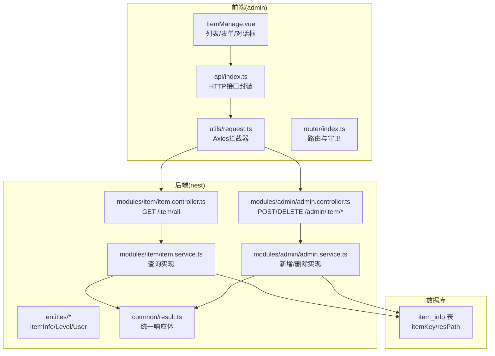
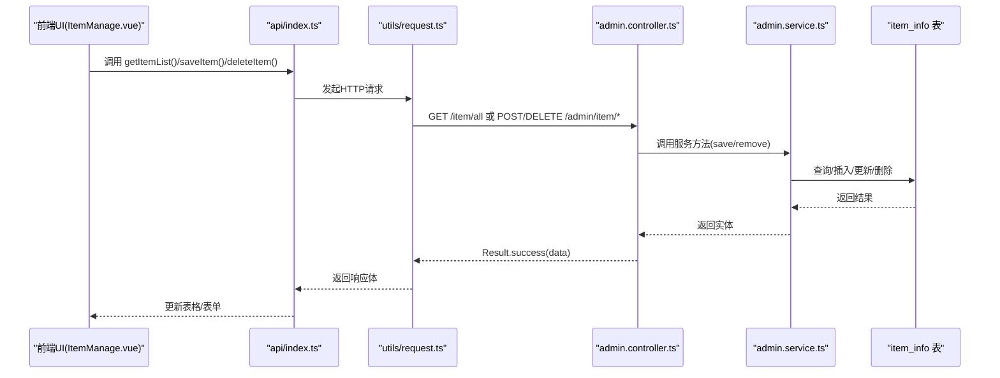
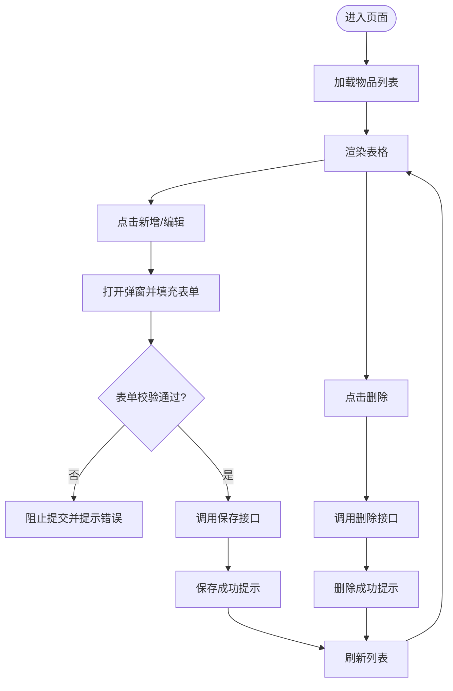
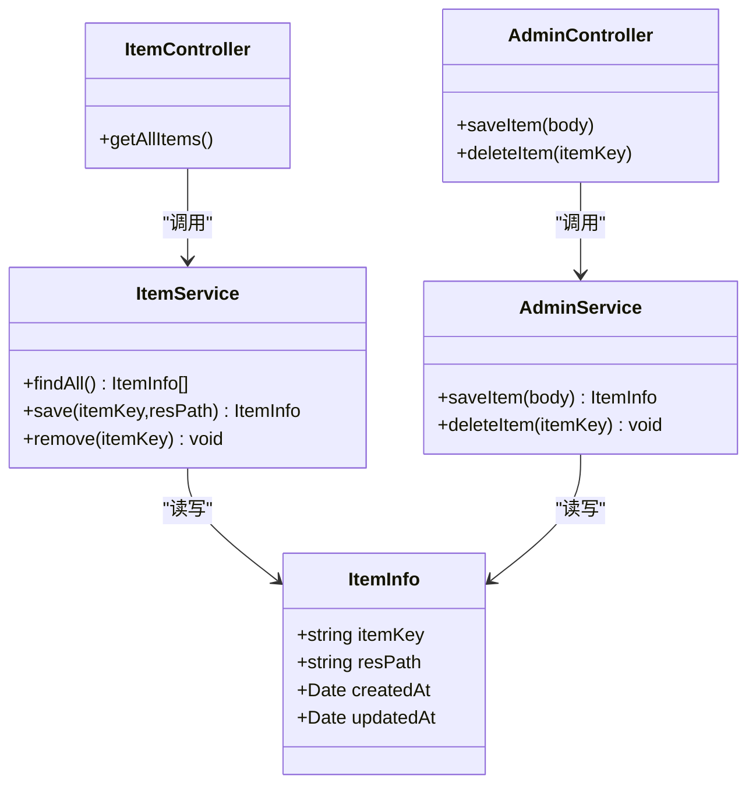
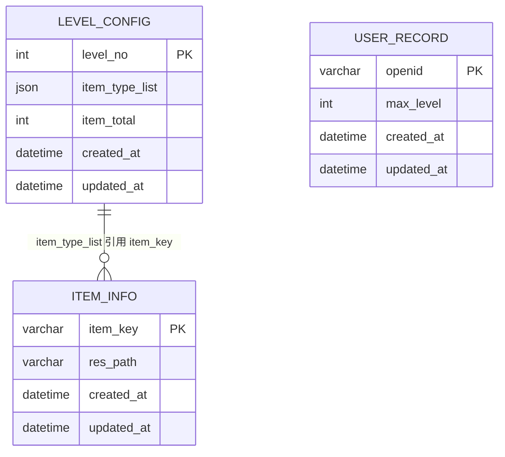
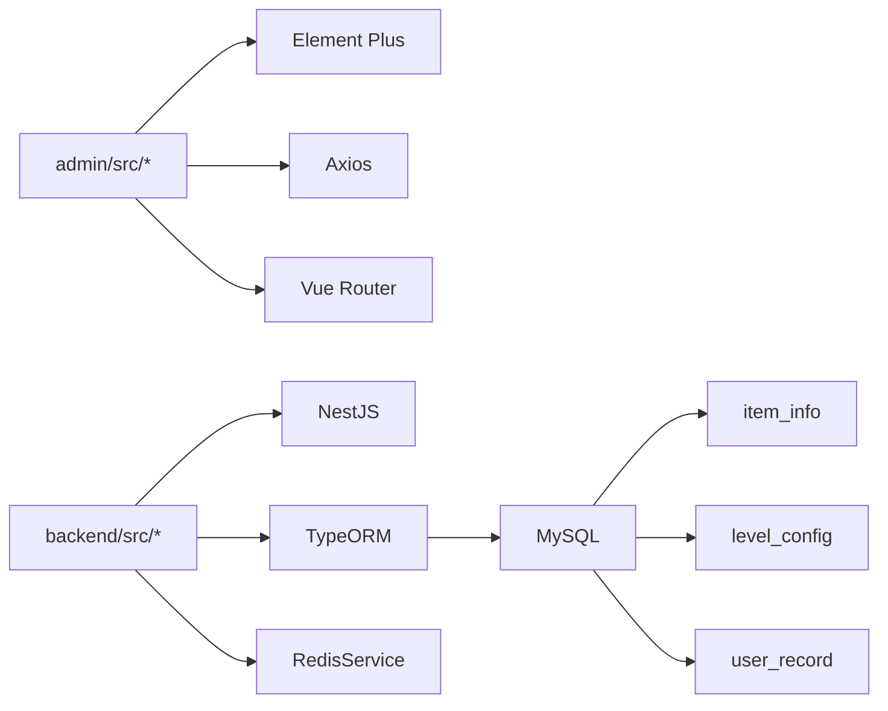

# 物品管理

<cite>
**本文引用的文件**
- [ItemManage.vue](file://admin/src/views/ItemManage.vue)
- [index.ts](file://admin/src/api/index.ts)
- [request.ts](file://admin/src/utils/request.ts)
- [index.ts](file://admin/src/router/index.ts)
- [item.controller.ts](file://backend/src/modules/item/item.controller.ts)
- [item.service.ts](file://backend/src/modules/item/item.service.ts)
- [admin.controller.ts](file://backend/src/modules/admin/admin.controller.ts)
- [admin.service.ts](file://backend/src/modules/admin/admin.service.ts)
- [item-info.entity.ts](file://backend/src/entities/item-info.entity.ts)
- [level-config.entity.ts](file://backend/src/entities/level-config.entity.ts)
- [user-record.entity.ts](file://backend/src/entities/user-record.entity.ts)
- [result.ts](file://backend/src/common/result.ts)
- [init.sql](file://sql/init.sql)
</cite>

## 目录
1. [简介](#简介)
2. [项目结构](#项目结构)
3. [核心组件](#核心组件)
4. [架构总览](#架构总览)
5. [详细组件分析](#详细组件分析)
6. [依赖分析](#依赖分析)
7. [性能考虑](#性能考虑)
8. [故障排查指南](#故障排查指南)
9. [结论](#结论)
10. [附录](#附录)

## 简介
本文件面向“物品管理”功能，系统性梳理前端界面、后端接口与数据库模型之间的协作关系，覆盖以下能力：
- 物品信息的增删改查（CRUD）
- 批量管理能力现状与扩展建议
- 数据验证规则与表单校验
- 列表展示、搜索过滤、分页加载与排序现状与优化建议
- 物品属性定义、类型分类与状态管理
- 添加/编辑表单、数据校验规则与API调用示例
- 物品数据模型、关联关系与业务逻辑实现

当前实现以“食材配置”为最小闭环，后续可按相同模式扩展到更复杂的物品类型与业务场景。

## 项目结构
- 前端（admin）：基于 Vue3 + Element Plus 的管理后台，负责物品列表展示、表单提交、分页与路由守卫等。
- 后端（backend）：基于 NestJS + TypeORM，提供物品查询、新增/更新、删除等接口，并通过统一响应体封装。
- 数据库（sql/init.sql）：初始化物品配置表与示例数据，支撑前端初始体验。

图表来源
- [ItemManage.vue:1-96](file://admin/src/views/ItemManage.vue#L1-L96)
- [index.ts:1-34](file://admin/src/api/index.ts#L1-L34)
- [request.ts:1-44](file://admin/src/utils/request.ts#L1-L44)
- [index.ts:1-53](file://admin/src/router/index.ts#L1-L53)
- [item.controller.ts:1-17](file://backend/src/modules/item/item.controller.ts#L1-L17)
- [admin.controller.ts:1-63](file://backend/src/modules/admin/admin.controller.ts#L1-L63)
- [item.service.ts:1-35](file://backend/src/modules/item/item.service.ts#L1-L35)
- [admin.service.ts:1-79](file://backend/src/modules/admin/admin.service.ts#L1-L79)
- [result.ts:1-23](file://backend/src/common/result.ts#L1-L23)
- [item-info.entity.ts:1-18](file://backend/src/entities/item-info.entity.ts#L1-L18)
- [init.sql:26-33](file://sql/init.sql#L26-L33)

章节来源
- [ItemManage.vue:1-96](file://admin/src/views/ItemManage.vue#L1-L96)
- [index.ts:1-34](file://admin/src/api/index.ts#L1-L34)
- [request.ts:1-44](file://admin/src/utils/request.ts#L1-L44)
- [index.ts:1-53](file://admin/src/router/index.ts#L1-L53)
- [item.controller.ts:1-17](file://backend/src/modules/item/item.controller.ts#L1-L17)
- [admin.controller.ts:1-63](file://backend/src/modules/admin/admin.controller.ts#L1-L63)
- [item.service.ts:1-35](file://backend/src/modules/item/item.service.ts#L1-L35)
- [admin.service.ts:1-79](file://backend/src/modules/admin/admin.service.ts#L1-L79)
- [result.ts:1-23](file://backend/src/common/result.ts#L1-L23)
- [item-info.entity.ts:1-18](file://backend/src/entities/item-info.entity.ts#L1-L18)
- [init.sql:26-33](file://sql/init.sql#L26-L33)

## 核心组件
- 前端视图组件：负责渲染物品列表、弹窗表单、按钮交互与消息提示。
- API封装：集中管理接口方法，统一参数与返回值约定。
- 请求拦截器：自动注入鉴权头、统一封装响应与错误处理。
- 后端控制器：暴露REST接口，调用服务层执行业务逻辑。
- 服务层：封装数据访问与业务规则，保证幂等与一致性。
- 实体模型：映射数据库表结构，定义字段类型与约束。
- 统一响应体：规范前后端交互格式，便于前端统一处理。

章节来源
- [ItemManage.vue:1-96](file://admin/src/views/ItemManage.vue#L1-L96)
- [index.ts:1-34](file://admin/src/api/index.ts#L1-L34)
- [request.ts:1-44](file://admin/src/utils/request.ts#L1-L44)
- [item.controller.ts:1-17](file://backend/src/modules/item/item.controller.ts#L1-L17)
- [admin.controller.ts:1-63](file://backend/src/modules/admin/admin.controller.ts#L1-L63)
- [item.service.ts:1-35](file://backend/src/modules/item/item.service.ts#L1-L35)
- [admin.service.ts:1-79](file://backend/src/modules/admin/admin.service.ts#L1-L79)
- [result.ts:1-23](file://backend/src/common/result.ts#L1-L23)
- [item-info.entity.ts:1-18](file://backend/src/entities/item-info.entity.ts#L1-L18)

## 架构总览
从前端到后端的数据流如下：
- 列表加载：前端调用 GET /item/all，后端查询所有物品并返回统一格式。
- 新增/编辑：前端调用 POST /admin/item/save，后端根据 itemKey 幂等更新或创建。
- 删除：前端调用 DELETE /admin/item/:itemKey，后端删除对应记录。
- 统一响应：后端使用 Result 类型封装 code/msg/data，前端在拦截器中统一处理错误与登录态。

图表来源
- [ItemManage.vue:58-92](file://admin/src/views/ItemManage.vue#L58-L92)
- [index.ts:19-29](file://admin/src/api/index.ts#L19-L29)
- [request.ts:10-41](file://admin/src/utils/request.ts#L10-L41)
- [admin.controller.ts:33-45](file://backend/src/modules/admin/admin.controller.ts#L33-L45)
- [admin.service.ts:53-67](file://backend/src/modules/admin/admin.service.ts#L53-L67)
- [item-info.entity.ts:1-18](file://backend/src/entities/item-info.entity.ts#L1-L18)

## 详细组件分析

### 前端组件：物品管理页面
- 功能点
  - 展示物品列表：itemKey、resPath 字段，支持编辑与删除。
  - 新增/编辑弹窗：表单字段 itemKey、resPath，必填校验。
  - 删除确认：二次确认弹窗，防止误删。
  - 加载数据：首次进入时拉取全量物品列表。
- 交互流程
  - 打开弹窗：区分新增/编辑模式；编辑时回填表单。
  - 保存：先进行表单校验，再调用保存接口，成功后刷新列表。
  - 删除：调用删除接口，成功后刷新列表。

图表来源
- [ItemManage.vue:58-92](file://admin/src/views/ItemManage.vue#L58-L92)

章节来源
- [ItemManage.vue:1-96](file://admin/src/views/ItemManage.vue#L1-L96)

### 后端接口与服务：物品管理
- 控制器
  - GET /item/all：返回全量物品列表。
  - POST /admin/item/save：新增或更新物品（以 itemKey 为主键）。
  - DELETE /admin/item/:itemKey：删除指定物品。
- 服务层
  - saveItem：根据 itemKey 查找，存在则更新 resPath，否则新建。
  - deleteItem：按 itemKey 删除。
- 实体模型
  - ItemInfo：itemKey（主键）、resPath、createdAt、updatedAt。
- 统一响应
  - Result.success(data)/Result.fail(msg, code) 统一封装。

图表来源
- [item.controller.ts:1-17](file://backend/src/modules/item/item.controller.ts#L1-L17)
- [admin.controller.ts:33-45](file://backend/src/modules/admin/admin.controller.ts#L33-L45)
- [item.service.ts:1-35](file://backend/src/modules/item/item.service.ts#L1-L35)
- [admin.service.ts:53-67](file://backend/src/modules/admin/admin.service.ts#L53-L67)
- [item-info.entity.ts:1-18](file://backend/src/entities/item-info.entity.ts#L1-L18)

章节来源
- [item.controller.ts:1-17](file://backend/src/modules/item/item.controller.ts#L1-L17)
- [admin.controller.ts:1-63](file://backend/src/modules/admin/admin.controller.ts#L1-L63)
- [item.service.ts:1-35](file://backend/src/modules/item/item.service.ts#L1-L35)
- [admin.service.ts:1-79](file://backend/src/modules/admin/admin.service.ts#L1-L79)
- [item-info.entity.ts:1-18](file://backend/src/entities/item-info.entity.ts#L1-L18)
- [result.ts:1-23](file://backend/src/common/result.ts#L1-L23)

### 数据模型与业务逻辑
- 数据模型
  - item_info：主键 itemKey，资源路径 resPath，时间戳 createdAt/updatedAt。
- 业务逻辑
  - 新增/更新：以 itemKey 作为唯一标识，不存在则创建，存在则更新。
  - 删除：按主键删除。
  - 列表：全量查询，无分页与过滤。
- 关联关系
  - 与关卡配置：关卡表 level_config 的 item_type_list 存放字符串数组，指向 item_info 的 itemKey。
  - 与玩家记录：user_record 与物品无直接外键关联，但可通过游戏逻辑间接关联。

图表来源
- [item-info.entity.ts:1-18](file://backend/src/entities/item-info.entity.ts#L1-L18)
- [level-config.entity.ts:1-21](file://backend/src/entities/level-config.entity.ts#L1-L21)
- [user-record.entity.ts:1-18](file://backend/src/entities/user-record.entity.ts#L1-L18)
- [init.sql:7-33](file://sql/init.sql#L7-L33)

章节来源
- [item-info.entity.ts:1-18](file://backend/src/entities/item-info.entity.ts#L1-L18)
- [level-config.entity.ts:1-21](file://backend/src/entities/level-config.entity.ts#L1-L21)
- [user-record.entity.ts:1-18](file://backend/src/entities/user-record.entity.ts#L1-L18)
- [init.sql:26-47](file://sql/init.sql#L26-L47)

### API 接口与调用示例
- 列表查询
  - 方法：GET /item/all
  - 参数：无
  - 返回：Result.success(list)
- 新增/编辑
  - 方法：POST /admin/item/save
  - 参数：{ itemKey, resPath }
  - 返回：Result.success(entity)
- 删除
  - 方法：DELETE /admin/item/:itemKey
  - 参数：路径参数 itemKey
  - 返回：Result.success(null, '删除成功')
- 前端调用
  - 使用 api/index.ts 中的方法封装，内部通过 utils/request.ts 发起请求并处理响应。

章节来源
- [index.ts:19-29](file://admin/src/api/index.ts#L19-L29)
- [request.ts:1-44](file://admin/src/utils/request.ts#L1-L44)
- [admin.controller.ts:33-45](file://backend/src/modules/admin/admin.controller.ts#L33-L45)
- [admin.service.ts:53-67](file://backend/src/modules/admin/admin.service.ts#L53-L67)

## 依赖分析
- 前端依赖
  - Element Plus：表格、表单、对话框、消息提示。
  - Axios：HTTP 客户端，统一拦截器处理鉴权与错误。
  - Vue Router：路由守卫保障登录态。
- 后端依赖
  - NestJS：控制器与服务解耦，模块化组织。
  - TypeORM：实体映射与仓储访问。
  - RedisService：用于关卡配置缓存清理（与物品管理同属 AdminService）。
- 数据库依赖
  - item_info 表：物品配置主表。
  - level_config 表：关卡配置，通过 JSON 字段引用物品类型。

图表来源
- [index.ts:1-53](file://admin/src/router/index.ts#L1-L53)
- [request.ts:1-44](file://admin/src/utils/request.ts#L1-L44)
- [admin.controller.ts:1-63](file://backend/src/modules/admin/admin.controller.ts#L1-L63)
- [admin.service.ts:1-79](file://backend/src/modules/admin/admin.service.ts#L1-L79)
- [item-info.entity.ts:1-18](file://backend/src/entities/item-info.entity.ts#L1-L18)
- [level-config.entity.ts:1-21](file://backend/src/entities/level-config.entity.ts#L1-L21)
- [user-record.entity.ts:1-18](file://backend/src/entities/user-record.entity.ts#L1-L18)

章节来源
- [index.ts:1-53](file://admin/src/router/index.ts#L1-L53)
- [request.ts:1-44](file://admin/src/utils/request.ts#L1-L44)
- [admin.controller.ts:1-63](file://backend/src/modules/admin/admin.controller.ts#L1-L63)
- [admin.service.ts:1-79](file://backend/src/modules/admin/admin.service.ts#L1-L79)
- [item-info.entity.ts:1-18](file://backend/src/entities/item-info.entity.ts#L1-L18)
- [level-config.entity.ts:1-21](file://backend/src/entities/level-config.entity.ts#L1-L21)
- [user-record.entity.ts:1-18](file://backend/src/entities/user-record.entity.ts#L1-L18)

## 性能考虑
- 列表查询
  - 当前为全量查询，建议增加分页与排序参数，避免一次性传输大量数据。
- 搜索与过滤
  - 当前未实现搜索/过滤，可在后端增加模糊匹配与条件筛选，前端提供输入框与筛选控件。
- 缓存策略
  - 对于不频繁变更的物品配置，可引入缓存层减少数据库压力。
- 并发与幂等
  - 以 itemKey 为主键的保存操作天然具备幂等性，适合高并发场景。
- 错误处理
  - 建议在前端统一捕获网络异常与业务错误，提供重试或降级策略。

## 故障排查指南
- 登录态失效
  - 现象：接口返回 401。
  - 处理：前端拦截器检测到 401 自动移除本地 token 并跳转登录页。
- 网络错误
  - 现象：提示网络错误。
  - 处理：检查网络连通性、代理配置与后端服务状态。
- 参数校验失败
  - 现象：表单校验失败或后端返回业务错误。
  - 处理：确保 itemKey 与 resPath 均非空；检查后端日志定位具体错误。
- 数据库连接问题
  - 现象：查询/保存失败。
  - 处理：确认数据库服务运行、连接串正确与初始化 SQL 已执行。

章节来源
- [request.ts:22-41](file://admin/src/utils/request.ts#L22-L41)
- [admin.controller.ts:54-61](file://backend/src/modules/admin/admin.controller.ts#L54-L61)
- [init.sql:1-48](file://sql/init.sql#L1-L48)

## 结论
- 物品管理功能以“食材配置”为核心，实现了基本的增删改查与表单校验。
- 前后端职责清晰：前端专注展示与交互，后端专注业务与数据持久化。
- 当前缺少分页、搜索过滤与排序，建议按现有架构快速扩展。
- 数据模型简洁明确，与关卡配置存在自然的引用关系，便于后续扩展。

## 附录

### 数据验证规则
- 必填校验
  - itemKey：必填，用于唯一标识。
  - resPath：必填，用于模型资源路径。
- 建议补充
  - 长度限制、格式校验（如路径格式）、唯一性校验（避免重复 itemKey）。

章节来源
- [ItemManage.vue:53-56](file://admin/src/views/ItemManage.vue#L53-L56)

### 批量管理能力现状与建议
- 现状
  - 未提供批量导入/导出与批量删除。
- 建议
  - 扩展接口：POST /admin/items/batch-save、DELETE /admin/items/batch-delete。
  - 前端：提供批量勾选、导入模板下载与进度反馈。

### 列表展示、搜索过滤、分页加载与排序
- 现状
  - 列表：全量查询，无分页与排序。
  - 搜索/过滤：未实现。
- 建议
  - 后端：在 AdminService 中增加分页与排序参数，支持按 itemKey/resPath 过滤。
  - 前端：在 ItemManage.vue 中增加分页控件与搜索输入框，调用相应接口。

### 物品属性定义、类型分类与状态管理
- 属性定义
  - itemKey：主键，唯一标识。
  - resPath：资源路径。
  - createdAt/updatedAt：时间戳。
- 类型分类
  - 可通过 level_config 的 item_type_list 与之关联，形成“类型-物品”的映射。
- 状态管理
  - 当前无显式状态字段；若需启用禁用/上下线，可在实体中增加状态字段并在服务层实现状态流转。

### API 接口调用示例（路径）
- 获取物品列表：[GET /item/all:10-15](file://backend/src/modules/item/item.controller.ts#L10-L15)
- 新增/编辑物品：[POST /admin/item/save:33-38](file://backend/src/modules/admin/admin.controller.ts#L33-L38)
- 删除物品：[DELETE /admin/item/:itemKey:40-45](file://backend/src/modules/admin/admin.controller.ts#L40-L45)