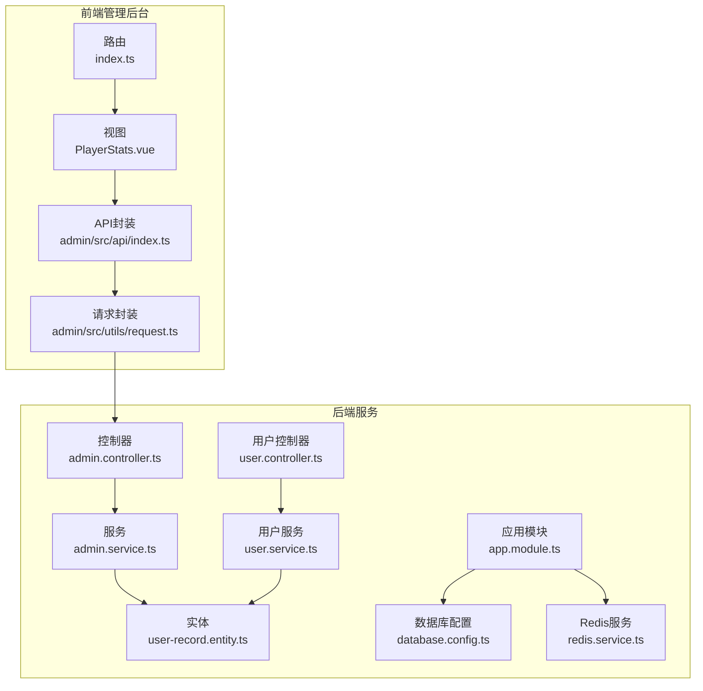
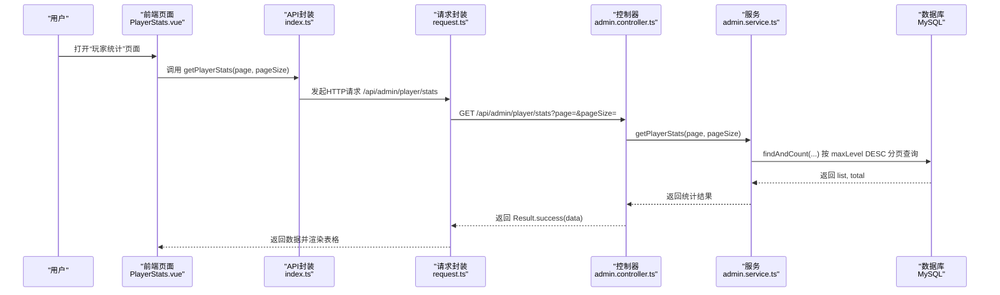
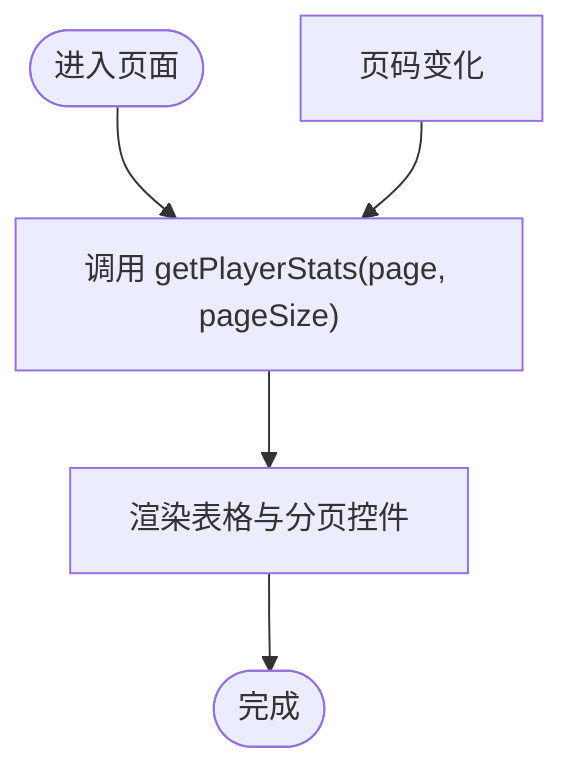
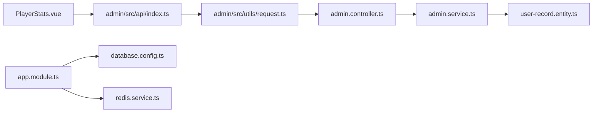

# 玩家统计

<cite>
**本文引用的文件**
- [PlayerStats.vue](file://admin/src/views/PlayerStats.vue)
- [index.ts（API封装）](file://admin/src/api/index.ts)
- [request.ts（请求封装）](file://admin/src/utils/request.ts)
- [index.ts（路由）](file://admin/src/router/index.ts)
- [Login.vue](file://admin/src/views/Login.vue)
- [admin.controller.ts](file://backend/src/modules/admin/admin.controller.ts)
- [admin.service.ts](file://backend/src/modules/admin/admin.service.ts)
- [user.controller.ts](file://backend/src/modules/user/user.controller.ts)
- [user.service.ts](file://backend/src/modules/user/user.service.ts)
- [user-record.entity.ts](file://backend/src/entities/user-record.entity.ts)
- [database.config.ts](file://backend/src/config/database.config.ts)
- [app.module.ts](file://backend/src/app.module.ts)
- [redis.service.ts](file://backend/src/modules/redis/redis.service.ts)
- [init.sql](file://sql/init.sql)
</cite>

## 目录
1. [简介](#简介)
2. [项目结构](#项目结构)
3. [核心组件](#核心组件)
4. [架构总览](#架构总览)
5. [组件详细分析](#组件详细分析)
6. [依赖关系分析](#依赖关系分析)
7. [性能考虑](#性能考虑)
8. [故障排查指南](#故障排查指南)
9. [结论](#结论)
10. [附录](#附录)

## 简介
本文件围绕“玩家统计”功能进行系统化文档化，覆盖数据采集链路、统计报表生成与展示、基础数据分析能力，以及后续扩展为更丰富统计维度（如活跃度、进度跟踪、行为分析）的建议。当前实现聚焦于“已通关最高关卡”的玩家排行榜式统计，支持分页查询与前端表格展示；后续可在此基础上扩展时间范围筛选、导出、图表可视化等能力。

## 项目结构
- 前端管理后台（Vue + Element Plus）
  - 路由：包含“玩家统计”页面入口
  - 页面：玩家统计页面负责分页加载与表格展示
  - API封装：统一管理后台接口调用
  - 请求封装：Axios封装，含鉴权头注入与统一错误处理
- 后端服务（NestJS + TypeORM + MySQL + Redis）
  - 控制器：提供“玩家统计”接口
  - 服务层：封装分页查询逻辑
  - 实体：玩家存档实体
  - 配置：数据库与Redis连接配置
  - 模块：AppModule集中导入各业务模块

**图表来源**
- [index.ts（路由）:1-53](file://admin/src/router/index.ts#L1-L53)
- [PlayerStats.vue:1-39](file://admin/src/views/PlayerStats.vue#L1-L39)
- [index.ts（API封装）:1-34](file://admin/src/api/index.ts#L1-L34)
- [request.ts（请求封装）:1-44](file://admin/src/utils/request.ts#L1-L44)
- [admin.controller.ts:1-63](file://backend/src/modules/admin/admin.controller.ts#L1-L63)
- [admin.service.ts:1-79](file://backend/src/modules/admin/admin.service.ts#L1-L79)
- [user.controller.ts:1-17](file://backend/src/modules/user/user.controller.ts#L1-L17)
- [user.service.ts:1-41](file://backend/src/modules/user/user.service.ts#L1-L41)
- [user-record.entity.ts:1-18](file://backend/src/entities/user-record.entity.ts#L1-L18)
- [app.module.ts:1-24](file://backend/src/app.module.ts#L1-L24)
- [database.config.ts:1-26](file://backend/src/config/database.config.ts#L1-L26)
- [redis.service.ts:1-45](file://backend/src/modules/redis/redis.service.ts#L1-L45)

**章节来源**
- [index.ts（路由）:1-53](file://admin/src/router/index.ts#L1-L53)
- [PlayerStats.vue:1-39](file://admin/src/views/PlayerStats.vue#L1-L39)
- [index.ts（API封装）:1-34](file://admin/src/api/index.ts#L1-L34)
- [request.ts（请求封装）:1-44](file://admin/src/utils/request.ts#L1-L44)
- [admin.controller.ts:1-63](file://backend/src/modules/admin/admin.controller.ts#L1-L63)
- [admin.service.ts:1-79](file://backend/src/modules/admin/admin.service.ts#L1-L79)
- [user.controller.ts:1-17](file://backend/src/modules/user/user.controller.ts#L1-L17)
- [user.service.ts:1-41](file://backend/src/modules/user/user.service.ts#L1-L41)
- [user-record.entity.ts:1-18](file://backend/src/entities/user-record.entity.ts#L1-L18)
- [app.module.ts:1-24](file://backend/src/app.module.ts#L1-L24)
- [database.config.ts:1-26](file://backend/src/config/database.config.ts#L1-L26)
- [redis.service.ts:1-45](file://backend/src/modules/redis/redis.service.ts#L1-L45)

## 核心组件
- 前端页面：玩家统计页面负责分页加载与表格展示，调用“玩家统计”API获取数据
- API封装：统一封装后台接口，便于复用与维护
- 请求封装：Axios实例，自动注入鉴权头，统一处理响应与错误
- 后端控制器：提供“玩家统计”接口，接收分页参数并返回结果
- 后端服务：执行分页查询，按最高关卡降序排序
- 实体：玩家存档实体，包含微信OpenID、最高关卡、创建与更新时间
- 应用模块与配置：集中注册数据库与Redis模块，加载实体

**章节来源**
- [PlayerStats.vue:22-38](file://admin/src/views/PlayerStats.vue#L22-L38)
- [index.ts（API封装）:31-34](file://admin/src/api/index.ts#L31-L34)
- [request.ts（请求封装）:10-41](file://admin/src/utils/request.ts#L10-L41)
- [admin.controller.ts:47-52](file://backend/src/modules/admin/admin.controller.ts#L47-L52)
- [admin.service.ts:69-77](file://backend/src/modules/admin/admin.service.ts#L69-L77)
- [user-record.entity.ts:1-18](file://backend/src/entities/user-record.entity.ts#L1-L18)
- [app.module.ts:10-21](file://backend/src/app.module.ts#L10-L21)
- [database.config.ts:6-17](file://backend/src/config/database.config.ts#L6-L17)

## 架构总览
下图展示了从前端页面到后端服务的数据流与职责分工：

**图表来源**
- [PlayerStats.vue:31-35](file://admin/src/views/PlayerStats.vue#L31-L35)
- [index.ts（API封装）:31-34](file://admin/src/api/index.ts#L31-L34)
- [request.ts（请求封装）:5-41](file://admin/src/utils/request.ts#L5-L41)
- [admin.controller.ts:47-52](file://backend/src/modules/admin/admin.controller.ts#L47-L52)
- [admin.service.ts:69-77](file://backend/src/modules/admin/admin.service.ts#L69-L77)
- [user-record.entity.ts:9-10](file://backend/src/entities/user-record.entity.ts#L9-L10)

## 组件详细分析

### 前端页面：玩家统计（PlayerStats.vue）
- 功能概述
  - 展示“微信OpenID、已通关最高关卡、最后更新时间”
  - 支持分页，页码变化触发重新加载
- 关键点
  - 使用 Element Plus 表格组件渲染数据
  - 使用分页组件控制页码与每页数量
  - 生命周期挂载时自动加载第一页数据
  - 通过 API 封装函数发起请求并更新状态

**图表来源**
- [PlayerStats.vue:31-38](file://admin/src/views/PlayerStats.vue#L31-L38)

**章节来源**
- [PlayerStats.vue:1-39](file://admin/src/views/PlayerStats.vue#L1-L39)

### API封装：admin/src/api/index.ts
- 职责
  - 对后台接口进行二次封装，暴露方法名明确的函数
  - 统一 GET/POST/DELETE 请求方式
- 玩家统计接口
  - getPlayerStats(page, pageSize) -> GET /admin/player/stats

**章节来源**
- [index.ts（API封装）:31-34](file://admin/src/api/index.ts#L31-L34)

### 请求封装：admin/src/utils/request.ts
- 职责
  - 创建 Axios 实例，设置基础URL与超时
  - 请求拦截：自动附加本地存储中的管理员Token
  - 响应拦截：统一错误提示；401时清理Token并跳转登录
- 作用
  - 保证所有后台请求具备鉴权头
  - 统一处理异常，提升用户体验

**章节来源**
- [request.ts（请求封装）:1-44](file://admin/src/utils/request.ts#L1-L44)

### 登录流程与路由守卫
- 登录页面：Login.vue
  - 表单校验、提交管理员账号与密码
  - 成功后写入Token至本地存储，跳转首页
- 路由守卫：index.ts
  - 访问非登录路由时检查是否存在Token
  - 无Token则重定向至登录页

**章节来源**
- [Login.vue:40-53](file://admin/src/views/Login.vue#L40-L53)
- [index.ts（路由）:42-50](file://admin/src/router/index.ts#L42-L50)

### 后端控制器：admin.controller.ts
- 玩家统计接口
  - GET /admin/player/stats
  - 接收 page、pageSize 查询参数
  - 调用服务层获取分页数据并返回 Result.success

**章节来源**
- [admin.controller.ts:47-52](file://backend/src/modules/admin/admin.controller.ts#L47-L52)

### 后端服务：admin.service.ts
- 玩家统计实现
  - 使用 TypeORM 的 findAndCount 执行分页查询
  - 排序依据：maxLevel 降序
  - 返回 list 与 total

**章节来源**
- [admin.service.ts:69-77](file://backend/src/modules/admin/admin.service.ts#L69-L77)

### 用户相关接口（用于数据采集）
- 用户控制器：user.controller.ts
  - POST /user/saveRecord
  - 接收 openid 与 maxLevel
  - 调用服务层保存或更新玩家记录
- 用户服务：user.service.ts
  - 若记录存在且新关卡更高则更新
  - 若不存在则新建
  - 提供 findAll 用于管理后台分页查询

**章节来源**
- [user.controller.ts:10-15](file://backend/src/modules/user/user.controller.ts#L10-L15)
- [user.service.ts:14-29](file://backend/src/modules/user/user.service.ts#L14-L29)
- [user.service.ts:31-39](file://backend/src/modules/user/user.service.ts#L31-L39)

### 数据模型：UserRecord（玩家存档）
- 字段
  - openid：主键，微信唯一标识
  - maxLevel：已通关最高关卡，默认0
  - createdAt、updatedAt：创建与更新时间
- 用途
  - 存储玩家通关进度
  - 作为统计报表的数据源

**章节来源**
- [user-record.entity.ts:1-18](file://backend/src/entities/user-record.entity.ts#L1-L18)

### 应用模块与配置
- App 模块：集中导入 TypeORM、Redis、业务模块
- 数据库配置：MySQL 连接与实体映射
- Redis 服务：封装常用操作，用于缓存与清理

**章节来源**
- [app.module.ts:10-21](file://backend/src/app.module.ts#L10-L21)
- [database.config.ts:6-17](file://backend/src/config/database.config.ts#L6-L17)
- [redis.service.ts:1-45](file://backend/src/modules/redis/redis.service.ts#L1-L45)

### 数据库初始化脚本
- 初始化数据库与表结构
- 包含 level_config、user_record、item_info 三张表
- 示例关卡与食材数据

**章节来源**
- [init.sql:7-33](file://sql/init.sql#L7-L33)

## 依赖关系分析
- 前端
  - PlayerStats.vue 依赖 API 封装
  - API 封装依赖请求封装
  - 路由守卫依赖本地存储的 Token
- 后端
  - AdminController 依赖 AdminService
  - AdminService 依赖 UserRecord Repository
  - App 模块集中注册数据库与 Redis 模块

**图表来源**
- [PlayerStats.vue:24-35](file://admin/src/views/PlayerStats.vue#L24-L35)
- [index.ts（API封装）:31-34](file://admin/src/api/index.ts#L31-L34)
- [request.ts（请求封装）:5-41](file://admin/src/utils/request.ts#L5-L41)
- [admin.controller.ts:8-51](file://backend/src/modules/admin/admin.controller.ts#L8-L51)
- [admin.service.ts:12-20](file://backend/src/modules/admin/admin.service.ts#L12-L20)
- [user-record.entity.ts:1-18](file://backend/src/entities/user-record.entity.ts#L1-L18)
- [app.module.ts:10-21](file://backend/src/app.module.ts#L10-L21)
- [database.config.ts:6-17](file://backend/src/config/database.config.ts#L6-L17)
- [redis.service.ts:1-45](file://backend/src/modules/redis/redis.service.ts#L1-L45)

**章节来源**
- [PlayerStats.vue:22-38](file://admin/src/views/PlayerStats.vue#L22-L38)
- [index.ts（API封装）:31-34](file://admin/src/api/index.ts#L31-L34)
- [request.ts（请求封装）:10-41](file://admin/src/utils/request.ts#L10-L41)
- [admin.controller.ts:8-51](file://backend/src/modules/admin/admin.controller.ts#L8-L51)
- [admin.service.ts:12-20](file://backend/src/modules/admin/admin.service.ts#L12-L20)
- [user-record.entity.ts:1-18](file://backend/src/entities/user-record.entity.ts#L1-L18)
- [app.module.ts:10-21](file://backend/src/app.module.ts#L10-L21)
- [database.config.ts:6-17](file://backend/src/config/database.config.ts#L6-L17)
- [redis.service.ts:1-45](file://backend/src/modules/redis/redis.service.ts#L1-L45)

## 性能考虑
- 分页查询
  - 已采用分页查询，避免一次性拉取全量数据
  - 建议在 maxLevel 上建立索引以优化排序与分页性能
- 缓存策略
  - 当前统计接口未使用缓存
  - 可结合 Redis 对热点榜单进行短期缓存，降低数据库压力
- 并发写入
  - 保存记录时仅在新关卡更高时更新，减少无效写入
- 网络与错误处理
  - 请求封装内置超时与统一错误提示，有助于快速定位问题

[本节为通用性能建议，不直接分析具体文件]

## 故障排查指南
- 登录失败或401
  - 检查本地存储是否包含有效 Token
  - 确认登录接口返回的 Token 是否正确写入
  - 路由守卫会在无 Token 时重定向至登录页
- 请求失败或网络错误
  - 查看请求封装中的响应拦截器，确认错误消息
  - 检查后端服务是否正常运行与端口连通性
- 统计数据为空
  - 确认数据库中是否存在玩家记录
  - 检查分页参数是否合理
- 关联功能（关卡与食材）
  - 若需扩展统计维度，可结合关卡配置与食材信息进行聚合
  - 注意数据库初始化脚本中已包含示例数据

**章节来源**
- [request.ts（请求封装）:22-41](file://admin/src/utils/request.ts#L22-L41)
- [index.ts（路由）:42-50](file://admin/src/router/index.ts#L42-L50)
- [init.sql:35-47](file://sql/init.sql#L35-L47)

## 结论
当前“玩家统计”功能实现了基于最高关卡的排行榜式展示，具备分页与鉴权机制。后续可在现有基础上扩展：
- 时间范围筛选：在接口层增加时间字段过滤
- 导出功能：将分页数据导出为CSV/Excel
- 图表可视化：引入图表库展示趋势与分布
- 更多指标：活跃度、通关率、平均用时等
- 缓存与索引：提升大数据量下的查询性能

[本节为总结性内容，不直接分析具体文件]

## 附录

### 统计数据API调用示例（路径参考）
- 获取玩家统计列表
  - 方法：GET
  - 路径：/api/admin/player/stats
  - 参数：page、pageSize
  - 调用位置：[getPlayerStats:31-34](file://admin/src/api/index.ts#L31-L34)
  - 请求封装：[request.ts:5-41](file://admin/src/utils/request.ts#L5-L41)

**章节来源**
- [index.ts（API封装）:31-34](file://admin/src/api/index.ts#L31-L34)
- [request.ts（请求封装）:5-41](file://admin/src/utils/request.ts#L5-L41)

### 数据模型定义（UserRecord）
- 字段说明
  - openid：主键，微信唯一标识
  - maxLevel：已通关最高关卡
  - createdAt、updatedAt：创建与更新时间
- 定义位置：[user-record.entity.ts:1-18](file://backend/src/entities/user-record.entity.ts#L1-L18)

**章节来源**
- [user-record.entity.ts:1-18](file://backend/src/entities/user-record.entity.ts#L1-L18)

### 数据库初始化脚本（参考）
- 初始化数据库与表结构
- 示例数据：关卡配置与食材配置
- 位置：[init.sql:7-47](file://sql/init.sql#L7-L47)

**章节来源**
- [init.sql:7-47](file://sql/init.sql#L7-L47)