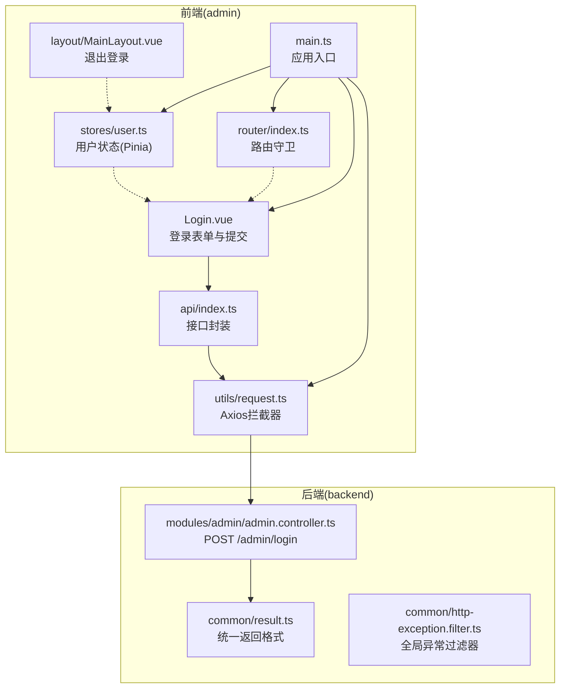
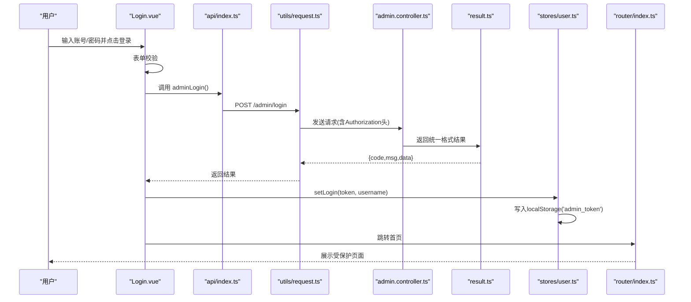
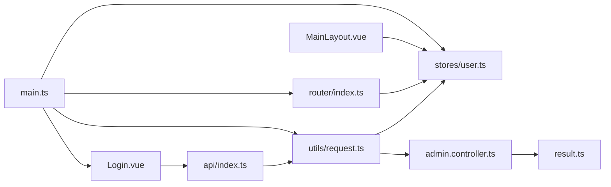

# 登录认证

<cite>
**本文引用的文件**
- [Login.vue](file://admin/src/views/Login.vue)
- [user.ts](file://admin/src/stores/user.ts)
- [index.ts](file://admin/src/router/index.ts)
- [request.ts](file://admin/src/utils/request.ts)
- [index.ts](file://admin/src/api/index.ts)
- [MainLayout.vue](file://admin/src/layout/MainLayout.vue)
- [main.ts](file://admin/src/main.ts)
- [admin.controller.ts](file://backend/src/modules/admin/admin.controller.ts)
- [admin.service.ts](file://backend/src/modules/admin/admin.service.ts)
- [result.ts](file://backend/src/common/result.ts)
- [http-exception.filter.ts](file://backend/src/common/http-exception.filter.ts)
</cite>

## 目录
1. [简介](#简介)
2. [项目结构](#项目结构)
3. [核心组件](#核心组件)
4. [架构总览](#架构总览)
5. [详细组件分析](#详细组件分析)
6. [依赖关系分析](#依赖关系分析)
7. [性能考虑](#性能考虑)
8. [故障排查指南](#故障排查指南)
9. [结论](#结论)
10. [附录](#附录)

## 简介
本文件系统性地文档化了“抓大鹅管理后台”的登录认证模块，覆盖以下主题：
- 用户登录流程与表单验证
- JWT 令牌管理（本地存储与请求头携带）
- 权限验证机制与路由守卫
- 会话状态管理（Pinia Store）
- 自动登录与安全策略
- 与后端 API 的交互方式与认证中间件工作原理
- 错误处理与统一返回格式
- 登录接口调用示例与状态管理代码路径

## 项目结构
前端采用 Vue 3 + TypeScript + Element Plus + Pinia + Vue Router 架构；后端采用 NestJS + TypeORM + Redis。认证相关的关键位置如下：
- 前端：登录页面、用户状态管理、路由守卫、HTTP 请求封装
- 后端：管理员登录接口、统一响应格式、全局异常过滤器

图表来源
- [Login.vue:1-55](file://admin/src/views/Login.vue#L1-L55)
- [user.ts:1-27](file://admin/src/stores/user.ts#L1-L27)
- [index.ts:1-53](file://admin/src/router/index.ts#L1-L53)
- [request.ts:1-44](file://admin/src/utils/request.ts#L1-L44)
- [index.ts:1-34](file://admin/src/api/index.ts#L1-L34)
- [MainLayout.vue:1-53](file://admin/src/layout/MainLayout.vue#L1-L53)
- [main.ts:1-20](file://admin/src/main.ts#L1-L20)
- [admin.controller.ts:1-63](file://backend/src/modules/admin/admin.controller.ts#L1-L63)
- [result.ts:1-23](file://backend/src/common/result.ts#L1-L23)
- [http-exception.filter.ts:1-26](file://backend/src/common/http-exception.filter.ts#L1-L26)

章节来源
- [Login.vue:1-55](file://admin/src/views/Login.vue#L1-L55)
- [user.ts:1-27](file://admin/src/stores/user.ts#L1-L27)
- [index.ts:1-53](file://admin/src/router/index.ts#L1-L53)
- [request.ts:1-44](file://admin/src/utils/request.ts#L1-L44)
- [index.ts:1-34](file://admin/src/api/index.ts#L1-L34)
- [MainLayout.vue:1-53](file://admin/src/layout/MainLayout.vue#L1-L53)
- [main.ts:1-20](file://admin/src/main.ts#L1-L20)
- [admin.controller.ts:1-63](file://backend/src/modules/admin/admin.controller.ts#L1-L63)
- [result.ts:1-23](file://backend/src/common/result.ts#L1-L23)
- [http-exception.filter.ts:1-26](file://backend/src/common/http-exception.filter.ts#L1-L26)

## 核心组件
- 登录页面(Login.vue)：负责表单校验、提交登录请求、接收并写入令牌、跳转首页
- 用户状态管理(user.ts)：基于 Pinia 的用户状态，持久化到 localStorage
- 路由守卫(index.ts)：拦截未登录访问，强制跳转登录页
- 请求封装(request.ts)：Axios 实例，自动附加 Authorization 头，统一错误处理与 401 重定向
- 接口封装(api/index.ts)：对后端接口进行薄封装，便于在组件中直接调用
- 后端登录控制器(admin.controller.ts)：提供 /admin/login 接口，返回统一格式结果
- 统一返回(result.ts)：前后端一致的返回结构
- 全局异常过滤器(http-exception.filter.ts)：兜底异常转换为统一格式

章节来源
- [Login.vue:1-55](file://admin/src/views/Login.vue#L1-L55)
- [user.ts:1-27](file://admin/src/stores/user.ts#L1-L27)
- [index.ts:1-53](file://admin/src/router/index.ts#L1-L53)
- [request.ts:1-44](file://admin/src/utils/request.ts#L1-L44)
- [index.ts:1-34](file://admin/src/api/index.ts#L1-L34)
- [admin.controller.ts:1-63](file://backend/src/modules/admin/admin.controller.ts#L1-L63)
- [result.ts:1-23](file://backend/src/common/result.ts#L1-L23)
- [http-exception.filter.ts:1-26](file://backend/src/common/http-exception.filter.ts#L1-L26)

## 架构总览
下图展示了从前端登录到后端鉴权再到前端状态更新的完整链路。

图表来源
- [Login.vue:40-53](file://admin/src/views/Login.vue#L40-L53)
- [index.ts:4-5](file://admin/src/api/index.ts#L4-L5)
- [request.ts:10-20](file://admin/src/utils/request.ts#L10-L20)
- [admin.controller.ts:54-61](file://backend/src/modules/admin/admin.controller.ts#L54-L61)
- [result.ts:13-22](file://backend/src/common/result.ts#L13-L22)
- [user.ts:12-18](file://admin/src/stores/user.ts#L12-L18)
- [index.ts:42-50](file://admin/src/router/index.ts#L42-L50)

## 详细组件分析

### 登录页面(Login.vue)
- 表单字段与规则：用户名、密码必填
- 事件绑定：回车触发登录、按钮加载态
- 登录流程：
  - 校验通过后调用接口封装函数
  - 成功后将 token 写入用户状态，并持久化到 localStorage
  - 成功提示与路由跳转
  - 异常由拦截器统一处理，避免重复处理

章节来源
- [Login.vue:7-38](file://admin/src/views/Login.vue#L7-L38)
- [Login.vue:40-53](file://admin/src/views/Login.vue#L40-L53)

### 用户状态管理(stores/user.ts)
- 状态：token、username
- 计算属性：isLoggedIn 判断是否已登录
- 动作：
  - setLogin(token, username)：写入 token 并持久化
  - logout()：清空 token 与 username，并移除 localStorage 中的令牌

章节来源
- [user.ts:4-26](file://admin/src/stores/user.ts#L4-L26)

### 路由守卫(router/index.ts)
- 在导航到非登录页时检查 localStorage 是否存在令牌
- 若无令牌则强制跳转至登录页
- 保证受保护页面的访问控制

章节来源
- [index.ts:42-50](file://admin/src/router/index.ts#L42-L50)

### 请求封装(utils/request.ts)
- Axios 实例：baseURL 为 /api，超时 10 秒
- 请求拦截器：从 localStorage 读取 token，若存在则附加到 Authorization 头
- 响应拦截器：
  - 校验 code 是否为 200，否则统一错误提示
  - 对 401 未授权：清理本地 token 并跳转登录页
  - 网络错误统一提示

章节来源
- [request.ts:5-8](file://admin/src/utils/request.ts#L5-L8)
- [request.ts:10-20](file://admin/src/utils/request.ts#L10-L20)
- [request.ts:22-41](file://admin/src/utils/request.ts#L22-L41)

### 接口封装(api/index.ts)
- 封装了管理员登录、关卡管理、食材管理、玩家统计等接口
- 登录接口：POST /admin/login
- 其他接口均通过统一的 request 实例发送，自动携带 Authorization 头

章节来源
- [index.ts:4-5](file://admin/src/api/index.ts#L4-L5)
- [index.ts:7-33](file://admin/src/api/index.ts#L7-L33)

### 后端登录控制器(admin.controller.ts)
- 提供 POST /admin/login 接口
- 简易校验：用户名=admin，密码=admin123
- 成功返回统一格式结果，包含 token 字段
- 失败返回 401 未授权

章节来源
- [admin.controller.ts:54-61](file://backend/src/modules/admin/admin.controller.ts#L54-L61)

### 统一返回(result.ts)
- 统一返回结构：{ code, msg, data }
- 成功静态方法：Result.success(data, msg)
- 失败静态方法：Result.fail(msg, code)

章节来源
- [result.ts:1-23](file://backend/src/common/result.ts#L1-L23)

### 全局异常过滤器(http-exception.filter.ts)
- 捕获所有异常，转换为统一格式返回
- 正常 HTTP 状态码仍以 200 返回，但 body 包含 code/msg

章节来源
- [http-exception.filter.ts:7-24](file://backend/src/common/http-exception.filter.ts#L7-L24)

### 退出登录(MainLayout.vue)
- 点击退出登录按钮，调用用户状态的 logout 方法
- 清空本地 token 并跳转登录页

章节来源
- [MainLayout.vue:48-51](file://admin/src/layout/MainLayout.vue#L48-L51)

### 应用入口(main.ts)
- 安装 Element Plus、Pinia、Vue Router
- 挂载应用

章节来源
- [main.ts:1-20](file://admin/src/main.ts#L1-L20)

## 依赖关系分析
- 前端组件依赖关系：
  - Login.vue 依赖 api/index.ts 与 stores/user.ts
  - api/index.ts 依赖 utils/request.ts
  - utils/request.ts 依赖浏览器 localStorage
  - router/index.ts 依赖 localStorage 进行登录态判断
  - MainLayout.vue 依赖 stores/user.ts 进行退出登录
- 后端依赖关系：
  - admin.controller.ts 依赖统一返回格式 result.ts
  - 全局异常过滤器 http-exception.filter.ts 作用于所有路由

图表来源
- [Login.vue:26-30](file://admin/src/views/Login.vue#L26-L30)
- [index.ts:1-5](file://admin/src/api/index.ts#L1-L5)
- [request.ts:1-8](file://admin/src/utils/request.ts#L1-L8)
- [user.ts:1-27](file://admin/src/stores/user.ts#L1-L27)
- [admin.controller.ts:1-63](file://backend/src/modules/admin/admin.controller.ts#L1-L63)
- [result.ts:1-23](file://backend/src/common/result.ts#L1-L23)
- [index.ts:42-50](file://admin/src/router/index.ts#L42-L50)
- [MainLayout.vue:42-46](file://admin/src/layout/MainLayout.vue#L42-L46)
- [main.ts:1-20](file://admin/src/main.ts#L1-L20)

## 性能考虑
- 请求拦截器统一注入 Authorization 头，避免每个接口重复设置
- 响应拦截器集中处理 401 与业务错误，减少重复逻辑
- localStorage 存储 token，读取开销低，但注意跨标签页同步问题
- 建议：
  - 在高并发场景下，可考虑使用更安全的令牌存储方案（如 HttpOnly Cookie）
  - 对频繁访问的受保护接口，可在前端增加缓存策略与防抖
  - 后端登录接口可引入速率限制与验证码，提升安全性

## 故障排查指南
- 登录失败
  - 检查用户名/密码是否符合后端校验条件
  - 查看响应拦截器是否返回 401，确认是否被重定向到登录页
- 无法访问受保护页面
  - 检查 localStorage 中是否存在 'admin_token'
  - 确认路由守卫逻辑是否正确拦截
- 请求未携带 Authorization 头
  - 检查请求拦截器是否正确读取 localStorage
  - 确认 token 是否已写入用户状态
- 统一返回格式异常
  - 确认后端是否使用 result.ts 的 success/fail
  - 检查全局异常过滤器是否生效

章节来源
- [request.ts:10-20](file://admin/src/utils/request.ts#L10-L20)
- [request.ts:22-41](file://admin/src/utils/request.ts#L22-L41)
- [index.ts:42-50](file://admin/src/router/index.ts#L42-L50)
- [admin.controller.ts:54-61](file://backend/src/modules/admin/admin.controller.ts#L54-L61)
- [result.ts:13-22](file://backend/src/common/result.ts#L13-L22)
- [http-exception.filter.ts:7-24](file://backend/src/common/http-exception.filter.ts#L7-L24)

## 结论
本认证模块通过“前端表单校验 + 接口封装 + Axios 拦截器 + Pinia 状态 + 路由守卫”的组合，实现了简洁可靠的登录认证流程。后端以统一返回格式与全局异常过滤器确保前后端交互的一致性。建议后续在安全与性能方面进一步增强，例如引入更严格的令牌策略与缓存优化。

## 附录

### 登录接口调用示例
- 登录接口：POST /admin/login
- 请求体字段：username, password
- 成功返回字段：token（用于后续请求的 Authorization 头）

章节来源
- [index.ts:4-5](file://admin/src/api/index.ts#L4-L5)
- [admin.controller.ts:54-61](file://backend/src/modules/admin/admin.controller.ts#L54-L61)
- [result.ts:13-22](file://backend/src/common/result.ts#L13-L22)

### 状态管理代码路径
- 登录成功写入 token：[setLogin:12-18](file://admin/src/stores/user.ts#L12-L18)
- 退出登录清理 token：[logout:19-24](file://admin/src/stores/user.ts#L19-L24)
- 登录态判断：[isLoggedIn:9-11](file://admin/src/stores/user.ts#L9-L11)

### 安全最佳实践
- 使用 HttpOnly Cookie 替代 localStorage 存储敏感令牌
- 后端登录接口增加速率限制与验证码
- 为 /admin/login 接口启用 HTTPS 与 CORS 严格配置
- 对关键接口增加权限校验与审计日志
- 定期轮换令牌并在服务端维护黑名单