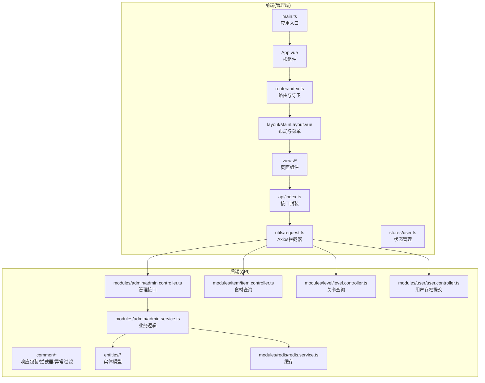
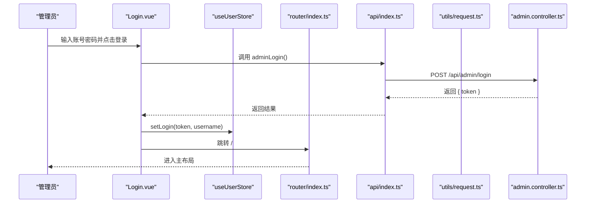
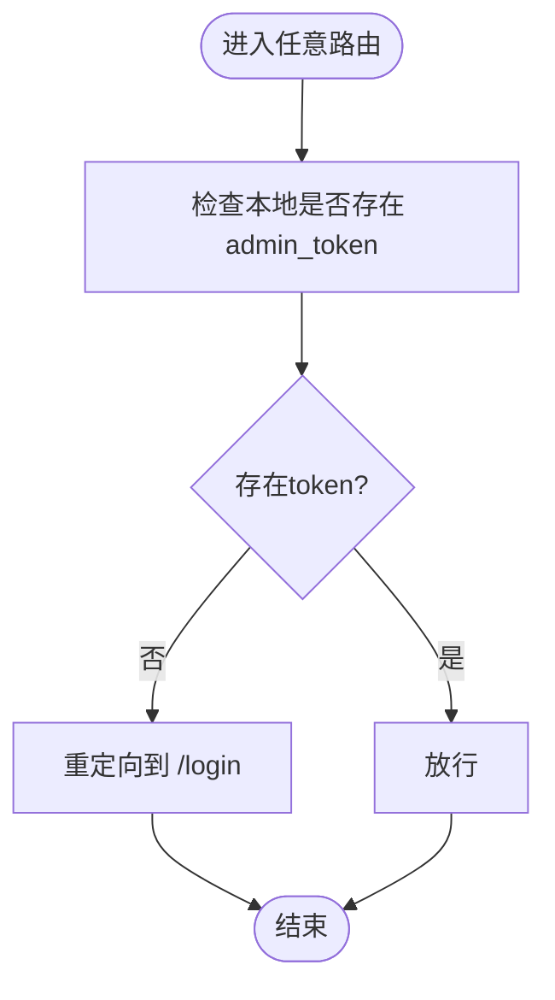
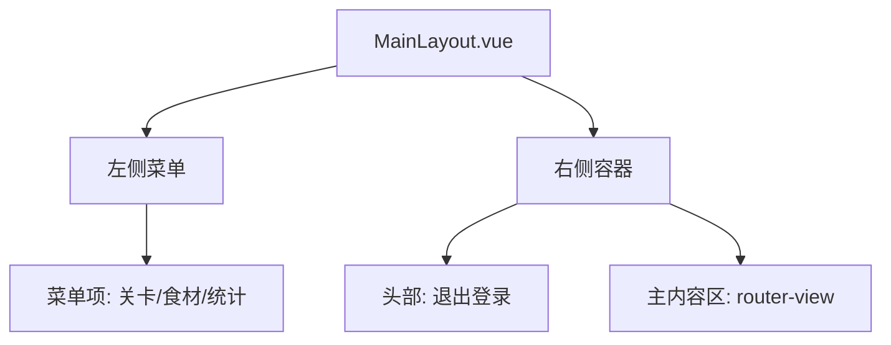
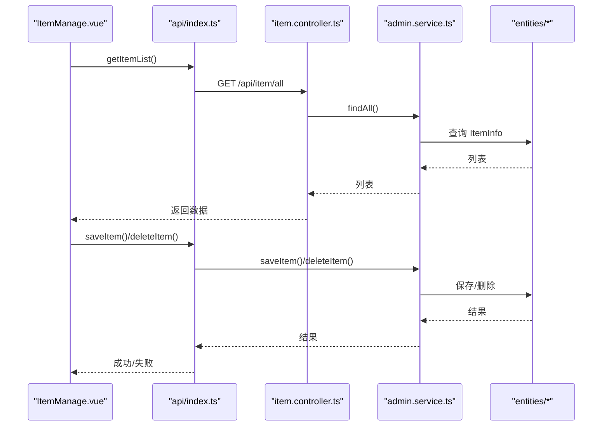
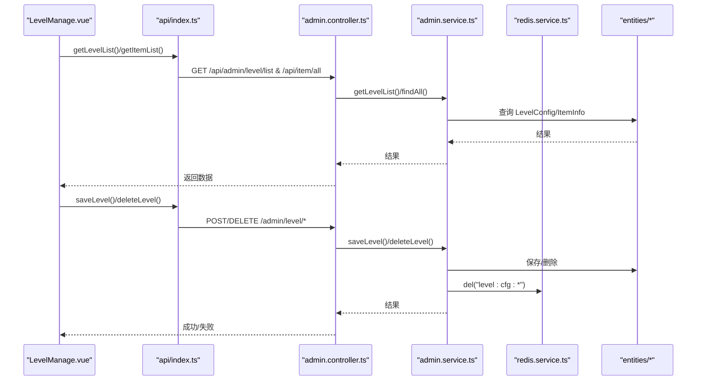
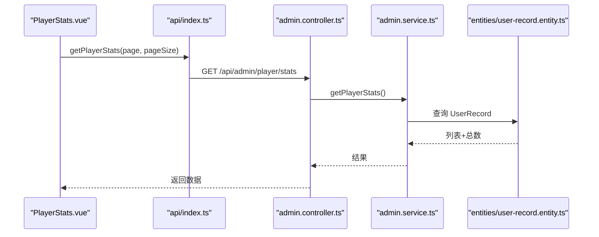
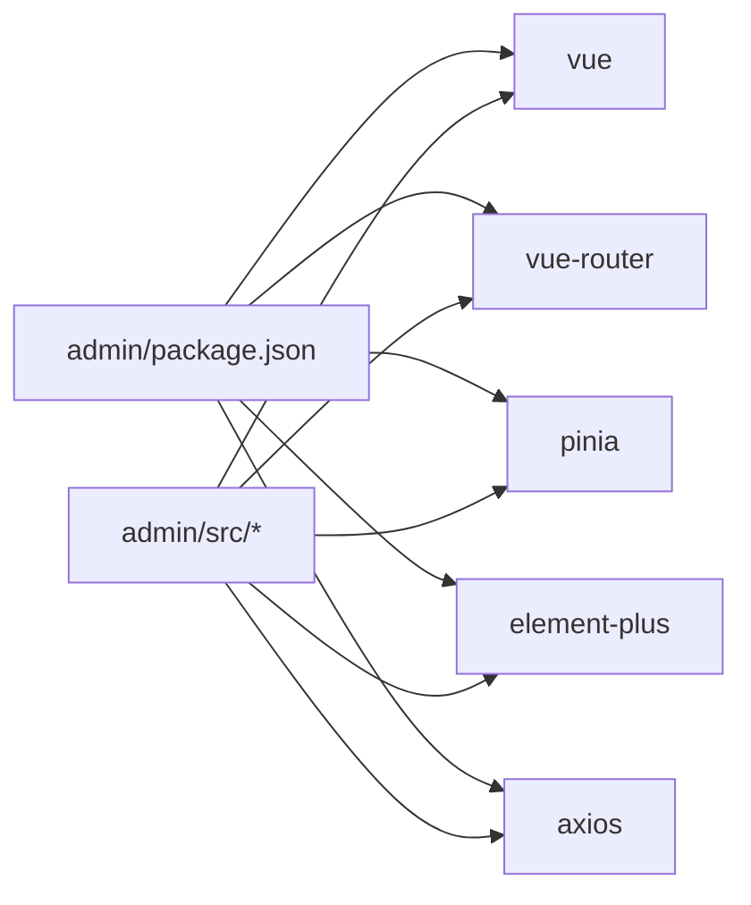

# 管理端功能

<cite>
**本文引用的文件**
- [package.json](file://admin/package.json)
- [main.ts](file://admin/src/main.ts)
- [App.vue](file://admin/src/App.vue)
- [router/index.ts](file://admin/src/router/index.ts)
- [stores/user.ts](file://admin/src/stores/user.ts)
- [utils/request.ts](file://admin/src/utils/request.ts)
- [api/index.ts](file://admin/src/api/index.ts)
- [layout/MainLayout.vue](file://admin/src/layout/MainLayout.vue)
- [views/Login.vue](file://admin/src/views/Login.vue)
- [views/LevelManage.vue](file://admin/src/views/LevelManage.vue)
- [views/ItemManage.vue](file://admin/src/views/ItemManage.vue)
- [views/PlayerStats.vue](file://admin/src/views/PlayerStats.vue)
- [modules/admin/admin.controller.ts](file://backend/src/modules/admin/admin.controller.ts)
- [modules/admin/admin.service.ts](file://backend/src/modules/admin/admin.service.ts)
- [modules/item/item.controller.ts](file://backend/src/modules/item/item.controller.ts)
- [modules/level/level.controller.ts](file://backend/src/modules/level/level.controller.ts)
- [modules/user/user.controller.ts](file://backend/src/modules/user/user.controller.ts)
- [common/result.ts](file://backend/src/common/result.ts)
- [common/http-exception.filter.ts](file://backend/src/common/http-exception.filter.ts)
- [common/transform.interceptor.ts](file://backend/src/common/transform.interceptor.ts)
- [entities/level-config.entity.ts](file://backend/src/entities/level-config.entity.ts)
- [entities/item-info.entity.ts](file://backend/src/entities/item-info.entity.ts)
- [entities/user-record.entity.ts](file://backend/src/entities/user-record.entity.ts)
- [modules/redis/redis.service.ts](file://backend/src/modules/redis/redis.service.ts)
- [vite.config.ts](file://admin/vite.config.ts)
- [tsconfig.json](file://admin/tsconfig.json)
- [deploy/Dockerfile](file://deploy/Dockerfile)
- [deploy/docker-compose.yml](file://deploy/docker-compose.yml)
- [deploy/nginx/default.conf](file://deploy/nginx/default.conf)
</cite>

## 目录
1. [简介](#简介)
2. [项目结构](#项目结构)
3. [核心组件](#核心组件)
4. [架构总览](#架构总览)
5. [详细组件分析](#详细组件分析)
6. [依赖关系分析](#依赖关系分析)
7. [性能考虑](#性能考虑)
8. [故障排查指南](#故障排查指南)
9. [结论](#结论)
10. [附录](#附录)

## 简介
本文件面向管理端功能，系统性阐述登录认证机制、权限管理与界面布局设计，并深入解析物品管理、关卡配置、玩家统计三大核心功能模块的实现原理与使用方法。文档覆盖 Vue 组件架构、路由配置、状态管理与 API 调用流程，提供界面操作指南、数据展示逻辑与交互设计说明，同时给出前端技术栈、构建配置与部署要求。

## 项目结构
管理端采用前后端分离架构：前端基于 Vue 3 + TypeScript + Vite，使用 Element Plus 作为 UI 组件库；后端基于 NestJS + TypeORM + Redis，提供 REST 接口与数据持久化。管理端通过统一的 Axios 封装进行 API 调用，路由守卫保障未登录访问拦截。

**图表来源**
- [main.ts:1-20](file://admin/src/main.ts#L1-L20)
- [router/index.ts:1-53](file://admin/src/router/index.ts#L1-L53)
- [layout/MainLayout.vue:1-53](file://admin/src/layout/MainLayout.vue#L1-L53)
- [views/Login.vue:1-55](file://admin/src/views/Login.vue#L1-L55)
- [views/LevelManage.vue:1-139](file://admin/src/views/LevelManage.vue#L1-L139)
- [views/ItemManage.vue:1-96](file://admin/src/views/ItemManage.vue#L1-L96)
- [views/PlayerStats.vue:1-39](file://admin/src/views/PlayerStats.vue#L1-L39)
- [api/index.ts:1-34](file://admin/src/api/index.ts#L1-L34)
- [utils/request.ts:1-44](file://admin/src/utils/request.ts#L1-L44)
- [stores/user.ts:1-27](file://admin/src/stores/user.ts#L1-L27)
- [modules/admin/admin.controller.ts:1-63](file://backend/src/modules/admin/admin.controller.ts#L1-L63)
- [modules/admin/admin.service.ts:1-79](file://backend/src/modules/admin/admin.service.ts#L1-L79)
- [modules/item/item.controller.ts:1-17](file://backend/src/modules/item/item.controller.ts#L1-L17)
- [modules/level/level.controller.ts:1-17](file://backend/src/modules/level/level.controller.ts#L1-L17)
- [modules/user/user.controller.ts:1-17](file://backend/src/modules/user/user.controller.ts#L1-L17)
- [common/result.ts](file://backend/src/common/result.ts)
- [common/http-exception.filter.ts](file://backend/src/common/http-exception.filter.ts)
- [common/transform.interceptor.ts](file://backend/src/common/transform.interceptor.ts)
- [entities/level-config.entity.ts](file://backend/src/entities/level-config.entity.ts)
- [entities/item-info.entity.ts](file://backend/src/entities/item-info.entity.ts)
- [entities/user-record.entity.ts](file://backend/src/entities/user-record.entity.ts)
- [modules/redis/redis.service.ts](file://backend/src/modules/redis/redis.service.ts)

**章节来源**
- [package.json:1-25](file://admin/package.json#L1-L25)
- [main.ts:1-20](file://admin/src/main.ts#L1-L20)
- [router/index.ts:1-53](file://admin/src/router/index.ts#L1-L53)

## 核心组件
- 应用入口与插件注册：初始化 Vue 应用、Element Plus、Pinia、路由，全局注册图标组件。
- 路由与守卫：定义登录页与主布局子路由，设置导航前守卫拦截未登录访问。
- 状态管理：集中维护管理员 token 与登录态，支持本地存储同步。
- 请求封装：统一 baseURL、超时、请求头附加 token、响应统一错误处理与 401 自动跳转登录。
- 视图组件：登录、关卡管理、食材配置、玩家统计四大页面，均采用 Element Plus 表格、分页与对话框。

**章节来源**
- [main.ts:1-20](file://admin/src/main.ts#L1-L20)
- [router/index.ts:1-53](file://admin/src/router/index.ts#L1-L53)
- [stores/user.ts:1-27](file://admin/src/stores/user.ts#L1-L27)
- [utils/request.ts:1-44](file://admin/src/utils/request.ts#L1-L44)
- [api/index.ts:1-34](file://admin/src/api/index.ts#L1-L34)

## 架构总览
管理端采用“前端路由 + 后端 REST API”的典型 SPA 架构。前端负责 UI 展示与交互，后端提供统一接口与数据持久化。登录成功后，前端将 token 写入本地存储并通过请求拦截器注入到每个请求头中，后端通过统一响应包装与拦截器保证接口一致性。

**图表来源**
- [views/Login.vue:40-53](file://admin/src/views/Login.vue#L40-L53)
- [stores/user.ts:14-18](file://admin/src/stores/user.ts#L14-L18)
- [router/index.ts:42-50](file://admin/src/router/index.ts#L42-L50)
- [api/index.ts:4-5](file://admin/src/api/index.ts#L4-L5)
- [utils/request.ts:11-20](file://admin/src/utils/request.ts#L11-L20)
- [modules/admin/admin.controller.ts:54-61](file://backend/src/modules/admin/admin.controller.ts#L54-L61)

## 详细组件分析

### 登录认证与权限管理
- 登录流程：表单校验 -> 调用登录接口 -> 成功后写入 token 并跳转首页。
- 权限控制：路由守卫读取本地 token，未登录访问非登录路由自动重定向至登录页。
- 请求拦截：所有请求自动附加 Authorization 头；响应 401 自动清理 token 并跳转登录。
- 退出登录：清空状态与本地存储，返回登录页。

**图表来源**
- [router/index.ts:43-50](file://admin/src/router/index.ts#L43-L50)
- [utils/request.ts:22-41](file://admin/src/utils/request.ts#L22-L41)
- [stores/user.ts:20-24](file://admin/src/stores/user.ts#L20-L24)

**章节来源**
- [views/Login.vue:40-53](file://admin/src/views/Login.vue#L40-L53)
- [router/index.ts:42-50](file://admin/src/router/index.ts#L42-L50)
- [utils/request.ts:10-41](file://admin/src/utils/request.ts#L10-L41)
- [stores/user.ts:12-26](file://admin/src/stores/user.ts#L12-L26)

### 界面布局设计
- 主布局：左侧菜单固定宽度，右侧内容区域包含头部与主内容区；顶部提供退出登录按钮。
- 菜单项：关卡管理、食材配置、玩家统计，对应子路由路径分别为 /level、/item、/player。
- 响应式与主题：Element Plus 菜单样式与颜色变量统一，适配不同屏幕尺寸。

**图表来源**
- [layout/MainLayout.vue:1-53](file://admin/src/layout/MainLayout.vue#L1-L53)

**章节来源**
- [layout/MainLayout.vue:1-53](file://admin/src/layout/MainLayout.vue#L1-L53)
- [router/index.ts:14-34](file://admin/src/router/index.ts#L14-L34)

### 物品管理（食材配置）
- 功能概览：查看全量食材、新增/编辑食材、删除食材；支持分页与表单校验。
- 数据流：首次加载调用 /item/all 获取食材列表；新增/编辑调用 /admin/item/save；删除调用 /admin/item/:itemKey。
- 交互细节：弹窗表单、多选/输入框、确认删除、保存成功提示。

**图表来源**
- [views/ItemManage.vue:58-92](file://admin/src/views/ItemManage.vue#L58-L92)
- [api/index.ts:19-29](file://admin/src/api/index.ts#L19-L29)
- [modules/item/item.controller.ts:10-15](file://backend/src/modules/item/item.controller.ts#L10-L15)
- [modules/admin/admin.service.ts:53-67](file://backend/src/modules/admin/admin.service.ts#L53-L67)
- [entities/item-info.entity.ts](file://backend/src/entities/item-info.entity.ts)

**章节来源**
- [views/ItemManage.vue:1-96](file://admin/src/views/ItemManage.vue#L1-L96)
- [api/index.ts:19-29](file://admin/src/api/index.ts#L19-L29)
- [modules/item/item.controller.ts:1-17](file://backend/src/modules/item/item.controller.ts#L1-L17)
- [modules/admin/admin.service.ts:53-67](file://backend/src/modules/admin/admin.service.ts#L53-L67)

### 关卡配置
- 功能概览：查看关卡列表（分页）、新增/编辑关卡、删除关卡；支持食材类型多选与总数设置。
- 数据流：加载列表调用 /admin/level/list；获取可选项调用 /item/all；保存调用 /admin/level/save；删除调用 /admin/level/:levelNo。
- 缓存策略：保存/删除关卡后，后端清除对应 Redis 缓存键，确保配置生效。

**图表来源**
- [views/LevelManage.vue:90-132](file://admin/src/views/LevelManage.vue#L90-L132)
- [api/index.ts:7-17](file://admin/src/api/index.ts#L7-L17)
- [modules/admin/admin.controller.ts:10-31](file://backend/src/modules/admin/admin.controller.ts#L10-L31)
- [modules/admin/admin.service.ts:22-51](file://backend/src/modules/admin/admin.service.ts#L22-L51)
- [modules/redis/redis.service.ts](file://backend/src/modules/redis/redis.service.ts)
- [entities/level-config.entity.ts](file://backend/src/entities/level-config.entity.ts)
- [entities/item-info.entity.ts](file://backend/src/entities/item-info.entity.ts)

**章节来源**
- [views/LevelManage.vue:1-139](file://admin/src/views/LevelManage.vue#L1-L139)
- [api/index.ts:7-17](file://admin/src/api/index.ts#L7-L17)
- [modules/admin/admin.controller.ts:10-31](file://backend/src/modules/admin/admin.controller.ts#L10-L31)
- [modules/admin/admin.service.ts:22-51](file://backend/src/modules/admin/admin.service.ts#L22-L51)

### 玩家统计
- 功能概览：分页展示玩家通关记录，字段包括 openid、最高通关关卡、更新时间。
- 数据流：调用 /admin/player/stats 获取分页数据；支持页码与每页数量参数。

**图表来源**
- [views/PlayerStats.vue:31-35](file://admin/src/views/PlayerStats.vue#L31-L35)
- [api/index.ts:31-33](file://admin/src/api/index.ts#L31-L33)
- [modules/admin/admin.controller.ts:47-51](file://backend/src/modules/admin/admin.controller.ts#L47-L51)
- [modules/admin/admin.service.ts:69-77](file://backend/src/modules/admin/admin.service.ts#L69-L77)
- [entities/user-record.entity.ts](file://backend/src/entities/user-record.entity.ts)

**章节来源**
- [views/PlayerStats.vue:1-39](file://admin/src/views/PlayerStats.vue#L1-L39)
- [api/index.ts:31-33](file://admin/src/api/index.ts#L31-L33)
- [modules/admin/admin.controller.ts:47-51](file://backend/src/modules/admin/admin.controller.ts#L47-L51)
- [modules/admin/admin.service.ts:69-77](file://backend/src/modules/admin/admin.service.ts#L69-L77)

## 依赖关系分析
- 前端依赖：Vue 3、Vue Router、Pinia、Element Plus、Axios、TypeScript、Vite。
- 后端依赖：NestJS、TypeORM、Redis、数据库驱动。
- 前后端通信：统一以 /api 前缀，前端 Axios baseURL 指向代理目标，后端返回统一 Result 包装。

**图表来源**
- [package.json:10-23](file://admin/package.json#L10-L23)

**章节来源**
- [package.json:1-25](file://admin/package.json#L1-L25)

## 性能考虑
- 前端优化建议
  - 路由懒加载：当前已使用动态导入，减少首屏体积。
  - 表格分页：列表接口支持分页，避免一次性加载大量数据。
  - 缓存策略：后端对关卡配置使用 Redis 缓存，前端在保存/删除后触发后端清理，降低重复查询成本。
- 后端优化建议
  - 查询排序：按主键或索引列排序，避免全表扫描。
  - 批量操作：批量删除/更新时尽量合并事务，减少 IO 次数。
  - 缓存命中：合理设置 Redis TTL，避免热点键过期风暴。

## 故障排查指南
- 登录失败
  - 检查用户名/密码是否正确；后端登录接口为硬编码校验。
  - 查看浏览器控制台是否有网络错误或跨域问题。
- 401 未授权
  - 检查本地是否仍存在 admin_token；响应拦截器会在 401 时自动清理并跳转登录。
- 接口报错
  - 统一错误提示由响应拦截器处理；若无提示，检查后端异常过滤器与拦截器是否生效。
- 数据不刷新
  - 关卡配置保存/删除后需等待后端清理 Redis 缓存；可在前端重新刷新页面验证。

**章节来源**
- [views/Login.vue:40-53](file://admin/src/views/Login.vue#L40-L53)
- [utils/request.ts:22-41](file://admin/src/utils/request.ts#L22-L41)
- [modules/admin/admin.controller.ts:54-61](file://backend/src/modules/admin/admin.controller.ts#L54-L61)
- [common/http-exception.filter.ts](file://backend/src/common/http-exception.filter.ts)
- [common/transform.interceptor.ts](file://backend/src/common/transform.interceptor.ts)

## 结论
管理端通过清晰的路由与状态管理、统一的请求封装与后端接口，实现了登录认证、权限控制与三大核心功能模块的完整闭环。前端采用组件化与分页策略，后端结合缓存与统一响应包装，具备良好的扩展性与可维护性。建议后续引入更完善的鉴权方案（如 JWT 签发/校验）与权限细化（菜单/按钮级权限），以满足更高安全与灵活性需求。

## 附录

### 前端技术栈与构建配置
- 技术栈：Vue 3 + TypeScript + Vite + Element Plus + Pinia + Axios
- 构建脚本：开发、构建、预览命令分别对应 dev/build/preview
- 类型配置：tsconfig.json 与 tsconfig.node.json 分别用于应用与构建工具链

**章节来源**
- [package.json:5-8](file://admin/package.json#L5-L8)
- [tsconfig.json](file://admin/tsconfig.json)

### 部署要求与容器化
- 容器镜像：Dockerfile 定义镜像构建步骤
- 编排：docker-compose.yml 管理服务编排
- 反向代理：nginx/default.conf 提供静态资源与反向代理配置

**章节来源**
- [deploy/Dockerfile](file://deploy/Dockerfile)
- [deploy/docker-compose.yml](file://deploy/docker-compose.yml)
- [deploy/nginx/default.conf](file://deploy/nginx/default.conf)