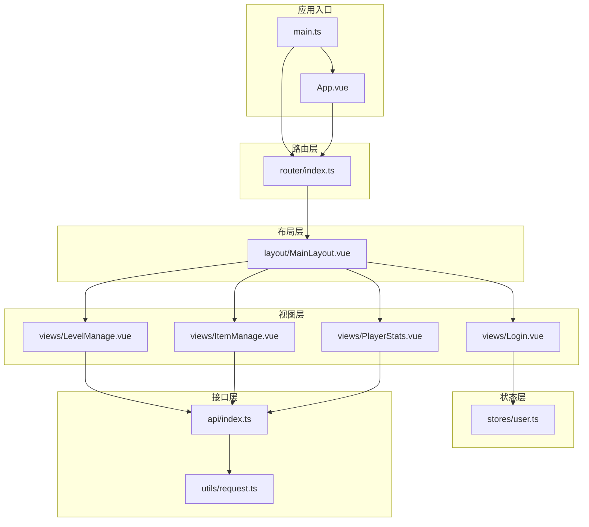
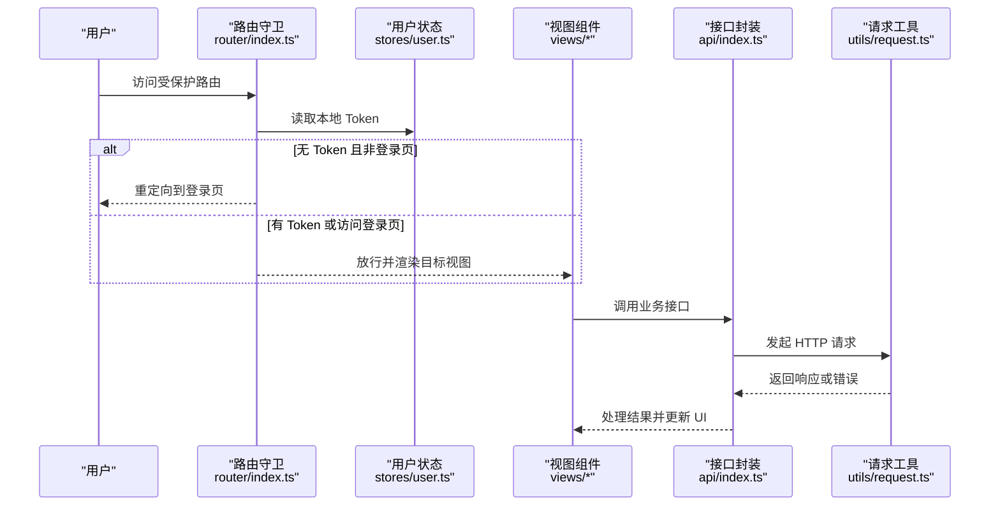
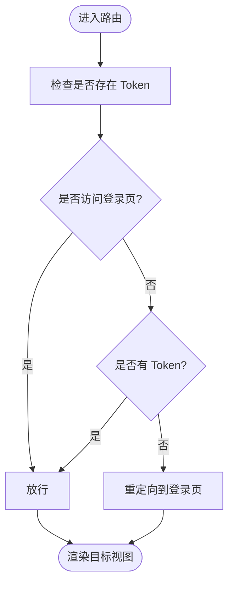
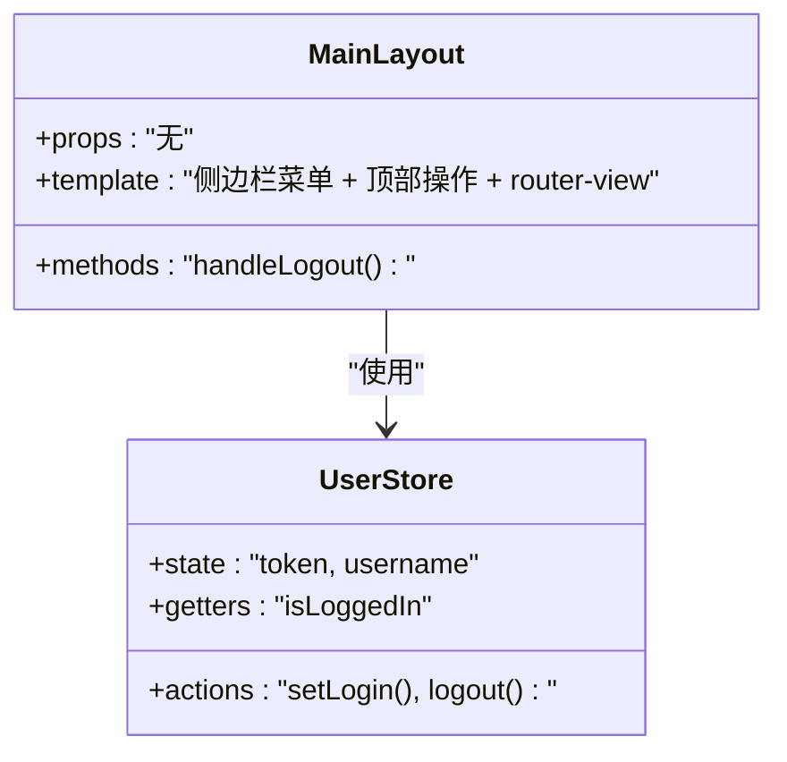
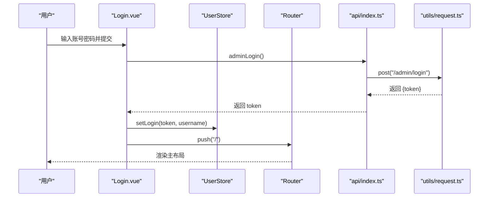
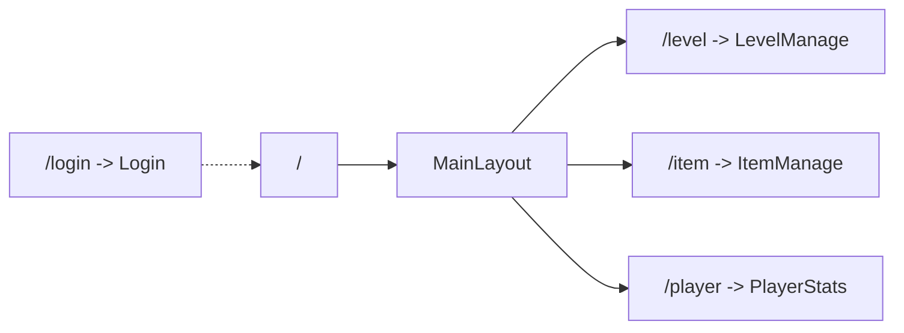
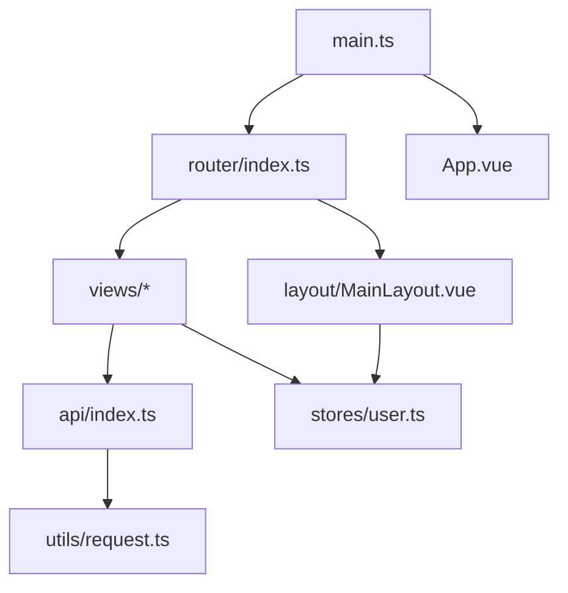

# 路由导航

<cite>
**本文引用的文件**
- [router/index.ts](file://admin/src/router/index.ts)
- [layout/MainLayout.vue](file://admin/src/layout/MainLayout.vue)
- [stores/user.ts](file://admin/src/stores/user.ts)
- [views/Login.vue](file://admin/src/views/Login.vue)
- [views/LevelManage.vue](file://admin/src/views/LevelManage.vue)
- [views/ItemManage.vue](file://admin/src/views/ItemManage.vue)
- [views/PlayerStats.vue](file://admin/src/views/PlayerStats.vue)
- [App.vue](file://admin/src/App.vue)
- [main.ts](file://admin/src/main.ts)
- [api/index.ts](file://admin/src/api/index.ts)
- [utils/request.ts](file://admin/src/utils/request.ts)
- [vite.config.ts](file://admin/vite.config.ts)
</cite>

## 目录
1. [简介](#简介)
2. [项目结构](#项目结构)
3. [核心组件](#核心组件)
4. [架构总览](#架构总览)
5. [详细组件分析](#详细组件分析)
6. [依赖关系分析](#依赖关系分析)
7. [性能考虑](#性能考虑)
8. [故障排除指南](#故障排除指南)
9. [结论](#结论)

## 简介
本文件面向管理端路由导航系统，系统基于 Vue 3 + Vue Router 4 + Pinia + Element Plus 构建，提供完整的路由配置、页面路由映射、导航守卫、侧边栏菜单生成、面包屑导航与权限控制能力。系统采用懒加载、嵌套路由与动态路由（通过用户状态）实现，结合 Pinia 状态管理与 Axios 统一请求封装，完成登录认证与权限拦截。

## 项目结构
管理端前端位于 admin 目录，核心目录与文件如下：
- src/router：路由定义与导航守卫
- src/layout：布局组件（主布局）
- src/stores：状态管理（用户登录态）
- src/views：页面视图（登录、关卡管理、食材配置、玩家统计）
- src/api：接口封装
- src/utils：请求工具（Axios 封装）
- src/main.ts：应用入口
- vite.config.ts：开发服务器与代理配置

图表来源
- [main.ts:1-20](file://admin/src/main.ts#L1-L20)
- [router/index.ts:1-53](file://admin/src/router/index.ts#L1-L53)
- [layout/MainLayout.vue:1-53](file://admin/src/layout/MainLayout.vue#L1-L53)
- [stores/user.ts:1-27](file://admin/src/stores/user.ts#L1-L27)
- [views/Login.vue:1-55](file://admin/src/views/Login.vue#L1-L55)
- [views/LevelManage.vue:1-139](file://admin/src/views/LevelManage.vue#L1-L139)
- [views/ItemManage.vue:1-96](file://admin/src/views/ItemManage.vue#L1-L96)
- [views/PlayerStats.vue:1-39](file://admin/src/views/PlayerStats.vue#L1-L39)
- [api/index.ts:1-34](file://admin/src/api/index.ts#L1-L34)
- [utils/request.ts:1-44](file://admin/src/utils/request.ts#L1-L44)

章节来源
- [main.ts:1-20](file://admin/src/main.ts#L1-L20)
- [router/index.ts:1-53](file://admin/src/router/index.ts#L1-L53)

## 核心组件
- 路由配置与导航守卫：定义登录页、嵌套路由与全局前置守卫
- 主布局组件：左侧菜单、顶部操作区、内容区与退出登录
- 用户状态管理：Token 存储、登录/登出、登录态判断
- 页面视图：登录、关卡管理、食材配置、玩家统计
- 接口封装与请求工具：统一前缀、拦截器、错误处理与 401 自动跳转
- 应用入口：注册 Element Plus 图标、Pinia、Vue Router 并挂载

章节来源
- [router/index.ts:1-53](file://admin/src/router/index.ts#L1-L53)
- [layout/MainLayout.vue:1-53](file://admin/src/layout/MainLayout.vue#L1-L53)
- [stores/user.ts:1-27](file://admin/src/stores/user.ts#L1-L27)
- [views/Login.vue:1-55](file://admin/src/views/Login.vue#L1-L55)
- [views/LevelManage.vue:1-139](file://admin/src/views/LevelManage.vue#L1-L139)
- [views/ItemManage.vue:1-96](file://admin/src/views/ItemManage.vue#L1-L96)
- [views/PlayerStats.vue:1-39](file://admin/src/views/PlayerStats.vue#L1-L39)
- [api/index.ts:1-34](file://admin/src/api/index.ts#L1-L34)
- [utils/request.ts:1-44](file://admin/src/utils/request.ts#L1-L44)
- [main.ts:1-20](file://admin/src/main.ts#L1-L20)

## 架构总览
系统采用“路由驱动视图”的单页应用架构，路由负责页面切换与权限拦截；布局组件承载菜单与内容区域；状态管理负责登录态；接口层统一处理请求与响应。

图表来源
- [router/index.ts:42-50](file://admin/src/router/index.ts#L42-L50)
- [stores/user.ts:9-11](file://admin/src/stores/user.ts#L9-L11)
- [views/Login.vue:40-53](file://admin/src/views/Login.vue#L40-L53)
- [api/index.ts:1-34](file://admin/src/api/index.ts#L1-L34)
- [utils/request.ts:10-41](file://admin/src/utils/request.ts#L10-L41)

## 详细组件分析

### 路由配置与导航守卫
- 路由结构
  - 登录页：独立路由，不参与嵌套
  - 根路由：主布局容器，子路由为关卡管理、食材配置、玩家统计
- 路由懒加载
  - 所有视图组件均通过动态导入实现按需加载
- 导航守卫
  - 全局前置守卫：未登录访问受保护路由时重定向至登录页
  - 登录成功后写入 Token 并跳转根路由

图表来源
- [router/index.ts:42-50](file://admin/src/router/index.ts#L42-L50)

章节来源
- [router/index.ts:4-35](file://admin/src/router/index.ts#L4-L35)
- [router/index.ts:42-50](file://admin/src/router/index.ts#L42-L50)

### 主布局与侧边栏菜单
- 左侧菜单
  - 使用 Element Plus 菜单组件，绑定当前路由路径作为默认激活项
  - 菜单项对应各子路由路径，点击自动跳转
- 顶部操作区
  - 提供退出登录按钮，调用用户状态的登出方法并跳转登录页
- 内容区
  - 通过 router-view 渲染子路由视图

图表来源
- [layout/MainLayout.vue:1-53](file://admin/src/layout/MainLayout.vue#L1-L53)
- [stores/user.ts:1-27](file://admin/src/stores/user.ts#L1-L27)

章节来源
- [layout/MainLayout.vue:1-53](file://admin/src/layout/MainLayout.vue#L1-L53)
- [stores/user.ts:1-27](file://admin/src/stores/user.ts#L1-L27)

### 登录流程与权限控制
- 登录表单
  - 校验账号与密码，提交后调用接口封装的登录方法
  - 成功后写入 Token 到状态与本地存储，并提示成功，跳转根路由
- 权限控制
  - 路由守卫在进入受保护路由前检查 Token
  - 请求拦截器自动附加 Authorization 头
  - 响应拦截器处理 401 未授权并跳转登录页

图表来源
- [views/Login.vue:40-53](file://admin/src/views/Login.vue#L40-L53)
- [stores/user.ts:12-18](file://admin/src/stores/user.ts#L12-L18)
- [router/index.ts:37-40](file://admin/src/router/index.ts#L37-L40)
- [api/index.ts:3-5](file://admin/src/api/index.ts#L3-L5)
- [utils/request.ts:10-20](file://admin/src/utils/request.ts#L10-L20)

章节来源
- [views/Login.vue:1-55](file://admin/src/views/Login.vue#L1-L55)
- [stores/user.ts:1-27](file://admin/src/stores/user.ts#L1-L27)
- [utils/request.ts:1-44](file://admin/src/utils/request.ts#L1-L44)

### 页面路由映射与嵌套路由
- 根路由指向主布局，子路由包括：
  - 关卡管理：路径 "/level"
  - 食材配置：路径 "/item"
  - 玩家统计：路径 "/player"
- 各子路由均配置了 meta.title 用于后续面包屑等扩展

图表来源
- [router/index.ts:4-35](file://admin/src/router/index.ts#L4-L35)

章节来源
- [router/index.ts:4-35](file://admin/src/router/index.ts#L4-L35)

### 动态路由与权限验证
- 动态路由实现思路
  - 当前系统通过 Pinia 的用户状态与路由守卫实现“动态”权限控制：根据登录态决定是否放行
  - 若需要更复杂的动态路由（例如根据角色动态注入菜单与路由），可在登录成功后根据返回的角色信息动态生成路由表并调用路由实例进行注入
- 权限验证机制
  - 路由守卫：全局前置守卫检查 Token
  - 请求拦截：自动附加 Authorization 头
  - 响应拦截：401 未授权自动清理 Token 并跳转登录

章节来源
- [router/index.ts:42-50](file://admin/src/router/index.ts#L42-L50)
- [utils/request.ts:10-31](file://admin/src/utils/request.ts#L10-L31)
- [stores/user.ts:19-24](file://admin/src/stores/user.ts#L19-L24)

### 面包屑导航与菜单生成
- 菜单生成
  - 主布局中静态声明菜单项，索引值与子路由路径一致，实现点击即跳转
- 面包屑导航
  - 当前代码未实现自动面包屑，可基于路由 meta.title 与 $route.matched 结果构建
  - 建议在布局组件中计算面包屑数组，遍历 $route.matched 并拼接标题

章节来源
- [layout/MainLayout.vue:8-27](file://admin/src/layout/MainLayout.vue#L8-L27)
- [router/index.ts:18-31](file://admin/src/router/index.ts#L18-L31)

### 路由懒加载与性能优化
- 懒加载
  - 所有视图组件通过动态导入实现按需加载，减少首屏体积
- 性能建议
  - 对频繁访问的页面可考虑预加载策略
  - 使用 keep-alive 缓存不常变化的页面组件

章节来源
- [router/index.ts:8, 18, 24, 30](file://admin/src/router/index.ts#L8,L18,L24,L30)

### 布局组件使用与导航状态管理
- 布局组件
  - MainLayout 作为根路由的子组件，承载菜单、头部与内容区
- 导航状态
  - 使用 Pinia 管理登录态，提供 isLoggedIn getter 与 setLogin/logout 方法
  - 退出登录时清除本地存储中的 Token 并跳转登录页

章节来源
- [layout/MainLayout.vue:41-51](file://admin/src/layout/MainLayout.vue#L41-L51)
- [stores/user.ts:1-27](file://admin/src/stores/user.ts#L1-L27)

### 路由元信息与页面访问控制
- 路由元信息
  - 各子路由配置了 meta.title，可用于面包屑、页面标题等扩展
- 页面访问控制
  - 通过路由守卫与请求拦截器共同实现：未登录禁止访问受保护路由，服务端 401 自动跳转登录

章节来源
- [router/index.ts:18-31](file://admin/src/router/index.ts#L18-L31)
- [utils/request.ts:22-33](file://admin/src/utils/request.ts#L22-L33)

## 依赖关系分析
- 应用入口依赖
  - main.ts 注册 Element Plus、Pinia、Vue Router，并挂载应用
- 路由依赖
  - router/index.ts 定义路由与守卫，依赖布局组件与视图组件
- 视图依赖
  - 各页面依赖 api/index.ts 进行数据交互，依赖 utils/request.ts 进行请求封装
- 状态依赖
  - stores/user.ts 为全局状态，被登录页与布局组件使用

图表来源
- [main.ts:1-20](file://admin/src/main.ts#L1-L20)
- [router/index.ts:1-53](file://admin/src/router/index.ts#L1-L53)
- [layout/MainLayout.vue:1-53](file://admin/src/layout/MainLayout.vue#L1-L53)
- [stores/user.ts:1-27](file://admin/src/stores/user.ts#L1-L27)
- [views/Login.vue:1-55](file://admin/src/views/Login.vue#L1-L55)
- [api/index.ts:1-34](file://admin/src/api/index.ts#L1-L34)
- [utils/request.ts:1-44](file://admin/src/utils/request.ts#L1-L44)

章节来源
- [main.ts:1-20](file://admin/src/main.ts#L1-L20)
- [router/index.ts:1-53](file://admin/src/router/index.ts#L1-L53)

## 性能考虑
- 路由懒加载：所有视图组件均采用动态导入，降低首屏加载压力
- 请求缓存：可结合业务场景在 api 层增加缓存策略（如分页数据缓存）
- 组件复用：对重复渲染的表格与分页组件，可使用 v-memo 或 keep-alive 减少重绘
- 开发代理：vite.config.ts 配置 /api 代理到后端服务，便于联调与热更新

章节来源
- [router/index.ts:8, 18, 24, 30](file://admin/src/router/index.ts#L8,L18,L24,L30)
- [vite.config.ts:1-16](file://admin/vite.config.ts#L1-L16)

## 故障排除指南
- 登录后无法进入受保护页面
  - 检查路由守卫逻辑与 Token 是否正确写入本地存储
  - 确认登录成功后是否跳转根路由
- 请求 401 未授权
  - 检查请求拦截器是否附加 Authorization 头
  - 确认响应拦截器是否在 401 时清理 Token 并跳转登录页
- 退出登录后仍显示受保护页面
  - 确认退出登录时是否清除了本地存储中的 Token
  - 检查路由守卫是否重新计算登录态

章节来源
- [router/index.ts:42-50](file://admin/src/router/index.ts#L42-L50)
- [utils/request.ts:10-31](file://admin/src/utils/request.ts#L10-L31)
- [stores/user.ts:19-24](file://admin/src/stores/user.ts#L19-L24)

## 结论
该管理端路由导航系统以 Vue Router 为核心，结合 Pinia 状态管理与 Axios 统一封装，实现了路由懒加载、嵌套路由、全局导航守卫与权限控制。主布局组件承担菜单与内容区职责，登录流程与权限拦截配合良好。后续可扩展动态路由注入、自动面包屑与更细粒度的权限控制，以满足复杂后台管理需求。