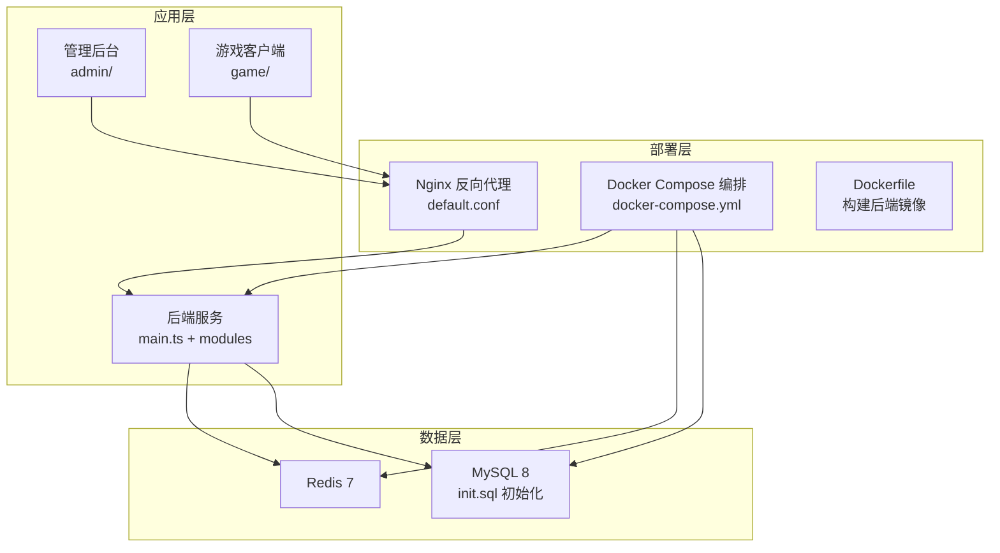
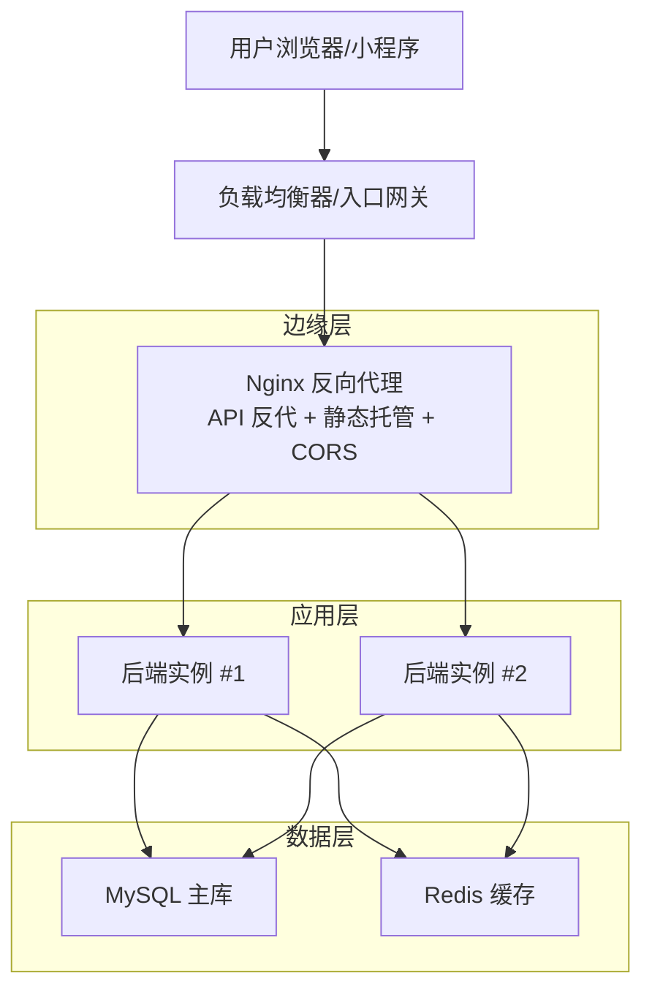
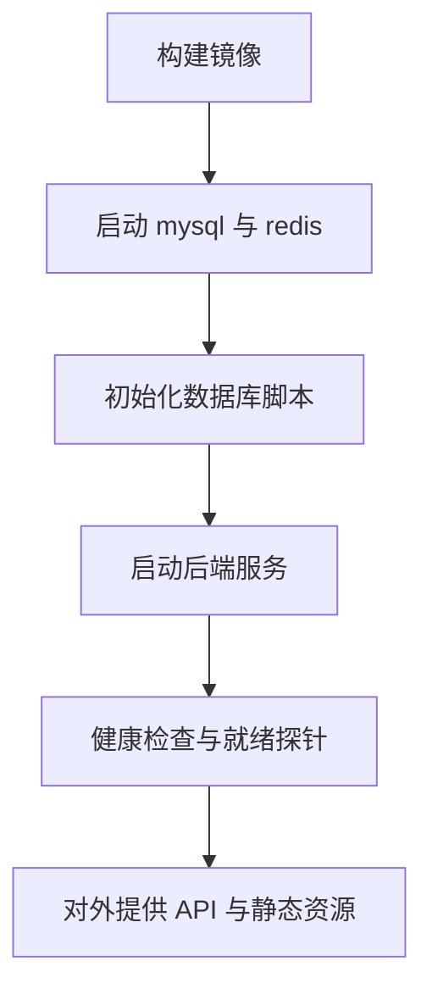
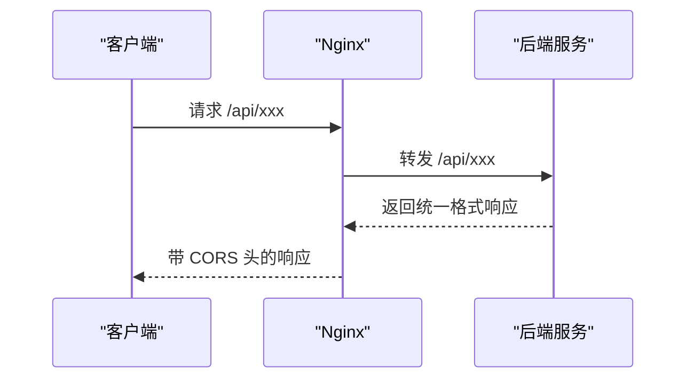
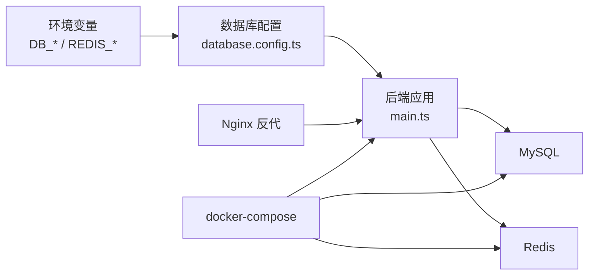

# 部署指南

<cite>
**本文引用的文件**
- [Dockerfile](file://deploy/Dockerfile)
- [docker-compose.yml](file://deploy/docker-compose.yml)
- [default.conf](file://deploy/nginx/default.conf)
- [deploy.md](file://deploy/deploy.md)
- [main.ts](file://backend/src/main.ts)
- [database.config.ts](file://backend/src/config/database.config.ts)
- [http-exception.filter.ts](file://backend/src/common/http-exception.filter.ts)
- [result.ts](file://backend/src/common/result.ts)
- [transform.interceptor.ts](file://backend/src/common/transform.interceptor.ts)
- [package.json（后端）](file://backend/package.json)
- [package.json（管理后台）](file://admin/package.json)
- [package.json（游戏客户端）](file://game/package.json)
- [vite.config.ts（管理后台）](file://admin/vite.config.ts)
- [vite.config.ts（游戏客户端）](file://game/vite.config.ts)
- [init.sql](file://sql/init.sql)
</cite>

## 目录
1. [简介](#简介)
2. [项目结构](#项目结构)
3. [核心组件](#核心组件)
4. [架构总览](#架构总览)
5. [详细组件分析](#详细组件分析)
6. [依赖关系分析](#依赖关系分析)
7. [性能考虑](#性能考虑)
8. [故障排查指南](#故障排查指南)
9. [结论](#结论)
10. [附录](#附录)

## 简介
本指南面向运维与开发团队，提供从本地开发到生产部署的完整落地步骤，涵盖 Docker 容器化、Nginx 反向代理、环境变量与 SSL 配置、生产部署与高可用、CI/CD 自动化、监控告警、性能调优、日志管理与故障排查，并给出不同环境（本地、测试、生产）的配置示例与最佳实践。

## 项目结构
该仓库采用多模块结构：
- 后端 NestJS 应用（API 服务）
- 管理后台（Vue + Vite）
- 游戏客户端（Vue + Vite，含微信小游戏构建）
- 部署编排（Docker + docker-compose + Nginx）
- 初始化 SQL（TypeORM 初始化）

图表来源
- [docker-compose.yml:1-68](file://deploy/docker-compose.yml#L1-L68)
- [default.conf:1-54](file://deploy/nginx/default.conf#L1-L54)
- [Dockerfile:1-23](file://deploy/Dockerfile#L1-L23)
- [main.ts:1-35](file://backend/src/main.ts#L1-L35)
- [init.sql:1-48](file://sql/init.sql#L1-L48)

章节来源
- [deploy.md:1-156](file://deploy/deploy.md#L1-L156)
- [docker-compose.yml:1-68](file://deploy/docker-compose.yml#L1-L68)

## 核心组件
- 后端服务：基于 NestJS，统一异常与响应格式，全局启用 CORS、路由前缀、验证管道与拦截器。
- 数据库与缓存：通过环境变量配置 MySQL 与 Redis 连接；使用 SQL 脚本初始化数据库。
- 反向代理：Nginx 提供 API 反代、静态资源托管与跨域支持。
- 容器化：Dockerfile 构建后端镜像；docker-compose 编排 MySQL、Redis、后端服务。
- 开发体验：管理后台与游戏客户端分别使用 Vite 开发服务器与代理到后端。

章节来源
- [main.ts:1-35](file://backend/src/main.ts#L1-L35)
- [database.config.ts:1-26](file://backend/src/config/database.config.ts#L1-L26)
- [default.conf:1-54](file://deploy/nginx/default.conf#L1-L54)
- [Dockerfile:1-23](file://deploy/Dockerfile#L1-L23)
- [docker-compose.yml:1-68](file://deploy/docker-compose.yml#L1-L68)
- [vite.config.ts（管理后台）:1-16](file://admin/vite.config.ts#L1-L16)
- [vite.config.ts（游戏客户端）:1-22](file://game/vite.config.ts#L1-L22)

## 架构总览
下图展示生产级部署的典型拓扑：Nginx 作为入口与静态资源分发，后端服务通过反向代理暴露 API；MySQL 与 Redis 作为持久化与缓存；容器编排确保服务可用性与扩展性。

图表来源
- [default.conf:1-54](file://deploy/nginx/default.conf#L1-L54)
- [docker-compose.yml:38-60](file://deploy/docker-compose.yml#L38-L60)

## 详细组件分析

### Docker 容器化与编排
- Dockerfile
  - 使用 Node.js 18 Alpine 基础镜像
  - 复制依赖与源码，安装依赖并构建
  - 暴露端口 3000，生产启动命令运行 dist/main
- docker-compose
  - MySQL 8：持久卷、初始化 SQL、字符集与排序规则
  - Redis 7：持久卷
  - 后端服务：依赖 MySQL/Redis，映射端口 3000，注入数据库与 Redis 环境变量
  - 网络：自定义桥接网络 goose_net

图表来源
- [Dockerfile:1-23](file://deploy/Dockerfile#L1-L23)
- [docker-compose.yml:1-68](file://deploy/docker-compose.yml#L1-L68)
- [init.sql:1-48](file://sql/init.sql#L1-L48)

章节来源
- [Dockerfile:1-23](file://deploy/Dockerfile#L1-L23)
- [docker-compose.yml:1-68](file://deploy/docker-compose.yml#L1-L68)

### Nginx 反向代理配置
- 反代后端 API：/api/ 路由转发至 backend:3000
- 静态资源托管：/admin/ 与 /game/ 对应静态目录，支持 SPA 回退
- 跨域支持：允许常用方法与头部，处理 OPTIONS 预检
- 默认访问：根路径指向游戏客户端静态首页

图表来源
- [default.conf:16-32](file://deploy/nginx/default.conf#L16-L32)
- [main.ts:10-16](file://backend/src/main.ts#L10-L16)

章节来源
- [default.conf:1-54](file://deploy/nginx/default.conf#L1-L54)

### 环境变量与配置
- 后端环境变量
  - 数据库：DB_HOST、DB_PORT、DB_USER、DB_PASS、DB_NAME
  - Redis：REDIS_HOST、REDIS_PORT、REDIS_PASS、REDIS_DB
  - 服务端口：PORT（默认 3000）
- 管理后台与游戏客户端
  - Vite 开发服务器端口分别为 5174 与 5173
  - 两者均将 /api 代理到本地 3000 端口
- 初始化 SQL
  - 创建数据库与三张表：关卡配置、玩家存档、食材资源
  - 插入示例数据用于快速验证

章节来源
- [database.config.ts:1-26](file://backend/src/config/database.config.ts#L1-L26)
- [docker-compose.yml:47-55](file://deploy/docker-compose.yml#L47-L55)
- [vite.config.ts（管理后台）:6-13](file://admin/vite.config.ts#L6-L13)
- [vite.config.ts（游戏客户端）:6-13](file://game/vite.config.ts#L6-L13)
- [init.sql:1-48](file://sql/init.sql#L1-L48)

### SSL 证书与安全加固
- 建议在 Nginx 层启用 HTTPS，绑定域名证书
- 强制 HTTP 重定向至 HTTPS
- 限制 TLS 版本与加密套件，禁用弱算法
- 配置 HSTS（可选）
- 后端开启严格 CORS 策略（生产环境仅允许特定源）

### 生产环境部署步骤
- 准备阶段
  - 准备服务器与域名，开放必要端口（80/443/3306/6379/3000+）
  - 准备 SSL 证书与密钥
- 部署流程
  - 构建并推送后端镜像至私有仓库或使用本地镜像
  - 修改 docker-compose 的镜像来源与环境变量
  - 启动 MySQL/Redis/后端服务
  - 配置 Nginx，挂载证书，启用 HTTPS，部署静态资源
  - 健康检查与灰度发布
- 验证
  - 访问 /api/level/get/1、/admin/、根路径，确认功能正常

章节来源
- [deploy.md:113-129](file://deploy/deploy.md#L113-L129)

### 负载均衡与高可用
- 多实例部署：后端至少部署两个实例，配合 Nginx upstream 实现轮询
- 健康检查：Nginx upstream 健康检查，后端提供 /health 接口
- 数据一致性：使用主从复制或集群版 MySQL；Redis 使用哨兵或集群
- 静态资源：CDN 分发 /admin/ 与 /game/ 静态资源
- 会话与缓存：Redis 集群，共享会话状态

### CI/CD 流水线与自动化部署
- 触发条件：push 到 main 分支或打标签
- 步骤
  - 代码检出与依赖安装
  - 单元测试与构建（后端、管理后台、游戏客户端）
  - 构建 Docker 镜像并推送到镜像仓库
  - 更新 docker-compose 配置（版本号或镜像 tag）
  - 执行远程部署（SSH 或编排平台）
  - 健康检查与回滚策略
- 工具推荐：GitHub Actions、GitLab CI、Jenkins、ArgoCD

**更新** 新的 Git 仓库迁移带来了更规范的分支策略和拉取请求工作流程，建议采用以下策略：
- 主分支保护：main 分支必须通过 CI 检查才能合并
- 功能分支：feature/* 用于新功能开发
- 修复分支：fix/* 用于 bug 修复
- 拉取请求：强制使用模板，包含测试覆盖和部署验证
- 自动化测试：每个 PR 必须通过单元测试、集成测试和部署测试

### 监控与告警
- 应用指标：Prometheus + Grafana，采集 CPU、内存、QPS、错误率、响应时间
- 日志：集中式日志（ELK/EFK），按服务与级别聚合
- 告警：阈值告警（错误率、延迟、连接数）、SLA 告警
- 健康检查：Nginx/容器健康探针，后端 /health 接口

## 依赖关系分析
后端服务对数据库与缓存的依赖通过环境变量注入，容器编排确保服务间连通性；Nginx 作为统一入口，负责静态资源与 API 反代。

图表来源
- [database.config.ts:1-26](file://backend/src/config/database.config.ts#L1-L26)
- [main.ts:1-35](file://backend/src/main.ts#L1-L35)
- [docker-compose.yml:1-68](file://deploy/docker-compose.yml#L1-L68)
- [default.conf:1-54](file://deploy/nginx/default.conf#L1-L54)

章节来源
- [database.config.ts:1-26](file://backend/src/config/database.config.ts#L1-L26)
- [main.ts:1-35](file://backend/src/main.ts#L1-L35)
- [docker-compose.yml:1-68](file://deploy/docker-compose.yml#L1-L68)

## 性能考虑
- 后端
  - 连接池与查询优化：合理设置 MySQL 连接数上限，避免慢查询
  - 缓存策略：热点数据放入 Redis，设置过期策略
  - 响应格式统一：减少前端二次封装成本
- Nginx
  - 启用 gzip/HTTP/2，合理设置超时与缓冲区
  - 静态资源强缓存与 CDN
- 容器
  - 使用只读根文件系统与最小权限
  - 设置资源限制（CPU/内存）防止资源争抢
- 数据库
  - 初始化脚本使用合适索引与字符集
  - 生产环境关闭自动迁移，使用迁移脚本

章节来源
- [http-exception.filter.ts:1-26](file://backend/src/common/http-exception.filter.ts#L1-L26)
- [transform.interceptor.ts:1-20](file://backend/src/common/transform.interceptor.ts#L1-L20)
- [init.sql:1-48](file://sql/init.sql#L1-L48)

## 故障排查指南
- 启动失败
  - 检查容器日志：docker-compose logs mysql/redis/backend
  - 确认端口占用与防火墙放行
- 数据库问题
  - 确认初始化 SQL 是否执行（查看容器日志）
  - 校验 DB_HOST/DB_PORT/DB_USER/DB_PASS/DB_NAME
- 缓存问题
  - 校验 REDIS_HOST/REDIS_PORT/REDIS_PASS/REDIS_DB
  - 使用 redis-cli 检查连接与键空间
- API 异常
  - 统一异常过滤器会将错误包装为标准响应格式，优先查看后端日志
- CORS 与静态资源
  - 确认 Nginx CORS 头与静态目录映射
  - 确认 /admin/ 与 /game/ 的别名与 try_files 配置

章节来源
- [deploy.md:18-21](file://deploy/deploy.md#L18-L21)
- [http-exception.filter.ts:1-26](file://backend/src/common/http-exception.filter.ts#L1-L26)
- [default.conf:23-32](file://deploy/nginx/default.conf#L23-L32)

## 结论
本指南提供了从开发到生产的全链路部署方案，结合容器化、反向代理、环境变量与初始化脚本，形成可复用的部署模板。建议在生产环境中进一步完善安全、高可用、监控与自动化能力，以满足业务增长与合规要求。

## 附录

### 不同环境配置示例
- 本地开发
  - 后端：使用 npm run start:dev，Vite 代理 /api 至 3000
  - 管理后台：npm run dev，默认端口 5174
  - 游戏客户端：npm run dev，默认端口 5173
- 测试环境
  - 使用 docker-compose 启动 MySQL/Redis/后端
  - Nginx 仅做静态资源托管与反代，不启用 HTTPS
- 生产环境
  - 使用固定镜像版本，启用 HTTPS，配置健康检查与限流
  - 数据库与缓存使用独立实例或集群

**更新** Git 仓库迁移后的部署流程变更：
- 分支策略：采用 GitFlow 工作流，main 分支受保护
- 拉取请求：强制使用标准模板，包含测试和部署验证
- 自动化测试：CI 中集成单元测试、集成测试和部署测试
- 代码质量：引入 ESLint、Prettier 和 SonarQube 代码扫描

章节来源
- [deploy.md:131-149](file://deploy/deploy.md#L131-L149)
- [vite.config.ts（管理后台）:1-16](file://admin/vite.config.ts#L1-L16)
- [vite.config.ts（游戏客户端）:1-22](file://game/vite.config.ts#L1-L22)