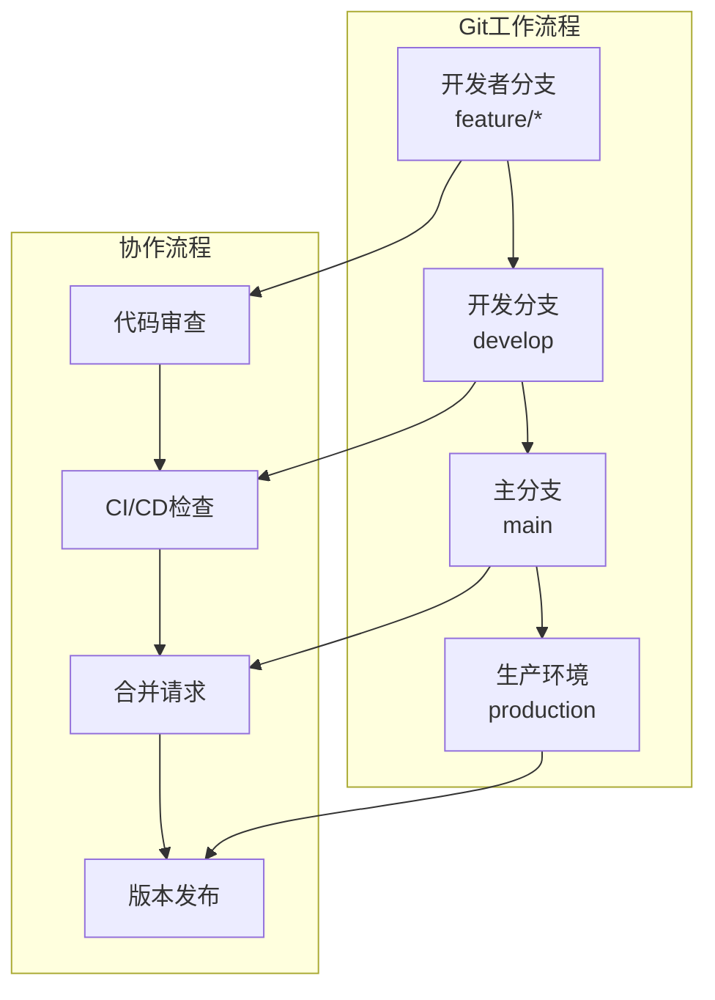
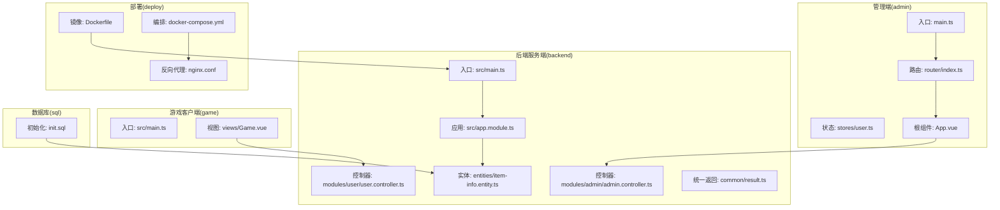
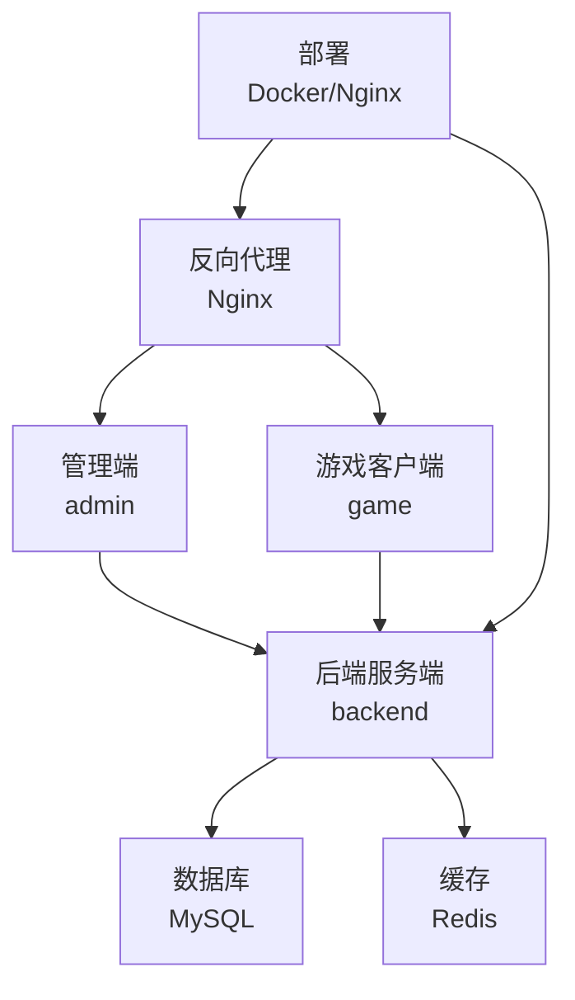
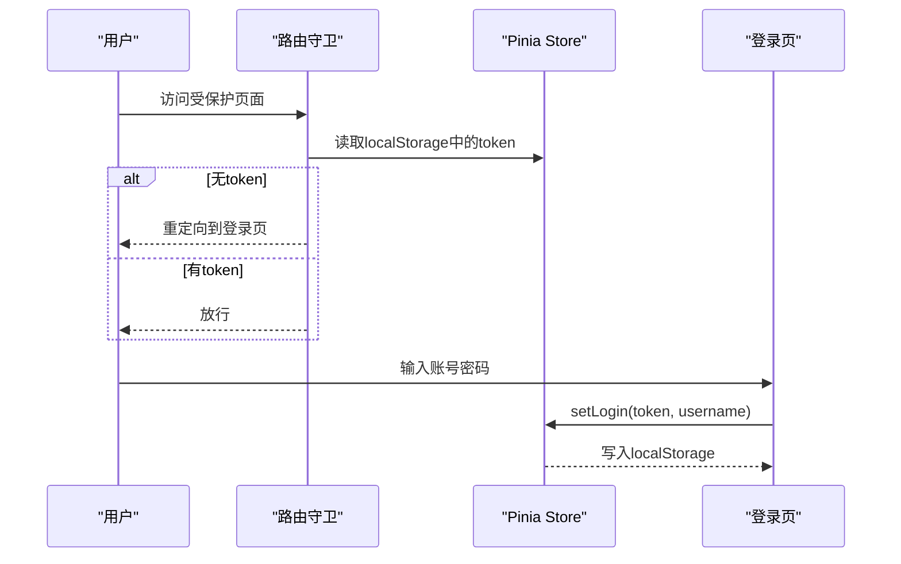
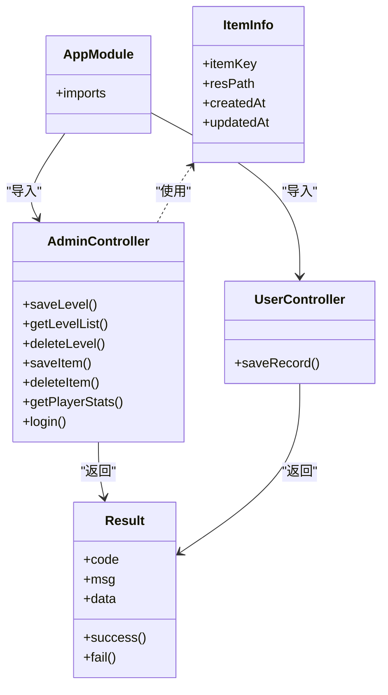
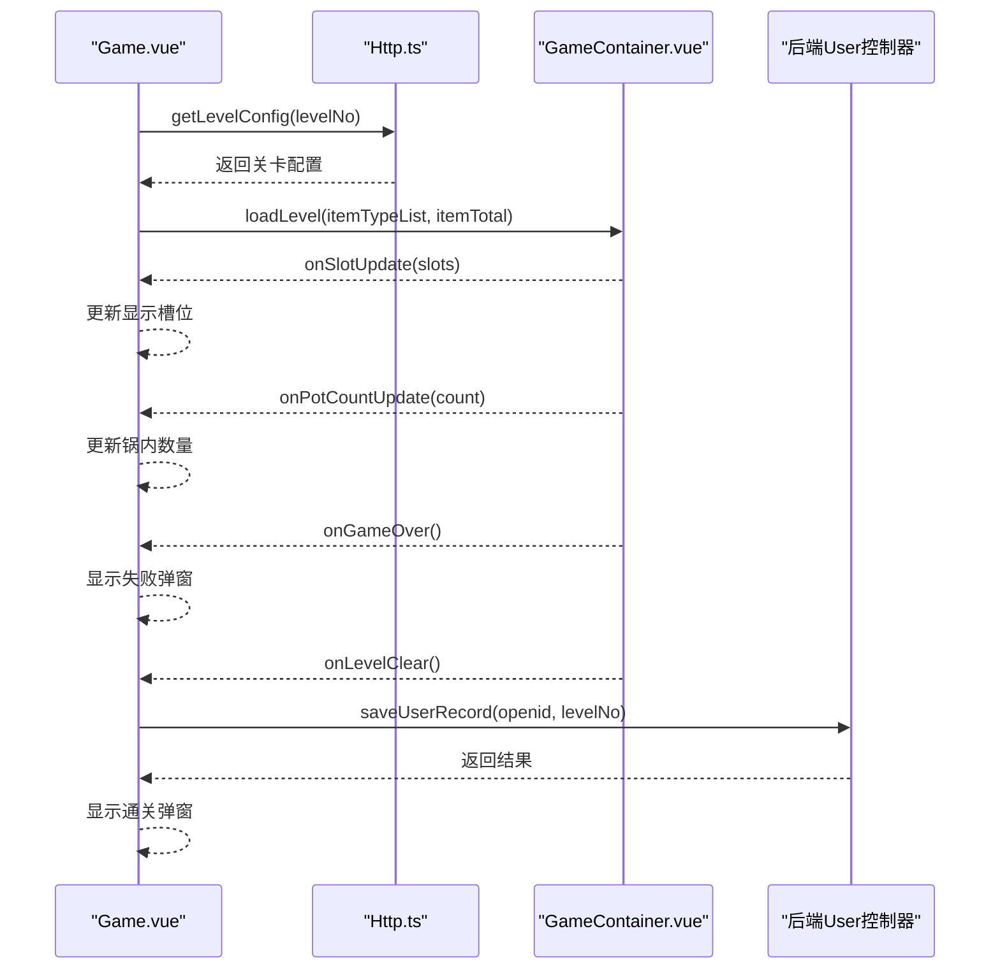
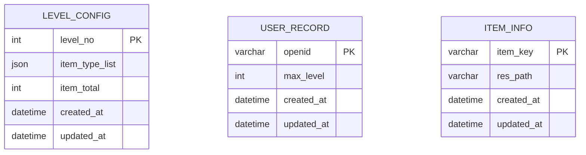
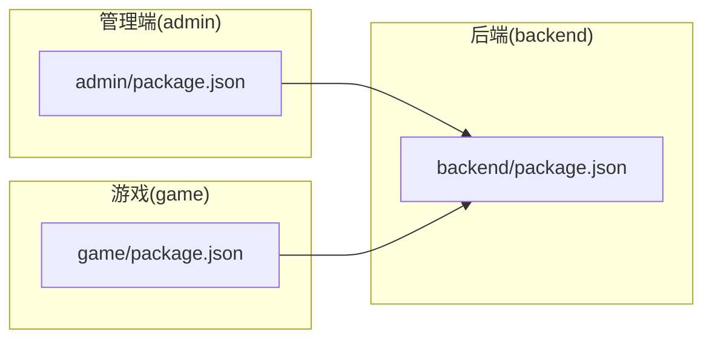

# 项目概述

<cite>
**本文引用的文件**
- [admin/package.json](file://admin/package.json)
- [admin/src/main.ts](file://admin/src/main.ts)
- [admin/src/router/index.ts](file://admin/src/router/index.ts)
- [admin/src/stores/user.ts](file://admin/src/stores/user.ts)
- [admin/src/App.vue](file://admin/src/App.vue)
- [backend/package.json](file://backend/package.json)
- [backend/src/main.ts](file://backend/src/main.ts)
- [backend/src/app.module.ts](file://backend/src/app.module.ts)
- [backend/src/modules/admin/admin.controller.ts](file://backend/src/modules/admin/admin.controller.ts)
- [backend/src/modules/user/user.controller.ts](file://backend/src/modules/user/user.controller.ts)
- [backend/src/entities/item-info.entity.ts](file://backend/src/entities/item-info.entity.ts)
- [backend/src/common/result.ts](file://backend/src/common/result.ts)
- [game/package.json](file://game/package.json)
- [game/src/main.ts](file://game/src/main.ts)
- [game/src/views/Game.vue](file://game/src/views/Game.vue)
- [deploy/Dockerfile](file://deploy/Dockerfile)
- [deploy/docker-compose.yml](file://deploy/docker-compose.yml)
- [deploy/nginx/default.conf](file://deploy/nginx/default.conf)
- [sql/init.sql](file://sql/init.sql)
</cite>

## 更新摘要
**所做更改**
- 新增版本控制与协作流程章节，详细介绍Git工作流程和版本控制实践
- 更新项目结构图，反映Git仓库的标准化管理
- 增加版本控制最佳实践指导
- 更新部署架构图，体现容器化部署流程

## 目录
1. [简介](#简介)
2. [版本控制与协作流程](#版本控制与协作流程)
3. [项目结构](#项目结构)
4. [核心组件](#核心组件)
5. [架构总览](#架构总览)
6. [详细组件分析](#详细组件分析)
7. [依赖分析](#依赖分析)
8. [性能考虑](#性能考虑)
9. [故障排查指南](#故障排查指南)
10. [结论](#结论)
11. [附录](#附录)

## 简介
本项目是一个多端游戏应用，围绕"摇一摇抓大鹅"主题打造的三消类小游戏，支持管理端（admin）、后端服务端（backend）与游戏客户端（game）三大模块协同工作。项目采用前后端分离与模块化架构，结合 Vue 3 + TypeScript 前端栈、NestJS 后端框架、MySQL 数据库存储以及可扩展的部署方案，实现从关卡配置、玩家进度到实时交互的完整闭环。

- 业务场景：玩家通过手机摇一摇触发物理碰撞，将食材放入锅中消除，达成关卡目标；管理员可在管理端维护关卡配置、食材资源与玩家统计数据。
- 目标用户：休闲游戏玩家与运营管理人员。
- 技术特色：统一响应体、全局异常处理、路由守卫、本地持久化、3D 物理引擎集成、可移植的 Docker 化部署。

**更新** 项目现已建立标准的Git版本控制系统，采用分支管理策略和协作流程，确保代码版本的可追溯性和团队协作的规范性。

## 版本控制与协作流程

### Git版本控制系统
项目已迁移至Git版本控制系统，采用以下标准工作流程：

#### 分支管理策略
- **main分支**：生产环境稳定代码，通过Pull Request合并
- **develop分支**：开发集成分支，每日构建和测试
- **feature分支**：功能开发分支，按功能模块命名
- **hotfix分支**：紧急修复分支，快速修复生产问题

#### 提交规范
- **类型**：feat、fix、docs、style、refactor、test、chore
- **格式**：type(scope): description
- **示例**：feat(admin): 添加用户权限管理功能

#### Pull Request流程
1. 从develop分支创建功能分支
2. 开发完成后推送分支
3. 创建Pull Request进行代码审查
4. 通过CI/CD检查后合并到develop
5. 定期同步main分支进行发布

**章节来源**
- [deploy/docker-compose.yml](file://deploy/docker-compose.yml)
- [deploy/nginx/default.conf](file://deploy/nginx/default.conf)

## 项目结构
项目采用多包结构，分别对应三个主要模块：
- admin：基于 Vue 3 + Pinia + Element Plus 的管理端前端，提供关卡管理、食材配置与玩家统计等界面。
- backend：基于 NestJS + TypeORM + MySQL 的后端服务，提供统一 API、实体映射与业务模块化组织。
- game：基于 Vue 3 + Three.js + Cannon-es 的游戏客户端，负责 3D 场景渲染、物理世界与交互逻辑。
- deploy：Docker 化部署脚本与 Nginx 配置，便于快速上线。
- sql：数据库初始化 SQL，包含关卡配置、玩家记录与食材资源三张核心表。

**图表来源**
- [admin/src/main.ts:1-20](file://admin/src/main.ts#L1-L20)
- [admin/src/router/index.ts:1-53](file://admin/src/router/index.ts#L1-L53)
- [admin/src/stores/user.ts:1-27](file://admin/src/stores/user.ts#L1-L27)
- [admin/src/App.vue:1-7](file://admin/src/App.vue#L1-L7)
- [backend/src/main.ts:1-35](file://backend/src/main.ts#L1-L35)
- [backend/src/app.module.ts:1-24](file://backend/src/app.module.ts#L1-L24)
- [backend/src/modules/admin/admin.controller.ts:1-63](file://backend/src/modules/admin/admin.controller.ts#L1-L63)
- [backend/src/modules/user/user.controller.ts:1-17](file://backend/src/modules/user/user.controller.ts#L1-L17)
- [backend/src/entities/item-info.entity.ts:1-18](file://backend/src/entities/item-info.entity.ts#L1-L18)
- [backend/src/common/result.ts:1-23](file://backend/src/common/result.ts#L1-L23)
- [game/src/main.ts:1-4](file://game/src/main.ts#L1-L4)
- [game/src/views/Game.vue:1-357](file://game/src/views/Game.vue#L1-L357)
- [deploy/Dockerfile:1-23](file://deploy/Dockerfile#L1-L23)
- [deploy/docker-compose.yml](file://deploy/docker-compose.yml)
- [deploy/nginx/default.conf](file://deploy/nginx/default.conf)
- [sql/init.sql:1-48](file://sql/init.sql#L1-L48)

**章节来源**
- [admin/src/main.ts:1-20](file://admin/src/main.ts#L1-L20)
- [backend/src/main.ts:1-35](file://backend/src/main.ts#L1-L35)
- [game/src/main.ts:1-4](file://game/src/main.ts#L1-L4)

## 核心组件
- 管理端（admin）
  - 路由与守卫：提供登录页与三级菜单（关卡管理、食材配置、玩家统计），并以路由前置守卫校验登录态。
  - 状态管理：使用 Pinia 存储 token 与用户名，自动落盘 localStorage。
  - UI 组件：基于 Element Plus，提供基础布局与常用控件。
- 后端服务端（backend）
  - 应用入口：启用 CORS、全局前缀、验证管道、异常过滤器与响应拦截器。
  - 模块化：按领域拆分 level、user、item、admin、redis 等模块，TypeORM 连接 MySQL。
  - 统一返回：Result 类封装 code/msg/data，控制器统一返回。
- 游戏客户端（game）
  - 视图层：Game.vue 负责 UI 布局、道具按钮、对话框与事件回调。
  - 交互流程：加载关卡配置、触发物理消除、保存通关记录、道具使用等。

**章节来源**
- [admin/src/router/index.ts:1-53](file://admin/src/router/index.ts#L1-L53)
- [admin/src/stores/user.ts:1-27](file://admin/src/stores/user.ts#L1-L27)
- [backend/src/main.ts:1-35](file://backend/src/main.ts#L1-L35)
- [backend/src/app.module.ts:1-24](file://backend/src/app.module.ts#L1-L24)
- [backend/src/common/result.ts:1-23](file://backend/src/common/result.ts#L1-L23)
- [game/src/views/Game.vue:1-357](file://game/src/views/Game.vue#L1-L357)

## 架构总览
系统采用"管理端 + 后端 + 客户端"的三层协作模式：
- 管理端通过 HTTP 请求调用后端 API，进行关卡与资源的维护。
- 游戏客户端同样通过 HTTP 请求与后端交互，提交通关记录并获取关卡配置。
- 后端以统一响应体返回数据，实体层映射数据库表，模块化组织业务逻辑。

**图表来源**
- [backend/src/app.module.ts:1-24](file://backend/src/app.module.ts#L1-L24)
- [backend/src/main.ts:1-35](file://backend/src/main.ts#L1-L35)
- [deploy/Dockerfile:1-23](file://deploy/Dockerfile#L1-L23)
- [deploy/docker-compose.yml](file://deploy/docker-compose.yml)
- [deploy/nginx/default.conf](file://deploy/nginx/default.conf)
- [sql/init.sql:1-48](file://sql/init.sql#L1-L48)

## 详细组件分析

### 管理端（admin）组件分析
- 应用初始化：注册 Element Plus 图标、安装 Pinia 与路由，挂载根组件。
- 路由与守卫：定义登录页与主布局子路由，设置全局前置守卫检查 token。
- 状态管理：Pinia Store 管理登录 token，支持登录与退出动作，并持久化至 localStorage。

**图表来源**
- [admin/src/router/index.ts:42-50](file://admin/src/router/index.ts#L42-L50)
- [admin/src/stores/user.ts:12-25](file://admin/src/stores/user.ts#L12-L25)

**章节来源**
- [admin/src/main.ts:1-20](file://admin/src/main.ts#L1-L20)
- [admin/src/router/index.ts:1-53](file://admin/src/router/index.ts#L1-L53)
- [admin/src/stores/user.ts:1-27](file://admin/src/stores/user.ts#L1-L27)

### 后端服务端（backend）组件分析
- 应用入口：启用 CORS、设置全局前缀、注册全局验证管道、异常过滤器与响应拦截器。
- 应用模块：整合 TypeORM 连接 MySQL、Redis 模块与业务模块（level、user、item、admin）。
- 控制器与服务：Admin 控制器提供关卡与食材的增删改查及登录接口；User 控制器提供保存通关记录接口。
- 实体与统一返回：ItemInfo 实体映射 item_info 表；Result 统一封装响应结构。

**图表来源**
- [backend/src/app.module.ts:1-24](file://backend/src/app.module.ts#L1-L24)
- [backend/src/modules/admin/admin.controller.ts:1-63](file://backend/src/modules/admin/admin.controller.ts#L1-L63)
- [backend/src/modules/user/user.controller.ts:1-17](file://backend/src/modules/user/user.controller.ts#L1-L17)
- [backend/src/entities/item-info.entity.ts:1-18](file://backend/src/entities/item-info.entity.ts#L1-L18)
- [backend/src/common/result.ts:1-23](file://backend/src/common/result.ts#L1-L23)

**章节来源**
- [backend/src/main.ts:1-35](file://backend/src/main.ts#L1-L35)
- [backend/src/app.module.ts:1-24](file://backend/src/app.module.ts#L1-L24)
- [backend/src/modules/admin/admin.controller.ts:1-63](file://backend/src/modules/admin/admin.controller.ts#L1-L63)
- [backend/src/modules/user/user.controller.ts:1-17](file://backend/src/modules/user/user.controller.ts#L1-L17)
- [backend/src/entities/item-info.entity.ts:1-18](file://backend/src/entities/item-info.entity.ts#L1-L18)
- [backend/src/common/result.ts:1-23](file://backend/src/common/result.ts#L1-L23)

### 游戏客户端（game）组件分析
- 视图层：Game.vue 负责顶部关卡信息、底部卡槽 UI、道具按钮与失败/通关弹窗。
- 交互流程：加载关卡配置、监听卡槽与锅内数量变化、使用道具、失败与通关回调、保存通关记录。
- 开发体验：提供"模拟摇晃"按钮用于网页调试。

**图表来源**
- [game/src/views/Game.vue:83-120](file://game/src/views/Game.vue#L83-L120)
- [backend/src/modules/user/user.controller.ts:10-15](file://backend/src/modules/user/user.controller.ts#L10-L15)

**章节来源**
- [game/src/views/Game.vue:1-357](file://game/src/views/Game.vue#L1-L357)

### 数据模型与初始化
- 关联关系：level_config（关卡配置）、user_record（玩家记录）、item_info（食材资源）三张表。
- 初始化 SQL：创建数据库与表，插入示例关卡与食材数据，便于快速验证。

**图表来源**
- [sql/init.sql:7-33](file://sql/init.sql#L7-L33)

**章节来源**
- [sql/init.sql:1-48](file://sql/init.sql#L1-L48)

## 依赖分析
- 管理端（admin）
  - 依赖：vue、vue-router、pinia、element-plus、axios。
  - 开发工具：@vitejs/plugin-vue、typescript、vite、vue-tsc。
- 后端服务端（backend）
  - 依赖：@nestjs/*、typeorm、mysql2、ioredis、class-validator、class-transformer、reflect-metadata、rxjs。
  - 开发工具：@nestjs/cli、@nestjs/schematics、typescript、ts-node、@types/node。
- 游戏客户端（game）
  - 依赖：vue、three、cannon-es、axios。
  - 开发工具：@vitejs/plugin-vue、@types/three、typescript、vite、vue-tsc。

**图表来源**
- [admin/package.json:1-25](file://admin/package.json#L1-L25)
- [backend/package.json:1-34](file://backend/package.json#L1-L34)
- [game/package.json:1-25](file://game/package.json#L1-L25)

**章节来源**
- [admin/package.json:1-25](file://admin/package.json#L1-L25)
- [backend/package.json:1-34](file://backend/package.json#L1-L34)
- [game/package.json:1-25](file://game/package.json#L1-L25)

## 性能考虑
- 响应一致性：后端统一返回结构与拦截器，减少前端解析成本，提升联调效率。
- 资源加载：管理端与游戏端均使用按需加载组件与路由懒加载，降低首屏体积。
- 缓存策略：Redis 模块已在应用中引入，可用于热点配置与会话缓存，建议在后续扩展中落地具体缓存键策略。
- 数据库优化：合理使用索引（如 level_no、openid），避免全表扫描；批量写入与事务控制保证一致性。
- 3D 性能：游戏端建议对模型资源进行压缩与批处理加载，减少帧率抖动。

## 故障排查指南
- 登录鉴权
  - 管理端路由守卫会检查 localStorage 中的 token，若缺失则重定向登录。请确认登录成功后是否正确写入 token。
- 接口返回
  - 后端统一返回 Result 结构，若出现异常，优先查看 code 与 msg 字段，再结合日志定位问题。
- 数据库初始化
  - 若首次运行报错，请确认数据库已执行初始化 SQL，且连接参数正确。
- Docker 部署
  - 使用提供的 Dockerfile 构建镜像并暴露 3000 端口，确保宿主机端口映射与防火墙放行。
- Git 协作
  - 确保遵循分支管理策略，提交信息符合规范，PR 流程完整执行。

**章节来源**
- [admin/src/router/index.ts:42-50](file://admin/src/router/index.ts#L42-L50)
- [backend/src/common/result.ts:1-23](file://backend/src/common/result.ts#L1-L23)
- [sql/init.sql:1-48](file://sql/init.sql#L1-L48)
- [deploy/Dockerfile:1-23](file://deploy/Dockerfile#L1-L23)

## 结论
本项目以清晰的模块划分与统一的工程实践，实现了管理端、后端与客户端的高效协作。通过 NestJS 的模块化能力与 Vue 3 的生态组合，兼顾了开发效率与可维护性；配合 Docker 化部署与数据库初始化脚本，能够快速搭建稳定的服务环境。项目现已建立标准的Git版本控制系统，采用规范的分支管理和协作流程，确保代码质量和团队协作效率。建议后续在缓存策略、3D 资源优化与安全加固方面持续演进。

## 附录
- 开发环境要求
  - Node.js 18+，npm 或 yarn。
  - MySQL 5.7+/8.0+，Redis（可选）。
  - Docker（可选，用于容器化部署）。
  - Git 2.0+，支持分支管理与协作流程。
- 快速启动
  - 后端：进入 backend 目录，安装依赖后运行开发模式或构建生产版本。
  - 管理端：进入 admin 目录，安装依赖后运行 dev。
  - 游戏端：进入 game 目录，安装依赖后运行 dev。
- 数据库初始化
  - 在 MySQL 中执行 init.sql，创建数据库与表并插入示例数据。
- Git 工作流程
  - 功能开发：git checkout -b feature/功能名
  - 提交代码：git add . && git commit -m "feat: 功能描述"
  - 推送分支：git push origin feature/功能名
  - 创建PR：在GitHub/GitLab上创建Pull Request进行代码审查
- 容器化部署
  - 使用 docker-compose.yml 进行多容器编排
  - Nginx 反向代理配置支持静态资源托管与API转发